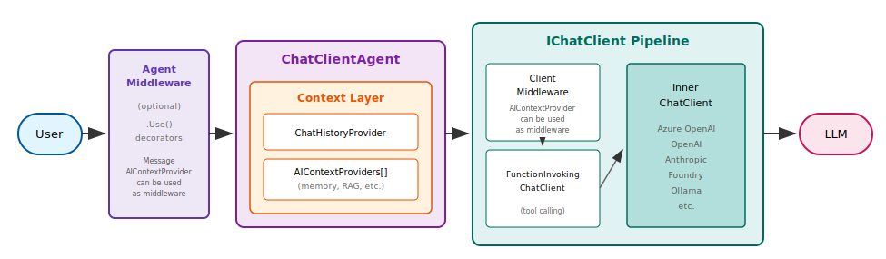
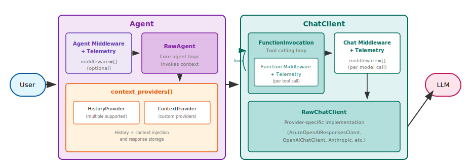
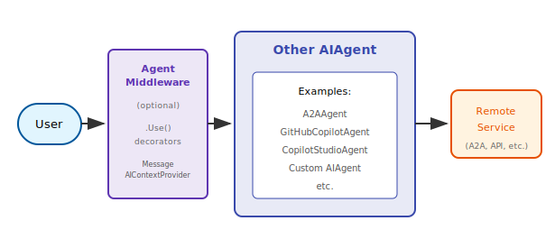

# Agent pipeline architecture

Agents in Microsoft Agent Framework use a layered pipeline architecture to process requests. Understanding this architecture helps you customize agent behavior by adding middleware, context providers, or client-level modifications at the appropriate layer.

::: zone pivot="programming-language-csharp"

## ChatClientAgent Pipeline



The `ChatClientAgent` builds a pipeline with three main layers:

1. **Agent middleware** - Optional decorators that wrap the agent via `.Use()` for logging, validation, or transformation
2. **Context layer** - Manages chat history (`ChatHistoryProvider`) and injects additional context (`AIContextProviders`)
3. **Chat client layer** - The `IChatClient` with optional middleware decorators that handle LLM communication

When you call `RunAsync()`, your request flows through each layer in sequence.

::: zone-end

::: zone pivot="programming-language-python"

## Agent Pipeline



The `Agent` class builds a pipeline through class composition with two main components:

**Agent** (outer component):

1. **Agent Middleware + Telemetry** - the `AgentMiddlewareLayer` and `AgentTelemetryLayer` classes handle middleware invocation and OpenTelemetry instrumentation
2. **RawAgent** - Core agent logic that invokes context providers and collects provider-added middleware
3. **Context Providers** - Unified `context_providers` list manages history, additional context, and per-run chat/function middleware

**ChatClient** (separate and interchangeable component):

1. **FunctionInvocation** - Handles tool calling loop, invoking Function Middleware + Telemetry per tool call
2. **Chat Middleware + Telemetry** - Optional middleware chain and instrumentation layers, including any chat middleware added by context providers, running per model call
3. **RawChatClient** - Provider-specific implementation (Azure OpenAI, OpenAI, Anthropic, etc.) that communicates with the LLM

When you call `run()`, your request flows through the Agent layers, then into the ChatClient pipeline for LLM communication.

::: zone-end

### Agent middleware layer

Agent middleware intercepts every call to the agent's run method, allowing you to inspect or modify inputs and outputs.

::: zone pivot="programming-language-csharp"

Add middleware using the agent builder pattern:

```csharp
var middlewareAgent = originalAgent
    .AsBuilder()
    .Use(runFunc: MyAgentMiddleware, runStreamingFunc: MyStreamingMiddleware)
    .Build();
```

You can also use `MessageAIContextProvider` as agent middleware to inject additional messages into the request. This works with any agent type, not just `ChatClientAgent`:

```csharp
var contextAgent = originalAgent
    .AsBuilder()
    .UseAIContextProviders(new MyMessageContextProvider())
    .Build();
```

This layer wraps the entire agent execution, including context resolution and chat client calls.
This has benefits, in that these decorators can be used with any type of agent, e.g. `A2AAgent` or `GitHubCopilotAgent`, not just `ChatClientAgent`.
This also means that decorators at this level cannot necessarily make assumptions about the agent that it is decorating, meaning that it is restricted to customizing or affecting common functionality.

::: zone-end

::: zone pivot="programming-language-python"

Add middleware when creating the agent:

```python
from agent_framework import Agent

agent = Agent(
    client=my_client,
    instructions="You are helpful.",
    middleware=[my_middleware_func],
)
```

The `Agent` class inherits from `AgentMiddlewareLayer`, which handles middleware invocation before delegating to the core agent logic.
It also inherits from `AgentTelemetryLayer` which handles emitting spans, events and metrics to a configured OpenTelemetry backend.
Both of these layers, do nothing when they are not configured.
::: zone-end

For detailed middleware and observability patterns, see [Agent Middleware](./middleware/index.md) and [Observability](./observability.md).

### Context layer

The context layer runs before each LLM call to build the full message history and inject additional context.

::: zone pivot="programming-language-csharp"

`ChatClientAgent` has two distinct provider types:

- **`ChatHistoryProvider`** (single) - Manages conversation history storage and retrieval
- **`AIContextProviders`** (list) - Injects additional context like memories, retrieved documents, or dynamic instructions

```csharp
var agent = new ChatClientAgent(chatClient, new ChatClientAgentOptions
{
    ChatHistoryProvider = new InMemoryChatHistoryProvider(),
    AIContextProviders = [new MyMemoryProvider(), new MyRagProvider()],
});
```

The agent calls each provider's `InvokingAsync()` method before sending messages to the chat client with each provider's output passed as input to the next provider.

::: zone-end

::: zone pivot="programming-language-python"

The `Agent` class uses a unified `context_providers` list that can include both history providers and context providers:

```python
from agent_framework import Agent, InMemoryHistoryProvider

agent = Agent(
    client=my_client,
    context_providers=[
        InMemoryHistoryProvider(),
        MyMemoryProvider(),
        MyRagProvider(),
    ],
)
```

Context providers can also attach chat or function middleware to a single invocation via `SessionContext.extend_middleware()`. The agent flattens those additions in provider order before entering the ChatClient pipeline.

::: zone-end

For detailed context provider patterns, see [Context Providers](./conversations/context-providers.md).

### Chat client layer

The chat client layer handles the actual communication with the LLM service.

::: zone pivot="programming-language-csharp"

`ChatClientAgent` uses an `IChatClient` instance, which can be decorated with additional middleware:

```csharp
var chatClient = new AIProjectClient(endpoint, credential)
    .GetProjectOpenAIClient()
    .GetProjectResponsesClient()
    .AsIChatClient(deploymentName)
    .AsBuilder()
    .Use(CustomChatClientMiddleware)
    .Build();

var agent = new ChatClientAgent(chatClient, instructions: "You are helpful.");
```

You can also use `AIContextProvider` as chat client middleware to enrich messages, tools, and instructions at the client level. This must be used within the context of a running `AIAgent`:

```csharp
var chatClient = new AIProjectClient(endpoint, credential)
    .GetProjectOpenAIClient()
    .GetProjectResponsesClient()
    .AsIChatClient(deploymentName)
    .AsBuilder()
    .UseAIContextProviders(new MyContextProvider())
    .Build();

var agent = new ChatClientAgent(chatClient, instructions: "You are helpful.");
```

By default, `ChatClientAgent` wraps the provided chat client with function-calling support. Set `UseProvidedChatClientAsIs = true` in options to skip this default wrapping.

::: zone-end

::: zone pivot="programming-language-python"

The `Agent` class accepts any client that implements `SupportsChatGetResponse`. The ChatClient pipeline handles middleware, telemetry, function invocation, and provider-specific communication:

```python
from agent_framework import Agent
from agent_framework.foundry import FoundryChatClient

client = FoundryChatClient(
    credential=credential,
    project_endpoint=endpoint,
    model=model,
)

agent = Agent(client=client, instructions="You are helpful.")
```

The `RawChatClient` within the ChatClient implements the provider-specific logic for communicating with different LLM services.

::: zone-end

### Execution flow

When you invoke an agent, the request flows through the pipeline:

::: zone pivot="programming-language-csharp"

1. **Agent middleware** executes (if configured)
2. **ChatHistoryProvider** loads conversation history into the request message list
3. **AIContextProviders** add messages, tools, or instructions to the request
4. **IChatClient middleware** executes (if decorated)
5. **IChatClient** sends the request to the LLM
6. Response flows back through the same layers
7. **ChatHistoryProvider** and **AIContextProviders** are notified of new messages

::: zone-end

::: zone pivot="programming-language-python"

**Agent pipeline:**

1. **Agent Middleware + Telemetry** executes middleware (if configured) and records spans
2. **RawAgent** invokes context providers to load history, add context, and collect provider-added chat/function middleware
3. Request is passed to the ChatClient

**ChatClient pipeline:**

4. **FunctionInvocation** manages the tool calling loop
   - For each tool call, **Function Middleware + Telemetry** executes, including any function middleware added by context providers
5. **Chat Middleware + Telemetry** executes per model call (if configured), including any chat middleware added by context providers
6. **RawChatClient** handles provider-specific LLM communication
7. Response flows back through the same layers
8. **Context providers** are notified of new messages for storage

> [!NOTE]
> Specialized agents may work differently to the pipeline described here.

::: zone-end

::: zone pivot="programming-language-csharp"

## Other agent types

Not all agents use the full `ChatClientAgent` pipeline. Agents like `A2AAgent`, `GitHubCopilotAgent`, or `CopilotStudioAgent` communicate with remote services rather than using a local `IChatClient`. However, they still support agent-level middleware.



Since these agents derive from `AIAgent`, you can use the same agent middleware patterns:

```csharp
// Agent middleware works with any AIAgent
var a2aAgent = originalA2AAgent
    .AsBuilder()
    .Use(runFunc: LoggingMiddleware)
    .UseAIContextProviders(new MyMessageContextProvider())
    .Build();

// Same pattern works for GitHubCopilotAgent
var copilotAgent = originalCopilotAgent
    .AsBuilder()
    .Use(runFunc: AuditMiddleware)
    .Build();
```

> [!NOTE]
> You cannot add chat client middleware to these agents because they don't use `IChatClient`.

::: zone-end

::: zone pivot="programming-language-python"

## Other agent types

Not every Python agent uses the full `Agent` + `ChatClient` pipeline. `GitHubCopilotAgent`, for example, sends requests through the GitHub Copilot CLI instead of a local chat client.

Even so, Python `GitHubCopilotAgent` still supports agent middleware and now runs `context_providers` around each invocation. Provider-added messages and instructions are included in the prompt sent to Copilot, and providers receive the matching `after_run` callback once a response is available.

> [!NOTE]
> Because `GitHubCopilotAgent` does not use a local chat client, chat client middleware still does not apply.

::: zone-end

::: zone pivot="programming-language-go"
## Agent pipeline architecture

In Go, agents use a layered middleware pipeline. Middlewares wrap the agent's `Run` function, each calling `next` to pass control to the next layer.

### Pipeline order

When an agent runs, middlewares are applied in this order:

1. **Context provider middleware** — Injects context from registered `ContextProvider` instances
2. **Custom middlewares** — Your registered middlewares, applied in declaration order
3. **Auto-call middleware** — Automatically invokes function tools when the model requests them
4. **Provider** — The underlying LLM provider (e.g., OpenAI, Anthropic)

### Middleware interface

```go
type Middleware interface {
    Run(next RunFunc, ctx context.Context, messages []*message.Message,
        options ...agentopt.Option) iter.Seq2[*message.ResponseUpdate, error]
}
```

Each middleware receives the `next` function in the chain and can:
- Modify messages or options before calling `next`
- Process or transform the response after calling `next`
- Short-circuit the pipeline by returning without calling `next`

### Built-in middlewares

| Middleware | Package | Purpose |
|---|---|---|
| Auto-call | `middleware/autocall` | Automatically invokes function tools |
| Context provider | `middleware/contextprovider` | Injects context from providers |
| OpenTelemetry | `middleware/otel` | Traces agent invocations |
| Structured output | `middleware/structuredoutput` | Handles structured output parsing |
| Logger | `middleware/logger` | Logs agent interactions |

::: zone-end
## Next steps

> [!div class="nextstepaction"]
> [Multimodal](./multimodal.md)

### Related content

- [Middleware](./middleware/index.md) - Add cross-cutting behavior to your agents
- [Context Providers](./conversations/context-providers.md) - Detailed patterns for history and context injection
- [Running Agents](./running-agents.md) - How to invoke agents
