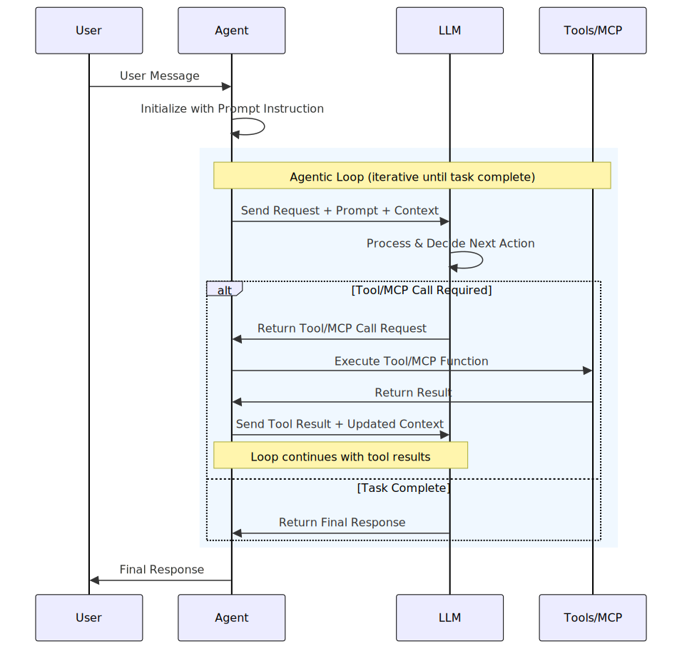

# Microsoft Agent Framework agent types

The Microsoft Agent Framework provides support for several types of agents to accommodate different use cases and requirements.

::: zone pivot="programming-language-csharp"
All agents are derived from a common base class, `AIAgent`, which provides a consistent interface for all agent types. This allows for building common, agent agnostic, higher level functionality such as multi-agent orchestrations.
::: zone-end

::: zone pivot="programming-language-python"
All agents are derived from a common base class, `Agent`, which provides a consistent interface for all agent types. This allows for building common, agent agnostic, higher level functionality such as multi-agent orchestrations.
::: zone-end

## Default Agent Runtime Execution Model

All agents in the Microsoft Agent Framework execute using a structured runtime model. This model coordinates user interaction, model inference, and tool execution in a deterministic loop.



> [!WARNING]
> If you use Microsoft Agent Framework to build applications that operate with third-party servers or agents, you do so at your own risk. We recommend reviewing all data being shared with third-party servers or agents and being cognizant of third-party practices for retention and location of data. It is your responsibility to manage whether your data will flow outside of your organization's Azure compliance and geographic boundaries and any related implications.

::: zone pivot="programming-language-csharp"

## Simple agents based on inference services

Agent Framework makes it easy to create simple agents based on many different inference services.
Any inference service that provides a [`Microsoft.Extensions.AI.IChatClient`](/dotnet/ai/microsoft-extensions-ai#the-ichatclient-interface) implementation can be used to build these agents. The `Microsoft.Agents.AI.ChatClientAgent` is the agent class used to provide an agent for any <xref:Microsoft.Extensions.AI.IChatClient> implementation.

These agents support a wide range of functionality out of the box:

1. Function calling.
1. Multi-turn conversations with local chat history management or service provided chat history management.
1. Custom service provided tools (for example, MCP, Code Execution).
1. Structured output.

To create one of these agents, simply construct a `ChatClientAgent` using the `IChatClient` implementation of your choice.

```csharp
using Microsoft.Agents.AI;

var agent = new ChatClientAgent(chatClient, instructions: "You are a helpful assistant");
```

To make creating these agents even easier, Agent Framework provides helpers for many popular services. For more information, see the documentation for each service.

| Underlying inference service | Description | Service chat history storage supported | InMemory/Custom chat history storage supported |
|------------------------------|-------------|----------------------------------------|------------------------------------------------|
|[Microsoft Foundry Agent](./providers/microsoft-foundry.md)|An agent that uses the Foundry Agent Service as its backend.|Yes|No|
|[Foundry Models ChatCompletion](./providers/microsoft-foundry.md)|An agent that uses any of the models deployed in the Foundry Service as its backend via ChatCompletion.|No|Yes|
|[Foundry Models Responses](./providers/microsoft-foundry.md)|An agent that uses any of the models deployed in the Foundry Service as its backend via Responses.|Yes|Yes|
|[Foundry Anthropic](./providers/anthropic.md)|An agent that uses a Claude model via the Foundry Anthropic Service as its backend.|No|Yes|
|[Azure OpenAI ChatCompletion](./providers/azure-openai.md)|An agent that uses the Azure OpenAI ChatCompletion service.|No|Yes|
|[Azure OpenAI Responses](./providers/azure-openai.md)|An agent that uses the Azure OpenAI Responses service.|Yes|Yes|
|[Anthropic](./providers/anthropic.md)|An agent that uses a Claude model via the Anthropic Service as its backend.|No|Yes|
|[OpenAI ChatCompletion](./providers/openai.md)|An agent that uses the OpenAI ChatCompletion service.|No|Yes|
|[OpenAI Responses](./providers/openai.md)|An agent that uses the OpenAI Responses service.|Yes|Yes|
|[Any other `IChatClient`](./providers/custom.md)|You can also use any other [`Microsoft.Extensions.AI.IChatClient`](/dotnet/ai/microsoft-extensions-ai#the-ichatclient-interface) implementation to create an agent.|Varies|Varies|

## Complex custom agents

It's also possible to create fully custom agents that aren't just wrappers around an `IChatClient`.
The agent framework provides the `AIAgent` base type.
This base type is the core abstraction for all agents, which, when subclassed, allows for complete control over the agent's behavior and capabilities.

For more information, see the documentation for [Custom Agents](./providers/custom.md).

## Proxies for remote agents

Agent Framework provides out of the box `AIAgent` implementations for common service hosted agent protocols,
such as A2A. This way you can easily connect to and use remote agents from your application.

See the documentation for each agent type, for more information:

| Protocol              | Description                                                             |
|-----------------------|-------------------------------------------------------------------------|
| [A2A](../integrations/a2a.md) | An agent that serves as a proxy to a remote agent via the A2A protocol. |

## Azure and OpenAI SDK Options Reference

When using Foundry, Azure OpenAI, OpenAI services, or Anthropic services, you have various SDK options to connect to these services. In some cases, it is possible to use multiple SDKs to connect to the same service or to use the same SDK to connect to different services. Here is a list of the different options available with the url that you should use when connecting to each. Make sure to replace `<resource>` and `<project>` with your actual resource and project names.

| AI service | SDK | Nuget | Url |
|------------------|-----|-------|-----|
| [Foundry Models](/azure/ai-foundry/concepts/foundry-models-overview) | Azure OpenAI SDK <sup>2</sup> | [Azure.AI.OpenAI](https://www.nuget.org/packages/Azure.AI.OpenAI) | https://ai-foundry-&lt;resource&gt;.services.ai.azure.com/ |
| [Foundry Models](/azure/ai-foundry/concepts/foundry-models-overview) | OpenAI SDK <sup>3</sup> | [OpenAI](https://www.nuget.org/packages/OpenAI) | https://ai-foundry-&lt;resource&gt;.services.ai.azure.com/openai/v1/ |
| [Foundry Models](/azure/ai-foundry/concepts/foundry-models-overview) | Azure AI Inference SDK <sup>2</sup> | [Azure.AI.Inference](https://www.nuget.org/packages/Azure.AI.Inference) | https://ai-foundry-&lt;resource&gt;.services.ai.azure.com/models |
| [Foundry Agents](/azure/ai-foundry/agents/overview) | Azure AI Persistent Agents SDK | [Azure.AI.Agents.Persistent](https://www.nuget.org/packages/Azure.AI.Agents.Persistent) | https://ai-foundry-&lt;resource&gt;.services.ai.azure.com/api/projects/ai-project-&lt;project&gt; |
| [Azure OpenAI](/azure/ai-foundry/openai/overview) <sup>1</sup> | Azure OpenAI SDK <sup>2</sup> | [Azure.AI.OpenAI](https://www.nuget.org/packages/Azure.AI.OpenAI) | https://&lt;resource&gt;.openai.azure.com/ |
| [Azure OpenAI](/azure/ai-foundry/openai/overview) <sup>1</sup> | OpenAI SDK | [OpenAI](https://www.nuget.org/packages/OpenAI) | https://&lt;resource&gt;.openai.azure.com/openai/v1/ |
| OpenAI | OpenAI SDK | [OpenAI](https://www.nuget.org/packages/OpenAI) | No url required |
| [Microsoft Foundry Anthropic](/azure/ai-foundry/foundry-models/how-to/use-foundry-models-claude) | Anthropic Foundry SDK | [Anthropic.Foundry](https://www.nuget.org/packages/Anthropic.Foundry) | Resource name required |
| Anthropic | Anthropic SDK | [Anthropic](https://www.nuget.org/packages/Anthropic) | No url or resource name required |

1. [Upgrading from Azure OpenAI to Foundry](/azure/ai-foundry/how-to/upgrade-azure-openai)
1. We recommend using the OpenAI SDK.
1. While we recommend using the OpenAI SDK to access Foundry models, Foundry Models support models from many different vendors, not just OpenAI. All these models are supported via the OpenAI SDK.

### Using the OpenAI SDK

As shown in the table above, the OpenAI SDK can be used to connect to multiple services.
Depending on the service you are connecting to, you may need to set a custom URL when creating the `OpenAIClient`.
You can also use different authentication mechanisms depending on the service.

If a custom URL is required (see table above), you can set it via the OpenAIClientOptions.

```csharp
var clientOptions = new OpenAIClientOptions() { Endpoint = new Uri(serviceUrl) };
```

It's possible to use an API key when creating the client.

```csharp
OpenAIClient client = new OpenAIClient(new ApiKeyCredential(apiKey), clientOptions);
```

When using an Azure Service, it's also possible to use Azure credentials instead of an API key.

```csharp
OpenAIClient client = new OpenAIClient(new BearerTokenPolicy(new DefaultAzureCredential(), "https://ai.azure.com/.default"), clientOptions)
```

> [!WARNING]
> `DefaultAzureCredential` is convenient for development but requires careful consideration in production. In production, consider using a specific credential (e.g., `ManagedIdentityCredential`) to avoid latency issues, unintended credential probing, and potential security risks from fallback mechanisms.

Once you have created the OpenAIClient, you can get a sub client for the specific service you want to use and then create an `AIAgent` from that.

```csharp
AIAgent agent = client
    .GetChatClient(model)
    .AsAIAgent(instructions: "You are good at telling jokes.", name: "Joker");
```

### Using the Azure AI Projects SDK

This SDK can be used to connect to Foundry services.
You will need to supply the correct project endpoint URL when creating the `AIProjectClient`.
See the table above for the correct URL to use.

```csharp
AIAgent agent = new AIProjectClient(
    new Uri(serviceUrl),
    new DefaultAzureCredential())
     .AsAIAgent(
         model: deploymentName,
         instructions: "You are good at telling jokes.",
         name: "Joker");
```

### Using the Azure AI Persistent Agents SDK

This SDK is only supported with the Agent Service. See the table above for the correct URL to use.

```csharp
var persistentAgentsClient = new PersistentAgentsClient(serviceUrl, new DefaultAzureCredential());
AIAgent agent = await persistentAgentsClient.CreateAIAgentAsync(
    model: deploymentName,
    instructions: "You are good at telling jokes.",
    name: "Joker");
```

### Using the Foundry Anthropic SDK

The resource is the subdomain name / first name coming before '.services.ai.azure.com' in the endpoint Uri.

For example: `https://(resource name).services.ai.azure.com/anthropic/v1/chat/completions`

```csharp
var client = new AnthropicFoundryClient(new AnthropicFoundryApiKeyCredentials(apiKey, resource));
AIAgent agent = client.AsAIAgent(
    model: deploymentName,
    instructions: "Joker",
    name: "You are good at telling jokes.");
```

### Using the Anthropic SDK

```csharp
var client = new AnthropicClient() { ApiKey = apiKey };
AIAgent agent = client.AsAIAgent(
    model: deploymentName,
    instructions: "Joker",
    name: "You are good at telling jokes.");
```

::: zone-end

::: zone pivot="programming-language-python"

## Simple agents based on inference services

Agent Framework makes it easy to create simple agents based on many different inference services.
Any inference service that provides a chat client implementation can be used to build these agents.
This can be done using the `SupportsChatGetResponse` protocol, which defines a standard for the methods that a client needs to support to be used with the standard `Agent` class.

These agents support a wide range of functionality out of the box:

1. Function calling
1. Multi-turn conversations with local chat history management or service provided chat history management
1. Custom service provided tools (for example, MCP, Code Execution)
1. Structured output
1. Streaming responses

To create one of these agents, simply construct an `Agent` using the chat client implementation of your choice.


```python
import os
from agent_framework import Agent
from agent_framework.foundry import FoundryChatClient
from azure.identity.aio import DefaultAzureCredential

agent = Agent(
    client=FoundryChatClient(
        credential=DefaultAzureCredential(),
        project_endpoint=os.getenv("AZURE_AI_PROJECT_ENDPOINT"),
        model=os.getenv("AZURE_AI_MODEL_DEPLOYMENT_NAME"),
    ),
    instructions="You are a helpful assistant",
)
response = await agent.run("Hello!")
```

Alternatively, you can use the convenience method on the chat client:

```python
from agent_framework.foundry import FoundryChatClient
from azure.identity.aio import DefaultAzureCredential

agent = FoundryChatClient(
    credential=DefaultAzureCredential(),
    project_endpoint=os.getenv("AZURE_AI_PROJECT_ENDPOINT"),
    model=os.getenv("AZURE_AI_MODEL_DEPLOYMENT_NAME"),
).as_agent(
    instructions="You are a helpful assistant"
)
```

> [!NOTE]
> This example shows using the FoundryChatClient, but the same pattern applies to any chat client that implements `SupportsChatGetResponse`, see [providers overview](./providers/index.md) for more details on other clients.

For detailed examples, see the agent-specific documentation sections below.

### Supported Chat Providers

|Underlying Inference Service|Description|Service Chat History storage supported|
|---|---|---|
|[Foundry Agent](./providers/microsoft-foundry.md)|An agent that uses the Agent Service as its backend.|Yes|
|[Azure OpenAI Chat Completion](./providers/azure-openai.md)|An agent that uses the Azure OpenAI Chat Completion service.|No|
|[Azure OpenAI Responses](./providers/azure-openai.md)|An agent that uses the Azure OpenAI Responses service.|Yes|
|[Azure OpenAI Assistants](./providers/azure-openai.md)|An agent that uses the Azure OpenAI Assistants service.|Yes|
|[OpenAI Chat Completion](./providers/openai.md)|An agent that uses the OpenAI Chat Completion service.|No|
|[OpenAI Responses](./providers/openai.md)|An agent that uses the OpenAI Responses service.|Yes|
|[Anthropic Claude](./providers/anthropic.md)|An agent that uses Anthropic Claude models.|No|
|[Amazon Bedrock](https://github.com/microsoft/agent-framework/tree/main/python/packages/bedrock)|An agent that uses Amazon Bedrock models through the Agent Framework Bedrock chat client.|No|
|[GitHub Copilot](./providers/github-copilot.md)|An agent that uses the GitHub Copilot SDK backend.|No|
|[Ollama (OpenAI-compatible)](./providers/ollama.md)|An agent that uses locally hosted Ollama models via OpenAI-compatible APIs.|No|
|[Any other ChatClient](./providers/custom.md)|You can also use any other implementation of `SupportsChatGetResponse` to create an agent.|Varies|

Custom chat history storage is supported whenever session-based conversation state is supported.

### Streaming Responses

Agents support both regular and streaming responses:

```python
# Regular response (wait for complete result)
response = await agent.run("What's the weather like in Seattle?")
print(response.text)

# Streaming response (get results as they are generated)
async for chunk in agent.run("What's the weather like in Portland?", stream=True):
    if chunk.text:
        print(chunk.text, end="", flush=True)
```

For streaming examples, see:

- [Azure AI streaming examples](https://github.com/microsoft/agent-framework/blob/main/python/samples/02-agents/providers/azure_ai/azure_ai_basic.py)
- [Azure OpenAI streaming examples](https://github.com/microsoft/agent-framework/blob/main/python/samples/02-agents/providers/azure_openai/azure_chat_client_basic.py)
- [OpenAI streaming examples](https://github.com/microsoft/agent-framework/blob/main/python/samples/02-agents/providers/openai/openai_chat_client_basic.py)

For more invocation patterns, see [Running Agents](./running-agents.md).

### Function Tools

You can provide function tools to agents for enhanced capabilities:

```python
import os
from typing import Annotated
from azure.identity.aio import DefaultAzureCredential
from agent_framework.foundry import FoundryChatClient

def get_weather(location: Annotated[str, "The location to get the weather for."]) -> str:
    """Get the weather for a given location."""
    return f"The weather in {location} is sunny with a high of 25°C."

async with DefaultAzureCredential() as credential:
    agent = FoundryChatClient(
        credential=credential,
        project_endpoint=os.getenv("AZURE_AI_PROJECT_ENDPOINT"),
        model=os.getenv("AZURE_AI_MODEL_DEPLOYMENT_NAME"),
    ).as_agent(
        instructions="You are a helpful weather assistant.",
        tools=get_weather,
    )
    response = await agent.run("What's the weather in Seattle?")
```

For tools and tool patterns, see [Tools overview](./tools/index.md).

## Custom agents

For fully custom implementations (for example deterministic agents or API-backed agents), see [Custom Agents](./providers/custom.md). That page covers implementing `SupportsAgentRun` or extending `BaseAgent`, including streaming updates with `AgentResponseUpdate`.

## Other agent types

Agent Framework also includes protocol-backed agents, such as:

| Agent Type | Description |
|---|---|
| [A2A](../integrations/a2a.md) | A proxy agent that connects to and invokes remote A2A-compliant agents. |

::: zone-end

## Next steps

> [!div class="nextstepaction"]
> [Running Agents](running-agents.md)
