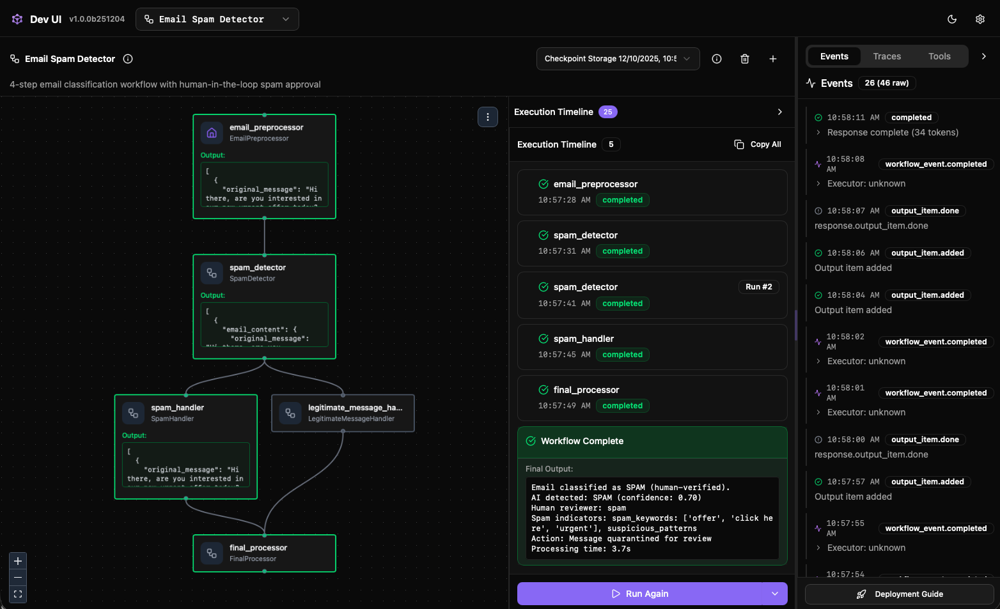

<!--
  Language parity table - keep in sync when adding/removing sections.

  | Section                | C# | Python | Go | Notes                       |
  |------------------------|:--:|:------:|:--:|-----------------------------|
  | DevUI purpose          | ✅ |   ✅   | ✅ |                             |
  | Installation           | ✅ |   ✅   | ❌ |                             |
  | Local registration     | ✅ |   ✅   | ❌ | Different hosting models    |
  | Aspire aggregation     | ✅ |   ❌   | ❌ | .NET-specific               |
  | Directory discovery    | ❌ |   ✅   | ❌ | Python-specific             |
  | Go availability        | ✅ |   ✅   | ✅ | Go zone is status only      |
-->

# DevUI

DevUI is a lightweight, standalone sample application for running agents and workflows in the Microsoft Agent Framework. It provides a web interface for interactive testing along with an OpenAI-compatible API backend, allowing you to visually debug, test, and iterate on agents and workflows you build before integrating them into your applications.

> [!IMPORTANT]
> DevUI is a **sample app** to help you visualize and debug your agents and workflows during development. It is **not** intended for production use.

::: zone pivot="programming-language-csharp"

## Install the packages

For a single .NET service, install the DevUI package. For an Aspire AppHost that aggregates multiple agent services, also install the Aspire hosting integration.

```bash
dotnet add package Microsoft.Agents.AI.DevUI --prerelease
dotnet add package Aspire.Hosting.AgentFramework.DevUI --prerelease
```

## Use DevUI with Aspire

Each agent service exposes OpenAI Responses and Conversations endpoints. The Aspire AppHost adds one DevUI resource and connects the agent services.

:::code language="csharp" source="~/../agent-framework-code/dotnet/samples/05-end-to-end/DevUIAspireIntegration/DevUIIntegration.AppHost/Program.cs" range="15-31":::

The `agents:` names passed to `WithAgentService` must match the names registered by `AddAIAgent(...)` in each service.

## Expose the agent service endpoints

:::code language="csharp" source="~/../agent-framework-code/dotnet/samples/05-end-to-end/DevUIAspireIntegration/WriterAgent/Program.cs" range="5-31":::

The DevUI aggregator combines entities from all configured services and routes Responses and Conversations requests to the correct backend.

::: zone-end

::: zone pivot="programming-language-python"

<p align="center">
  
</p>

## Features

- **Web Interface**: Interactive UI for testing agents and workflows
- **Flexible Input Types**: Support for text, file uploads, and custom input types based on your workflow's first executor
- **Directory-Based Discovery**: Automatically discover agents and workflows from a directory structure
- **In-Memory Registration**: Register entities programmatically without file system setup
- **OpenAI-Compatible API**: Use the OpenAI Python SDK to interact with your agents
- **Sample Gallery**: Browse and download curated examples when no entities are discovered
- **Tracing**: View OpenTelemetry traces for debugging and observability

## Input Types

DevUI adapts its input interface based on the entity type:

- **Agents**: Support text input and file attachments (images, documents, etc.) for multimodal interactions
- **Workflows**: The input interface is automatically generated based on the first executor's input type. DevUI introspects the workflow and reflects the expected input schema, making it easy to test workflows with structured or custom input types.

This dynamic input handling allows you to test your agents and workflows exactly as they would receive input in your application.

## Installation

Install DevUI from PyPI:

```bash
pip install agent-framework-devui --pre
```

## Quick Start

### Option 1: Programmatic Registration

Launch DevUI with agents registered in-memory:

```python
from agent_framework import Agent
from agent_framework.openai import OpenAIChatClient
from agent_framework.devui import serve

def get_weather(location: str) -> str:
    """Get weather for a location."""
    return f"Weather in {location}: 72F and sunny"

# Create your agent
agent = Agent(
    name="WeatherAgent",
    client=OpenAIChatClient(),
    tools=[get_weather]
)

# Launch DevUI
serve(entities=[agent], auto_open=True)
# Opens browser to http://localhost:8080
```

### Option 2: Directory Discovery (CLI)

If you have agents and workflows organized in a directory structure, launch DevUI from the command line:

```bash
# Launch web UI + API server
devui ./agents --port 8080
# Web UI: http://localhost:8080
# API: http://localhost:8080/v1/*
```

See [Directory Discovery](./directory-discovery.md) for details on the required directory structure.

## Using the OpenAI SDK

DevUI provides an OpenAI-compatible Responses API. You can use the OpenAI Python SDK to interact with your agents:

```python
from openai import OpenAI

client = OpenAI(
    base_url="http://localhost:8080/v1",
    api_key="not-needed"  # API key not required for local DevUI
)

response = client.responses.create(
    metadata={"entity_id": "weather_agent"},  # Your agent/workflow name
    input="What's the weather in Seattle?"
)

# Extract text from response
print(response.output[0].content[0].text)
```

For more details on the API, see [API Reference](./api-reference.md).

## CLI Options

```bash
devui [directory] [options]

Options:
  --port, -p      Port (default: 8080)
  --host          Host (default: 127.0.0.1)
  --headless      API only, no UI
  --no-open       Don't automatically open browser
  --tracing       Enable OpenTelemetry tracing
  --reload        Enable auto-reload
  --mode          developer|user (default: developer)
  --auth          Enable Bearer token authentication
  --auth-token    Custom authentication token
```

::: zone-end

::: zone pivot="programming-language-go"

> [!NOTE]
> Go support for this feature is coming soon. See the [Agent Framework Go repository](https://github.com/microsoft/agent-framework-go) for the latest status.

::: zone-end
## Next steps

> [!div class="nextstepaction"]
> [Directory Discovery](./directory-discovery.md)

**Go deeper:**

- [API Reference](./api-reference.md)
- [Tracing & Observability](./tracing.md)
- [Security & Deployment](./security.md)
- [Samples](./samples.md)
