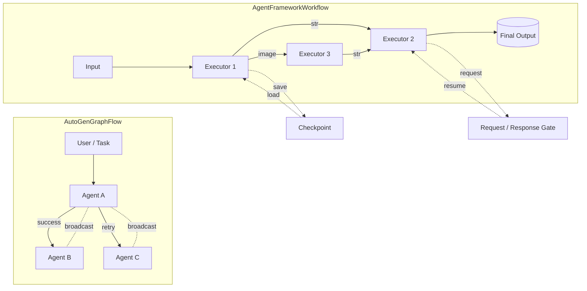

# AutoGen to Microsoft Agent Framework Migration Guide

A comprehensive guide for migrating from AutoGen to the Microsoft Agent Framework Python SDK.

## Table of Contents

- [Background](#background)
- [Key Similarities and Differences](#key-similarities-and-differences)
- [Model Client Creation and Configuration](#model-client-creation-and-configuration)
  - [AutoGen Model Clients](#autogen-model-clients)
  - [Agent Framework ChatClients](#agent-framework-chatclients)
  - [Responses API Support (Agent Framework Exclusive)](#responses-api-support-agent-framework-exclusive)
- [Single-Agent Feature Mapping](#single-agent-feature-mapping)
  - [Basic Agent Creation and Execution](#basic-agent-creation-and-execution)
  - [Managing Conversation State with AgentThread](#managing-conversation-state-with-agentthread)
  - [OpenAI Assistant Agent Equivalence](#openai-assistant-agent-equivalence)
  - [Streaming Support](#streaming-support)
  - [Message Types and Creation](#message-types-and-creation)
  - [Tool Creation and Integration](#tool-creation-and-integration)
  - [Hosted Tools (Agent Framework Exclusive)](#hosted-tools-agent-framework-exclusive)
  - [MCP Server Support](#mcp-server-support)
  - [Agent-as-a-Tool Pattern](#agent-as-a-tool-pattern)
  - [Middleware (Agent Framework Feature)](#middleware-agent-framework-feature)
  - [Custom Agents](#custom-agents)
- [Multi-Agent Feature Mapping](#multi-agent-feature-mapping)
  - [Programming Model Overview](#programming-model-overview)
  - [Workflow vs GraphFlow](#workflow-vs-graphflow)
    - [Visual Overview](#visual-overview)
    - [Code Comparison](#code-comparison)
  - [Nesting Patterns](#nesting-patterns)
  - [Group Chat Patterns](#group-chat-patterns)
    - [RoundRobinGroupChat Pattern](#roundrobingroupchat-pattern)
    - [MagenticOneGroupChat Pattern](#magenticonegroupchat-pattern)
    - [Future Patterns](#future-patterns)
  - [Human-in-the-Loop with Request Response](#human-in-the-loop-with-request-response)
    - [Agent Framework Request-Response API](#agent-framework-request-response-api)
    - [Running Human-in-the-Loop Workflows](#running-human-in-the-loop-workflows)
  - [Checkpointing and Resuming Workflows](#checkpointing-and-resuming-workflows)
    - [Agent Framework Checkpointing](#agent-framework-checkpointing)
    - [Resuming from Checkpoints](#resuming-from-checkpoints)
    - [Advanced Checkpointing Features](#advanced-checkpointing-features)
    - [Practical Examples](#practical-examples)
- [Observability](#observability)
  - [AutoGen Observability](#autogen-observability)
  - [Agent Framework Observability](#agent-framework-observability)
- [Conclusion](#conclusion)
  - [Additional Sample Categories](#additional-sample-categories)

## Background

[AutoGen](https://github.com/microsoft/autogen) is a framework for building AI
agents and multi-agent systems using large language models (LLMs). It started as a
research project at Microsoft Research and pioneered several concepts in multi-agent
orchestration, such as GroupChat and event-driven agent runtime.
The project has been a fruitful collaboration of the open-source community and
many important features came from external contributors.

[Microsoft Agent Framework](https://github.com/microsoft/agent-framework)
is a new multi-language SDK for building AI agents and workflows using LLMs.
It represents a significant evolution of the ideas pioneered in AutoGen
and incorporates lessons learned from real-world usage. It's developed
by the core AutoGen and Semantic Kernel teams at Microsoft,
and is designed to be a new foundation for building AI applications going forward.

This guide describes a practical migration path: it starts by covering what stays the same and what changes at a glance. Then, it covers model client setup, single‑agent features, and finally multi‑agent orchestration with concrete code side‑by‑side. Along the way, links to runnable samples in the Agent Framework repo help you validate each step.

## Key Similarities and Differences

### What Stays the Same

The foundations are familiar. You still create agents around a model client, provide instructions, and attach tools. Both libraries support function-style tools, token streaming, multimodal content, and async I/O.

```python
# Both frameworks follow similar patterns
# AutoGen
agent = AssistantAgent(name="assistant", model_client=client, tools=[my_tool])
result = await agent.run(task="Help me with this task")

# Agent Framework
agent = ChatAgent(name="assistant", chat_client=client, tools=[my_tool])
result = await agent.run("Help me with this task")
```

### Key Differences

1. Orchestration style: AutoGen pairs an event-driven core with a high‑level `Team`. Agent Framework centers on a typed, graph‑based `Workflow` that routes data along edges and activates executors when inputs are ready.

2. Tools: AutoGen wraps functions with `FunctionTool`. Agent Framework uses `@ai_function`, infers schemas automatically, and adds hosted tools such as a code interpreter and web search.

3. Agent behavior: `AssistantAgent` is single‑turn unless you increase `max_tool_iterations`. `ChatAgent` is multi‑turn by default and keeps invoking tools until it can return a final answer.

4. Runtime: AutoGen offers embedded and experimental distributed runtimes. Agent Framework focuses on single‑process composition today; distributed execution is planned.

## Model Client Creation and Configuration

Both frameworks provide model clients for major AI providers, with similar but not identical APIs.

| Feature                 | AutoGen                           | Agent Framework              |
| ----------------------- | --------------------------------- | ---------------------------- |
| OpenAI Client           | `OpenAIChatCompletionClient`      | `OpenAIChatClient`           |
| OpenAI Responses Client | ❌ Not available                  | `OpenAIResponsesClient`      |
| Azure OpenAI            | `AzureOpenAIChatCompletionClient` | `AzureOpenAIChatClient`      |
| Azure OpenAI Responses  | ❌ Not available                  | `AzureOpenAIResponsesClient` |
| Azure AI                | `AzureAIChatCompletionClient`     | `AzureAIAgentClient`         |
| Anthropic               | `AnthropicChatCompletionClient`   | 🚧 Planned                   |
| Ollama                  | `OllamaChatCompletionClient`      | 🚧 Planned                   |
| Caching                 | `ChatCompletionCache` wrapper     | 🚧 Planned                   |

### AutoGen Model Clients

```python
from autogen_ext.models.openai import OpenAIChatCompletionClient, AzureOpenAIChatCompletionClient

# OpenAI
client = OpenAIChatCompletionClient(
    model="gpt-5",
    api_key="your-key"
)

# Azure OpenAI
client = AzureOpenAIChatCompletionClient(
    azure_endpoint="https://your-endpoint.openai.azure.com/",
    azure_deployment="gpt-5",
    api_version="2024-12-01",
    api_key="your-key"
)
```

### Agent Framework ChatClients

```python
from agent_framework.openai import OpenAIChatClient
from agent_framework.azure import AzureOpenAIChatClient

# OpenAI (reads API key from environment)
client = OpenAIChatClient(model_id="gpt-5")

# Azure OpenAI (uses environment or default credentials; see samples for auth options)
client = AzureOpenAIChatClient(model_id="gpt-5")
```

For detailed examples, see:

- [OpenAI Chat Client](https://github.com/microsoft/agent-framework/blob/main/python/samples/getting_started/agents/openai/openai_chat_client_basic.py) - Basic OpenAI client setup
- [Azure OpenAI Chat Client](https://github.com/microsoft/agent-framework/blob/main/python/samples/getting_started/agents/azure_openai/azure_chat_client_basic.py) - Azure OpenAI with authentication
- [Azure AI Client](https://github.com/microsoft/agent-framework/blob/main/python/samples/getting_started/agents/azure_ai/azure_ai_basic.py) - Azure AI agent integration

### Responses API Support (Agent Framework Exclusive)

Agent Framework's `AzureOpenAIResponsesClient` and `OpenAIResponsesClient` provide specialized support for reasoning models and structured responses not available in AutoGen:

```python
from agent_framework.azure import AzureOpenAIResponsesClient
from agent_framework.openai import OpenAIResponsesClient

# Azure OpenAI with Responses API
azure_responses_client = AzureOpenAIResponsesClient(model_id="gpt-5")

# OpenAI with Responses API
openai_responses_client = OpenAIResponsesClient(model_id="gpt-5")
```

For Responses API examples, see:

- [Azure Responses Client Basic](https://github.com/microsoft/agent-framework/blob/main/python/samples/getting_started/agents/azure_openai/azure_responses_client_basic.py) - Azure OpenAI with responses
- [OpenAI Responses Client Basic](https://github.com/microsoft/agent-framework/blob/main/python/samples/getting_started/agents/openai/openai_responses_client_basic.py) - OpenAI responses integration

## Single-Agent Feature Mapping

This section maps single‑agent features between AutoGen and Agent Framework. With a client in place, create an agent, attach tools, and choose between non‑streaming and streaming execution.

### Basic Agent Creation and Execution

Once you have a model client configured, the next step is creating agents. Both frameworks provide similar agent abstractions, but with different default behaviors and configuration options.

#### AutoGen AssistantAgent

```python
from autogen_agentchat.agents import AssistantAgent

agent = AssistantAgent(
    name="assistant",
    model_client=client,
    system_message="You are a helpful assistant.",
    tools=[my_tool],
    max_tool_iterations=1  # Single-turn by default
)

# Execution
result = await agent.run(task="What's the weather?")
```

#### Agent Framework ChatAgent

```python
from agent_framework import ChatAgent, ai_function
from agent_framework.openai import OpenAIChatClient

# Create simple tools for the example
@ai_function
def get_weather(location: str) -> str:
    """Get weather for a location."""
    return f"Weather in {location}: sunny"

@ai_function
def get_time() -> str:
    """Get current time."""
    return "Current time: 2:30 PM"

# Create client
client = OpenAIChatClient(model_id="gpt-5")

async def example():
    # Direct creation
    agent = ChatAgent(
        name="assistant",
        chat_client=client,
        instructions="You are a helpful assistant.",
        tools=[get_weather]  # Multi-turn by default
    )

    # Factory method (more convenient)
    agent = client.create_agent(
        name="assistant",
        instructions="You are a helpful assistant.",
        tools=[get_weather]
    )

    # Execution with runtime tool configuration
    result = await agent.run(
        "What's the weather?",
        tools=[get_time],  # Can add tools at runtime
        tool_choice="auto"
    )
```

**Key Differences:**

- **Default behavior**: `ChatAgent` automatically iterates through tool calls, while `AssistantAgent` requires explicit `max_tool_iterations` setting
- **Runtime configuration**: `ChatAgent.run()` accepts `tools` and `tool_choice` parameters for per-invocation customization
- **Factory methods**: Agent Framework provides convenient factory methods directly from chat clients
- **State management**: `ChatAgent` is stateless and doesn't maintain conversation history between invocations, unlike `AssistantAgent` which maintains conversation history as part of its state

#### Managing Conversation State with AgentThread

To continue conversations with `ChatAgent`, use `AgentThread` to manage conversation history:

```python
# Assume we have an agent from previous examples
async def conversation_example():
    # Create a new thread that will be reused
    thread = agent.get_new_thread()

    # First interaction - thread is empty
    result1 = await agent.run("What's 2+2?", thread=thread)
    print(result1.text)  # "4"

    # Continue conversation - thread contains previous messages
    result2 = await agent.run("What about that number times 10?", thread=thread)
    print(result2.text)  # "40" (understands "that number" refers to 4)

    # AgentThread can use external storage, similar to ChatCompletionContext in AutoGen
```

Stateless by default: quick demo

```python
# Without a thread (two independent invocations)
r1 = await agent.run("What's 2+2?")
print(r1.text)  # for example, "4"

r2 = await agent.run("What about that number times 10?")
print(r2.text)  # Likely ambiguous without prior context; cannot be "40"

# With a thread (shared context across calls)
thread = agent.get_new_thread()
print((await agent.run("What's 2+2?", thread=thread)).text)  # "4"
print((await agent.run("What about that number times 10?", thread=thread)).text)  # "40"
```

For thread management examples, see:

- [Azure AI with Thread](https://github.com/microsoft/agent-framework/blob/main/python/samples/getting_started/agents/azure_ai/azure_ai_with_thread.py) - Conversation state management
- [OpenAI Chat Client with Thread](https://github.com/microsoft/agent-framework/blob/main/python/samples/getting_started/agents/openai/openai_chat_client_with_thread.py) - Thread usage patterns
- [Redis-backed Threads](https://github.com/microsoft/agent-framework/blob/main/python/samples/getting_started/threads/redis_chat_message_store_thread.py) - Persisting conversation state externally

#### OpenAI Assistant Agent Equivalence

Both frameworks provide OpenAI Assistant API integration:

```python
# AutoGen OpenAIAssistantAgent
from autogen_ext.agents.openai import OpenAIAssistantAgent
```

```python
# Agent Framework has OpenAI Assistants support via OpenAIAssistantsClient
from agent_framework.openai import OpenAIAssistantsClient
```

For OpenAI Assistant examples, see:

- [OpenAI Assistants Basic](https://github.com/microsoft/agent-framework/blob/main/python/samples/getting_started/agents/openai/openai_assistants_basic.py) - Basic assistant setup
- [OpenAI Assistants with Function Tools](https://github.com/microsoft/agent-framework/blob/main/python/samples/getting_started/agents/openai/openai_assistants_with_function_tools.py) - Custom tools integration
- [Azure OpenAI Assistants Basic](https://github.com/microsoft/agent-framework/blob/main/python/samples/getting_started/agents/azure_openai/azure_assistants_basic.py) - Azure assistant setup
- [OpenAI Assistants with Thread](https://github.com/microsoft/agent-framework/blob/main/python/samples/getting_started/agents/openai/openai_assistants_with_thread.py) - Thread management

### Streaming Support

Both frameworks stream tokens in real time—from clients and from agents—to keep UIs responsive.

#### AutoGen Streaming

```python
# Model client streaming
async for chunk in client.create_stream(messages):
    if isinstance(chunk, str):
        print(chunk, end="")

# Agent streaming
async for event in agent.run_stream(task="Hello"):
    if isinstance(event, ModelClientStreamingChunkEvent):
        print(event.content, end="")
    elif isinstance(event, TaskResult):
        print("Final result received")
```

#### Agent Framework Streaming

```python
# Assume we have client, agent, and tools from previous examples
async def streaming_example():
    # Chat client streaming
    async for chunk in client.get_streaming_response("Hello", tools=tools):
        if chunk.text:
            print(chunk.text, end="")

    # Agent streaming
    async for chunk in agent.run_stream("Hello"):
        if chunk.text:
            print(chunk.text, end="", flush=True)
```

Tip: In Agent Framework, both clients and agents yield the same update shape; you can read `chunk.text` in either case.

### Message Types and Creation

Understanding how messages work is crucial for effective agent communication. Both frameworks provide different approaches to message creation and handling, with AutoGen using separate message classes and Agent Framework using a unified message system.

#### AutoGen Message Types

```python
from autogen_agentchat.messages import TextMessage, MultiModalMessage
from autogen_core.models import UserMessage

# Text message
text_msg = TextMessage(content="Hello", source="user")

# Multi-modal message
multi_modal_msg = MultiModalMessage(
    content=["Describe this image", image_data],
    source="user"
)

# Convert to model format for use with model clients
user_message = text_msg.to_model_message()
```

#### Agent Framework Message Types

```python
from agent_framework import ChatMessage, TextContent, DataContent, UriContent, Role
import base64

# Text message
text_msg = ChatMessage(role=Role.USER, text="Hello")

# Supply real image bytes, or use a data: URI/URL via UriContent
image_bytes = b"<your_image_bytes>"
image_b64 = base64.b64encode(image_bytes).decode()
image_uri = f"data:image/jpeg;base64,{image_b64}"

# Multi-modal message with mixed content
multi_modal_msg = ChatMessage(
    role=Role.USER,
    contents=[
        TextContent(text="Describe this image"),
        DataContent(uri=image_uri, media_type="image/jpeg")
    ]
)
```

**Key Differences**:

- AutoGen uses separate message classes (`TextMessage`, `MultiModalMessage`) with a `source` field
- Agent Framework uses a unified `ChatMessage` with typed content objects and a `role` field
- Agent Framework messages use `Role` enum (USER, ASSISTANT, SYSTEM, TOOL) instead of string sources

### Tool Creation and Integration

Tools extend agent capabilities beyond text generation. The frameworks take different approaches to tool creation, with Agent Framework providing more automated schema generation.

#### AutoGen FunctionTool

```python
from autogen_core.tools import FunctionTool

async def get_weather(location: str) -> str:
    """Get weather for a location."""
    return f"Weather in {location}: sunny"

# Manual tool creation
tool = FunctionTool(
    func=get_weather,
    description="Get weather information"
)

# Use with agent
agent = AssistantAgent(name="assistant", model_client=client, tools=[tool])
```

#### Agent Framework @ai_function

```python
from agent_framework import ai_function
from typing import Annotated
from pydantic import Field

@ai_function
def get_weather(
    location: Annotated[str, Field(description="The location to get weather for")]
) -> str:
    """Get weather for a location."""
    return f"Weather in {location}: sunny"

# Direct use with agent (automatic conversion)
agent = ChatAgent(name="assistant", chat_client=client, tools=[get_weather])
```

For detailed examples, see:

- [OpenAI Chat Agent Basic](https://github.com/microsoft/agent-framework/blob/main/python/samples/getting_started/agents/openai/openai_chat_client_basic.py) - Simple OpenAI chat agent
- [OpenAI with Function Tools](https://github.com/microsoft/agent-framework/blob/main/python/samples/getting_started/agents/openai/openai_chat_client_with_function_tools.py) - Agent with custom tools
- [Azure OpenAI Basic](https://github.com/microsoft/agent-framework/blob/main/python/samples/getting_started/agents/azure_openai/azure_chat_client_basic.py) - Azure OpenAI agent setup

#### Hosted Tools (Agent Framework Exclusive)

Agent Framework provides hosted tools that are not available in AutoGen:

```python
from agent_framework import ChatAgent, HostedCodeInterpreterTool, HostedWebSearchTool
from agent_framework.azure import AzureOpenAIChatClient

# Azure OpenAI client with a model that supports hosted tools
client = AzureOpenAIChatClient(model_id="gpt-5")

# Code execution tool
code_tool = HostedCodeInterpreterTool()

# Web search tool
search_tool = HostedWebSearchTool()

agent = ChatAgent(
    name="researcher",
    chat_client=client,
    tools=[code_tool, search_tool]
)
```

For detailed examples, see:

- [Azure AI with Code Interpreter](https://github.com/microsoft/agent-framework/blob/main/python/samples/getting_started/agents/azure_ai/azure_ai_with_code_interpreter.py) - Code execution tool
- [Azure AI with Multiple Tools](https://github.com/microsoft/agent-framework/blob/main/python/samples/getting_started/agents/azure_ai/azure_ai_with_multiple_tools.py) - Multiple hosted tools
- [OpenAI with Web Search](https://github.com/microsoft/agent-framework/blob/main/python/samples/getting_started/agents/openai/openai_chat_client_with_web_search.py) - Web search integration

Requirements and caveats:

- Hosted tools are only available on models/accounts that support them. Verify entitlements and model support for your provider before enabling these tools.
- Configuration differs by provider; follow the prerequisites in each sample for setup and permissions.
- Not every model supports every hosted tool (for example, web search vs code interpreter). Choose a compatible model in your environment.

> [!NOTE]
> AutoGen supports local code execution tools, but this feature is planned for future Agent Framework versions.

**Key Difference**: Agent Framework handles tool iteration automatically at the agent level. Unlike AutoGen's `max_tool_iterations` parameter, Agent Framework agents continue tool execution until completion by default, with built-in safety mechanisms to prevent infinite loops.

### MCP Server Support

For advanced tool integration, both frameworks support Model Context Protocol (MCP), enabling agents to interact with external services and data sources. Agent Framework provides more comprehensive built-in support.

#### AutoGen MCP Support

AutoGen has basic MCP support through extensions (specific implementation details vary by version).

#### Agent Framework MCP Support

```python
from agent_framework import ChatAgent, MCPStdioTool, MCPStreamableHTTPTool, MCPWebsocketTool
from agent_framework.openai import OpenAIChatClient

# Create client for the example
client = OpenAIChatClient(model_id="gpt-5")

# Stdio MCP server
mcp_tool = MCPStdioTool(
    name="filesystem",
    command="uvx mcp-server-filesystem",
    args=["/allowed/directory"]
)

# HTTP streaming MCP
http_mcp = MCPStreamableHTTPTool(
    name="http_mcp",
    url="http://localhost:8000/sse"
)

# WebSocket MCP
ws_mcp = MCPWebsocketTool(
    name="websocket_mcp",
    url="ws://localhost:8000/ws"
)

agent = ChatAgent(name="assistant", chat_client=client, tools=[mcp_tool])
```

For MCP examples, see:

- [OpenAI with Local MCP](https://github.com/microsoft/agent-framework/blob/main/python/samples/getting_started/agents/openai/openai_chat_client_with_local_mcp.py) - Using MCPStreamableHTTPTool with OpenAI
- [OpenAI with Hosted MCP](https://github.com/microsoft/agent-framework/blob/main/python/samples/getting_started/agents/openai/openai_responses_client_with_hosted_mcp.py) - Using hosted MCP services
- [Azure AI with Local MCP](https://github.com/microsoft/agent-framework/blob/main/python/samples/getting_started/agents/azure_ai/azure_ai_with_local_mcp.py) - Using MCP with Azure AI
- [Azure AI with Hosted MCP](https://github.com/microsoft/agent-framework/blob/main/python/samples/getting_started/agents/azure_ai/azure_ai_with_hosted_mcp.py) - Using hosted MCP with Azure AI

### Agent-as-a-Tool Pattern

One powerful pattern is using agents themselves as tools, enabling hierarchical agent architectures. Both frameworks support this pattern with different implementations.

#### AutoGen AgentTool

```python
from autogen_agentchat.tools import AgentTool

# Create specialized agent
writer = AssistantAgent(
    name="writer",
    model_client=client,
    system_message="You are a creative writer."
)

# Wrap as tool
writer_tool = AgentTool(agent=writer)

# Use in coordinator (requires disabling parallel tool calls)
coordinator_client = OpenAIChatCompletionClient(
    model="gpt-5",
    parallel_tool_calls=False
)
coordinator = AssistantAgent(
    name="coordinator",
    model_client=coordinator_client,
    tools=[writer_tool]
)
```

#### Agent Framework as_tool()

```python
from agent_framework import ChatAgent

# Assume we have client from previous examples
# Create specialized agent
writer = ChatAgent(
    name="writer",
    chat_client=client,
    instructions="You are a creative writer."
)

# Convert to tool
writer_tool = writer.as_tool(
    name="creative_writer",
    description="Generate creative content",
    arg_name="request",
    arg_description="What to write"
)

# Use in coordinator
coordinator = ChatAgent(
    name="coordinator",
    chat_client=client,
    tools=[writer_tool]
)
```

Explicit migration note: In AutoGen, set `parallel_tool_calls=False` on the coordinator's model client when wrapping agents as tools to avoid concurrency issues when invoking the same agent instance.
In Agent Framework, `as_tool()` does not require disabling parallel tool calls
as agents are stateless by default.

### Middleware (Agent Framework Feature)

Agent Framework introduces middleware capabilities that AutoGen lacks. Middleware enables powerful cross-cutting concerns like logging, security, and performance monitoring.

```python
from agent_framework import ChatAgent, AgentRunContext, FunctionInvocationContext
from typing import Callable, Awaitable

# Assume we have client from previous examples
async def logging_middleware(
    context: AgentRunContext,
    next: Callable[[AgentRunContext], Awaitable[None]]
) -> None:
    print(f"Agent {context.agent.name} starting")
    await next(context)
    print(f"Agent {context.agent.name} completed")

async def security_middleware(
    context: FunctionInvocationContext,
    next: Callable[[FunctionInvocationContext], Awaitable[None]]
) -> None:
    if "password" in str(context.arguments):
        print("Blocking function call with sensitive data")
        return  # Don't call next()
    await next(context)

agent = ChatAgent(
    name="secure_agent",
    chat_client=client,
    middleware=[logging_middleware, security_middleware]
)
```

**Benefits:**

- **Security**: Input validation and content filtering
- **Observability**: Logging, metrics, and tracing
- **Performance**: Caching and rate limiting
- **Error handling**: Graceful degradation and retry logic

For detailed middleware examples, see:

- [Function-based Middleware](https://github.com/microsoft/agent-framework/blob/main/python/samples/getting_started/middleware/function_based_middleware.py) - Simple function middleware
- [Class-based Middleware](https://github.com/microsoft/agent-framework/blob/main/python/samples/getting_started/middleware/class_based_middleware.py) - Object-oriented middleware
- [Exception Handling Middleware](https://github.com/microsoft/agent-framework/blob/main/python/samples/getting_started/middleware/exception_handling_with_middleware.py) - Error handling patterns
- [Shared State Middleware](https://github.com/microsoft/agent-framework/blob/main/python/samples/getting_started/middleware/shared_state_middleware.py) - State management across agents

### Custom Agents

Sometimes you don't want a model-backed agent at all—you want a deterministic or API-backed agent with custom logic. Both frameworks support building custom agents, but the patterns differ.

#### AutoGen: Subclass BaseChatAgent

```python
from typing import Sequence
from autogen_agentchat.agents import BaseChatAgent
from autogen_agentchat.base import Response
from autogen_agentchat.messages import BaseChatMessage, TextMessage, StopMessage
from autogen_core import CancellationToken

class StaticAgent(BaseChatAgent):
    def __init__(self, name: str = "static", description: str = "Static responder") -> None:
        super().__init__(name, description)

    @property
    def produced_message_types(self) -> Sequence[type[BaseChatMessage]]:  # Which message types this agent produces
        return (TextMessage,)

    async def on_messages(self, messages: Sequence[BaseChatMessage], cancellation_token: CancellationToken) -> Response:
        # Always return a static response
        return Response(chat_message=TextMessage(content="Hello from AutoGen custom agent", source=self.name))
```

Notes:

- Implement `on_messages(...)` and return a `Response` with a chat message.
- Optionally implement `on_reset(...)` to clear internal state between runs.

#### Agent Framework: Extend BaseAgent (thread-aware)

```python
from collections.abc import AsyncIterable
from typing import Any
from agent_framework import (
    AgentResponse,
    AgentResponseUpdate,
    AgentThread,
    BaseAgent,
    ChatMessage,
    Role,
    TextContent,
)

class StaticAgent(BaseAgent):
    async def run(
        self,
        messages: str | ChatMessage | list[str] | list[ChatMessage] | None = None,
        *,
        thread: AgentThread | None = None,
        **kwargs: Any,
    ) -> AgentResponse:
        # Build a static reply
        reply = ChatMessage(role=Role.ASSISTANT, contents=[TextContent(text="Hello from AF custom agent")])

        # Persist conversation to the provided AgentThread (if any)
        if thread is not None:
            normalized = self._normalize_messages(messages)
            await self._notify_thread_of_new_messages(thread, normalized, reply)

        return AgentResponse(messages=[reply])

    async def run_stream(
        self,
        messages: str | ChatMessage | list[str] | list[ChatMessage] | None = None,
        *,
        thread: AgentThread | None = None,
        **kwargs: Any,
    ) -> AsyncIterable[AgentResponseUpdate]:
        # Stream the same static response in a single chunk for simplicity
        yield AgentResponseUpdate(contents=[TextContent(text="Hello from AF custom agent")], role=Role.ASSISTANT)

        # Notify thread of input and the complete response once streaming ends
        if thread is not None:
            reply = ChatMessage(role=Role.ASSISTANT, contents=[TextContent(text="Hello from AF custom agent")])
            normalized = self._normalize_messages(messages)
            await self._notify_thread_of_new_messages(thread, normalized, reply)
```

Notes:

- `AgentThread` maintains conversation state externally; use `agent.get_new_thread()` and pass it to `run`/`run_stream`.
- Call `self._notify_thread_of_new_messages(thread, input_messages, response_messages)` so the thread has both sides of the exchange.
- See the full sample: [Custom Agent](https://github.com/microsoft/agent-framework/blob/main/python/samples/getting_started/agents/custom/custom_agent.py)

---

Next, let's look at multi‑agent orchestration—the area where the frameworks differ most.

## Multi-Agent Feature Mapping

### Programming Model Overview

The multi-agent programming models represent the most significant difference between the two frameworks.

#### AutoGen's Dual Model Approach

AutoGen provides two programming models:

1. **`autogen-core`**: Low-level, event-driven programming with `RoutedAgent` and message subscriptions
2. **`Team` abstraction**: High-level, run-centric model built on top of `autogen-core`

```python
# Low-level autogen-core (complex)
class MyAgent(RoutedAgent):
    @message_handler
    async def handle_message(self, message: TextMessage, ctx: MessageContext) -> None:
        # Handle specific message types
        pass

# High-level Team (easier but limited)
team = RoundRobinGroupChat(
    participants=[agent1, agent2],
    termination_condition=StopAfterNMessages(5)
)
result = await team.run(task="Collaborate on this task")
```

**Challenges:**

- Low-level model is too complex for most users
- High-level model can become limiting for complex behaviors
- Bridging between the two models adds implementation complexity

#### Agent Framework's Unified Workflow Model

Agent Framework provides a single `Workflow` abstraction that combines the best of both approaches:

```python
from agent_framework import WorkflowBuilder, executor, WorkflowContext
from typing_extensions import Never

# Assume we have agent1 and agent2 from previous examples
@executor(id="agent1")
async def agent1_executor(input_msg: str, ctx: WorkflowContext[str]) -> None:
    response = await agent1.run(input_msg)
    await ctx.send_message(response.text)

@executor(id="agent2")
async def agent2_executor(input_msg: str, ctx: WorkflowContext[Never, str]) -> None:
    response = await agent2.run(input_msg)
    await ctx.yield_output(response.text)  # Final output

# Build typed data flow graph
workflow = (WorkflowBuilder()
           .add_edge(agent1_executor, agent2_executor)
           .set_start_executor(agent1_executor)
           .build())

# Example usage (would be in async context)
# result = await workflow.run("Initial input")
```

For detailed workflow examples, see:

- [Workflow Basics](https://github.com/microsoft/agent-framework/blob/main/python/samples/getting_started/workflows/_start-here/step1_executors_and_edges.py) - Introduction to executors and edges
- [Agents in Workflow](https://github.com/microsoft/agent-framework/blob/main/python/samples/getting_started/workflows/_start-here/step2_agents_in_a_workflow.py) - Integrating agents in workflows
- [Workflow Streaming](https://github.com/microsoft/agent-framework/blob/main/python/samples/getting_started/workflows/_start-here/step3_streaming.py) - Real-time workflow execution

**Benefits:**

- **Unified model**: Single abstraction for all complexity levels
- **Type safety**: Strongly typed inputs and outputs
- **Graph visualization**: Clear data flow representation
- **Flexible composition**: Mix agents, functions, and sub-workflows

### Workflow vs GraphFlow

The Agent Framework's `Workflow` abstraction is inspired by AutoGen's experimental `GraphFlow` feature, but represents a significant evolution in design philosophy:

- **GraphFlow**: Control-flow based where edges are transitions and messages are broadcast to all agents; transitions are
  conditioned on broadcasted message content
- **Workflow**: Data-flow based where messages are routed through specific edges and executors are activated by edges, with
  support for concurrent execution.

#### Visual Overview

The diagram below contrasts AutoGen's control-flow GraphFlow (left) with Agent Framework's data-flow Workflow (right). GraphFlow models agents as nodes with conditional transitions and broadcasts. Workflow models executors (agents, functions, or sub-workflows) connected by typed edges; it also supports request/response pauses and checkpointing.



In practice:

- GraphFlow uses agents as nodes and broadcasts messages; edges represent conditional transitions.
- Workflow routes typed messages along edges. Nodes (executors) can be agents, pure functions, or sub-workflows.
- Request/response lets a workflow pause for external input; checkpointing persists progress and enables resume.

#### Code Comparison

##### 1) Sequential + Conditional

```python
# AutoGen GraphFlow (fluent builder) — writer → reviewer → editor (conditional)
from autogen_agentchat.agents import AssistantAgent
from autogen_agentchat.teams import DiGraphBuilder, GraphFlow

writer = AssistantAgent(name="writer", description="Writes a draft", model_client=client)
reviewer = AssistantAgent(name="reviewer", description="Reviews the draft", model_client=client)
editor = AssistantAgent(name="editor", description="Finalizes the draft", model_client=client)

graph = (
    DiGraphBuilder()
    .add_node(writer).add_node(reviewer).add_node(editor)
    .add_edge(writer, reviewer)  # always
    .add_edge(reviewer, editor, condition=lambda msg: "approve" in msg.to_model_text())
    .set_entry_point(writer)
).build()

team = GraphFlow(participants=[writer, reviewer, editor], graph=graph)
result = await team.run(task="Draft a short paragraph about solar power")
```

```python
# Agent Framework Workflow — sequential executors with conditional logic
from agent_framework import WorkflowBuilder, executor, WorkflowContext
from typing_extensions import Never

@executor(id="writer")
async def writer_exec(task: str, ctx: WorkflowContext[str]) -> None:
    await ctx.send_message(f"Draft: {task}")

@executor(id="reviewer")
async def reviewer_exec(draft: str, ctx: WorkflowContext[str]) -> None:
    decision = "approve" if "solar" in draft.lower() else "revise"
    await ctx.send_message(f"{decision}:{draft}")

@executor(id="editor")
async def editor_exec(msg: str, ctx: WorkflowContext[Never, str]) -> None:
    if msg.startswith("approve:"):
        await ctx.yield_output(msg.split(":", 1)[1])
    else:
        await ctx.yield_output("Needs revision")

workflow_seq = (
    WorkflowBuilder()
    .add_edge(writer_exec, reviewer_exec)
    .add_edge(reviewer_exec, editor_exec)
    .set_start_executor(writer_exec)
    .build()
)
```

##### 2) Fan‑out + Join (ALL vs ANY)

```python
# AutoGen GraphFlow — A → (B, C) → D with ALL/ANY join
from autogen_agentchat.teams import DiGraphBuilder, GraphFlow
A, B, C, D = agent_a, agent_b, agent_c, agent_d

# ALL (default): D runs after both B and C
g_all = (
    DiGraphBuilder()
    .add_node(A).add_node(B).add_node(C).add_node(D)
    .add_edge(A, B).add_edge(A, C)
    .add_edge(B, D).add_edge(C, D)
    .set_entry_point(A)
).build()

# ANY: D runs when either B or C completes
g_any = (
    DiGraphBuilder()
    .add_node(A).add_node(B).add_node(C).add_node(D)
    .add_edge(A, B).add_edge(A, C)
    .add_edge(B, D, activation_group="join_d", activation_condition="any")
    .add_edge(C, D, activation_group="join_d", activation_condition="any")
    .set_entry_point(A)
).build()
```

```python
# Agent Framework Workflow — A → (B, C) → aggregator (ALL vs ANY)
from agent_framework import WorkflowBuilder, executor, WorkflowContext
from typing_extensions import Never

@executor(id="A")
async def start(task: str, ctx: WorkflowContext[str]) -> None:
    await ctx.send_message(f"B:{task}", target_id="B")
    await ctx.send_message(f"C:{task}", target_id="C")

@executor(id="B")
async def branch_b(text: str, ctx: WorkflowContext[str]) -> None:
    await ctx.send_message(f"B_done:{text}")

@executor(id="C")
async def branch_c(text: str, ctx: WorkflowContext[str]) -> None:
    await ctx.send_message(f"C_done:{text}")

@executor(id="join_any")
async def join_any(msg: str, ctx: WorkflowContext[Never, str]) -> None:
    await ctx.yield_output(f"First: {msg}")  # ANY join (first arrival)

@executor(id="join_all")
async def join_all(msg: str, ctx: WorkflowContext[str, str]) -> None:
    state = await ctx.get_executor_state() or {"items": []}
    state["items"].append(msg)
    await ctx.set_executor_state(state)
    if len(state["items"]) >= 2:
        await ctx.yield_output(" | ".join(state["items"]))  # ALL join

wf_any = (
    WorkflowBuilder()
    .add_edge(start, branch_b).add_edge(start, branch_c)
    .add_edge(branch_b, join_any).add_edge(branch_c, join_any)
    .set_start_executor(start)
    .build()
)

wf_all = (
    WorkflowBuilder()
    .add_edge(start, branch_b).add_edge(start, branch_c)
    .add_edge(branch_b, join_all).add_edge(branch_c, join_all)
    .set_start_executor(start)
    .build()
)
```

##### 3) Targeted Routing (no broadcast)

```python
from agent_framework import WorkflowBuilder, executor, WorkflowContext
from typing_extensions import Never

@executor(id="ingest")
async def ingest(task: str, ctx: WorkflowContext[str]) -> None:
    # Route selectively using target_id
    if task.startswith("image:"):
        await ctx.send_message(task.removeprefix("image:"), target_id="vision")
    else:
        await ctx.send_message(task, target_id="writer")

@executor(id="writer")
async def write(text: str, ctx: WorkflowContext[Never, str]) -> None:
    await ctx.yield_output(f"Draft: {text}")

@executor(id="vision")
async def caption(image_ref: str, ctx: WorkflowContext[Never, str]) -> None:
    await ctx.yield_output(f"Caption: {image_ref}")

workflow = (
    WorkflowBuilder()
    .add_edge(ingest, write)
    .add_edge(ingest, caption)
    .set_start_executor(ingest)
    .build()
)

# Example usage (async):
# await workflow.run("Summarize the benefits of solar power")
# await workflow.run("image:https://example.com/panel.jpg")
```

What to notice:

- GraphFlow broadcasts messages and uses conditional transitions. Join behavior is configured via target‑side `activation` and per‑edge `activation_group`/`activation_condition` (for example, group both edges into `join_d` with `activation_condition="any"`).
- Workflow routes data explicitly; use `target_id` to select downstream executors. Join behavior lives in the receiving executor (for example, yield on first input vs wait for all), or via orchestration builders/aggregators.
- Executors in Workflow are free‑form: wrap a `ChatAgent`, a function, or a sub‑workflow and mix them within the same graph.

#### Key Differences

The table below summarizes the fundamental differences between AutoGen's GraphFlow and Agent Framework's Workflow:

| Aspect            | AutoGen GraphFlow                    | Agent Framework Workflow         |
| ----------------- | ------------------------------------ | -------------------------------- |
| **Flow Type**     | Control flow (edges are transitions) | Data flow (edges route messages) |
| **Node Types**    | Agents only                          | Agents, functions, sub-workflows |
| **Activation**    | Message broadcast                    | Edge-based activation            |
| **Type Safety**   | Limited                              | Strong typing throughout         |
| **Composability** | Limited                              | Highly composable                |

### Nesting Patterns

#### AutoGen Team Nesting

```python
# Inner team
inner_team = RoundRobinGroupChat(
    participants=[specialist1, specialist2],
    termination_condition=StopAfterNMessages(3)
)

# Outer team with nested team as participant
outer_team = RoundRobinGroupChat(
    participants=[coordinator, inner_team, reviewer],  # Team as participant
    termination_condition=StopAfterNMessages(10)
)

# Messages are broadcasted to all participants including nested team
result = await outer_team.run("Complex task requiring collaboration")
```

**AutoGen nesting characteristics:**

- Nested team receives all messages from outer team
- Nested team messages are broadcast to all outer team participants
- Shared message context across all levels

#### Agent Framework Workflow Nesting

```python
from agent_framework import WorkflowExecutor, WorkflowBuilder

# Assume we have executors from previous examples
# specialist1_executor, specialist2_executor, coordinator_executor, reviewer_executor

# Create sub-workflow
sub_workflow = (WorkflowBuilder()
               .add_edge(specialist1_executor, specialist2_executor)
               .set_start_executor(specialist1_executor)
               .build())

# Wrap as executor
sub_workflow_executor = WorkflowExecutor(
    workflow=sub_workflow,
    id="sub_process"
)

# Use in parent workflow
parent_workflow = (WorkflowBuilder()
                  .add_edge(coordinator_executor, sub_workflow_executor)
                  .add_edge(sub_workflow_executor, reviewer_executor)
                  .set_start_executor(coordinator_executor)
                  .build())
```

**Agent Framework nesting characteristics:**

- Isolated input/output through `WorkflowExecutor`
- No message broadcasting - data flows through specific connections
- Independent state management for each workflow level

### Group Chat Patterns

Group chat patterns enable multiple agents to collaborate on complex tasks. Here's how common patterns translate between frameworks.

#### RoundRobinGroupChat Pattern

**AutoGen Implementation:**

```python
from autogen_agentchat.teams import RoundRobinGroupChat
from autogen_agentchat.conditions import StopAfterNMessages

team = RoundRobinGroupChat(
    participants=[agent1, agent2, agent3],
    termination_condition=StopAfterNMessages(10)
)
result = await team.run("Discuss this topic")
```

**Agent Framework Implementation:**

```python
from agent_framework import SequentialBuilder, WorkflowOutputEvent

# Assume we have agent1, agent2, agent3 from previous examples
# Sequential workflow through participants
workflow = SequentialBuilder().participants([agent1, agent2, agent3]).build()

# Example usage (would be in async context)
async def sequential_example():
    # Each agent appends to shared conversation
    async for event in workflow.run_stream("Discuss this topic"):
        if isinstance(event, WorkflowOutputEvent):
            conversation_history = event.data  # list[ChatMessage]
```

For detailed orchestration examples, see:

- [Sequential Agents](https://github.com/microsoft/agent-framework/blob/main/python/samples/getting_started/workflows/orchestration/sequential_agents.py) - Round-robin style agent execution
- [Sequential Custom Executors](https://github.com/microsoft/agent-framework/blob/main/python/samples/getting_started/workflows/orchestration/sequential_custom_executors.py) - Custom executor patterns

For concurrent execution patterns, Agent Framework also provides:

```python
from agent_framework import ConcurrentBuilder, WorkflowOutputEvent

# Assume we have agent1, agent2, agent3 from previous examples
# Concurrent workflow for parallel processing
workflow = (ConcurrentBuilder()
           .participants([agent1, agent2, agent3])
           .build())

# Example usage (would be in async context)
async def concurrent_example():
    # All agents process the input concurrently
    async for event in workflow.run_stream("Process this in parallel"):
        if isinstance(event, WorkflowOutputEvent):
            results = event.data  # Combined results from all agents
```

For concurrent execution examples, see:

- [Concurrent Agents](https://github.com/microsoft/agent-framework/blob/main/python/samples/getting_started/workflows/orchestration/concurrent_agents.py) - Parallel agent execution
- [Concurrent Custom Executors](https://github.com/microsoft/agent-framework/blob/main/python/samples/getting_started/workflows/orchestration/concurrent_custom_executors.py) - Custom parallel patterns
- [Concurrent with Custom Aggregator](https://github.com/microsoft/agent-framework/blob/main/python/samples/getting_started/workflows/orchestration/concurrent_custom_aggregator.py) - Result aggregation patterns

#### MagenticOneGroupChat Pattern

**AutoGen Implementation:**

```python
from autogen_agentchat.teams import MagenticOneGroupChat

team = MagenticOneGroupChat(
    participants=[researcher, coder, executor],
    model_client=coordinator_client,
    termination_condition=StopAfterNMessages(20)
)
result = await team.run("Complex research and analysis task")
```

**Agent Framework Implementation:**

```python
from typing import cast
from agent_framework import (
    MAGENTIC_EVENT_TYPE_AGENT_DELTA,
    MAGENTIC_EVENT_TYPE_ORCHESTRATOR,
    AgentResponseUpdateEvent,
    ChatAgent,
    ChatMessage,
    MagenticBuilder,
    WorkflowOutputEvent,
)
from agent_framework.openai import OpenAIChatClient

# Create a manager agent for orchestration
manager_agent = ChatAgent(
    name="MagenticManager",
    description="Orchestrator that coordinates the workflow",
    instructions="You coordinate a team to complete complex tasks efficiently.",
    chat_client=OpenAIChatClient(),
)

workflow = (
    MagenticBuilder()
    .participants(researcher=researcher, coder=coder)
    .with_standard_manager(
        agent=manager_agent,
        max_round_count=20,
        max_stall_count=3,
        max_reset_count=2,
    )
    .build()
)

# Example usage (would be in async context)
async def magentic_example():
    output: str | None = None
    async for event in workflow.run_stream("Complex research task"):
        if isinstance(event, AgentResponseUpdateEvent):
            props = event.data.additional_properties if event.data else None
            event_type = props.get("magentic_event_type") if props else None

            if event_type == MAGENTIC_EVENT_TYPE_ORCHESTRATOR:
                text = event.data.text if event.data else ""
                print(f"[ORCHESTRATOR]: {text}")
            elif event_type == MAGENTIC_EVENT_TYPE_AGENT_DELTA:
                agent_id = props.get("agent_id", event.executor_id) if props else event.executor_id
                if event.data and event.data.text:
                    print(f"[{agent_id}]: {event.data.text}", end="")

        elif isinstance(event, WorkflowOutputEvent):
            output_messages = cast(list[ChatMessage], event.data)
            if output_messages:
                output = output_messages[-1].text
```

**Agent Framework Customization Options:**

The Magentic workflow provides extensive customization options:

- **Manager configuration**: Use a ChatAgent with custom instructions and model settings
- **Round limits**: `max_round_count`, `max_stall_count`, `max_reset_count`
- **Event streaming**: Use `AgentResponseUpdateEvent` with `magentic_event_type` metadata
- **Agent specialization**: Custom instructions and tools per agent
- **Human-in-the-loop**: Plan review, tool approval, and stall intervention

```python
# Advanced customization example with human-in-the-loop
from typing import cast
from agent_framework import (
    MAGENTIC_EVENT_TYPE_AGENT_DELTA,
    MAGENTIC_EVENT_TYPE_ORCHESTRATOR,
    AgentResponseUpdateEvent,
    ChatAgent,
    MagenticBuilder,
    MagenticHumanInterventionDecision,
    MagenticHumanInterventionKind,
    MagenticHumanInterventionReply,
    MagenticHumanInterventionRequest,
    RequestInfoEvent,
    WorkflowOutputEvent,
)
from agent_framework.openai import OpenAIChatClient

# Create manager agent with custom configuration
manager_agent = ChatAgent(
    name="MagenticManager",
    description="Orchestrator for complex tasks",
    instructions="Custom orchestration instructions...",
    chat_client=OpenAIChatClient(model_id="gpt-4o"),
)

workflow = (
    MagenticBuilder()
    .participants(
        researcher=researcher_agent,
        coder=coder_agent,
        analyst=analyst_agent,
    )
    .with_standard_manager(
        agent=manager_agent,
        max_round_count=15,      # Limit total rounds
        max_stall_count=2,       # Trigger stall handling
        max_reset_count=1,       # Allow one reset on failure
    )
    .with_plan_review()           # Enable human plan review
    .with_human_input_on_stall()  # Enable human intervention on stalls
    .build()
)

# Handle human intervention requests during execution
async for event in workflow.run_stream("Complex task"):
    if isinstance(event, RequestInfoEvent) and event.request_type is MagenticHumanInterventionRequest:
        req = cast(MagenticHumanInterventionRequest, event.data)
        if req.kind == MagenticHumanInterventionKind.PLAN_REVIEW:
            # Review and approve the plan
            reply = MagenticHumanInterventionReply(
                decision=MagenticHumanInterventionDecision.APPROVE
            )
            async for ev in workflow.send_responses_streaming({event.request_id: reply}):
                pass  # Handle continuation
```

For detailed Magentic examples, see:

- [Basic Magentic Workflow](https://github.com/microsoft/agent-framework/blob/main/python/samples/getting_started/workflows/orchestration/magentic.py) - Standard orchestrated multi-agent workflow
- [Magentic with Checkpointing](https://github.com/microsoft/agent-framework/blob/main/python/samples/getting_started/workflows/orchestration/magentic_checkpoint.py) - Persistent orchestrated workflows
- [Magentic Human Plan Update](https://github.com/microsoft/agent-framework/blob/main/python/samples/getting_started/workflows/orchestration/magentic_human_plan_update.py) - Human-in-the-loop plan review
- [Magentic Agent Clarification](https://github.com/microsoft/agent-framework/blob/main/python/samples/getting_started/workflows/orchestration/magentic_agent_clarification.py) - Tool approval for agent clarification
- [Magentic Human Replan](https://github.com/microsoft/agent-framework/blob/main/python/samples/getting_started/workflows/orchestration/magentic_human_replan.py) - Human intervention on stalls

#### Future Patterns

The Agent Framework roadmap includes several AutoGen patterns currently in development:

- **Swarm pattern**: Handoff-based agent coordination
- **SelectorGroupChat**: LLM-driven speaker selection

### Human-in-the-Loop with Request Response

A key new feature in Agent Framework's `Workflow` is the concept of **request and response**, which allows workflows to pause execution and wait for external input before continuing. This capability is not present in AutoGen's `Team` abstraction and enables sophisticated human-in-the-loop patterns.

#### AutoGen Limitations

AutoGen's `Team` abstraction runs continuously once started and doesn't provide built-in mechanisms to pause execution for human input. Any human-in-the-loop functionality requires custom implementations outside the framework.

#### Agent Framework Request-Response API

Agent Framework provides built-in request-response capabilities where any executor can send requests using `ctx.request_info()` and handle responses with the `@response_handler` decorator.

```python
from agent_framework import (
    RequestInfoEvent, WorkflowBuilder, WorkflowContext, 
    Executor, handler, response_handler
)
from dataclasses import dataclass

# Assume we have agent_executor defined elsewhere

# Define typed request payload
@dataclass
class ApprovalRequest:
    """Request human approval for agent output."""
    content: str = ""
    agent_name: str = ""

# Workflow executor that requests human approval
class ReviewerExecutor(Executor):
    
    @handler
    async def review_content(
        self,
        agent_response: str,
        ctx: WorkflowContext
    ) -> None:
        # Request human input with structured data
        approval_request = ApprovalRequest(
            content=agent_response,
            agent_name="writer_agent"
        )
        await ctx.request_info(request_data=approval_request, response_type=str)
    
    @response_handler
    async def handle_approval_response(
        self,
        original_request: ApprovalRequest,
        decision: str,
        ctx: WorkflowContext
    ) -> None:
        decision_lower = decision.strip().lower()
        original_content = original_request.content

        if decision_lower == "approved":
            await ctx.yield_output(f"APPROVED: {original_content}")
        else:
            await ctx.yield_output(f"REVISION NEEDED: {decision}")

# Build workflow with human-in-the-loop
reviewer = ReviewerExecutor(id="reviewer")

workflow = (WorkflowBuilder()
           .add_edge(agent_executor, reviewer)
           .set_start_executor(agent_executor)
           .build())
```

#### Running Human-in-the-Loop Workflows

Agent Framework provides streaming APIs to handle the pause-resume cycle:

```python
from agent_framework import RequestInfoEvent, WorkflowOutputEvent

# Assume we have workflow defined from previous examples
async def run_with_human_input():
    pending_responses = None
    completed = False

    while not completed:
        # First iteration uses run_stream, subsequent use send_responses_streaming
        stream = (
            workflow.send_responses_streaming(pending_responses)
            if pending_responses
            else workflow.run_stream("initial input")
        )

        events = [event async for event in stream]
        pending_responses = None

        # Collect human requests and outputs
        for event in events:
            if isinstance(event, RequestInfoEvent):
                # Display request to human and collect response
                request_data = event.data  # ApprovalRequest instance
                print(f"Review needed: {request_data.content}")

                human_response = input("Enter 'approved' or revision notes: ")
                pending_responses = {event.request_id: human_response}

            elif isinstance(event, WorkflowOutputEvent):
                print(f"Final result: {event.data}")
                completed = True
```

For human-in-the-loop workflow examples, see:

- [Guessing Game with Human Input](https://github.com/microsoft/agent-framework/blob/main/python/samples/getting_started/workflows/human-in-the-loop/guessing_game_with_human_input.py) - Interactive workflow with user feedback
- [Workflow as Agent with Human Input](https://github.com/microsoft/agent-framework/blob/main/python/samples/getting_started/workflows/agents/workflow_as_agent_human_in_the_loop.py) - Nested workflows with human interaction

### Checkpointing and Resuming Workflows

Another key advantage of Agent Framework's `Workflow` over AutoGen's `Team` abstraction is built-in support for checkpointing and resuming execution. This enables workflows to be paused, persisted, and resumed later from any checkpoint, providing fault tolerance and enabling long-running or asynchronous workflows.

#### AutoGen Limitations

AutoGen's `Team` abstraction does not provide built-in checkpointing capabilities. Any persistence or recovery mechanisms must be implemented externally, often requiring complex state management and serialization logic.

#### Agent Framework Checkpointing

Agent Framework provides comprehensive checkpointing through `FileCheckpointStorage` and the `with_checkpointing()` method on `WorkflowBuilder`. Checkpoints capture:

- **Executor state**: Local state for each executor using `ctx.set_executor_state()`
- **Shared state**: Cross-executor state using `ctx.set_shared_state()`
- **Message queues**: Pending messages between executors
- **Workflow position**: Current execution progress and next steps

```python
from agent_framework import (
    FileCheckpointStorage, WorkflowBuilder, WorkflowContext,
    Executor, handler
)
from typing_extensions import Never

class ProcessingExecutor(Executor):
    @handler
    async def process(self, data: str, ctx: WorkflowContext[str]) -> None:
        # Process the data
        result = f"Processed: {data.upper()}"
        print(f"Processing: '{data}' -> '{result}'")

        # Persist executor-local state
        prev_state = await ctx.get_executor_state() or {}
        count = prev_state.get("count", 0) + 1
        await ctx.set_executor_state({
            "count": count,
            "last_input": data,
            "last_output": result
        })

        # Persist shared state for other executors
        await ctx.set_shared_state("original_input", data)
        await ctx.set_shared_state("processed_output", result)

        await ctx.send_message(result)

class FinalizeExecutor(Executor):
    @handler
    async def finalize(self, data: str, ctx: WorkflowContext[Never, str]) -> None:
        result = f"Final: {data}"
        await ctx.yield_output(result)

# Configure checkpoint storage
checkpoint_storage = FileCheckpointStorage(storage_path="./checkpoints")
processing_executor = ProcessingExecutor(id="processing")
finalize_executor = FinalizeExecutor(id="finalize")

# Build workflow with checkpointing enabled
workflow = (WorkflowBuilder()
           .add_edge(processing_executor, finalize_executor)
           .set_start_executor(processing_executor)
           .with_checkpointing(checkpoint_storage=checkpoint_storage)  # Enable checkpointing
           .build())

# Example usage (would be in async context)
async def checkpoint_example():
    # Run workflow - checkpoints are created automatically
    async for event in workflow.run_stream("input data"):
        print(f"Event: {event}")
```

#### Resuming from Checkpoints

Agent Framework provides APIs to list, inspect, and resume from specific checkpoints:

```python
from typing_extensions import Never

from agent_framework import (
    Executor,
    FileCheckpointStorage,
    WorkflowContext,
    WorkflowBuilder,
    get_checkpoint_summary,
    handler,
)

class UpperCaseExecutor(Executor):
    @handler
    async def process(self, text: str, ctx: WorkflowContext[str]) -> None:
        result = text.upper()
        await ctx.send_message(result)

class ReverseExecutor(Executor):
    @handler
    async def process(self, text: str, ctx: WorkflowContext[Never, str]) -> None:
        result = text[::-1]
        await ctx.yield_output(result)

def create_workflow(checkpoint_storage: FileCheckpointStorage):
    """Create a workflow with two executors and checkpointing."""
    upper_executor = UpperCaseExecutor(id="upper")
    reverse_executor = ReverseExecutor(id="reverse")

    return (WorkflowBuilder()
           .add_edge(upper_executor, reverse_executor)
           .set_start_executor(upper_executor)
           .with_checkpointing(checkpoint_storage=checkpoint_storage)
           .build())

# Assume we have checkpoint_storage from previous examples
checkpoint_storage = FileCheckpointStorage(storage_path="./checkpoints")

async def checkpoint_resume_example():
    # List available checkpoints
    checkpoints = await checkpoint_storage.list_checkpoints()

    # Display checkpoint information
    for checkpoint in checkpoints:
        summary = get_checkpoint_summary(checkpoint)
        print(f"Checkpoint {summary.checkpoint_id}: iteration={summary.iteration_count}")

    # Resume from a specific checkpoint
    if checkpoints:
        chosen_checkpoint_id = checkpoints[0].checkpoint_id

        # Create new workflow instance and resume
        new_workflow = create_workflow(checkpoint_storage)
        async for event in new_workflow.run_stream(
            checkpoint_id=chosen_checkpoint_id,
            checkpoint_storage=checkpoint_storage
        ):
            print(f"Resumed event: {event}")
```

#### Advanced Checkpointing Features

**Checkpoint with Human-in-the-Loop Integration:**

Checkpointing works seamlessly with human-in-the-loop workflows, allowing workflows to be paused for human input and resumed later. When resuming from a checkpoint that contains pending requests, those requests will be re-emitted as events:

```python
# Assume we have workflow, checkpoint_id, and checkpoint_storage from previous examples
async def resume_with_pending_requests_example():
    # Resume from checkpoint - pending requests will be re-emitted
    request_info_events = []
    async for event in workflow.run_stream(
        checkpoint_id=checkpoint_id,
        checkpoint_storage=checkpoint_storage
    ):
        if isinstance(event, RequestInfoEvent):
            request_info_events.append(event)

    # Handle re-emitted pending request
    responses = {}
    for event in request_info_events:
        response = handle_request(event.data)
        responses[event.request_id] = response

    # Send response back to workflow
    async for event in workflow.send_responses_streaming(responses):
        print(f"Event: {event}")
```

#### Key Benefits

**Compared to AutoGen, Agent Framework's checkpointing provides:**

- **Automatic persistence**: No manual state management required
- **Granular recovery**: Resume from any superstep boundary
- **State isolation**: Separate executor-local and shared state
- **Human-in-the-loop integration**: Seamless pause-resume with human input
- **Fault tolerance**: Robust recovery from failures or interruptions

#### Practical Examples

For comprehensive checkpointing examples, see:

- [Checkpoint with Resume](https://github.com/microsoft/agent-framework/blob/main/python/samples/getting_started/workflows/checkpoint/checkpoint_with_resume.py) - Basic checkpointing and interactive resume
- [Checkpoint with Human-in-the-Loop](https://github.com/microsoft/agent-framework/blob/main/python/samples/getting_started/workflows/checkpoint/checkpoint_with_human_in_the_loop.py) - Persistent workflows with human approval gates
- [Sub-workflow Checkpoint](https://github.com/microsoft/agent-framework/blob/main/python/samples/getting_started/workflows/checkpoint/sub_workflow_checkpoint.py) - Checkpointing nested workflows
- [Magentic Checkpoint](https://github.com/microsoft/agent-framework/blob/main/python/samples/getting_started/workflows/orchestration/magentic_checkpoint.py) - Checkpointing orchestrated multi-agent workflows

---

## Observability

Both AutoGen and Agent Framework provide observability capabilities, but with different approaches and features.

### AutoGen Observability

AutoGen has native support for [OpenTelemetry](https://opentelemetry.io/) with instrumentation for:

- **Runtime tracing**: `SingleThreadedAgentRuntime` and `GrpcWorkerAgentRuntime`
- **Tool execution**: `BaseTool` with `execute_tool` spans following GenAI semantic conventions
- **Agent operations**: `BaseChatAgent` with `create_agent` and `invoke_agent` spans

```python
from opentelemetry import trace
from opentelemetry.sdk.trace import TracerProvider
from autogen_core import SingleThreadedAgentRuntime

# Configure OpenTelemetry
tracer_provider = TracerProvider()
trace.set_tracer_provider(tracer_provider)

# Pass to runtime
runtime = SingleThreadedAgentRuntime(tracer_provider=tracer_provider)
```

### Agent Framework Observability

Agent Framework provides comprehensive observability through multiple approaches:

- **Zero-code setup**: Automatic instrumentation via environment variables
- **Manual configuration**: Programmatic setup with custom parameters
- **Rich telemetry**: Agents, workflows, and tool execution tracking
- **Console output**: Built-in console logging and visualization

```python
from agent_framework import ChatAgent
from agent_framework.observability import setup_observability
from agent_framework.openai import OpenAIChatClient

# Zero-code setup via environment variables
# Set ENABLE_OTEL=true
# Set OTLP_ENDPOINT=http://localhost:4317

# Or manual setup
setup_observability(
    otlp_endpoint="http://localhost:4317"
)

# Create client for the example
client = OpenAIChatClient(model_id="gpt-5")

async def observability_example():
    # Observability is automatically applied to all agents and workflows
    agent = ChatAgent(name="assistant", chat_client=client)
    result = await agent.run("Hello")  # Automatically traced
```

**Key Differences:**

- **Setup complexity**: Agent Framework offers simpler zero-code setup options
- **Scope**: Agent Framework provides broader coverage including workflow-level observability
- **Visualization**: Agent Framework includes built-in console output and development UI
- **Configuration**: Agent Framework offers more flexible configuration options

For detailed observability examples, see:

- [Zero-code Setup](https://github.com/microsoft/agent-framework/blob/main/python/samples/getting_started/observability/advanced_zero_code.py) - Environment variable configuration
- [Manual Setup](https://github.com/microsoft/agent-framework/blob/main/python/samples/getting_started/observability/setup_observability_with_parameters.py) - Programmatic configuration
- [Agent Observability](https://github.com/microsoft/agent-framework/blob/main/python/samples/getting_started/observability/agent_observability.py) - Single agent telemetry
- [Workflow Observability](https://github.com/microsoft/agent-framework/blob/main/python/samples/getting_started/observability/workflow_observability.py) - Multi-agent workflow tracing

---

## Conclusion

This migration guide provides a comprehensive mapping between AutoGen and Microsoft Agent Framework, covering everything from basic agent creation to complex multi-agent workflows. Key takeaways for migration:

- **Single-agent migration** is straightforward, with similar APIs and enhanced capabilities in Agent Framework
- **Multi-agent patterns** require rethinking your approach from event-driven to data-flow based architectures, but if you already familiar with GraphFlow, the transition will be easier
- **Agent Framework offers** additional features like middleware, hosted tools, and typed workflows

For additional examples and detailed implementation guidance, refer to the [Agent Framework samples](https://github.com/microsoft/agent-framework/tree/main/python/samples) directory.

### Additional Sample Categories

The Agent Framework provides samples across several other important areas:

- **Threads**: [Thread samples](https://github.com/microsoft/agent-framework/tree/main/python/samples/getting_started/threads) - Managing conversation state and context
- **Multimodal Input**: [Multimodal samples](https://github.com/microsoft/agent-framework/tree/main/python/samples/getting_started/multimodal_input) - Working with images and other media types
- **Context Providers**: [Context Provider samples](https://github.com/microsoft/agent-framework/tree/main/python/samples/getting_started/context_providers) - External context integration patterns

## Next steps

> [!div class="nextstepaction"]
> [Quickstart Guide](../../tutorials/quick-start.md)
