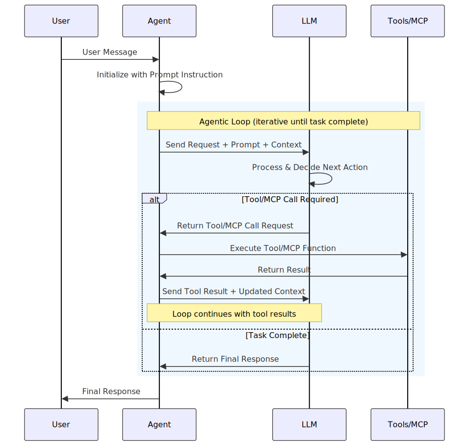
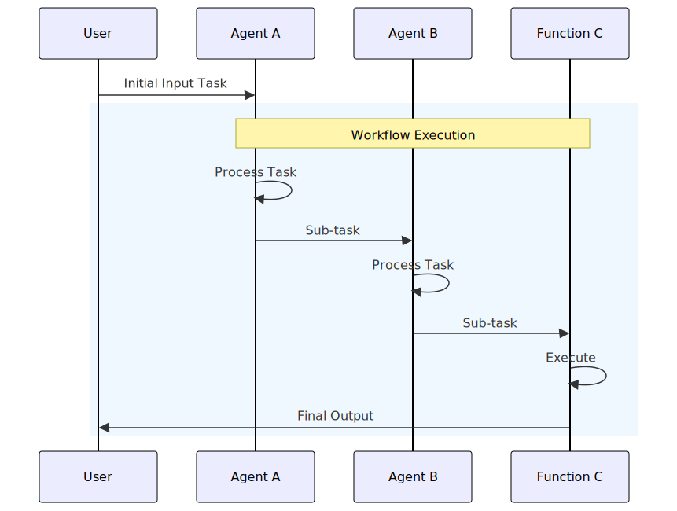

# Microsoft Agent Framework

[Microsoft Agent Framework](https://github.com/microsoft/agent-framework)
is an open-source development kit for building **AI agents** and **multi-agent workflows**
for .NET and Python.
It brings together and extends ideas from [Semantic Kernel](https://github.com/microsoft/semantic-kernel)
and [AutoGen](https://github.com/microsoft/autogen) projects, combining their strengths while adding new capabilities. Built by the same teams, it is the unified foundation for building AI agents going forward.

Agent Framework offers two primary categories of capabilities:

- [AI agents](#ai-agents): Individual agents that use LLMs to process user inputs, call tools and MCP servers to perform actions, and generate responses. Agents support model providers including Azure OpenAI, OpenAI, and Azure AI.
- [Workflows](#workflows): Graph-based workflows that connect multiple agents and functions to perform complex, multi-step tasks. Workflows support type-based routing, nesting, checkpointing, and request/response patterns for human-in-the-loop scenarios.

The framework also provides foundational building
blocks, including model clients (chat completions and responses), an agent thread for state management, context providers for agent memory,
middleware for intercepting agent actions, and MCP clients for tool integration.
Together, these components give you the flexibility and power to build
interactive, robust, and safe AI applications.

## Why another agent framework?

[Semantic Kernel](https://github.com/microsoft/semantic-kernel)
and [AutoGen](https://github.com/microsoft/autogen) pioneered the concepts of AI agents and multi-agent orchestration.
The Agent Framework is the direct successor, created by the same teams. It combines AutoGen's simple abstractions for single- and multi-agent patterns with Semantic Kernel's enterprise-grade features such as thread-based state management, type safety, filters,
telemetry, and extensive model and embedding support. Beyond merging the two,
Agent Framework introduces workflows that give developers explicit control over
multi-agent execution paths, plus a robust state management system
for long-running and human-in-the-loop scenarios.
In short, Agent Framework is the next generation of
both Semantic Kernel and AutoGen.

To learn more about migrating from either Semantic Kernel or AutoGen,
see the [Migration Guide from Semantic Kernel](../migration-guide/from-semantic-kernel/index.md)
and [Migration Guide from AutoGen](../migration-guide/from-autogen/index.md).

Both Semantic Kernel and AutoGen have benefited significantly from the open-source community,
and the same is expected for Agent Framework. Microsoft Agent Framework welcomes contributions and will keep improving with new features and capabilities.

> [!NOTE]
> Microsoft Agent Framework is currently in public preview. Please submit any feedback or issues on the [GitHub repository](https://github.com/microsoft/agent-framework).

> [!IMPORTANT]
> If you use Microsoft Agent Framework to build applications that operate with third-party servers or agents, you do so at your own risk. We recommend reviewing all data being shared with third-party servers or agents and being cognizant of third-party practices for retention and location of data. It is your responsibility to manage whether your data will flow outside of your organization's Azure compliance and geographic boundaries and any related implications.

## Installation

Python:

```bash
pip install agent-framework --pre
```

.NET:

```dotnetcli
dotnet add package Microsoft.Agents.AI
```

## AI Agents

### What is an AI agent?

An **AI agent** uses an LLM to process user inputs, make decisions,
call [tools](../user-guide/agents/agent-tools.md) and [MCP servers](../user-guide/model-context-protocol/index.md) to perform actions,
and generate responses.
The following diagram illustrates the core components and their interactions in an AI agent:



An AI agent can also be augmented with additional components such as
a [thread](../user-guide/agents/multi-turn-conversation.md),
a [context provider](../user-guide/agents/agent-memory.md),
and [middleware](../user-guide/agents/agent-middleware.md)
to enhance its capabilities.

### When to use an AI agent?

AI agents are suitable for applications that require autonomous decision-making,
ad hoc planning, trial-and-error exploration, and conversation-based user interactions.
They are particularly useful for scenarios where the input task is unstructured and cannot be
easily defined in advance.

Here are some common scenarios where AI agents excel:

- **Customer Support**: AI agents can handle multi-modal queries (text, voice, images)
  from customers, use tools to look up information, and provide natural language responses.
- **Education and Tutoring**: AI agents can leverage external knowledge bases to provide
  personalized tutoring and answer student questions.
- **Code Generation and Debugging**: For software developers, AI agents can assist with
  implementation, code reviews, and debugging by using various programming tools and environments.
- **Research Assistance**: For researchers and analysts, AI agents can search the web,
  summarize documents, and piece together information from multiple sources.

The key is that AI agents are designed to operate in a dynamic and underspecified
setting, where the exact sequence of steps to fulfill a user request is not known
in advance and might require exploration and close collaboration with users.

### When not to use an AI agent?

AI agents are not well-suited for tasks that are highly structured and require
strict adherence to predefined rules.
If your application anticipates a specific kind of input and has a well-defined
sequence of operations to perform, using AI agents might introduce unnecessary
uncertainty, latency, and cost.

_If you can write a function to handle the task, do that instead of using an AI agent. You can use AI to help you write that function._

A single AI agent might struggle with complex tasks that involve multiple steps
and decision points. Such tasks might require a large number of tools (for example, over 20),
which a single agent cannot feasibly manage.

In these cases, consider using workflows instead.

## Workflows

### What is a Workflow?

A **workflow** can express a predefined sequence of operations that can include AI agents as components while maintaining consistency and reliability. Workflows are designed to handle complex and long-running processes that might involve multiple agents, human interactions, and integrations with external systems.

The execution sequence of a workflow can be explicitly defined, allowing for more control over the execution path. The following diagram illustrates an example of a workflow that connects two AI agents and a function:



Workflows can also express dynamic sequences using
conditional routing, model-based decision making, and concurrent
execution. This is how [multi-agent orchestration patterns](../user-guide/workflows/orchestrations/overview.md) are implemented.
The orchestration patterns provide mechanisms to coordinate multiple agents
to work on complex tasks that require multiple steps and decision points,
addressing the limitations of single agents.

### What problems do Workflows solve?

Workflows provide a structured way to manage complex processes that involve multiple steps, decision points, and interactions with various systems or agents. The types of tasks workflows are designed to handle often require more than one AI agent.

Here are some of the key benefits of Agent Framework workflows:

- **Modularity**: Workflows can be broken down into smaller, reusable components, making it easier to manage and update individual parts of the process.
- **Agent Integration**: Workflows can incorporate multiple AI agents alongside non-agentic components, allowing for sophisticated orchestration of tasks.
- **Type Safety**: Strong typing ensures messages flow correctly between components, with comprehensive validation that prevents runtime errors.
- **Flexible Flow**: Graph-based architecture allows for intuitive modeling of complex workflows with `executors` and `edges`. Conditional routing, parallel processing, and dynamic execution paths are all supported.
- **External Integration**: Built-in request/response patterns enable seamless integration with external APIs and support human-in-the-loop scenarios.
- **Checkpointing**: Save workflow states via checkpoints, enabling recovery and resumption of long-running processes on the server side.
- **Multi-Agent Orchestration**: Built-in patterns for coordinating multiple AI agents, including sequential, concurrent, hand-off, and Magentic.
- **Composability**: Workflows can be nested or combined to create more complex processes, allowing for scalability and adaptability.

## Next steps

- [Quickstart Guide](../tutorials/quick-start.md)
- [Migration Guide from Semantic Kernel](../migration-guide/from-semantic-kernel/index.md)
- [Migration Guide from AutoGen](../migration-guide/from-autogen/index.md)
