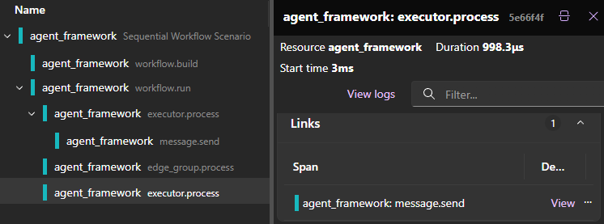

# Microsoft Agent Framework Workflows - Observability

Observability provides insights into the internal state and behavior of workflows during execution. This includes logging, metrics, and tracing capabilities that help monitor and debug workflows.

> [!TIP]
> Observability is a framework-wide feature and is not limited to workflows. For more information, see [Observability](../observability.md).

Aside from the standard [GenAI telemetry](https://opentelemetry.io/docs/specs/semconv/gen-ai/), Agent Framework Workflows emits additional spans, logs, and metrics to provide deeper insights into workflow execution. These observability features help developers understand the flow of messages, the performance of executors, and any errors that might occur.

## Enable Observability

::: zone pivot="programming-language-csharp"

Please refer to [Enabling Observability](../observability.md#enable-observability-c) for instructions on enabling observability in your applications.

::: zone-end

::: zone pivot="programming-language-python"

Please refer to [Enabling Observability](../observability.md#enable-observability-python) for instructions on enabling observability in your applications.

::: zone-end

## Workflow Spans

| Span Name            | Description                              |
|----------------------|------------------------------------------|
| `workflow.build`     | For each workflow build                  |
| `workflow.run`       | For each workflow execution              |
| `message.send`       | For each message sent to an executor     |
| `executor.process`   | For each executor processing a message   |
| `edge_group.process` | For each edge group processing a message |

### Links between Spans

When an executor sends a message to another executor, the `message.send` span is created as a child of the `executor.process` span. However, the `executor.process` span of the target executor will not be a child of the `message.send` span because the execution is not nested. Instead, the `executor.process` span of the target executor is linked to the `message.send` span of the source executor. This creates a traceable path through the workflow execution.

For example:

## Third-party observability integrations

Traces generated by Agent Framework can be exported to your desired backend compatible with OpenTelemetry.

### MLflow

[MLflow](https://mlflow.org/) is a popular open-source platform that provides observability and reproducibility for LLM applications. Agent Framework can export traces to MLflow through its OTLP endpoint to keep a durable record of workflow runs, inputs/outputs, and derived metrics.

See [MLflow Microsoft Agent Framework integration](https://mlflow.org/docs/latest/genai/tracing/integrations/listing/microsoft-agent-framework/) for how to set up MLflow to collect traces from Agent Framework.

## Next Steps

- [Learn about state isolation in workflows](./state-isolation.md).
- [Learn how to visualize workflows](./visualization.md).
