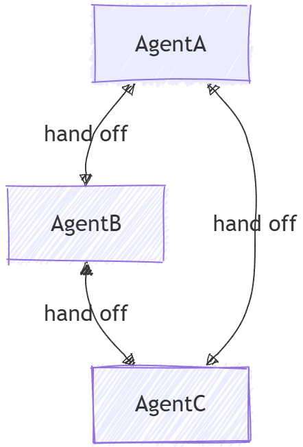

# Microsoft Agent Framework Workflows Orchestrations - Handoff

Handoff orchestration allows agents to transfer control to one another based on the context or user request. Each agent can "handoff" the conversation to another agent with the appropriate expertise, ensuring that the right agent handles each part of the task. This is particularly useful in customer support, expert systems, or any scenario requiring dynamic delegation.



## Differences Between Handoff and Agent-as-Tools

While agent-as-tools is commonly considered as a multi-agent pattern and it may look similar to handoff at first glance, there are fundamental differences between the two:

- **Control Flow**: In handoff orchestration, control is explicitly passed between agents based on defined rules. Each agent can decide to hand off the entire task to another agent. There is no central authority managing the workflow. In contrast, agent-as-tools involves a primary agent that delegates sub tasks to other agents and once the agent completes the sub task, control returns to the primary agent.
- **Task Ownership**: In handoff, the agent receiving the handoff takes full ownership of the task. In agent-as-tools, the primary agent retains overall responsibility for the task, while other agents are treated as tools to assist in specific subtasks.
- **Context Management**: In handoff orchestration, the conversation is handed off to another agent entirely. The receiving agent has full context of what has been done so far. In agent-as-tools, the primary agent manages the overall context and may provide only relevant information to the tool agents as needed.

## What You'll Learn

- How to create specialized agents for different domains
- How to configure handoff rules between agents
- How to build interactive workflows with dynamic agent routing
- How to handle multi-turn conversations with agent switching

In handoff orchestration, agents can transfer control to one another based on context, allowing for dynamic routing and specialized expertise handling.

::: zone pivot="programming-language-csharp"

## Set Up the Azure OpenAI Client

```csharp
using System;
using System.Collections.Generic;
using System.Threading.Tasks;
using Azure.AI.OpenAI;
using Azure.Identity;
using Microsoft.Agents.Workflows;
using Microsoft.Extensions.AI;
using Microsoft.Agents.AI;

// 1) Set up the Azure OpenAI client
var endpoint = Environment.GetEnvironmentVariable("AZURE_OPENAI_ENDPOINT") ??
    throw new InvalidOperationException("AZURE_OPENAI_ENDPOINT is not set.");
var deploymentName = Environment.GetEnvironmentVariable("AZURE_OPENAI_DEPLOYMENT_NAME") ?? "gpt-4o-mini";
var client = new AzureOpenAIClient(new Uri(endpoint), new AzureCliCredential())
    .GetChatClient(deploymentName)
    .AsIChatClient();
```

## Define Your Specialized Agents

Create domain-specific agents and a triage agent for routing:

```csharp
// 2) Create specialized agents
ChatClientAgent historyTutor = new(client,
    "You provide assistance with historical queries. Explain important events and context clearly. Only respond about history.",
    "history_tutor",
    "Specialist agent for historical questions");

ChatClientAgent mathTutor = new(client,
    "You provide help with math problems. Explain your reasoning at each step and include examples. Only respond about math.",
    "math_tutor",
    "Specialist agent for math questions");

ChatClientAgent triageAgent = new(client,
    "You determine which agent to use based on the user's homework question. ALWAYS handoff to another agent.",
    "triage_agent",
    "Routes messages to the appropriate specialist agent");
```

## Configure Handoff Rules

Define which agents can hand off to which other agents:

```csharp
// 3) Build handoff workflow with routing rules
var workflow = AgentWorkflowBuilder.StartHandoffWith(triageAgent)
    .WithHandoffs(triageAgent, [mathTutor, historyTutor]) // Triage can route to either specialist
    .WithHandoff(mathTutor, triageAgent)                  // Math tutor can return to triage
    .WithHandoff(historyTutor, triageAgent)               // History tutor can return to triage
    .Build();
```

## Run Interactive Handoff Workflow

Handle multi-turn conversations with dynamic agent switching:

```csharp
// 4) Process multi-turn conversations
List<ChatMessage> messages = new();

while (true)
{
    Console.Write("Q: ");
    string userInput = Console.ReadLine()!;
    messages.Add(new(ChatRole.User, userInput));

    // Execute workflow and process events
    StreamingRun run = await InProcessExecution.StreamAsync(workflow, messages);
    await run.TrySendMessageAsync(new TurnToken(emitEvents: true));

    List<ChatMessage> newMessages = new();
    await foreach (WorkflowEvent evt in run.WatchStreamAsync().ConfigureAwait(false))
    {
        if (evt is AgentRunUpdateEvent e)
        {
            Console.WriteLine($"{e.ExecutorId}: {e.Data}");
        }
        else if (evt is WorkflowCompletedEvent completed)
        {
            newMessages = (List<ChatMessage>)completed.Data!;
            break;
        }
    }

    // Add new messages to conversation history
    messages.AddRange(newMessages.Skip(messages.Count));
}
```

## Sample Interaction

```plaintext
Q: What is the derivative of x^2?
triage_agent: This is a math question. I'll hand this off to the math tutor.
math_tutor: The derivative of x^2 is 2x. Using the power rule, we bring down the exponent (2) and multiply it by the coefficient (1), then reduce the exponent by 1: d/dx(x^2) = 2x^(2-1) = 2x.

Q: Tell me about World War 2
triage_agent: This is a history question. I'll hand this off to the history tutor.
history_tutor: World War 2 was a global conflict from 1939 to 1945. It began when Germany invaded Poland and involved most of the world's nations. Key events included the Holocaust, Pearl Harbor attack, D-Day invasion, and ended with atomic bombs on Japan.

Q: Can you help me with calculus integration?
triage_agent: This is another math question. I'll route this to the math tutor.
math_tutor: I'd be happy to help with calculus integration! Integration is the reverse of differentiation. The basic power rule for integration is: ∫x^n dx = x^(n+1)/(n+1) + C, where C is the constant of integration.
```

::: zone-end

::: zone pivot="programming-language-python"

## Set Up the Chat Client

```python
from agent_framework.azure import AzureOpenAIChatClient
from azure.identity import AzureCliCredential

# Initialize the Azure OpenAI chat client
chat_client = AzureOpenAIChatClient(credential=AzureCliCredential())
```

## Define Your Specialized Agents

Create domain-specific agents with a coordinator for routing:

```python
# Create triage/coordinator agent
triage_agent = chat_client.create_agent(
    instructions=(
        "You are frontline support triage. Read the latest user message and decide whether "
        "to hand off to refund_agent, order_agent, or support_agent. Provide a brief natural-language "
        "response for the user. When delegation is required, call the matching handoff tool "
        "(`handoff_to_refund_agent`, `handoff_to_order_agent`, or `handoff_to_support_agent`)."
    ),
    name="triage_agent",
)

# Create specialist agents
refund_agent = chat_client.create_agent(
    instructions=(
        "You handle refund workflows. Ask for any order identifiers you require and outline the refund steps."
    ),
    name="refund_agent",
)

order_agent = chat_client.create_agent(
    instructions=(
        "You resolve shipping and fulfillment issues. Clarify the delivery problem and describe the actions "
        "you will take to remedy it."
    ),
    name="order_agent",
)

support_agent = chat_client.create_agent(
    instructions=(
        "You are a general support agent. Offer empathetic troubleshooting and gather missing details if the "
        "issue does not match other specialists."
    ),
    name="support_agent",
)
```

## Configure Handoff Rules

Build the handoff workflow using `HandoffBuilder`:

```python
from agent_framework import HandoffBuilder

# Build the handoff workflow
workflow = (
    HandoffBuilder(
        name="customer_support_handoff",
        participants=[triage_agent, refund_agent, order_agent, support_agent],
    )
    .set_coordinator("triage_agent")
    .with_termination_condition(
        # Terminate after a certain number of user messages
        lambda conv: sum(1 for msg in conv if msg.role.value == "user") >= 10
    )
    .build()
)
```

For more advanced routing, you can configure specialist-to-specialist handoffs:

```python
# Enable return-to-previous and add specialist-to-specialist handoffs
workflow = (
    HandoffBuilder(
        name="advanced_handoff",
        participants=[coordinator, technical, account, billing],
    )
    .set_coordinator(coordinator)
    .add_handoff(coordinator, [technical, account, billing])  # Coordinator routes to all specialists
    .add_handoff(technical, [billing, account])  # Technical can route to billing or account
    .add_handoff(account, [technical, billing])  # Account can route to technical or billing
    .add_handoff(billing, [technical, account])  # Billing can route to technical or account
    .enable_return_to_previous(True)  # User inputs route directly to current specialist
    .build()
)
```

## Run Interactive Handoff Workflow

Handle multi-turn conversations with user input requests:

```python
from agent_framework import RequestInfoEvent, HandoffUserInputRequest, WorkflowOutputEvent

# Start workflow with initial user message
events = [event async for event in workflow.run_stream("I need help with my order")]

# Process events and collect pending input requests
pending_requests = []
for event in events:
    if isinstance(event, RequestInfoEvent):
        pending_requests.append(event)
        request_data = event.data
        print(f"Agent {request_data.awaiting_agent_id} is awaiting your input")
        for msg in request_data.conversation[-3:]:
            print(f"{msg.author_name}: {msg.text}")

# Interactive loop: respond to requests
while pending_requests:
    user_input = input("You: ")
    
    # Send responses to all pending requests
    responses = {req.request_id: user_input for req in pending_requests}
    events = [event async for event in workflow.send_responses_streaming(responses)]
    
    # Process new events
    pending_requests = []
    for event in events:
        if isinstance(event, RequestInfoEvent):
            pending_requests.append(event)
        elif isinstance(event, WorkflowOutputEvent):
            print("Workflow completed!")
            conversation = event.data
            for msg in conversation:
                print(f"{msg.author_name}: {msg.text}")
```

## Sample Interaction

```plaintext
User: I need help with my order

triage_agent: I'd be happy to help you with your order. Could you please provide more details about the issue?

User: My order 1234 arrived damaged

triage_agent: I'm sorry to hear that your order arrived damaged. I will connect you with a specialist.

support_agent: I'm sorry about the damaged order. To assist you better, could you please:
- Describe the damage
- Would you prefer a replacement or refund?

User: I'd like a refund

triage_agent: I'll connect you with the refund specialist.

refund_agent: I'll process your refund for order 1234. Here's what will happen next:
1. Verification of the damaged items
2. Refund request submission
3. Return instructions if needed
4. Refund processing within 5-10 business days

Could you provide photos of the damage to expedite the process?
```

::: zone-end

## Key Concepts

::: zone pivot="programming-language-csharp"

- **Dynamic Routing**: Agents can decide which agent should handle the next interaction based on context
- **AgentWorkflowBuilder.StartHandoffWith()**: Defines the initial agent that starts the workflow
- **WithHandoff()** and **WithHandoffs()**: Configures handoff rules between specific agents
- **Context Preservation**: Full conversation history is maintained across all handoffs
- **Multi-turn Support**: Supports ongoing conversations with seamless agent switching
- **Specialized Expertise**: Each agent focuses on their domain while collaborating through handoffs

::: zone-end

::: zone pivot="programming-language-python"

- **Dynamic Routing**: Agents can decide which agent should handle the next interaction based on context
- **HandoffBuilder**: Creates workflows with automatic handoff tool registration
- **set_coordinator()**: Defines which agent receives user input first
- **add_handoff()**: Configures specific handoff relationships between agents
- **enable_return_to_previous()**: Routes user inputs directly to the current specialist, skipping coordinator re-evaluation
- **Context Preservation**: Full conversation history is maintained across all handoffs
- **Request/Response Cycle**: Workflow requests user input, processes responses, and continues until termination condition is met
- **Specialized Expertise**: Each agent focuses on their domain while collaborating through handoffs

::: zone-end

## Next steps

> [!div class="nextstepaction"]
> [Magnetic Orchestration](./magentic.md)
