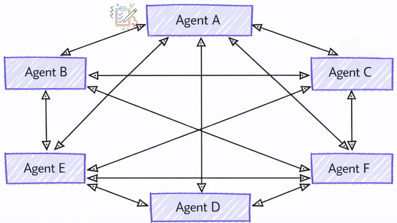

# Microsoft Agent Framework Workflows Orchestrations - Handoff

Handoff orchestration allows agents to transfer control to one another based on the context or user request. Each agent can "handoff" the conversation to another agent with the appropriate expertise, ensuring that the right agent handles each part of the task. This is particularly useful in customer support, expert systems, or any scenario requiring dynamic delegation.

Internally, the handoff orchestration is implemented using a mesh topology where agents are connected directly without an orchestrator. Each agent can decide when to hand off the conversation based on predefined rules or the content of the messages.

<p align="center">
    
</p>

> [!NOTE]
> Handoff orchestration only supports `ChatAgent` and the agents must support local tools execution.

## Differences Between Handoff and Agent-as-Tools

While agent-as-tools is commonly considered as a multi-agent pattern and it might look similar to handoff at first glance, there are fundamental differences between the two:

- **Control Flow**: In handoff orchestration, control is explicitly passed between agents based on defined rules. Each agent can decide to hand off the entire task to another agent. There is no central authority managing the workflow. In contrast, agent-as-tools involves a primary agent that delegates sub tasks to other agents and once the agent completes the sub task, control returns to the primary agent.
- **Task Ownership**: In handoff, the agent receiving the handoff takes full ownership of the task. In agent-as-tools, the primary agent retains overall responsibility for the task, while other agents are treated as tools to assist in specific subtasks.
- **Context Management**: In handoff orchestration, the conversation is handed off to another agent entirely. The receiving agent has full context of what has been done so far. In agent-as-tools, the primary agent manages the overall context and might provide only relevant information to the tool agents as needed.

## What You'll Learn

- How to create specialized agents for different domains
- How to configure handoff rules between agents
- How to build interactive workflows with dynamic agent routing
- How to handle multi-turn conversations with agent switching
- How to implement tool approval for sensitive operations (HITL)
- How to use checkpointing for durable handoff workflows

In handoff orchestration, agents can transfer control to one another based on context, allowing for dynamic routing and specialized expertise handling.

::: zone pivot="programming-language-csharp"

## Set Up the Azure OpenAI Client

```csharp
using System;
using System.Collections.Generic;
using System.Threading.Tasks;
using Azure.AI.OpenAI;
using Azure.Identity;
using Microsoft.Agents.AI.Workflows;
using Microsoft.Extensions.AI;
using Microsoft.Agents.AI;

// 1) Set up the Azure OpenAI client
var endpoint = Environment.GetEnvironmentVariable("AZURE_OPENAI_ENDPOINT") ??
    throw new InvalidOperationException("AZURE_OPENAI_ENDPOINT is not set.");
var deploymentName = Environment.GetEnvironmentVariable("AZURE_OPENAI_DEPLOYMENT_NAME") ?? "gpt-4o-mini";
var client = new AzureOpenAIClient(new Uri(endpoint), new AzureCliCredential())
    .GetChatClient(deploymentName)
    .AsIChatClient();
```

## Define Your Specialized Agents

Create domain-specific agents and a triage agent for routing:

```csharp
// 2) Create specialized agents
ChatClientAgent historyTutor = new(client,
    "You provide assistance with historical queries. Explain important events and context clearly. Only respond about history.",
    "history_tutor",
    "Specialist agent for historical questions");

ChatClientAgent mathTutor = new(client,
    "You provide help with math problems. Explain your reasoning at each step and include examples. Only respond about math.",
    "math_tutor",
    "Specialist agent for math questions");

ChatClientAgent triageAgent = new(client,
    "You determine which agent to use based on the user's homework question. ALWAYS handoff to another agent.",
    "triage_agent",
    "Routes messages to the appropriate specialist agent");
```

## Configure Handoff Rules

Define which agents can hand off to which other agents:

```csharp
// 3) Build handoff workflow with routing rules
var workflow = AgentWorkflowBuilder.StartHandoffWith(triageAgent)
    .WithHandoffs(triageAgent, [mathTutor, historyTutor]) // Triage can route to either specialist
    .WithHandoff(mathTutor, triageAgent)                  // Math tutor can return to triage
    .WithHandoff(historyTutor, triageAgent)               // History tutor can return to triage
    .Build();
```

## Run Interactive Handoff Workflow

Handle multi-turn conversations with dynamic agent switching:

```csharp
// 4) Process multi-turn conversations
List<ChatMessage> messages = new();

while (true)
{
    Console.Write("Q: ");
    string userInput = Console.ReadLine()!;
    messages.Add(new(ChatRole.User, userInput));

    // Execute workflow and process events
    StreamingRun run = await InProcessExecution.StreamAsync(workflow, messages);
    await run.TrySendMessageAsync(new TurnToken(emitEvents: true));

    List<ChatMessage> newMessages = new();
    await foreach (WorkflowEvent evt in run.WatchStreamAsync().ConfigureAwait(false))
    {
        if (evt is AgentRunUpdateEvent e)
        {
            Console.WriteLine($"{e.ExecutorId}: {e.Data}");
        }
        else if (evt is WorkflowOutputEvent outputEvt)
        {
            newMessages = (List<ChatMessage>)outputEvt.Data!;
            break;
        }
    }

    // Add new messages to conversation history
    messages.AddRange(newMessages.Skip(messages.Count));
}
```

## Sample Interaction

```plaintext
Q: What is the derivative of x^2?
triage_agent: This is a math question. I'll hand this off to the math tutor.
math_tutor: The derivative of x^2 is 2x. Using the power rule, we bring down the exponent (2) and multiply it by the coefficient (1), then reduce the exponent by 1: d/dx(x^2) = 2x^(2-1) = 2x.

Q: Tell me about World War 2
triage_agent: This is a history question. I'll hand this off to the history tutor.
history_tutor: World War 2 was a global conflict from 1939 to 1945. It began when Germany invaded Poland and involved most of the world's nations. Key events included the Holocaust, Pearl Harbor attack, D-Day invasion, and ended with atomic bombs on Japan.

Q: Can you help me with calculus integration?
triage_agent: This is another math question. I'll route this to the math tutor.
math_tutor: I'd be happy to help with calculus integration! Integration is the reverse of differentiation. The basic power rule for integration is: ∫x^n dx = x^(n+1)/(n+1) + C, where C is the constant of integration.
```

::: zone-end

::: zone pivot="programming-language-python"

## Define a few tools for demonstration

```python
@ai_function
def process_refund(order_number: Annotated[str, "Order number to process refund for"]) -> str:
    """Simulated function to process a refund for a given order number."""
    return f"Refund processed successfully for order {order_number}."

@ai_function
def check_order_status(order_number: Annotated[str, "Order number to check status for"]) -> str:
    """Simulated function to check the status of a given order number."""
    return f"Order {order_number} is currently being processed and will ship in 2 business days."

@ai_function
def process_return(order_number: Annotated[str, "Order number to process return for"]) -> str:
    """Simulated function to process a return for a given order number."""
    return f"Return initiated successfully for order {order_number}. You will receive return instructions via email."
```

## Set Up the Chat Client

```python
from agent_framework.azure import AzureOpenAIChatClient
from azure.identity import AzureCliCredential

# Initialize the Azure OpenAI chat client
chat_client = AzureOpenAIChatClient(credential=AzureCliCredential())
```

## Define Your Specialized Agents

Create domain-specific agents with a coordinator for routing:

```python
# Create triage/coordinator agent
triage_agent = chat_client.create_agent(
    instructions=(
        "You are frontline support triage. Route customer issues to the appropriate specialist agents "
        "based on the problem described."
    ),
    description="Triage agent that handles general inquiries.",
    name="triage_agent",
)

# Refund specialist: Handles refund requests
refund_agent = chat_client.create_agent(
    instructions="You process refund requests.",
    description="Agent that handles refund requests.",
    name="refund_agent",
    # In a real application, an agent can have multiple tools; here we keep it simple
    tools=[process_refund],
)

# Order/shipping specialist: Resolves delivery issues
order_agent = chat_client.create_agent(
    instructions="You handle order and shipping inquiries.",
    description="Agent that handles order tracking and shipping issues.",
    name="order_agent",
    # In a real application, an agent can have multiple tools; here we keep it simple
    tools=[check_order_status],
)

# Return specialist: Handles return requests
return_agent = chat_client.create_agent(
    instructions="You manage product return requests.",
    description="Agent that handles return processing.",
    name="return_agent",
    # In a real application, an agent can have multiple tools; here we keep it simple
    tools=[process_return],
)
```

## Configure Handoff Rules

Build the handoff workflow using `HandoffBuilder`:

```python
from agent_framework import HandoffBuilder

# Build the handoff workflow
workflow = (
    HandoffBuilder(
        name="customer_support_handoff",
        participants=[triage_agent, refund_agent, order_agent, return_agent],
    )
    .with_start_agent(triage_agent) # Triage receives initial user input
    .with_termination_condition(
        # Custom termination: Check if one of the agents has provided a closing message.
        # This looks for the last message containing "welcome", which indicates the
        # conversation has concluded naturally.
        lambda conversation: len(conversation) > 0 and "welcome" in conversation[-1].text.lower()
    )
    .build()
)
```

By default, all agents can handoff to each other. For more advanced routing, you can configure handoffs:

```python
workflow = (
    HandoffBuilder(
        name="customer_support_handoff",
        participants=[triage_agent, refund_agent, order_agent, return_agent],
    )
    .with_start_agent(triage_agent) # Triage receives initial user input
    .with_termination_condition(
        # Custom termination: Check if one of the agents has provided a closing message.
        # This looks for the last message containing "welcome", which indicates the
        # conversation has concluded naturally.
        lambda conversation: len(conversation) > 0 and "welcome" in conversation[-1].text.lower()
    )
    # Triage cannot route directly to refund agent
    .add_handoff(triage_agent, [order_agent, return_agent])
    # Only the return agent can handoff to refund agent - users wanting refunds after returns
    .add_handoff(return_agent, [refund_agent])
    # All specialists can handoff back to triage for further routing
    .add_handoff(order_agent, [triage_agent])
    .add_handoff(return_agent, [triage_agent])
    .add_handoff(refund_agent, [triage_agent])
    .build()
)
```

> [!NOTE]
> Even with custom handoff rules, all agents are still connected in a mesh topology. This is because agents need to share context with each other to maintain conversation history (see [Context Synchronization](#context-synchronization) for more details). The handoff rules only govern which agents can take over the conversation next.

## Run Handoff Agent Interaction

Unlike other orchestrations, handoff is interactive because an agent may not decide to handoff after every turn. If an agent doesn't handoff, human input is required to continue the conversation. See [Autonomous Mode](#autonomous-mode) for bypassing this requirement. In other orchestrations, after an agent responds, the control either goes to the orchestrator or the next agent.

When an agent in a handoff workflow decides not to handoff (a handoff is triggered by a special tool call), the workflow emits a `RequestInfoEvent` with a `HandoffAgentUserRequest` payload containing the agent's most recent messages. The user must respond to this request to continue the workflow.

```python
from agent_framework import RequestInfoEvent, HandoffAgentUserRequest, WorkflowOutputEvent

# Start workflow with initial user message
events = [event async for event in workflow.run_stream("I need help with my order")]

# Process events and collect pending input requests
pending_requests = []
for event in events:
    if isinstance(event, RequestInfoEvent) and isinstance(event.data, HandoffAgentUserRequest):
        pending_requests.append(event)
        request_data = event.data
        print(f"Agent {event.source_executor_id} is awaiting your input")
        # The request contains the most recent messages generated by the
        # agent requesting input
        for msg in request_data.agent_response.messages[-3:]:
            print(f"{msg.author_name}: {msg.text}")

# Interactive loop: respond to requests
while pending_requests:
    user_input = input("You: ")

    # Send responses to all pending requests
    responses = {req.request_id: HandoffAgentUserRequest.create_response(user_input) for req in pending_requests}
    # You can also send a `HandoffAgentUserRequest.terminate()` to end the workflow early
    events = [event async for event in workflow.send_responses_streaming(responses)]

    # Process new events
    pending_requests = []
    for event in events:
        # Check for new input requests
```

## Autonomous Mode

The Handoff orchestration is designed for interactive scenarios where human input is required when an agent decides not to handoff. However, as an **experimental feature**, you can enable "autonomous mode" to allow the workflow to continue without human intervention. In this mode, when an agent decides not to handoff, the workflow automatically sends a default response (e.g.`User did not respond. Continue assisting autonomously.`) to the agent, allowing it to continue the conversation.

> [!TIP]
> Why is Handoff orchestration inherently interactive? Unlike other orchestrations where there is only one path to follow after an agent responds (e.g. back to orchestrator or next agent), in a Handoff orchestration, the agent has the option to either handoff to another agent or continue assisting the user itself. And because handoffs are achieved through tool calls, if an agent does not call a handoff tool but generates a response instead, the workflow won't know what to do next but to delegate back to the user for further input. It is also not possible to force an agent to always handoff by requiring it to call the handoff tool because the agent won't be able to generate meaningful responses otherwise.

**Autonomous Mode** is enabled by calling `with_autonomous_mode()` on the `HandoffBuilder`. This configures the workflow to automatically respond to input requests with a default message, allowing the agent to continue without waiting for human input.

```python
workflow = (
    HandoffBuilder(
        name="autonomous_customer_support",
        participants=[triage_agent, refund_agent, order_agent, return_agent],
    )
    .with_start_agent(triage_agent)
    .with_autonomous_mode()
    .build()
)
```

You can also enable autonomous mode on only a subset of agents by passing a list of agent instances to `with_autonomous_mode()`.

```python
workflow = (
    HandoffBuilder(
        name="partially_autonomous_support",
        participants=[triage_agent, refund_agent, order_agent, return_agent],
    )
    .with_start_agent(triage_agent)
    .with_autonomous_mode(agents=[triage_agent])  # Only triage_agent runs autonomously
    .build()
)
```

You can customize the default response message.

```python
workflow = (
    HandoffBuilder(
        name="custom_autonomous_support",
        participants=[triage_agent, refund_agent, order_agent, return_agent],
    )
    .with_start_agent(triage_agent)
    .with_autonomous_mode(
        agents=[triage_agent],
        prompts={triage_agent.name: "Continue with your best judgment as the user is unavailable."},
    )
    .build()
)
```

You can customize the number of turns an agent can run autonomously before requiring human input. This can prevent the workflow from running indefinitely without user involvement.

```python
workflow = (
    HandoffBuilder(
        name="limited_autonomous_support",
        participants=[triage_agent, refund_agent, order_agent, return_agent],
    )
    .with_start_agent(triage_agent)
    .with_autonomous_mode(
        agents=[triage_agent],
        turn_limits={triage_agent.name: 3},  # Max 3 autonomous turns
    )
    .build()
)
```

## Advanced: Tool Approval in Handoff Workflows

Handoff workflows can include agents with tools that require human approval before execution. This is useful for sensitive operations like processing refunds, making purchases, or executing irreversible actions.

### Define Tools with Approval Required

```python
from typing import Annotated
from agent_framework import ai_function

@ai_function(approval_mode="always_require")
def process_refund(order_number: Annotated[str, "Order number to process refund for"]) -> str:
    """Simulated function to process a refund for a given order number."""
    return f"Refund processed successfully for order {order_number}."
```

### Create Agents with Approval-Required Tools

```python
from agent_framework import ChatAgent
from agent_framework.azure import AzureOpenAIChatClient
from azure.identity import AzureCliCredential

client = AzureOpenAIChatClient(credential=AzureCliCredential())

triage_agent = chat_client.create_agent(
    instructions=(
        "You are frontline support triage. Route customer issues to the appropriate specialist agents "
        "based on the problem described."
    ),
    description="Triage agent that handles general inquiries.",
    name="triage_agent",
)

refund_agent = chat_client.create_agent(
    instructions="You process refund requests.",
    description="Agent that handles refund requests.",
    name="refund_agent",
    tools=[process_refund],
)

order_agent = chat_client.create_agent(
    instructions="You handle order and shipping inquiries.",
    description="Agent that handles order tracking and shipping issues.",
    name="order_agent",
    tools=[check_order_status],
)
```

### Handle Both User Input and Tool Approval Requests

```python
from agent_framework import (
    FunctionApprovalRequestContent,
    HandoffBuilder,
    HandoffAgentUserRequest,
    RequestInfoEvent,
    WorkflowOutputEvent,
)

workflow = (
    HandoffBuilder(
        name="support_with_approvals",
        participants=[triage_agent, refund_agent, order_agent],
    )
    .with_start_agent(triage_agent)
    .build()
)

pending_requests: list[RequestInfoEvent] = []

# Start workflow
async for event in workflow.run_stream("My order 12345 arrived damaged. I need a refund."):
    if isinstance(event, RequestInfoEvent):
        pending_requests.append(event)

# Process pending requests - could be user input OR tool approval
while pending_requests:
    responses: dict[str, object] = {}

    for request in pending_requests:
        if isinstance(request.data, HandoffAgentUserRequest):
            # Agent needs user input
            print(f"Agent {request.source_executor_id} asks:")
            for msg in request.data.agent_response.messages[-2:]:
                print(f"  {msg.author_name}: {msg.text}")

            user_input = input("You: ")
            responses[request.request_id] = HandoffAgentUserRequest.create_response(user_input)

        elif isinstance(request.data, FunctionApprovalRequestContent):
            # Agent wants to call a tool that requires approval
            func_call = request.data.function_call
            args = func_call.parse_arguments() or {}

            print(f"\nTool approval requested: {func_call.name}")
            print(f"Arguments: {args}")

            approval = input("Approve? (y/n): ").strip().lower() == "y"
            responses[request.request_id] = request.data.create_response(approved=approval)

    # Send all responses and collect new requests
    pending_requests = []
    async for event in workflow.send_responses_streaming(responses):
        if isinstance(event, RequestInfoEvent):
            pending_requests.append(event)
        elif isinstance(event, WorkflowOutputEvent):
            print("\nWorkflow completed!")
```

### With Checkpointing for Durable Workflows

For long-running workflows where tool approvals may happen hours or days later, use checkpointing:

```python
from agent_framework import FileCheckpointStorage

storage = FileCheckpointStorage(storage_path="./checkpoints")

workflow = (
    HandoffBuilder(
        name="durable_support",
        participants=[triage_agent, refund_agent, order_agent],
    )
    .with_start_agent(triage_agent)
    .with_checkpointing(storage)
    .build()
)

# Initial run - workflow pauses when approval is needed
pending_requests = []
async for event in workflow.run_stream("I need a refund for order 12345"):
    if isinstance(event, RequestInfoEvent):
        pending_requests.append(event)

# Process can exit here - checkpoint is saved automatically

# Later: Resume from checkpoint and provide approval
checkpoints = await storage.list_checkpoints()
latest = sorted(checkpoints, key=lambda c: c.timestamp, reverse=True)[0]

# Step 1: Restore checkpoint to reload pending requests
restored_requests = []
async for event in workflow.run_stream(checkpoint_id=latest.checkpoint_id):
    if isinstance(event, RequestInfoEvent):
        restored_requests.append(event)

# Step 2: Send responses
responses = {}
for req in restored_requests:
    if isinstance(req.data, FunctionApprovalRequestContent):
        responses[req.request_id] = req.data.create_response(approved=True)
    elif isinstance(req.data, HandoffAgentUserRequest):
        responses[req.request_id] = HandoffAgentUserRequest.create_response("Yes, please process the refund.")

async for event in workflow.send_responses_streaming(responses):
    if isinstance(event, WorkflowOutputEvent):
        print("Refund workflow completed!")
```

## Sample Interaction

```plaintext
User: I need help with my order

triage_agent: I'd be happy to help you with your order. Could you please provide more details about the issue?

User: My order 1234 arrived damaged

triage_agent: I'm sorry to hear that your order arrived damaged. I will connect you with a specialist.

support_agent: I'm sorry about the damaged order. To assist you better, could you please:
- Describe the damage
- Would you prefer a replacement or refund?

User: I'd like a refund

triage_agent: I'll connect you with the refund specialist.

refund_agent: I'll process your refund for order 1234. Here's what will happen next:
1. Verification of the damaged items
2. Refund request submission
3. Return instructions if needed
4. Refund processing within 5-10 business days

Could you provide photos of the damage to expedite the process?
````

::: zone-end

## Context Synchronization

Agents in Agent Framework relies on agent threads ([`AgentThread`](../../agents/multi-turn-conversation.md)) to manage context. In a Handoff orchestration, agents **do not** share the same thread instance, participants are responsible for ensuring context consistency. To achieve this, participants are designed to broadcast their responses or user inputs received to all others in the workflow whenever they generate a response, making sure all participants have the latest context for their next turn.

<p align="center">
    
</p>

> [!NOTE]
> Tool related contents, including handoff tool calls, are not broadcasted to other agents. Only user and agent messages are synchronized across all participants.

> [!TIP]
> Agents do not share the same thread instance because different [agent types](../../agents/agent-types/index.md) may have different implementations of the `AgentThread` abstraction. Sharing the same thread instance could lead to inconsistencies in how each agent processes and maintains context.

After broadcasting the response, the participant then checks whether it needs to handoff the conversation to another agent. If so, it sends a request to the selected agent to take over the conversation. Otherwise, it requests user input or continues autonomously based on the workflow configuration.

## Key Concepts

::: zone pivot="programming-language-csharp"

- **Dynamic Routing**: Agents can decide which agent should handle the next interaction based on context
- **AgentWorkflowBuilder.StartHandoffWith()**: Defines the initial agent that starts the workflow
- **WithHandoff()** and **WithHandoffs()**: Configures handoff rules between specific agents
- **Context Preservation**: Full conversation history is maintained across all handoffs
- **Multi-turn Support**: Supports ongoing conversations with seamless agent switching
- **Specialized Expertise**: Each agent focuses on their domain while collaborating through handoffs

::: zone-end

::: zone pivot="programming-language-python"

- **Dynamic Routing**: Agents can decide which agent should handle the next interaction based on context
- **HandoffBuilder**: Creates workflows with automatic handoff tool registration
- **with_start_agent()**: Defines which agent receives user input first
- **add_handoff()**: Configures specific handoff relationships between agents
- **Context Preservation**: Full conversation history is maintained across all handoffs
- **Request/Response Cycle**: Workflow requests user input, processes responses, and continues until termination condition is met
- **Tool Approval**: Use `@ai_function(approval_mode="always_require")` for sensitive operations that need human approval
- **FunctionApprovalRequestContent**: Emitted when an agent calls a tool requiring approval; use `create_response(approved=...)` to respond
- **Checkpointing**: Use `with_checkpointing()` for durable workflows that can pause and resume across process restarts
- **Specialized Expertise**: Each agent focuses on their domain while collaborating through handoffs

::: zone-end

## Next steps

> [!div class="nextstepaction"]
> [Human-in-the-Loop in Orchestrations](./human-in-the-loop.md) - Learn how to implement human-in-the-loop interactions in orchestrations for enhanced control and oversight.
