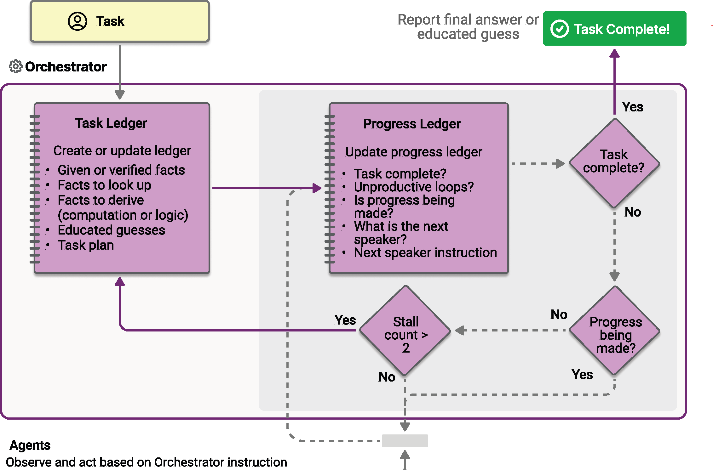

# Microsoft Agent Framework Workflows Orchestrations - Magentic

Magentic orchestration is designed based on the [Magentic-One](https://microsoft.github.io/autogen/stable/user-guide/agentchat-user-guide/magentic-one.html) system invented by AutoGen. It is a flexible, general-purpose multi-agent pattern designed for complex, open-ended tasks that require dynamic collaboration. In this pattern, a dedicated Magentic manager coordinates a team of specialized agents, selecting which agent should act next based on the evolving context, task progress, and agent capabilities.

The Magentic manager maintains a shared context, tracks progress, and adapts the workflow in real time. This enables the system to break down complex problems, delegate subtasks, and iteratively refine solutions through agent collaboration. The orchestration is especially well-suited for scenarios where the solution path is not known in advance and might require multiple rounds of reasoning, research, and computation.



## What You'll Learn

- How to set up a Magentic manager to coordinate multiple specialized agents
- How to handle streaming events with `AgentRunUpdateEvent`
- How to implement human-in-the-loop plan review, tool approval, and stall intervention
- How to track agent collaboration and progress through complex tasks

## Define Your Specialized Agents

::: zone pivot="programming-language-csharp"

Coming soon...

::: zone-end

::: zone pivot="programming-language-python"

In Magentic orchestration, you define specialized agents that the manager can dynamically select based on task requirements:

```python
from agent_framework import ChatAgent, HostedCodeInterpreterTool
from agent_framework.openai import OpenAIChatClient, OpenAIResponsesClient

researcher_agent = ChatAgent(
    name="ResearcherAgent",
    description="Specialist in research and information gathering",
    instructions=(
        "You are a Researcher. You find information without additional computation or quantitative analysis."
    ),
    # This agent requires the gpt-4o-search-preview model to perform web searches
    chat_client=OpenAIChatClient(model_id="gpt-4o-search-preview"),
)

coder_agent = ChatAgent(
    name="CoderAgent",
    description="A helpful assistant that writes and executes code to process and analyze data.",
    instructions="You solve questions using code. Please provide detailed analysis and computation process.",
    chat_client=OpenAIResponsesClient(),
    tools=HostedCodeInterpreterTool(),
)

# Create a manager agent for orchestration
manager_agent = ChatAgent(
    name="MagenticManager",
    description="Orchestrator that coordinates the research and coding workflow",
    instructions="You coordinate a team to complete complex tasks efficiently.",
    chat_client=OpenAIChatClient(),
)
```

## Build the Magentic Workflow

Use `MagenticBuilder` to configure the workflow with a standard manager:

```python
from agent_framework import MagenticBuilder

workflow = (
    MagenticBuilder()
    .participants(researcher=researcher_agent, coder=coder_agent)
    .with_standard_manager(
        agent=manager_agent,
        max_round_count=10,  # Maximum collaboration rounds
        max_stall_count=3,   # Maximum rounds without progress
        max_reset_count=2,   # Maximum plan resets allowed
    )
    .build()
)
```

## Run the Workflow with Event Streaming

Execute a complex task and handle events for streaming output and orchestration updates:

```python
from typing import cast
from agent_framework import (
    MAGENTIC_EVENT_TYPE_AGENT_DELTA,
    MAGENTIC_EVENT_TYPE_ORCHESTRATOR,
    AgentRunUpdateEvent,
    ChatMessage,
    WorkflowOutputEvent,
)

task = (
    "I am preparing a report on the energy efficiency of different machine learning model architectures. "
    "Compare the estimated training and inference energy consumption of ResNet-50, BERT-base, and GPT-2 "
    "on standard datasets (for example, ImageNet for ResNet, GLUE for BERT, WebText for GPT-2). "
    "Then, estimate the CO2 emissions associated with each, assuming training on an Azure Standard_NC6s_v3 "
    "VM for 24 hours. Provide tables for clarity, and recommend the most energy-efficient model "
    "per task type (image classification, text classification, and text generation)."
)

# State for streaming callback
last_stream_agent_id: str | None = None
stream_line_open: bool = False
output: str | None = None

async for event in workflow.run_stream(task):
    if isinstance(event, AgentRunUpdateEvent):
        props = event.data.additional_properties if event.data else None
        event_type = props.get("magentic_event_type") if props else None

        if event_type == MAGENTIC_EVENT_TYPE_ORCHESTRATOR:
            # Manager's planning and coordination messages
            kind = props.get("orchestrator_message_kind", "") if props else ""
            text = event.data.text if event.data else ""
            print(f"\n[ORCH:{kind}]\n\n{text}\n{'-' * 26}")

        elif event_type == MAGENTIC_EVENT_TYPE_AGENT_DELTA:
            # Streaming tokens from agents
            agent_id = props.get("agent_id", event.executor_id) if props else event.executor_id
            if last_stream_agent_id != agent_id or not stream_line_open:
                if stream_line_open:
                    print()
                print(f"\n[STREAM:{agent_id}]: ", end="", flush=True)
                last_stream_agent_id = agent_id
                stream_line_open = True
            if event.data and event.data.text:
                print(event.data.text, end="", flush=True)

        elif event.data and event.data.text:
            print(event.data.text, end="", flush=True)

    elif isinstance(event, WorkflowOutputEvent):
        output_messages = cast(list[ChatMessage], event.data)
        if output_messages:
            output = output_messages[-1].text

if stream_line_open:
    print()

if output is not None:
    print(f"Workflow completed with result:\n\n{output}")
```

## Advanced: Human-in-the-Loop Plan Review

Enable human review and approval of the manager's plan before execution:

### Configure Plan Review

```python
from typing import cast
from agent_framework import (
    MAGENTIC_EVENT_TYPE_AGENT_DELTA,
    MAGENTIC_EVENT_TYPE_ORCHESTRATOR,
    AgentRunUpdateEvent,
    MagenticHumanInterventionDecision,
    MagenticHumanInterventionKind,
    MagenticHumanInterventionReply,
    MagenticHumanInterventionRequest,
    RequestInfoEvent,
    WorkflowOutputEvent,
)

workflow = (
    MagenticBuilder()
    .participants(researcher=researcher_agent, coder=coder_agent)
    .with_standard_manager(
        agent=manager_agent,
        max_round_count=10,
        max_stall_count=3,
        max_reset_count=2,
    )
    .with_plan_review()  # Enable plan review
    .build()
)
```

### Handle Plan Review Requests

```python
pending_request: RequestInfoEvent | None = None
pending_responses: dict[str, MagenticHumanInterventionReply] | None = None
completed = False
workflow_output: str | None = None

while not completed:
    # Use streaming for both initial run and response sending
    if pending_responses is not None:
        stream = workflow.send_responses_streaming(pending_responses)
    else:
        stream = workflow.run_stream(task)

    async for event in stream:
        if isinstance(event, AgentRunUpdateEvent):
            # Handle streaming events as shown above
            pass
        elif isinstance(event, RequestInfoEvent) and event.request_type is MagenticHumanInterventionRequest:
            request = cast(MagenticHumanInterventionRequest, event.data)
            if request.kind == MagenticHumanInterventionKind.PLAN_REVIEW:
                pending_request = event
                if request.plan_text:
                    print(f"\n=== PLAN REVIEW REQUEST ===\n{request.plan_text}\n")
        elif isinstance(event, WorkflowOutputEvent):
            workflow_output = str(event.data) if event.data else None
            completed = True

    pending_responses = None

    # Handle pending plan review request
    if pending_request is not None:
        # Collect human decision (approve/reject/modify)
        # For demo, we auto-approve:
        reply = MagenticHumanInterventionReply(decision=MagenticHumanInterventionDecision.APPROVE)

        # Or approve with comments:
        # reply = MagenticHumanInterventionReply(
        #     decision=MagenticHumanInterventionDecision.APPROVE,
        #     comments="Looks good, but prioritize efficiency metrics."
        # )

        # Or request revision:
        # reply = MagenticHumanInterventionReply(
        #     decision=MagenticHumanInterventionDecision.REVISE,
        #     comments="Please include a comparison with newer models like LLaMA."
        # )

        pending_responses = {pending_request.request_id: reply}
        pending_request = None
```

## Advanced: Agent Clarification via Tool Approval

Agents can ask clarifying questions to users during execution using tool approval. This enables Human-in-the-Loop (HITL) interactions where the agent can request additional information before proceeding.

### Define a Tool with Approval Required

```python
from typing import Annotated
from agent_framework import ai_function

@ai_function(approval_mode="always_require")
def ask_user(question: Annotated[str, "The question to ask the user for clarification"]) -> str:
    """Ask the user a clarifying question to gather missing information.

    Use this tool when you need additional information from the user to complete
    your task effectively.
    """
    # This function body is a placeholder - the actual interaction happens via HITL.
    return f"User was asked: {question}"
```

### Create an Agent with the Tool

```python
onboarding_agent = ChatAgent(
    name="OnboardingAgent",
    description="HR specialist who handles employee onboarding",
    instructions=(
        "You are an HR Onboarding Specialist. Your job is to onboard new employees.\n\n"
        "IMPORTANT: When given an onboarding request, you MUST gather the following "
        "information before proceeding:\n"
        "1. Department (e.g., Engineering, Sales, Marketing)\n"
        "2. Role/Title (e.g., Software Engineer, Account Executive)\n\n"
        "Use the ask_user tool to request ANY missing information."
    ),
    chat_client=OpenAIChatClient(model_id="gpt-4o"),
    tools=[ask_user],
)
```

### Handle Tool Approval Requests

```python
async for event in workflow.run_stream("Onboard Jessica Smith"):
    if isinstance(event, RequestInfoEvent) and event.request_type is MagenticHumanInterventionRequest:
        req = cast(MagenticHumanInterventionRequest, event.data)

        if req.kind == MagenticHumanInterventionKind.TOOL_APPROVAL:
            print(f"Agent: {req.agent_id}")
            print(f"Question: {req.prompt}")

            # Get user's answer
            answer = input("> ").strip()

            # Send the answer back - it will be fed to the agent as the function result
            reply = MagenticHumanInterventionReply(
                decision=MagenticHumanInterventionDecision.APPROVE,
                response_text=answer,
            )
            pending_responses = {event.request_id: reply}

            # Continue workflow with response
            async for ev in workflow.send_responses_streaming(pending_responses):
                # Handle continuation events
                pass
```

## Advanced: Human Intervention on Stall

Enable human intervention when the workflow detects that agents are not making progress:

### Configure Stall Intervention

```python
workflow = (
    MagenticBuilder()
    .participants(researcher=researcher_agent, analyst=analyst_agent)
    .with_standard_manager(
        agent=manager_agent,
        max_round_count=10,
        max_stall_count=1,  # Stall detection after 1 round without progress
        max_reset_count=2,
    )
    .with_human_input_on_stall()  # Request human input when stalled
    .build()
)
```

### Handle Stall Intervention Requests

```python
async for event in workflow.run_stream(task):
    if isinstance(event, RequestInfoEvent) and event.request_type is MagenticHumanInterventionRequest:
        req = cast(MagenticHumanInterventionRequest, event.data)

        if req.kind == MagenticHumanInterventionKind.STALL:
            print(f"Workflow stalled after {req.stall_count} rounds")
            print(f"Reason: {req.stall_reason}")
            if req.plan_text:
                print(f"Current plan:\n{req.plan_text}")

            # Choose response: CONTINUE, REPLAN, or GUIDANCE
            reply = MagenticHumanInterventionReply(
                decision=MagenticHumanInterventionDecision.GUIDANCE,
                comments="Focus on completing the research step first before moving to analysis.",
            )
            pending_responses = {event.request_id: reply}
```

## Key Concepts

- **Dynamic Coordination**: The Magentic manager dynamically selects which agent should act next based on the evolving context
- **Iterative Refinement**: The system can break down complex problems and iteratively refine solutions through multiple rounds
- **Progress Tracking**: Built-in mechanisms to detect stalls and reset the plan if needed
- **Flexible Collaboration**: Agents can be called multiple times in any order as determined by the manager
- **Human Oversight**: Optional human-in-the-loop mechanisms including plan review, tool approval, and stall intervention
- **Unified Event System**: Use `AgentRunUpdateEvent` with `magentic_event_type` to handle orchestrator and agent streaming events

## Workflow Execution Flow

The Magentic orchestration follows this execution pattern:

1. **Planning Phase**: The manager analyzes the task and creates an initial plan
2. **Optional Plan Review**: If enabled, humans can review and approve/modify the plan
3. **Agent Selection**: The manager selects the most appropriate agent for each subtask
4. **Execution**: The selected agent executes their portion of the task
5. **Progress Assessment**: The manager evaluates progress and updates the plan
6. **Stall Detection**: If progress stalls, either auto-replan or request human intervention
7. **Iteration**: Steps 3-6 repeat until the task is complete or limits are reached
8. **Final Synthesis**: The manager synthesizes all agent outputs into a final result

## Complete Example

Here's a full example that brings together all the concepts:

```python
import asyncio
import logging
from typing import cast

from agent_framework import (
    MAGENTIC_EVENT_TYPE_AGENT_DELTA,
    MAGENTIC_EVENT_TYPE_ORCHESTRATOR,
    AgentRunUpdateEvent,
    ChatAgent,
    ChatMessage,
    HostedCodeInterpreterTool,
    MagenticBuilder,
    WorkflowOutputEvent,
)
from agent_framework.openai import OpenAIChatClient, OpenAIResponsesClient

logging.basicConfig(level=logging.WARNING)
logger = logging.getLogger(__name__)

async def main() -> None:
    # Define specialized agents
    researcher_agent = ChatAgent(
        name="ResearcherAgent",
        description="Specialist in research and information gathering",
        instructions=(
            "You are a Researcher. You find information without additional "
            "computation or quantitative analysis."
        ),
        chat_client=OpenAIChatClient(model_id="gpt-4o-search-preview"),
    )

    coder_agent = ChatAgent(
        name="CoderAgent",
        description="A helpful assistant that writes and executes code to process and analyze data.",
        instructions="You solve questions using code. Please provide detailed analysis and computation process.",
        chat_client=OpenAIResponsesClient(),
        tools=HostedCodeInterpreterTool(),
    )

    # Create a manager agent for orchestration
    manager_agent = ChatAgent(
        name="MagenticManager",
        description="Orchestrator that coordinates the research and coding workflow",
        instructions="You coordinate a team to complete complex tasks efficiently.",
        chat_client=OpenAIChatClient(),
    )

    # State for streaming output
    last_stream_agent_id: str | None = None
    stream_line_open: bool = False

    # Build the workflow
    print("\nBuilding Magentic Workflow...")

    workflow = (
        MagenticBuilder()
        .participants(researcher=researcher_agent, coder=coder_agent)
        .with_standard_manager(
            agent=manager_agent,
            max_round_count=10,
            max_stall_count=3,
            max_reset_count=2,
        )
        .build()
    )

    # Define the task
    task = (
        "I am preparing a report on the energy efficiency of different machine learning model architectures. "
        "Compare the estimated training and inference energy consumption of ResNet-50, BERT-base, and GPT-2 "
        "on standard datasets (for example, ImageNet for ResNet, GLUE for BERT, WebText for GPT-2). "
        "Then, estimate the CO2 emissions associated with each, assuming training on an Azure Standard_NC6s_v3 "
        "VM for 24 hours. Provide tables for clarity, and recommend the most energy-efficient model "
        "per task type (image classification, text classification, and text generation)."
    )

    print(f"\nTask: {task}")
    print("\nStarting workflow execution...")

    # Run the workflow
    try:
        output: str | None = None
        async for event in workflow.run_stream(task):
            if isinstance(event, AgentRunUpdateEvent):
                props = event.data.additional_properties if event.data else None
                event_type = props.get("magentic_event_type") if props else None

                if event_type == MAGENTIC_EVENT_TYPE_ORCHESTRATOR:
                    kind = props.get("orchestrator_message_kind", "") if props else ""
                    text = event.data.text if event.data else ""
                    print(f"\n[ORCH:{kind}]\n\n{text}\n{'-' * 26}")
                elif event_type == MAGENTIC_EVENT_TYPE_AGENT_DELTA:
                    agent_id = props.get("agent_id", event.executor_id) if props else event.executor_id
                    if last_stream_agent_id != agent_id or not stream_line_open:
                        if stream_line_open:
                            print()
                        print(f"\n[STREAM:{agent_id}]: ", end="", flush=True)
                        last_stream_agent_id = agent_id
                        stream_line_open = True
                    if event.data and event.data.text:
                        print(event.data.text, end="", flush=True)
                elif event.data and event.data.text:
                    print(event.data.text, end="", flush=True)
            elif isinstance(event, WorkflowOutputEvent):
                output_messages = cast(list[ChatMessage], event.data)
                if output_messages:
                    output = output_messages[-1].text

        if stream_line_open:
            print()

        if output is not None:
            print(f"Workflow completed with result:\n\n{output}")

    except Exception as e:
        print(f"Workflow execution failed: {e}")
        logger.exception("Workflow exception", exc_info=e)

if __name__ == "__main__":
    asyncio.run(main())
```

## Configuration Options

### Manager Parameters
- `max_round_count`: Maximum number of collaboration rounds (default: 10)
- `max_stall_count`: Maximum rounds without progress before triggering stall handling (default: 3)
- `max_reset_count`: Maximum number of plan resets allowed (default: 2)

### Human Intervention Kinds
- `PLAN_REVIEW`: Review and approve/revise the initial plan
- `TOOL_APPROVAL`: Approve a tool/function call (used for agent clarification)
- `STALL`: Workflow has stalled and needs guidance

### Human Intervention Decisions
- `APPROVE`: Accept the plan or tool call as-is
- `REVISE`: Request revision with feedback (plan review)
- `REJECT`: Reject/deny (tool approval)
- `CONTINUE`: Continue with current state (stall)
- `REPLAN`: Trigger replanning (stall)
- `GUIDANCE`: Provide guidance text (stall, tool approval)

### Event Types
Events are emitted via `AgentRunUpdateEvent` with metadata in `additional_properties`:
- `magentic_event_type`: Either `MAGENTIC_EVENT_TYPE_ORCHESTRATOR` or `MAGENTIC_EVENT_TYPE_AGENT_DELTA`
- `orchestrator_message_kind`: For orchestrator events, indicates the message type (e.g., "instruction", "notice", "task_ledger")
- `agent_id`: For agent delta events, identifies the streaming agent

## Sample Output

Coming soon...

::: zone-end

## Next steps

> [!div class="nextstepaction"]
> [Handoff Orchestration](./handoff.md)
