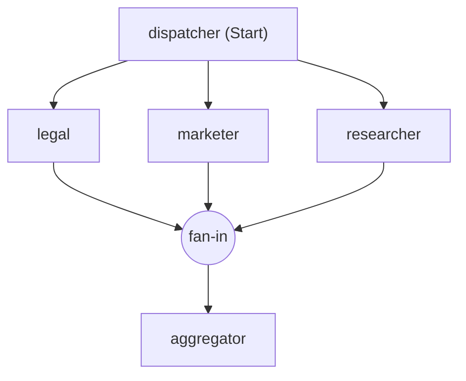
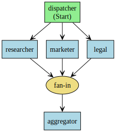

# Microsoft Agent Framework Workflows - Visualization

Sometimes a workflow that has multiple executors and complex interactions can be hard to understand from just reading the code. Visualization can help you see the structure of the workflow more clearly, so that you can verify that it has the intended design.

::: zone pivot="programming-language-python"

Workflow visualization is done via a `WorkflowViz` object that can be instantiated with a `Workflow` object. The `WorkflowViz` object can then generate visualizations in different formats, such as Graphviz DOT format or Mermaid diagram format.

> [!TIP]
> To export visualization images you also need to [install GraphViz](https://graphviz.org/download/).

Creating a `WorkflowViz` object is straightforward:

```python
from agent_framework import WorkflowBuilder, WorkflowViz

# Create a workflow with a fan-out and fan-in pattern
workflow = (
    WorkflowBuilder()
    .set_start_executor(dispatcher)
    .add_fan_out_edges(dispatcher, [researcher, marketer, legal])
    .add_fan_in_edges([researcher, marketer, legal], aggregator)
    .build()
)

viz = WorkflowViz(workflow)
```

Then, you can create visualizations in different formats:

```python
# Mermaid diagram
print(viz.to_mermaid())
# DiGraph string
print(viz.to_digraph())
# Export to a file
print(viz.export(format="svg"))
```

The exported diagram will look similar to the following for the example workflow:



or in Graphviz DOT format:



::: zone-end
