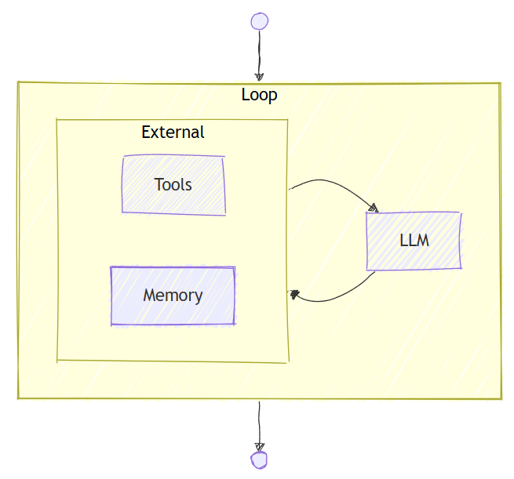
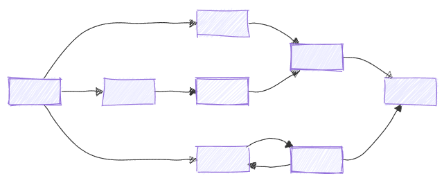

# Microsoft Agent Framework Workflows

## Overview

Microsoft Agent Framework Workflows empowers you to build intelligent automation systems that seamlessly blend AI agents with business processes. With its type-safe architecture and intuitive design, you can orchestrate complex workflows without getting bogged down in infrastructure complexity, allowing you to focus on your core business logic.

## How is a Workflows different from an Agent?

While an agent and a workflow can involve multiple steps to achieve a goal, they serve different purposes and operate at different levels of abstraction:

- **Agent**: An agent is typically driven by a large language model (LLM) and it has access to various tools to help it accomplish tasks. The steps an agent takes are dynamic and determined by the LLM based on the context of the conversation and the tools available.

  

    
  

- **Workflow**: A workflow, on the other hand, is a predefined sequence of operations that can include AI agents as components. Workflows are designed to handle complex business processes that may involve multiple agents, human interactions, and integrations with external systems. The flow of a workflow is explicitly defined, allowing for more control over the execution path.

  

    
  

## Key Features

- **Type Safety**: Strong typing ensures messages flow correctly between components, with comprehensive validation that prevents runtime errors.
- **Flexible Control Flow**: Graph-based architecture allows for intuitive modeling of complex workflows with `executors` and `edges`. Conditional routing, parallel processing, and dynamic execution paths are all supported.
- **External Integration**: Built-in request/response patterns for seamless integration with external APIs, and human-in-the-loop scenarios.
- **Checkpointing**: Save workflow states via checkpoints, enabling recovery and resumption of long-running processes on server sides.
- **Multi-Agent Orchestration**: Built-in patterns for coordinating multiple AI agents, including sequential, concurrent, hand-off, and magentic.

## Core Concepts

- **[Executors](./executors.md)**: represent individual processing units within a workflow. They can be AI agents or custom logic components. They receive input messages, perform specific tasks, and produce output messages.
- **[Edges](./edges.md)**: define the connections between executors, determining the flow of messages. They can include conditions to control routing based on message contents.
- **[Events](./events.md)**: provide observability into workflow execution, including lifecycle events, executor events, and custom events.
- **[Workflow Builder & Execution](./workflows.md)**: ties executors and edges together into a directed graph, manages execution via supersteps, and supports streaming and non-streaming modes.

## Getting Started

Begin your journey with Microsoft Agent Framework Workflows by exploring the getting started samples:

- [C# Getting Started Sample](https://github.com/microsoft/agent-framework/tree/main/dotnet/samples/03-workflows)
- [Python Getting Started Sample](https://github.com/microsoft/agent-framework/tree/main/python/samples/03-workflows)

## Next Steps

> [!div class="nextstepaction"]
> [Executors](./executors.md)
