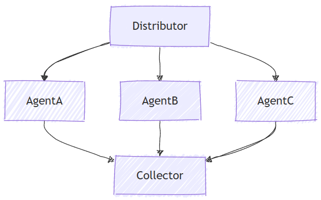

<!--
  Language parity table – keep in sync when adding/removing sections.

    | Section                                    | C# | Python | Go | Notes           |
    |--------------------------------------------|:--:|:------:|:--:|-----------------|
    | Client Setup and Agent Definition          | ✅ |   ✅   | ✅ |                 |
    | Set Up the Concurrent Orchestration        | ✅ |   ✅   | ✅ |                 |
    | Run the Concurrent Workflow                | ✅ |   ✅   | ✅ |                 |
    | Sample Output                              | ✅ |   ✅   | ✅ |                 |
    | Advanced: Custom Agent Executors           | ❌ |   ✅   | ✅ | Python/Go-specific |
    | Advanced: Custom Aggregator                | ❌ |   ✅   | ✅ | Python/Go-specific |
    | Intermediate Outputs                       | ❌ |   ✅   | ✅ | Python/Go-specific |
    | Key Concepts                               | ✅ |   ✅   | ✅ |                 |
-->

# Microsoft Agent Framework Workflows Orchestrations - Concurrent

Concurrent orchestration enables multiple agents to work on the same task in parallel. Each agent processes the input independently, and their results are collected and aggregated. This approach is well-suited for scenarios where diverse perspectives or solutions are valuable, such as brainstorming, ensemble reasoning, or voting systems.

<p align="center">
    
</p>

## What You'll Learn

- How to define multiple agents with different expertise
- How to orchestrate these agents to work concurrently on a single task
- How to collect and process the results

::: zone pivot="programming-language-csharp"

In concurrent orchestration, multiple agents work on the same task simultaneously and independently, providing diverse perspectives on the same input.

## Set Up the Azure OpenAI Client

```csharp
using System;
using System.Collections.Generic;
using System.Linq;
using System.Threading.Tasks;
using Azure.AI.Projects;
using Azure.Identity;
using Microsoft.Agents.AI.Workflows;
using Microsoft.Extensions.AI;
using Microsoft.Agents.AI;

// 1) Set up the Azure OpenAI client
var endpoint = Environment.GetEnvironmentVariable("AZURE_OPENAI_ENDPOINT") ??
    throw new InvalidOperationException("AZURE_OPENAI_ENDPOINT is not set.");
var deploymentName = Environment.GetEnvironmentVariable("AZURE_OPENAI_DEPLOYMENT_NAME") ?? "gpt-4o-mini";
var client = new AIProjectClient(new Uri(endpoint), new DefaultAzureCredential())
    .GetProjectOpenAIClient()
    .GetProjectResponsesClient()
    .AsIChatClient(deploymentName);
```

> [!WARNING]
> `DefaultAzureCredential` is convenient for development but requires careful consideration in production. In production, consider using a specific credential (e.g., `ManagedIdentityCredential`) to avoid latency issues, unintended credential probing, and potential security risks from fallback mechanisms.

## Define Your Agents

Create multiple specialized agents that will work on the same task concurrently:

```csharp
// 2) Helper method to create translation agents
static ChatClientAgent GetTranslationAgent(string targetLanguage, IChatClient chatClient) =>
    new(chatClient,
        $"You are a translation assistant who only responds in {targetLanguage}. Respond to any " +
        $"input by outputting the name of the input language and then translating the input to {targetLanguage}.");

// Create translation agents for concurrent processing
var translationAgents = (from lang in (string[])["French", "Spanish", "English"]
                         select GetTranslationAgent(lang, client));
```

## Set Up the Concurrent Orchestration

Build the workflow using `AgentWorkflowBuilder` to run agents in parallel:

```csharp
// 3) Build concurrent workflow
var workflow = AgentWorkflowBuilder.BuildConcurrent(translationAgents);
```

## Run the Concurrent Workflow and Collect Results

Execute the workflow and process events from all agents running simultaneously:

```csharp
// 4) Run the workflow
var messages = new List<ChatMessage> { new(ChatRole.User, "Hello, world!") };

await using StreamingRun run = await InProcessExecution.RunStreamingAsync(workflow, messages);
await run.TrySendMessageAsync(new TurnToken(emitEvents: true));

List<ChatMessage> result = new();
await foreach (WorkflowEvent evt in run.WatchStreamAsync())
{
    if (evt is AgentResponseUpdateEvent e)
    {
        Console.WriteLine($"{e.ExecutorId}: {e.Update.Text}");
    }
    else if (evt is WorkflowOutputEvent outputEvt)
    {
        result = outputEvt.As<List<ChatMessage>>()!;
        break;
    }
}

// Display aggregated results from all agents
Console.WriteLine("===== Final Aggregated Results =====");
foreach (var message in result)
{
    Console.WriteLine($"{message.Role}: {message.Text}");
}
```

## Sample Output

```plaintext
French_Agent: English detected. Bonjour, le monde !
Spanish_Agent: English detected. ¡Hola, mundo!
English_Agent: English detected. Hello, world!

===== Final Aggregated Results =====
User: Hello, world!
Assistant: English detected. Bonjour, le monde !
Assistant: English detected. ¡Hola, mundo!
Assistant: English detected. Hello, world!
```

## Key Concepts

- **Parallel Execution**: All agents process the input simultaneously and independently
- **AgentWorkflowBuilder.BuildConcurrent()**: Creates a concurrent workflow from a collection of agents
- **Automatic Aggregation**: Results from all agents are automatically collected into the final result
- **Event Streaming**: Real-time monitoring of agent progress through `AgentResponseUpdateEvent`
- **Diverse Perspectives**: Each agent brings its unique expertise to the same problem

::: zone-end

::: zone pivot="programming-language-python"

Agents are specialized entities that can process tasks. The following code defines three agents: a research expert, a marketing expert, and a legal expert.

```python
import os

from agent_framework.foundry import FoundryChatClient
from azure.identity import AzureCliCredential

# 1) Create three domain agents using FoundryChatClient
chat_client = FoundryChatClient(
    project_endpoint=os.environ["FOUNDRY_PROJECT_ENDPOINT"],
    model=os.environ["FOUNDRY_MODEL"],
    credential=AzureCliCredential(),
)

researcher = chat_client.as_agent(
    instructions=(
        "You're an expert market and product researcher. Given a prompt, provide concise, factual insights,"
        " opportunities, and risks."
    ),
    name="researcher",
)

marketer = chat_client.as_agent(
    instructions=(
        "You're a creative marketing strategist. Craft compelling value propositions and target messaging"
        " aligned to the prompt."
    ),
    name="marketer",
)

legal = chat_client.as_agent(
    instructions=(
        "You're a cautious legal/compliance reviewer. Highlight constraints, disclaimers, and policy concerns"
        " based on the prompt."
    ),
    name="legal",
)
```

## Set Up the Concurrent Orchestration

The `ConcurrentBuilder` class allows you to construct a workflow to run multiple agents in parallel. You pass the list of agents as participants.

```python
from agent_framework.orchestrations import ConcurrentBuilder

# 2) Build a concurrent workflow
# Participants are either Agents (type of SupportsAgentRun) or Executors
workflow = ConcurrentBuilder(participants=[researcher, marketer, legal]).build()
```

## Run the Concurrent Workflow and Collect the Results

The default aggregator produces a single `AgentResponse` containing one assistant message per participant:

```python
from agent_framework import AgentResponse

# 3) Run with a single prompt and print the aggregated agent responses
events = await workflow.run("We are launching a new budget-friendly electric bike for urban commuters.")
outputs = events.get_outputs()

if outputs:
    print("===== Final Aggregated Results =====")
    final: AgentResponse = outputs[0]
    for msg in final.messages:
        name = msg.author_name or "assistant"
        print(f"{'-' * 60}\n\n[{name}]:\n{msg.text}")
```

## Sample Output

```plaintext
===== Final Aggregated Results =====
------------------------------------------------------------

[researcher]:
**Insights:**

- **Target Demographic:** Urban commuters seeking affordable, eco-friendly transport;
    likely to include students, young professionals, and price-sensitive urban residents.
- **Market Trends:** E-bike sales are growing globally, with increasing urbanization,
    higher fuel costs, and sustainability concerns driving adoption.
...
------------------------------------------------------------

[marketer]:
**Value Proposition:**
"Empowering your city commute: Our new electric bike combines affordability, reliability, and
    sustainable design—helping you conquer urban journeys without breaking the bank."
...
------------------------------------------------------------

[legal]:
**Constraints, Disclaimers, & Policy Concerns for Launching a Budget-Friendly Electric Bike for Urban Commuters:**

**1. Regulatory Compliance**
- Verify that the electric bike meets all applicable federal, state, and local regulations
    regarding e-bike classification, speed limits, power output, and safety features.
```

## Advanced: Custom Agent Executors

Concurrent orchestration supports custom executors that wrap agents with additional logic. This is useful when you need more control over how agents are initialized and how they process requests:

### Define Custom Agent Executors

```python
from agent_framework import (
    AgentExecutorRequest,
    AgentExecutorResponse,
    Agent,
    Executor,
    WorkflowContext,
    handler,
)

class ResearcherExec(Executor):
    def __init__(self, chat_client: FoundryChatClient, id: str = "researcher"):
        self.agent = chat_client.as_agent(
            instructions=(
                "You're an expert market and product researcher. Given a prompt, provide concise, factual insights,"
                " opportunities, and risks."
            ),
            name=id,
        )
        super().__init__(id=id)

    @handler
    async def run(self, request: AgentExecutorRequest, ctx: WorkflowContext[AgentExecutorResponse]) -> None:
        response = await self.agent.run(request.messages)
        full_conversation = list(request.messages) + list(response.messages)
        await ctx.send_message(AgentExecutorResponse(self.id, response, full_conversation=full_conversation))

class MarketerExec(Executor):
    def __init__(self, chat_client: FoundryChatClient, id: str = "marketer"):
        self.agent = chat_client.as_agent(
            instructions=(
                "You're a creative marketing strategist. Craft compelling value propositions and target messaging"
                " aligned to the prompt."
            ),
            name=id,
        )
        super().__init__(id=id)

    @handler
    async def run(self, request: AgentExecutorRequest, ctx: WorkflowContext[AgentExecutorResponse]) -> None:
        response = await self.agent.run(request.messages)
        full_conversation = list(request.messages) + list(response.messages)
        await ctx.send_message(AgentExecutorResponse(self.id, response, full_conversation=full_conversation))
```

### Build a Workflow with Custom Executors

```python
chat_client = FoundryChatClient(
    project_endpoint=os.environ["FOUNDRY_PROJECT_ENDPOINT"],
    model=os.environ["FOUNDRY_MODEL"],
    credential=AzureCliCredential(),
)

researcher = ResearcherExec(chat_client)
marketer = MarketerExec(chat_client)
legal = LegalExec(chat_client)

workflow = ConcurrentBuilder(participants=[researcher, marketer, legal]).build()
```

## Advanced: Custom Aggregator

By default, concurrent orchestration aggregates all agent responses into a single `AgentResponse` with one assistant message per participant. You can override this behavior with a custom aggregator that processes the results in a specific way:

### Define a Custom Aggregator

```python
from agent_framework import AgentExecutorResponse

# Create a summarizer agent for the aggregator
summarizer_agent = chat_client.as_agent(
    instructions=(
        "You are a helpful assistant that consolidates multiple domain expert outputs "
        "into one cohesive, concise summary with clear takeaways. Keep it under 200 words."
    ),
    name="summarizer",
)

# Define a custom aggregator callback
async def summarize_results(results: list[AgentExecutorResponse]) -> str:
    # Extract one final assistant message per agent
    expert_sections: list[str] = []
    for r in results:
        try:
            messages = getattr(r.agent_response, "messages", [])
            final_text = messages[-1].text if messages and hasattr(messages[-1], "text") else "(no content)"
            expert_sections.append(f"{r.executor_id}:\n{final_text}")
        except Exception as e:
            expert_sections.append(f"{r.executor_id}: (error: {type(e).__name__}: {e})")

    # Ask the model to synthesize a concise summary of the experts' outputs
    prompt = "\n\n".join(expert_sections)
    response = await summarizer_agent.run(prompt)
    # Return the model's final assistant text as the completion result
    return response.messages[-1].text if response.messages else ""
```

### Build a Workflow with Custom Aggregator

```python
workflow = (
    ConcurrentBuilder(participants=[researcher, marketer, legal])
    .with_aggregator(summarize_results)
    .build()
)

output = None
async for event in workflow.run("We are launching a new budget-friendly electric bike for urban commuters.", stream=True):
    if event.type == "output":
        output = event.data

if output:
    print("===== Final Consolidated Output =====")
    print(output)
```

### Sample Output with Custom Aggregator

```plaintext
===== Final Consolidated Output =====
Urban e-bike demand is rising rapidly due to eco-awareness, urban congestion, and high fuel costs,
with market growth projected at a ~10% CAGR through 2030. Key customer concerns are affordability,
easy maintenance, convenient charging, compact design, and theft protection. Differentiation opportunities
include integrating smart features (GPS, app connectivity), offering subscription or leasing options, and
developing portable, space-saving designs. Partnering with local governments and bike shops can boost visibility.

Risks include price wars eroding margins, regulatory hurdles, battery quality concerns, and heightened expectations
for after-sales support. Accurate, substantiated product claims and transparent marketing (with range disclaimers)
are essential. All e-bikes must comply with local and federal regulations on speed, wattage, safety certification,
and labeling. Clear warranty, safety instructions (especially regarding batteries), and inclusive, accessible
marketing are required. For connected features, data privacy policies and user consents are mandatory.

Effective messaging should target young professionals, students, eco-conscious commuters, and first-time buyers,
emphasizing affordability, convenience, and sustainability. Slogan suggestion: "Charge Ahead—City Commutes Made
Affordable." Legal review in each target market, compliance vetting, and robust customer support policies are
critical before launch.
```

## Intermediate Outputs

By default, only the aggregator's output surfaces as a workflow `"output"` (terminal) event. Pass `intermediate_output_from` with the participants you want to designate as intermediate sources to also surface their individual outputs as `"intermediate"` events:

```python
workflow = ConcurrentBuilder(
    participants=[researcher, marketer, legal],
    intermediate_output_from=[researcher, marketer, legal],
).build()
```

You can handle these events in real-time in streaming mode:

```python
from agent_framework import AgentResponseUpdate

# Track the last author to format streaming output.
last_author: str | None = None

async for event in workflow.run("Analyze our new product launch strategy.", stream=True):
    if event.type == "intermediate" and isinstance(event.data, AgentResponseUpdate):
        update = event.data
        author = update.author_name
        if author != last_author:
            if last_author is not None:
                print()  # Newline between different authors
            print(f"{author}: {update.text}", end="", flush=True)
            last_author = author
        else:
            print(update.text, end="", flush=True)
```

## Key Concepts

- **Parallel Execution**: All agents work on the task simultaneously and independently
- **AgentResponse Output**: The default aggregator yields a single `AgentResponse` with one assistant message per participant (no user prompt included)
- **Diverse Perspectives**: Each agent brings its unique expertise to the same problem
- **Flexible Participants**: You can use agents directly or wrap them in custom executors
- **Custom Processing**: Override the default aggregator to synthesize results in domain-specific ways
- **Intermediate Outputs**: Pass `intermediate_output_from=[participant, ...]` to surface each listed participant's output as `"intermediate"` events, in addition to the aggregator's terminal `"output"` event

::: zone-end

::: zone pivot="programming-language-go"

Go supports concurrent agent workflows with `agentworkflow.NewConcurrentWorkflowBuilder`. You can also build the same pattern manually with fan-out and fan-in edges when you need custom executor behavior.

## Set Up Foundry Configuration

Configure the Foundry project endpoint, model deployment, and authentication:

```go
endpoint := os.Getenv("FOUNDRY_PROJECT_ENDPOINT")
model := cmp.Or(os.Getenv("FOUNDRY_MODEL"), "gpt-4o-mini")

token, err := azidentity.NewDefaultAzureCredential(nil)
if err != nil {
    return err
}
```

> [!WARNING]
> `azidentity.NewDefaultAzureCredential` is convenient for development but requires careful consideration in production. In production, consider using a specific credential, such as `azidentity.NewManagedIdentityCredential`, to avoid latency issues, unintended credential probing, and potential security risks from fallback mechanisms.

## Define Your Agents

Create multiple specialized agents that will work on the same task concurrently:

```go
newTranslationAgent := func(language string) *agent.Agent {
    return foundryprovider.NewAgent(
        endpoint,
        token,
        foundryprovider.ModelDeployment(model),
        foundryprovider.AgentConfig{
            Instructions: fmt.Sprintf(
                "You are a translation assistant who only responds in %s. Respond to any input by outputting the name of the input language and then translating the input to %s.",
                language,
                language,
            ),
            Config: agent.Config{Name: language},
        },
    )
}

agents := []*agent.Agent{
    newTranslationAgent("French"),
    newTranslationAgent("Spanish"),
    newTranslationAgent("English"),
}
```

## Set Up the Concurrent Orchestration

Build the workflow with `agentworkflow.NewConcurrentWorkflowBuilder`:

```go
wf, err := agentworkflow.NewConcurrentWorkflowBuilder(agents...).
    WithName("translation-concurrent").
    Build()
if err != nil {
    return err
}
```

## Run the Concurrent Workflow and Collect Results

Run the workflow with a user message and a turn token. When event emission is enabled, agent updates are surfaced as workflow output events before the final aggregated output.

```go
run, err := inproc.Default.RunStreaming(ctx, wf, []*message.Message{message.NewText("Hello, world!")})
if err != nil {
    return err
}
defer run.Close(ctx)

emitEvents := true
if err := run.SendMessage(ctx, workflow.TurnToken{EmitEvents: &emitEvents}); err != nil {
    return err
}

for evt, err := range run.WatchStream(ctx) {
    if err != nil {
        return err
    }
    if output, ok := evt.(workflow.OutputEvent); ok {
        switch value := output.Output.(type) {
        case *agent.ResponseUpdate:
            fmt.Printf("%s: %s\n", output.ExecutorID, value.String())
        case []*message.Message:
            fmt.Println("===== Final Aggregated Results =====")
            for _, msg := range value {
                fmt.Printf("%s: %s\n", msg.Role, msg.String())
            }
        }
    }
}
```

## Sample Output

```plaintext
French: English detected. Bonjour, le monde !
Spanish: English detected. ¡Hola, mundo!
English: English detected. Hello, world!

===== Final Aggregated Results =====
assistant: English detected. Bonjour, le monde !
assistant: English detected. ¡Hola, mundo!
assistant: English detected. Hello, world!
```

## Advanced: Custom Agent Executors

Build concurrent workflows manually when you need custom executor behavior. A custom executor can call an agent and then participate in a fan-out/fan-in workflow.

```go
agentExecutor := func(id string, ag *agent.Agent) workflow.ExecutorBinding {
    return workflow.BindNewExecutorFunc(id, func(_ string, executorID string) (*workflow.Executor, error) {
        return workflow.NewExecutor(executorID, func(ctx *workflow.Context, prompt string) (string, error) {
            response, err := ag.RunText(ctx, prompt).Collect()
            if err != nil {
                return "", err
            }
            return response.String(), nil
        }), nil
    })
}

researcher := agentExecutor("researcher", researcherAgent)
marketer := agentExecutor("marketer", marketerAgent)
aggregate := aggregateStrings("ConcurrentAggregationExecutor")

wf, err := workflow.NewBuilder(start).
    AddFanOutEdge(start, []workflow.ExecutorBinding{researcher, marketer}).
    AddFanInBarrierEdge([]workflow.ExecutorBinding{researcher, marketer}, aggregate).
    WithOutputFrom(aggregate).
    Build()
```

## Advanced: Custom Aggregator

Use `WithAggregator` to replace the default message aggregation behavior:

```go
wf, err := agentworkflow.NewConcurrentWorkflowBuilder(agents...).
    WithName("translation-concurrent").
    WithAggregator(func(_ context.Context, batches [][]*message.Message) []*message.Message {
        results := make([]*message.Message, 0, len(batches))
        for _, batch := range batches {
            if len(batch) > 0 {
                results = append(results, batch[len(batch)-1])
            }
        }
        return results
    }).
    Build()
if err != nil {
    return err
}
```

## Intermediate Outputs

By default, `NewConcurrentWorkflowBuilder` emits participant and batching outputs as intermediate workflow outputs and emits the aggregated result as the terminal output. For custom executor workflows, mark branch executors as intermediate and the aggregator as terminal:

```go
wf, err := workflow.NewBuilder(start).
    AddFanOutEdge(start, []workflow.ExecutorBinding{physics, chemistry}).
    AddFanInBarrierEdge([]workflow.ExecutorBinding{physics, chemistry}, aggregate).
    WithIntermediateOutputFrom(physics, chemistry).
    WithOutputFrom(aggregate).
    Build()
```

Each `workflow.OutputEvent` includes the `ExecutorID` that produced the output. Use `OutputEvent.IsIntermediate()` to distinguish intermediate branch outputs from the final aggregate.

## Key Concepts

- **Parallel Execution**: All agents or executors process the input independently.
- **agentworkflow.NewConcurrentWorkflowBuilder()**: Creates a concurrent workflow from a collection of agents.
- **Fan-out/Fan-in Edges**: Custom concurrent workflows use `AddFanOutEdge` and `AddFanInBarrierEdge`.
- **Message Aggregation**: The default aggregator returns the last message from each participant; custom aggregators can replace that behavior.
- **Event Streaming**: Output events can surface individual agent updates and final aggregated results.
- **Intermediate Outputs**: `WithIntermediateOutputFrom` marks selected outputs with `workflow.OutputTagIntermediate`.

> [!TIP]
> See the [concurrent workflow sample](https://github.com/microsoft/agent-framework-go/blob/main/examples/03-workflows/concurrent/concurrent/main.go) and [agent workflow patterns sample](https://github.com/microsoft/agent-framework-go/blob/main/examples/03-workflows/01-start-here/03_agent_workflow_patterns/main.go) for complete runnable examples.

::: zone-end
## Next steps

> [!div class="nextstepaction"]
> [Sequential Orchestration](./sequential.md)
