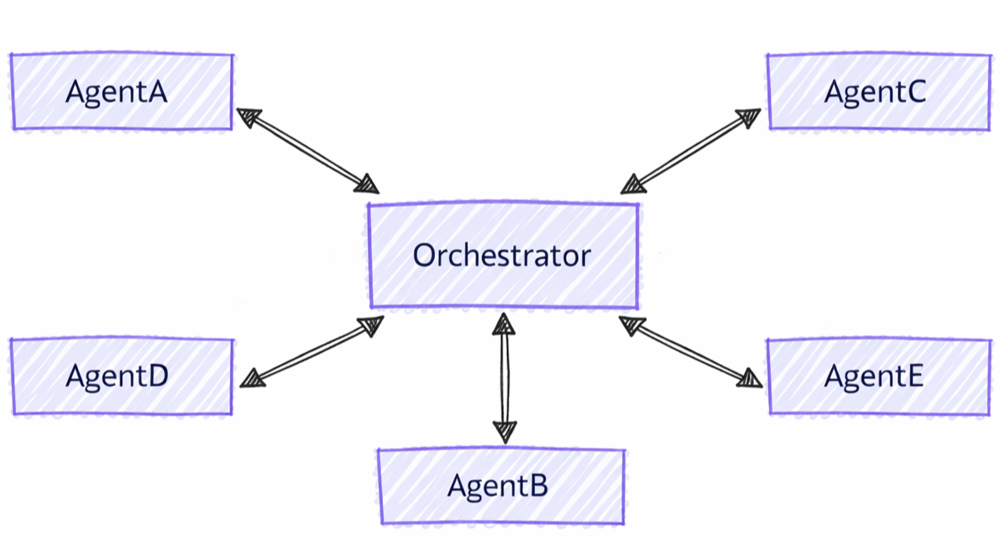

<!--
  Language parity table – keep in sync when adding/removing sections.

  | Section                                        | C# | Python | Notes           |
  |------------------------------------------------|:--:|:------:|-----------------|
  | Set Up the Client                              | ✅ |   ✅   |                 |
  | Define Your Agents                             | ✅ |   ✅   |                 |
  | Configure Group Chat (Round-Robin / Selector)  | ✅ |   ✅   |                 |
  | Configure Group Chat (Agent-Based Orchestrator)| ❌ |   ✅   |                 |
  | Run the Workflow                               | ✅ |   ✅   |                 |
  | Sample Interaction                             | ✅ |   ✅   |                 |
  | Key Concepts                                   | ✅ |   ✅   |                 |
  | Advanced: Custom Speaker Selection             | ✅ |   ✅   |                 |
  | Context Synchronization                        | ✅ |   ✅   | Shared section  |
  | When to Use Group Chat                         | ✅ |   ✅   | Shared section  |
-->

# Microsoft Agent Framework Workflows Orchestrations - Group Chat

Group chat orchestration models a collaborative conversation among multiple agents, coordinated by an orchestrator that determines speaker selection and conversation flow. This pattern is ideal for scenarios requiring iterative refinement, collaborative problem-solving, or multi-perspective analysis.

Internally, the group chat orchestration assembles agents in a star topology, with an orchestrator in the middle. The orchestrator can implement various strategies for selecting which agent speaks next, such as round-robin, prompt-based selection, or custom logic based on conversation context, making it a flexible and powerful pattern for multi-agent collaboration.

<p align="center">
    
</p>

## Differences Between Group Chat and Other Patterns

Group chat orchestration has distinct characteristics compared to other multi-agent patterns:

- **Centralized Coordination**: Unlike handoff patterns where agents directly transfer control, group chat uses an orchestrator to coordinate who speaks next
- **Iterative Refinement**: Agents can review and build upon each other's responses in multiple rounds
- **Flexible Speaker Selection**: The orchestrator can use various strategies (round-robin, prompt-based, custom logic) to select speakers
- **Shared Context**: All agents see the full conversation history, enabling collaborative refinement

## What You'll Learn

- How to create specialized agents for group collaboration
- How to configure speaker selection strategies
- How to build workflows with iterative agent refinement
- How to customize conversation flow with custom orchestrators

::: zone pivot="programming-language-csharp"

## Set Up the Azure OpenAI Client

```csharp
using System;
using System.Collections.Generic;
using System.Threading.Tasks;
using Azure.AI.Projects;
using Azure.Identity;
using Microsoft.Agents.AI.Workflows;
using Microsoft.Extensions.AI;
using Microsoft.Agents.AI;

// Set up the Azure OpenAI client
var endpoint = Environment.GetEnvironmentVariable("AZURE_OPENAI_ENDPOINT") ??
    throw new InvalidOperationException("AZURE_OPENAI_ENDPOINT is not set.");
var deploymentName = Environment.GetEnvironmentVariable("AZURE_OPENAI_DEPLOYMENT_NAME") ?? "gpt-4o-mini";
var client = new AIProjectClient(new Uri(endpoint), new DefaultAzureCredential())
    .GetProjectOpenAIClient()
    .GetProjectResponsesClient()
    .AsIChatClient(deploymentName);
```

> [!WARNING]
> `DefaultAzureCredential` is convenient for development but requires careful consideration in production. In production, consider using a specific credential (e.g., `ManagedIdentityCredential`) to avoid latency issues, unintended credential probing, and potential security risks from fallback mechanisms.

## Define Your Agents

Create specialized agents for different roles in the group conversation:

```csharp
// Create a copywriter agent
ChatClientAgent writer = new(client,
    "You are a creative copywriter. Generate catchy slogans and marketing copy. Be concise and impactful.",
    "CopyWriter",
    "A creative copywriter agent");

// Create a reviewer agent
ChatClientAgent reviewer = new(client,
    "You are a marketing reviewer. Evaluate slogans for clarity, impact, and brand alignment. " +
    "Provide constructive feedback or approval.",
    "Reviewer",
    "A marketing review agent");
```

## Configure Group Chat with Round-Robin Orchestrator

Build the group chat workflow using `AgentWorkflowBuilder`:

```csharp
// Build group chat with round-robin speaker selection
// The manager factory receives the list of agents and returns a configured manager
var workflow = AgentWorkflowBuilder
    .CreateGroupChatBuilderWith(agents =>
        new RoundRobinGroupChatManager(agents)
        {
            MaximumIterationCount = 5  // Maximum number of turns
        })
    .AddParticipants(writer, reviewer)
    .Build();
```

## Run the Group Chat Workflow

Execute the workflow and observe the iterative conversation:

```csharp
// Start the group chat
var messages = new List<ChatMessage> {
    new(ChatRole.User, "Create a slogan for an eco-friendly electric vehicle.")
};

await using StreamingRun run = await InProcessExecution.RunStreamingAsync(workflow, messages);
await run.TrySendMessageAsync(new TurnToken(emitEvents: true));

await foreach (WorkflowEvent evt in run.WatchStreamAsync().ConfigureAwait(false))
{
    if (evt is AgentResponseUpdateEvent update)
    {
        // Process streaming agent responses
        AgentResponse response = update.AsResponse();
        foreach (ChatMessage message in response.Messages)
        {
            Console.WriteLine($"[{update.ExecutorId}]: {message.Text}");
        }
    }
    else if (evt is WorkflowOutputEvent output)
    {
        // Workflow completed
        var conversationHistory = output.As<List<ChatMessage>>();
        Console.WriteLine("\n=== Final Conversation ===");
        foreach (var message in conversationHistory)
        {
            Console.WriteLine($"{message.AuthorName}: {message.Text}");
        }
        break;
    }
}
```

## Sample Interaction

```plaintext
[CopyWriter]: "Green Dreams, Zero Emissions" - Drive the future with style and sustainability.

[Reviewer]: The slogan is good, but "Green Dreams" might be a bit abstract. Consider something
more direct like "Pure Power, Zero Impact" to emphasize both performance and environmental benefit.

[CopyWriter]: "Pure Power, Zero Impact" - Experience electric excellence without compromise.

[Reviewer]: Excellent! This slogan is clear, impactful, and directly communicates the key benefits.
The tagline reinforces the message perfectly. Approved for use.

[CopyWriter]: Thank you! The final slogan is: "Pure Power, Zero Impact" - Experience electric
excellence without compromise.
```

::: zone-end

::: zone pivot="programming-language-python"

## Set Up the Chat Client

```python
import os

from agent_framework.foundry import FoundryChatClient
from azure.identity import AzureCliCredential

# Initialize the Azure OpenAI client
client = FoundryChatClient(
    project_endpoint=os.environ["FOUNDRY_PROJECT_ENDPOINT"],
    model=os.environ["FOUNDRY_MODEL"],
    credential=AzureCliCredential(),
)
```

## Define Your Agents

Create specialized agents with distinct roles:

```python
from agent_framework import Agent

# Create a researcher agent
researcher = Agent(
    client=client,
    name="Researcher",
    description="Collects relevant background information.",
    instructions="Gather concise facts that help answer the question. Be brief and factual.",
)

# Create a writer agent
writer = Agent(
    client=client,
    name="Writer",
    description="Synthesizes polished answers using gathered information.",
    instructions="Compose clear, structured answers using any notes provided. Be comprehensive.",
)
```

## Configure Group Chat with Simple Selector

Build a group chat with custom speaker selection logic:

```python
from agent_framework.orchestrations import GroupChatBuilder, GroupChatState

def round_robin_selector(state: GroupChatState) -> str:
    """A round-robin selector function that picks the next speaker based on the current round index."""

    participant_names = list(state.participants.keys())
    return participant_names[state.current_round % len(participant_names)]


# Build the group chat workflow
workflow = GroupChatBuilder(
    participants=[researcher, writer],
    termination_condition=lambda conversation: len(conversation) >= 4,
    selection_func=round_robin_selector,
).build()
```

## Configure Group Chat with Agent-Based Orchestrator

Alternatively, use an agent-based orchestrator for intelligent speaker selection. The orchestrator is a full `Agent` with access to tools, context, and observability:

```python
# Create orchestrator agent for speaker selection
orchestrator_agent = Agent(
    name="Orchestrator",
    description="Coordinates multi-agent collaboration by selecting speakers",
    instructions="""
You coordinate a team conversation to solve the user's task.

Guidelines:
- Start with Researcher to gather information
- Then have Writer synthesize the final answer
- Only finish after both have contributed meaningfully
""",
    client=client,
)

# Build group chat with agent-based orchestrator
workflow = GroupChatBuilder(
    participants=[researcher, writer],
    # Set a hard termination condition: stop after 4 assistant messages
    # The agent orchestrator will intelligently decide when to end before this limit but just in case
    termination_condition=lambda messages: sum(1 for msg in messages if msg.role == "assistant") >= 4,
    orchestrator_agent=orchestrator_agent,
).build()
```

## Run the Group Chat Workflow

Execute the workflow and process events:

```python
from agent_framework import AgentResponseUpdate, Message

task = "What are the key benefits of async/await in Python?"

print(f"Task: {task}\n")
print("=" * 80)

final_conversation: list[Message] = []
last_author: str | None = None

# Run the workflow with streaming enabled
async for event in workflow.run(task, stream=True):
    if event.type == "output" and isinstance(event.data, AgentResponseUpdate):
        # Print streaming agent updates
        author = event.data.author_name
        if author != last_author:
            if last_author is not None:
                print()
            print(f"[{author}]:", end=" ", flush=True)
            last_author = author
        print(event.data.text, end="", flush=True)
    elif event.type == "output" and isinstance(event.data, list):
        # Workflow completed - data is a list of Message
        final_conversation = event.data

if final_conversation:
    print("\n\n" + "=" * 80)
    print("Final Conversation:")
    for msg in final_conversation:
        print(f"\n[{msg.author_name}]\n{msg.text}")
        print("-" * 80)

print("\nWorkflow completed.")
```

## Sample Interaction

```plaintext
Task: What are the key benefits of async/await in Python?

================================================================================

[Researcher]: Async/await in Python provides non-blocking I/O operations, enabling
concurrent execution without threading overhead. Key benefits include improved
performance for I/O-bound tasks, better resource utilization, and simplified
concurrent code structure using native coroutines.

[Writer]: The key benefits of async/await in Python are:

1. **Non-blocking Operations**: Allows I/O operations to run concurrently without
   blocking the main thread, significantly improving performance for network
   requests, file I/O, and database queries.

2. **Resource Efficiency**: Avoids the overhead of thread creation and context
   switching, making it more memory-efficient than traditional threading.

3. **Simplified Concurrency**: Provides a clean, synchronous-looking syntax for
   asynchronous code, making concurrent programs easier to write and maintain.

4. **Scalability**: Enables handling thousands of concurrent connections with
   minimal resource consumption, ideal for high-performance web servers and APIs.

--------------------------------------------------------------------------------

Workflow completed.
```

::: zone-end

## Key Concepts

::: zone pivot="programming-language-csharp"

- **Centralized Manager**: Group chat uses a manager to coordinate speaker selection and flow
- **AgentWorkflowBuilder.CreateGroupChatBuilderWith()**: Creates workflows with a manager factory function
- **RoundRobinGroupChatManager**: Built-in manager that alternates speakers in round-robin fashion
- **MaximumIterationCount**: Controls the maximum number of agent turns before termination
- **Custom Managers**: Extend `RoundRobinGroupChatManager` or implement custom logic
- **Iterative Refinement**: Agents review and improve each other's contributions
- **Shared Context**: All participants see the full conversation history

::: zone-end

::: zone pivot="programming-language-python"

- **Flexible Orchestrator Strategies**: Choose between simple selectors, agent-based orchestrators, or custom logic via constructor parameters (`selection_func`, `orchestrator_agent`, or `orchestrator`).
- **GroupChatBuilder**: Creates workflows with configurable speaker selection
- **GroupChatState**: Provides conversation state for selection decisions
- **Iterative Collaboration**: Agents build upon each other's contributions
- **Event Streaming**: Process `AgentResponseUpdate` events in real-time via `workflow.run(task, stream=True)`
- **list[Message] Output**: All orchestrations return a list of chat messages

::: zone-end

## Advanced: Custom Speaker Selection

::: zone pivot="programming-language-csharp"

You can implement custom manager logic by creating a custom group chat manager:

```csharp
public class ApprovalBasedManager : RoundRobinGroupChatManager
{
    private readonly string _approverName;

    public ApprovalBasedManager(IReadOnlyList<AIAgent> agents, string approverName)
        : base(agents)
    {
        _approverName = approverName;
    }

    // Override to add custom termination logic
    protected override ValueTask<bool> ShouldTerminateAsync(
        IReadOnlyList<ChatMessage> history,
        CancellationToken cancellationToken = default)
    {
        var last = history.LastOrDefault();
        bool shouldTerminate = last?.AuthorName == _approverName &&
            last.Text?.Contains("approve", StringComparison.OrdinalIgnoreCase) == true;

        return ValueTask.FromResult(shouldTerminate);
    }
}

// Use custom manager in workflow
var workflow = AgentWorkflowBuilder
    .CreateGroupChatBuilderWith(agents =>
        new ApprovalBasedManager(agents, "Reviewer")
        {
            MaximumIterationCount = 10
        })
    .AddParticipants(writer, reviewer)
    .Build();
```

::: zone-end

::: zone pivot="programming-language-python"

You can implement sophisticated selection logic based on conversation state:

```python
def smart_selector(state: GroupChatState) -> str:
    """Select speakers based on conversation content and context."""
    conversation = state.conversation

    last_message = conversation[-1] if conversation else None

    # If no messages yet, start with Researcher
    if not last_message:
        return "Researcher"

    # Check last message content
    last_text = last_message.text.lower()

    # If researcher finished gathering info, switch to writer
    if "i have finished" in last_text and last_message.author_name == "Researcher":
        return "Writer"

    # Else continue with researcher until it indicates completion
    return "Researcher"

workflow = GroupChatBuilder(
    participants=[researcher, writer],
    selection_func=smart_selector,
).build()
```

> [!IMPORTANT]
> When using a custom implementation of `BaseGroupChatOrchestrator` for advanced scenarios, all properties must be set, including `participant_registry`, `max_rounds`, and `termination_condition`. `max_rounds` and `termination_condition` set in the builder will be ignored.

::: zone-end

## Context Synchronization

As mentioned at the beginning of this guide, all agents in a group chat see the full conversation history.

Agents in Agent Framework relies on agent sessions ([`AgentSession`](../../agents/conversations/session.md)) to manage context. In a group chat orchestration, agents **do not** share the same session instance, but the orchestrator ensures that each agent's session is synchronized with the complete conversation history before each turn. To achieve this, after each agent's turn, the orchestrator broadcasts the response to all other agents, making sure all participants have the latest context for their next turn.

<p align="center">
    
</p>

> [!TIP]
> Agents do not share the same session instance because different [agent types](../../agents/providers/index.md) may have different implementations of the `AgentSession` abstraction. Sharing the same session instance could lead to inconsistencies in how each agent processes and maintains context.

After broadcasting the response, the orchestrator then decide the next speaker and sends a request to the selected agent, which now has the full conversation history to generate its response.

## When to Use Group Chat

Group chat orchestration is ideal for:

- **Iterative Refinement**: Multiple rounds of review and improvement
- **Collaborative Problem-Solving**: Agents with complementary expertise working together
- **Content Creation**: Writer-reviewer workflows for document creation
- **Multi-Perspective Analysis**: Getting diverse viewpoints on the same input
- **Quality Assurance**: Automated review and approval processes

**Consider alternatives when:**

- You need strict sequential processing (use Sequential orchestration)
- Agents should work completely independently (use Concurrent orchestration)
- Direct agent-to-agent handoffs are needed (use Handoff orchestration)
- Complex dynamic planning is required (use Magentic orchestration)

## Next steps

> [!div class="nextstepaction"]
> [Magentic Orchestration](./magentic.md)
