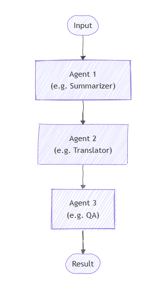
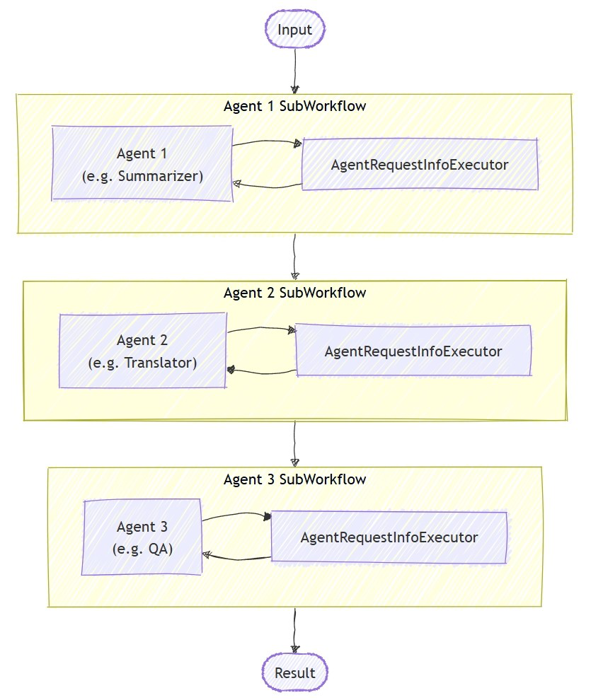

<!--
  Language parity table – keep in sync when adding/removing sections.

  | Section                                       | C# | Python | Notes           |
  |-----------------------------------------------|:--:|:------:|-----------------|
  | Set Up the Azure OpenAI Client                | ✅ |   ✅   |                 |
  | Define Your Agents                            | ✅ |   ✅   |                 |
  | Set Up the Sequential Orchestration           | ✅ |   ✅   |                 |
  | Run the Sequential Workflow                   | ✅ |   ✅   |                 |
  | Sample Output                                 | ✅ |   ✅   |                 |
  | Sequential with Human-in-the-Loop             | ✅ |   ✅   |                 |
  | Advanced: Mixing Agents with Custom Executors | ❌ |   ✅   | Python-specific |
  | Key Concepts                                  | ✅ |   ✅   |                 |
-->

# Microsoft Agent Framework Workflows Orchestrations - Sequential

In sequential orchestration, agents are organized in a pipeline. Each agent processes the task in turn, passing its output to the next agent in the sequence. This is ideal for workflows where each step builds upon the previous one, such as document review, data processing pipelines, or multi-stage reasoning.

<p align="center">
    
</p>

> [!IMPORTANT]
> The full conversation history from previous agents is passed to the next agent in the sequence. Each agent can see all prior messages, allowing for context-aware processing.

## What You'll Learn

- How to create a sequential pipeline of agents
- How to chain agents where each builds upon the previous output
- How to add human-in-the-loop approval for sensitive tool calls
- How to mix agents with custom executors for specialized tasks
- How to track the conversation flow through the pipeline

## Define Your Agents

::: zone pivot="programming-language-csharp"

In sequential orchestration, agents are organized in a pipeline where each agent processes the task in turn, passing output to the next agent in the sequence.

## Set Up the Azure OpenAI Client

```csharp
using System;
using System.Collections.Generic;
using System.Linq;
using System.Threading.Tasks;
using Azure.AI.Projects;
using Azure.Identity;
using Microsoft.Agents.AI.Workflows;
using Microsoft.Extensions.AI;
using Microsoft.Agents.AI;

// 1) Set up the Azure OpenAI client
var endpoint = Environment.GetEnvironmentVariable("AZURE_OPENAI_ENDPOINT") ??
    throw new InvalidOperationException("AZURE_OPENAI_ENDPOINT is not set.");
var deploymentName = Environment.GetEnvironmentVariable("AZURE_OPENAI_DEPLOYMENT_NAME") ?? "gpt-4o-mini";
var client = new AIProjectClient(new Uri(endpoint), new DefaultAzureCredential())
    .GetChatClient(deploymentName)
    .AsIChatClient();
```

> [!WARNING]
> `DefaultAzureCredential` is convenient for development but requires careful consideration in production. In production, consider using a specific credential (e.g., `ManagedIdentityCredential`) to avoid latency issues, unintended credential probing, and potential security risks from fallback mechanisms.

Create specialized agents that will work in sequence:

```csharp
// 2) Helper method to create translation agents
static ChatClientAgent GetTranslationAgent(string targetLanguage, IChatClient chatClient) =>
    new(chatClient,
        $"You are a translation assistant who only responds in {targetLanguage}. Respond to any " +
        $"input by outputting the name of the input language and then translating the input to {targetLanguage}.");

// Create translation agents for sequential processing
var translationAgents = (from lang in (string[])["French", "Spanish", "English"]
                         select GetTranslationAgent(lang, client));
```

## Set Up the Sequential Orchestration

Build the workflow using `AgentWorkflowBuilder`:

```csharp
// 3) Build sequential workflow
var workflow = AgentWorkflowBuilder.BuildSequential(translationAgents);
```

## Run the Sequential Workflow

Execute the workflow and process the events:

```csharp
// 4) Run the workflow
var messages = new List<ChatMessage> { new(ChatRole.User, "Hello, world!") };

await using StreamingRun run = await InProcessExecution.RunStreamingAsync(workflow, messages);
await run.TrySendMessageAsync(new TurnToken(emitEvents: true));

string? lastExecutorId = null;
List<ChatMessage> result = [];
await foreach (WorkflowEvent evt in run.WatchStreamAsync())
{
    if (evt is AgentResponseUpdateEvent e)
    {
        if (e.ExecutorId != lastExecutorId)
        {
            lastExecutorId = e.ExecutorId;
            Console.WriteLine();
            Console.Write($"{e.ExecutorId}: ");
        }

        Console.Write(e.Update.Text);
    }
    else if (evt is WorkflowOutputEvent outputEvt)
    {
        result = outputEvt.As<List<ChatMessage>>()!;
        break;
    }
}

// Display final result
Console.WriteLine();
foreach (var message in result)
{
    Console.WriteLine($"{message.Role}: {message.Content}");
}
```

## Sample Output

```plaintext
French_Translation: User: Hello, world!
French_Translation: Assistant: English detected. Bonjour, le monde !
Spanish_Translation: Assistant: French detected. ¡Hola, mundo!
English_Translation: Assistant: Spanish detected. Hello, world!
```

## Sequential Orchestration with Human-in-the-Loop

Sequential orchestrations support human-in-the-loop interactions through tool approval. When agents use tools wrapped with `ApprovalRequiredAIFunction`, the workflow pauses and emits a `RequestInfoEvent` containing a `ToolApprovalRequestContent`. External systems (such as a human operator) can inspect the tool call, approve or reject it, and the workflow resumes accordingly.

<p align="center">
    
</p>

> [!TIP]
> For more details on the request and response model, see [Human-in-the-Loop](../human-in-the-loop.md).

### Define Agents with Approval-Required Tools

Create agents where sensitive tools are wrapped with `ApprovalRequiredAIFunction`:

```csharp
ChatClientAgent deployAgent = new(
    client,
    "You are a DevOps engineer. Check staging status first, then deploy to production.",
    "DeployAgent",
    "Handles deployments",
    [
        AIFunctionFactory.Create(CheckStagingStatus),
        new ApprovalRequiredAIFunction(AIFunctionFactory.Create(DeployToProduction))
    ]);

ChatClientAgent verifyAgent = new(
    client,
    "You are a QA engineer. Verify that the deployment was successful and summarize the results.",
    "VerifyAgent",
    "Verifies deployments");
```

### Build and Run with Approval Handling

Build the sequential workflow normally. The approval flow is handled through the event stream:

```csharp
var workflow = AgentWorkflowBuilder.BuildSequential([deployAgent, verifyAgent]);

await foreach (WorkflowEvent evt in run.WatchStreamAsync())
{
    if (evt is RequestInfoEvent e &&
        e.Request.TryGetDataAs(out ToolApprovalRequestContent? approvalRequest))
    {
        await run.SendResponseAsync(
            e.Request.CreateResponse(approvalRequest.CreateResponse(approved: true)));
    }
}
```

> [!NOTE]
> `AgentWorkflowBuilder.BuildSequential()` supports tool approval out of the box — no additional configuration is needed. When an agent calls a tool wrapped with `ApprovalRequiredAIFunction`, the workflow automatically pauses and emits a `RequestInfoEvent`.

> [!TIP]
> For a complete runnable example of this approval flow, see the [`GroupChatToolApproval` sample](https://github.com/microsoft/agent-framework/tree/main/dotnet/samples/03-workflows/Agents/GroupChatToolApproval). The same `RequestInfoEvent` handling pattern applies to other orchestrations.

## Key Concepts

- **Sequential Processing**: Each agent processes the output of the previous agent in order
- **AgentWorkflowBuilder.BuildSequential()**: Creates a pipeline workflow from a collection of agents
- **ChatClientAgent**: Represents an agent backed by a chat client with specific instructions
- **InProcessExecution.RunStreamingAsync()**: Runs the workflow and returns a `StreamingRun` for real-time event streaming
- **Event Handling**: Monitor agent progress through `AgentResponseUpdateEvent` and completion through `WorkflowOutputEvent`
- **Tool Approval**: Wrap sensitive tools with `ApprovalRequiredAIFunction` to require human approval before execution
- **RequestInfoEvent**: Emitted when a tool requires approval; contains `ToolApprovalRequestContent` with the tool call details

::: zone-end

::: zone pivot="programming-language-python"

In sequential orchestration, each agent processes the task in turn, with output flowing from one to the next. Start by defining agents for a two-stage process:

```python
import os
from agent_framework.foundry import FoundryChatClient
from azure.identity import AzureCliCredential

# 1) Create agents using FoundryChatClient
chat_client = FoundryChatClient(
    project_endpoint=os.environ["AZURE_AI_PROJECT_ENDPOINT"],
    model=os.environ["AZURE_AI_MODEL_DEPLOYMENT_NAME"],
    credential=AzureCliCredential(),
)

writer = chat_client.as_agent(
    instructions=(
        "You are a concise copywriter. Provide a single, punchy marketing sentence based on the prompt."
    ),
    name="writer",
)

reviewer = chat_client.as_agent(
    instructions=(
        "You are a thoughtful reviewer. Give brief feedback on the previous assistant message."
    ),
    name="reviewer",
)
```

## Set Up the Sequential Orchestration

The `SequentialBuilder` class creates a pipeline where agents process tasks in order. Each agent sees the full conversation history and adds their response:

```python
from agent_framework.orchestrations import SequentialBuilder

# 2) Build sequential workflow: writer -> reviewer
workflow = SequentialBuilder(participants=[writer, reviewer]).build()
```

## Run the Sequential Workflow

Execute the workflow and collect the final conversation showing each agent's contribution:

```python
from typing import Any, cast
from agent_framework import Message, WorkflowEvent

# 3) Run and print final conversation
outputs: list[list[Message]] = []
async for event in workflow.run("Write a tagline for a budget-friendly eBike.", stream=True):
    if event.type == "output":
        outputs.append(cast(list[Message], event.data))

if outputs:
    print("===== Final Conversation =====")
    messages: list[Message] = outputs[-1]
    for i, msg in enumerate(messages, start=1):
        name = msg.author_name or ("assistant" if msg.role == "assistant" else "user")
        print(f"{'-' * 60}\n{i:02d} [{name}]\n{msg.text}")
```

## Sample Output

```plaintext
===== Final Conversation =====
------------------------------------------------------------
01 [user]
Write a tagline for a budget-friendly eBike.
------------------------------------------------------------
02 [writer]
Ride farther, spend less—your affordable eBike adventure starts here.
------------------------------------------------------------
03 [reviewer]
This tagline clearly communicates affordability and the benefit of extended travel, making it
appealing to budget-conscious consumers. It has a friendly and motivating tone, though it could
be slightly shorter for more punch. Overall, a strong and effective suggestion!
```

## Advanced: Mixing Agents with Custom Executors

Sequential orchestration supports mixing agents with custom executors for specialized processing. This is useful when you need custom logic that doesn't require an LLM:

### Define a Custom Executor

> [!NOTE]
> When a custom executor follows an agent in the sequence, its handler receives an `AgentExecutorResponse` (because agents are internally wrapped by `AgentExecutor`). Use `agent_response.full_conversation` to access the full conversation history.

```python
from agent_framework import AgentExecutorResponse, Executor, WorkflowContext, handler
from agent_framework import Message

class Summarizer(Executor):
    """Simple summarizer: consumes full conversation and appends an assistant summary."""

    @handler
    async def summarize(
        self,
        agent_response: AgentExecutorResponse,
        ctx: WorkflowContext[list[Message]]
    ) -> None:
        if not agent_response.full_conversation:
            await ctx.send_message([Message("assistant", ["No conversation to summarize."])])
            return

        users = sum(1 for m in agent_response.full_conversation if m.role == "user")
        assistants = sum(1 for m in agent_response.full_conversation if m.role == "assistant")
        summary = Message("assistant", [f"Summary -> users:{users} assistants:{assistants}"])
        await ctx.send_message(list(agent_response.full_conversation) + [summary])
```

### Build a Mixed Sequential Workflow

```python
# Create a content agent
content = chat_client.as_agent(
    instructions="Produce a concise paragraph answering the user's request.",
    name="content",
)

# Build sequential workflow: content -> summarizer
summarizer = Summarizer(id="summarizer")
workflow = SequentialBuilder(participants=[content, summarizer]).build()
```

### Sample Output with Custom Executor

```plaintext
------------------------------------------------------------
01 [user]
Explain the benefits of budget eBikes for commuters.
------------------------------------------------------------
02 [content]
Budget eBikes offer commuters an affordable, eco-friendly alternative to cars and public transport.
Their electric assistance reduces physical strain and allows riders to cover longer distances quickly,
minimizing travel time and fatigue. Budget models are low-cost to maintain and operate, making them accessible
for a wider range of people. Additionally, eBikes help reduce traffic congestion and carbon emissions,
supporting greener urban environments. Overall, budget eBikes provide cost-effective, efficient, and
sustainable transportation for daily commuting needs.
------------------------------------------------------------
03 [assistant]
Summary -> users:1 assistants:1
```

## Sequential Orchestration with Human-in-the-Loop

Sequential orchestrations support human-in-the-loop interactions in two ways: **tool approval** for controlling sensitive tool calls, and **request info** for pausing after each agent response to gather feedback.

<p align="center">
    
</p>

> [!TIP]
> For more details on the request and response model, see [Human-in-the-Loop](../human-in-the-loop.md).

### Tool Approval in Sequential Workflows

Use `@tool(approval_mode="always_require")` to mark tools that need human approval before execution. The workflow pauses and emits a `request_info` event when the agent tries to call the tool.

```python
@tool(approval_mode="always_require")
def execute_database_query(query: str) -> str:
    return f"Query executed successfully: {query}"


database_agent = Agent(
    client=chat_client,
    name="DatabaseAgent",
    instructions="You are a database assistant.",
    tools=[execute_database_query],
)

workflow = SequentialBuilder(participants=[database_agent]).build()
```

Process the event stream and handle approval requests:

```python
async def process_event_stream(stream):
    responses = {}
    async for event in stream:
        if event.type == "request_info" and event.data.type == "function_approval_request":
            responses[event.request_id] = event.data.to_function_approval_response(approved=True)
    return responses if responses else None

stream = workflow.run("Check the schema and update all pending orders", stream=True)

pending_responses = await process_event_stream(stream)
while pending_responses is not None:
    stream = workflow.run(stream=True, responses=pending_responses)
    pending_responses = await process_event_stream(stream)
```

> [!TIP]
> For a complete runnable example, see [`sequential_builder_tool_approval.py`](https://github.com/microsoft/agent-framework/blob/main/python/samples/03-workflows/tool-approval/sequential_builder_tool_approval.py). Tool approval works with `SequentialBuilder` without any extra builder configuration.

### Request Info for Agent Feedback

Use `.with_request_info()` to pause after specific agents respond, allowing external input (such as human review) before the next agent begins:

```python
drafter = Agent(
    client=chat_client,
    name="drafter",
    instructions="You are a document drafter. Create a brief draft on the given topic.",
)

editor = Agent(
    client=chat_client,
    name="editor",
    instructions="You are an editor. Review and improve the draft. Incorporate any human feedback.",
)

finalizer = Agent(
    client=chat_client,
    name="finalizer",
    instructions="You are a finalizer. Create a polished final version.",
)

# Enable request info for the editor agent only
workflow = (
    SequentialBuilder(participants=[drafter, editor, finalizer])
    .with_request_info(agents=["editor"])
    .build()
)

async def process_event_stream(stream):
    responses = {}
    async for event in stream:
        if event.type == "request_info":
            responses[event.request_id] = AgentRequestInfoResponse.approve()
    return responses if responses else None

stream = workflow.run("Write a brief introduction to artificial intelligence.", stream=True)

pending_responses = await process_event_stream(stream)
while pending_responses is not None:
    stream = workflow.run(stream=True, responses=pending_responses)
    pending_responses = await process_event_stream(stream)
```

> [!TIP]
> See the full samples: [sequential tool approval](https://github.com/microsoft/agent-framework/blob/main/python/samples/03-workflows/tool-approval/sequential_builder_tool_approval.py) and [sequential request info](https://github.com/microsoft/agent-framework/blob/main/python/samples/03-workflows/human-in-the-loop/sequential_request_info.py).

## Key Concepts

- **Shared Context**: Each participant receives the full conversation history, including all previous messages
- **Order Matters**: Agents execute strictly in the order specified in the `participants` list
- **Flexible Participants**: You can mix agents and custom executors in any order
- **Conversation Flow**: Each agent/executor appends to the conversation, building a complete dialogue
- **Tool Approval**: Use `@tool(approval_mode="always_require")` for sensitive operations that need human review
- **Request Info**: Use `.with_request_info(agents=[...])` to pause after specific agents for external feedback

::: zone-end

## Next steps

> [!div class="nextstepaction"]
> [Concurrent Orchestration](concurrent.md)
