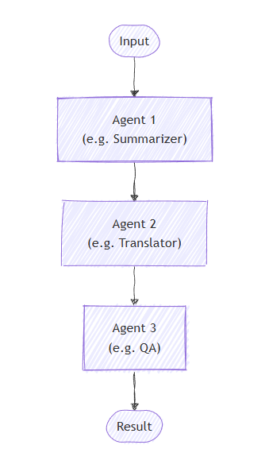
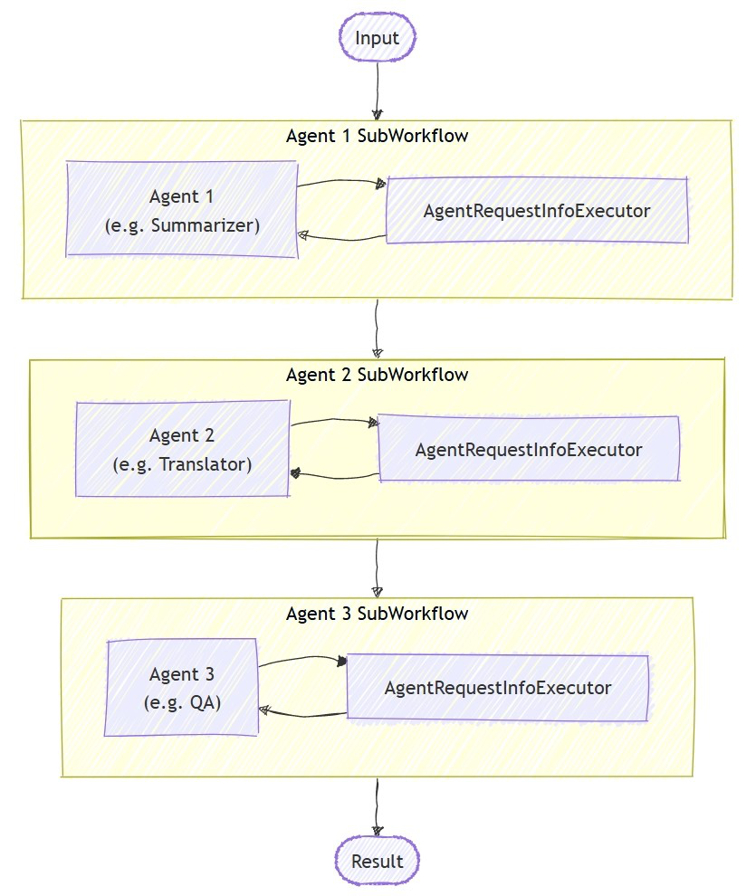

<!--
  Language parity table – keep in sync when adding/removing sections.

    | Section                                       | C# | Python | Go | Notes           |
    |-----------------------------------------------|:--:|:------:|:--:|-----------------|
    | Set Up the Azure OpenAI Client                | ✅ |   ✅   | ✅ |                 |
    | Define Your Agents                            | ✅ |   ✅   | ✅ |                 |
    | Set Up the Sequential Orchestration           | ✅ |   ✅   | ✅ |                 |
    | Run the Sequential Workflow                   | ✅ |   ✅   | ✅ |                 |
    | Sample Output                                 | ✅ |   ✅   | ✅ |                 |
    | Sequential with Human-in-the-Loop             | ✅ |   ✅   | ✅ | Python adds a request-info feedback step; C# covers tool approval and links to Handoff for interactive HITL |
    | Advanced: Mixing Agents with Custom Executors | ❌ |   ✅   | ✅ | Python/Go-specific |
    | Controlling Context Between Agents             | ❌ |   ✅   | ✅ | Python/Go-specific |
    | Intermediate Outputs                           | ❌ |   ✅   | ✅ | Python/Go-specific |
    | Key Concepts                                  | ✅ |   ✅   | ✅ |                 |
-->

# Microsoft Agent Framework Workflows Orchestrations - Sequential

In sequential orchestration, agents are organized in a pipeline. Each agent processes the task in turn, passing its output to the next agent in the sequence. This is ideal for workflows where each step builds upon the previous one, such as document review, data processing pipelines, or multi-stage reasoning.

<p align="center">
    
</p>

> [!IMPORTANT]
> By default, each agent in the sequence consumes the previous agent's full conversation — both the input messages provided to the previous agent and its response messages. You can configure agents to consume only the previous agent's response messages instead. See [Controlling Context Between Agents](#controlling-context-between-agents) for details.

## What You'll Learn

- How to create a sequential pipeline of agents
- How to chain agents where each builds upon the previous output
- How to add human-in-the-loop approval for sensitive tool calls
- How to mix agents with custom executors for specialized tasks
- How to track the conversation flow through the pipeline

## Define Your Agents

::: zone pivot="programming-language-csharp"

In sequential orchestration, agents are organized in a pipeline where each agent processes the task in turn, passing output to the next agent in the sequence.

## Set Up the Azure OpenAI Client

```csharp
using System;
using System.Collections.Generic;
using System.Linq;
using System.Threading.Tasks;
using Azure.AI.Projects;
using Azure.Identity;
using Microsoft.Agents.AI.Workflows;
using Microsoft.Extensions.AI;
using Microsoft.Agents.AI;

// 1) Set up the Azure OpenAI client
var endpoint = Environment.GetEnvironmentVariable("AZURE_OPENAI_ENDPOINT") ??
    throw new InvalidOperationException("AZURE_OPENAI_ENDPOINT is not set.");
var deploymentName = Environment.GetEnvironmentVariable("AZURE_OPENAI_DEPLOYMENT_NAME") ?? "gpt-4o-mini";
var client = new AIProjectClient(new Uri(endpoint), new DefaultAzureCredential())
    .GetProjectOpenAIClient()
    .GetProjectResponsesClient()
    .AsIChatClient(deploymentName);
```

> [!WARNING]
> `DefaultAzureCredential` is convenient for development but requires careful consideration in production. In production, consider using a specific credential (e.g., `ManagedIdentityCredential`) to avoid latency issues, unintended credential probing, and potential security risks from fallback mechanisms.

Create specialized agents that will work in sequence:

```csharp
// 2) Helper method to create translation agents
static ChatClientAgent GetTranslationAgent(string targetLanguage, IChatClient chatClient) =>
    new(chatClient,
        $"You are a translation assistant who only responds in {targetLanguage}. Respond to any " +
        $"input by outputting the name of the input language and then translating the input to {targetLanguage}.");

// Create translation agents for sequential processing
var translationAgents = (from lang in (string[])["French", "Spanish", "English"]
                         select GetTranslationAgent(lang, client));
```

## Set Up the Sequential Orchestration

Build the workflow using `AgentWorkflowBuilder`:

```csharp
// 3) Build sequential workflow
var workflow = AgentWorkflowBuilder.BuildSequential(translationAgents);
```

## Run the Sequential Workflow

Execute the workflow and process the events:

```csharp
// 4) Run the workflow
var messages = new List<ChatMessage> { new(ChatRole.User, "Hello, world!") };

await using StreamingRun run = await InProcessExecution.RunStreamingAsync(workflow, messages);
await run.TrySendMessageAsync(new TurnToken(emitEvents: true));

string? lastExecutorId = null;
List<ChatMessage> result = [];
await foreach (WorkflowEvent evt in run.WatchStreamAsync())
{
    if (evt is AgentResponseUpdateEvent e)
    {
        if (e.ExecutorId != lastExecutorId)
        {
            lastExecutorId = e.ExecutorId;
            Console.WriteLine();
            Console.Write($"{e.ExecutorId}: ");
        }

        Console.Write(e.Update.Text);
    }
    else if (evt is WorkflowOutputEvent outputEvt)
    {
        result = outputEvt.As<List<ChatMessage>>()!;
        break;
    }
}

// Display final result
Console.WriteLine();
foreach (var message in result)
{
    Console.WriteLine($"{message.Role}: {message.Text}");
}
```

## Sample Output

```plaintext
French_Translation: User: Hello, world!
French_Translation: Assistant: English detected. Bonjour, le monde !
Spanish_Translation: Assistant: French detected. ¡Hola, mundo!
English_Translation: Assistant: Spanish detected. Hello, world!
```

## Sequential Orchestration with Human-in-the-Loop

Sequential orchestrations support human-in-the-loop interactions through tool approval. When agents use tools wrapped with `ApprovalRequiredAIFunction`, the workflow pauses and emits a `RequestInfoEvent` containing a `ToolApprovalRequestContent`. External systems (such as a human operator) can inspect the tool call, approve or reject it, and the workflow resumes accordingly.

<p align="center">
    
</p>

> [!TIP]
> For more details on the request and response model, see [Human-in-the-Loop](../human-in-the-loop.md).

### Define Agents with Approval-Required Tools

Create agents where sensitive tools are wrapped with `ApprovalRequiredAIFunction`:

```csharp
ChatClientAgent deployAgent = new(
    client,
    "You are a DevOps engineer. Check staging status first, then deploy to production.",
    "DeployAgent",
    "Handles deployments",
    [
        AIFunctionFactory.Create(CheckStagingStatus),
        new ApprovalRequiredAIFunction(AIFunctionFactory.Create(DeployToProduction))
    ]);

ChatClientAgent verifyAgent = new(
    client,
    "You are a QA engineer. Verify that the deployment was successful and summarize the results.",
    "VerifyAgent",
    "Verifies deployments");
```

### Build and Run with Approval Handling

Build the sequential workflow normally. The approval flow is handled through the event stream:

```csharp
var workflow = AgentWorkflowBuilder.BuildSequential([deployAgent, verifyAgent]);

await foreach (WorkflowEvent evt in run.WatchStreamAsync())
{
    if (evt is RequestInfoEvent e &&
        e.Request.TryGetDataAs(out ToolApprovalRequestContent? approvalRequest))
    {
        await run.SendResponseAsync(
            e.Request.CreateResponse(approvalRequest.CreateResponse(approved: true)));
    }
}
```

> [!NOTE]
> `AgentWorkflowBuilder.BuildSequential()` supports tool approval out of the box — no additional configuration is needed. When an agent calls a tool wrapped with `ApprovalRequiredAIFunction`, the workflow automatically pauses and emits a `RequestInfoEvent`.

> [!TIP]
> For a complete runnable example of this approval flow, see the [`GroupChatToolApproval` sample](https://github.com/microsoft/agent-framework/tree/main/dotnet/samples/03-workflows/Agents/GroupChatToolApproval). The same `RequestInfoEvent` handling pattern applies to other orchestrations.

### Beyond Tool Approval: Interactive Feedback

Tool approval lets a human accept or reject a specific tool call, but a sequential orchestration does not include a built-in step to pause for free-form user feedback between agents, and it cannot return control to a previous agent. When an agent needs to interactively ask the user for more information and iterate before continuing; for example, collecting booking details before it calls a reservation tool; use one of the following approaches instead:

- **[Handoff orchestration](./handoff.md)** is interactive by default: when an agent responds without handing off, control returns to the user for the next input, enabling multi-turn back-and-forth within the orchestration. Restrict each agent to a single handoff target to approximate a sequential flow that still pauses for user input.
- A **custom workflow** built with `WorkflowBuilder` and a [`RequestPort`](../human-in-the-loop.md) lets you send a typed request to the user at any point and route the response back to an executor, which you can place before or after your agents in the pipeline.

## Key Concepts

- **Sequential Processing**: Each agent processes the output of the previous agent in order
- **AgentWorkflowBuilder.BuildSequential()**: Creates a pipeline workflow from a collection of agents
- **ChatClientAgent**: Represents an agent backed by a chat client with specific instructions
- **InProcessExecution.RunStreamingAsync()**: Runs the workflow and returns a `StreamingRun` for real-time event streaming
- **Event Handling**: Monitor agent progress through `AgentResponseUpdateEvent` and completion through `WorkflowOutputEvent`
- **Tool Approval**: Wrap sensitive tools with `ApprovalRequiredAIFunction` to require human approval before execution
- **RequestInfoEvent**: Emitted when a tool requires approval; contains `ToolApprovalRequestContent` with the tool call details
- **Interactive HITL**: Sequential orchestration covers tool approval; for interactive back-and-forth where an agent gathers more information from the user, use [handoff orchestration](./handoff.md) or a custom `RequestPort` workflow

::: zone-end

::: zone pivot="programming-language-python"

In sequential orchestration, each agent processes the task in turn, with output flowing from one to the next. Start by defining agents for a two-stage process:

```python
import os
from agent_framework.foundry import FoundryChatClient
from azure.identity import AzureCliCredential

# 1) Create agents using FoundryChatClient
chat_client = FoundryChatClient(
    project_endpoint=os.environ["FOUNDRY_PROJECT_ENDPOINT"],
    model=os.environ["FOUNDRY_MODEL"],
    credential=AzureCliCredential(),
)

writer = chat_client.as_agent(
    instructions=(
        "You are a concise copywriter. Provide a single, punchy marketing sentence based on the prompt."
    ),
    name="writer",
)

reviewer = chat_client.as_agent(
    instructions=(
        "You are a thoughtful reviewer. Give brief feedback on the previous assistant message."
    ),
    name="reviewer",
)
```

## Set Up the Sequential Orchestration

The `SequentialBuilder` class creates a pipeline where agents process tasks in order. Each agent sees the full conversation history and adds their response:

```python
from agent_framework.orchestrations import SequentialBuilder

# 2) Build sequential workflow: writer -> reviewer
workflow = SequentialBuilder(participants=[writer, reviewer]).build()
```

## Run the Sequential Workflow

Execute the workflow and collect the final output. The terminal output is an `AgentResponse` containing the last agent's response messages:

```python
from agent_framework import AgentResponse

# 3) Run and print the last agent's response
events = await workflow.run("Write a tagline for a budget-friendly eBike.")
outputs = events.get_outputs()

if outputs:
    print("===== Final Response =====")
    final: AgentResponse = outputs[0]
    for msg in final.messages:
        name = msg.author_name or "assistant"
        print(f"[{name}]\n{msg.text}")
```

## Sample Output

```plaintext
===== Final Response =====
[reviewer]
This tagline clearly communicates affordability and the benefit of extended travel, making it
appealing to budget-conscious consumers. It has a friendly and motivating tone, though it could
be slightly shorter for more punch. Overall, a strong and effective suggestion!
```

## Advanced: Mixing Agents with Custom Executors

Sequential orchestration supports mixing agents with custom executors for specialized processing. This is useful when you need custom logic that doesn't require an LLM:

### Define a Custom Executor

> [!NOTE]
> When a custom executor follows an agent in the sequence, its handler receives an `AgentExecutorResponse` (because agents are internally wrapped by `AgentExecutor`). Use `agent_response.full_conversation` to access the full conversation history. A custom executor used as the **last participant** (terminator) must call `ctx.yield_output(AgentResponse(...))` so its output becomes the workflow's terminal output.

```python
from agent_framework import AgentExecutorResponse, AgentResponse, Executor, WorkflowContext, handler
from agent_framework import Message
from typing_extensions import Never

class Summarizer(Executor):
    """Terminator custom executor: consumes full conversation and yields a summary as the workflow's final answer."""

    @handler
    async def summarize(
        self,
        agent_response: AgentExecutorResponse,
        ctx: WorkflowContext[Never, AgentResponse]
    ) -> None:
        if not agent_response.full_conversation:
            await ctx.yield_output(AgentResponse(messages=[Message("assistant", ["No conversation to summarize."])]))
            return

        users = sum(1 for m in agent_response.full_conversation if m.role == "user")
        assistants = sum(1 for m in agent_response.full_conversation if m.role == "assistant")
        summary = Message("assistant", [f"Summary -> users:{users} assistants:{assistants}"])
        await ctx.yield_output(AgentResponse(messages=[summary]))
```

### Build a Mixed Sequential Workflow

```python
# Create a content agent
content = chat_client.as_agent(
    instructions="Produce a concise paragraph answering the user's request.",
    name="content",
)

# Build sequential workflow: content -> summarizer
summarizer = Summarizer(id="summarizer")
workflow = SequentialBuilder(participants=[content, summarizer]).build()
```

### Sample Output with Custom Executor

```plaintext
===== Final Summary =====
Summary -> users:1 assistants:1
```

## Controlling Context Between Agents

By default, each agent in a `SequentialBuilder` workflow consumes the previous agent's full conversation (input + response messages). Setting `chain_only_agent_responses=True` configures all agents in the sequence to consume only the previous agent's response messages instead:

```python
workflow = SequentialBuilder(
    participants=[writer, translator, reviewer],
    chain_only_agent_responses=True,
).build()
```

This is useful for translation pipelines, progressive refinement, and other scenarios where each agent should focus solely on transforming the prior agent's output without being influenced by earlier conversation turns.

For a complete example, see [sequential_chain_only_agent_responses.py](https://github.com/microsoft/agent-framework/blob/main/python/samples/03-workflows/orchestrations/sequential_chain_only_agent_responses.py) in the Agent Framework repository.

> [!TIP]
> For more fine-grained control over context flow — including custom filter functions — see [Context Modes](../../concepts/workflows/advanced/agent-executor.md#context-modes) in the Agent Executor reference.

## Intermediate Outputs

By default, `SequentialBuilder` designates the **last participant** as the terminal output source (`output_from`). Only that participant's output surfaces as an `"output"` event.

To surface earlier participants' outputs as well, pass `intermediate_output_from` with the participants you want to designate as intermediate sources. This implicitly demotes those participants from the default-final set — they emit `"intermediate"` events instead of `"output"` events:

```python
workflow = SequentialBuilder(
    participants=[writer, reviewer, editor],
    intermediate_output_from=[writer, reviewer],
).build()
```

You can handle both `"intermediate"` and `"output"` events in real-time in streaming mode:

```python
from agent_framework import AgentResponseUpdate

# Track the last author to format streaming output.
last_author: str | None = None

async for event in workflow.run("Write a tagline for a budget-friendly eBike.", stream=True):
    if event.type in ("output", "intermediate") and isinstance(event.data, AgentResponseUpdate):
        update = event.data
        author = update.author_name
        if author != last_author:
            if last_author is not None:
                print()  # Newline between different authors
            label = "FINAL" if event.type == "output" else "intermediate"
            print(f"[{label}] {author}: {update.text}", end="", flush=True)
            last_author = author
        else:
            print(update.text, end="", flush=True)
```

## Sequential Orchestration with Human-in-the-Loop

Sequential orchestrations support human-in-the-loop interactions in two ways: **tool approval** for controlling sensitive tool calls, and **request info** for pausing after each agent response to gather feedback.

<p align="center">
    
</p>

> [!TIP]
> For more details on the request and response model, see [Human-in-the-Loop](../human-in-the-loop.md).

### Tool Approval in Sequential Workflows

Use `@tool(approval_mode="always_require")` to mark tools that need human approval before execution. The workflow pauses and emits a `request_info` event when the agent tries to call the tool.

```python
@tool(approval_mode="always_require")
def execute_database_query(query: str) -> str:
    return f"Query executed successfully: {query}"


database_agent = Agent(
    client=chat_client,
    name="DatabaseAgent",
    instructions="You are a database assistant.",
    tools=[execute_database_query],
)

workflow = SequentialBuilder(participants=[database_agent]).build()
```

Process the event stream and handle approval requests:

```python
async def process_event_stream(stream):
    responses = {}
    async for event in stream:
        if event.type == "request_info" and event.data.type == "function_approval_request":
            responses[event.request_id] = event.data.to_function_approval_response(approved=True)
    return responses if responses else None

stream = workflow.run("Check the schema and update all pending orders", stream=True)

pending_responses = await process_event_stream(stream)
while pending_responses is not None:
    stream = workflow.run(stream=True, responses=pending_responses)
    pending_responses = await process_event_stream(stream)
```

> [!TIP]
> For a complete runnable example, see [`sequential_builder_tool_approval.py`](https://github.com/microsoft/agent-framework/blob/main/python/samples/03-workflows/tool-approval/sequential_builder_tool_approval.py). Tool approval works with `SequentialBuilder` without any extra builder configuration.

### Request Info for Agent Feedback

Use `.with_request_info()` to pause after specific agents respond, allowing external input (such as human review) before the next agent begins:

```python
drafter = Agent(
    client=chat_client,
    name="drafter",
    instructions="You are a document drafter. Create a brief draft on the given topic.",
)

editor = Agent(
    client=chat_client,
    name="editor",
    instructions="You are an editor. Review and improve the draft. Incorporate any human feedback.",
)

finalizer = Agent(
    client=chat_client,
    name="finalizer",
    instructions="You are a finalizer. Create a polished final version.",
)

# Enable request info for the editor agent only
workflow = (
    SequentialBuilder(participants=[drafter, editor, finalizer])
    .with_request_info(agents=["editor"])
    .build()
)

async def process_event_stream(stream):
    responses = {}
    async for event in stream:
        if event.type == "request_info":
            responses[event.request_id] = AgentRequestInfoResponse.approve()
    return responses if responses else None

stream = workflow.run("Write a brief introduction to artificial intelligence.", stream=True)

pending_responses = await process_event_stream(stream)
while pending_responses is not None:
    stream = workflow.run(stream=True, responses=pending_responses)
    pending_responses = await process_event_stream(stream)
```

> [!TIP]
> See the full samples: [sequential tool approval](https://github.com/microsoft/agent-framework/blob/main/python/samples/03-workflows/tool-approval/sequential_builder_tool_approval.py) and [sequential request info](https://github.com/microsoft/agent-framework/blob/main/python/samples/03-workflows/human-in-the-loop/sequential_request_info.py).

## Key Concepts

- **Shared Context**: By default, each agent consumes the previous agent's full conversation, including input and response messages
- **Context Control**: Use `chain_only_agent_responses=True` to configure agents to consume only the previous agent's response messages
- **AgentResponse Output**: The workflow's terminal output is an `AgentResponse` containing the last agent's response (not the full conversation)
- **Order Matters**: Agents execute strictly in the order specified in the `participants` list
- **Flexible Participants**: You can mix agents and custom executors in any order
- **Custom Terminator Contract**: A custom executor used as the last participant must call `ctx.yield_output(AgentResponse(...))` to produce the terminal output
- **Intermediate Outputs**: Use `intermediate_output_from=[...]` or `intermediate_output_from="all_other"` to surface participant progress as intermediate workflow events, not just the last participant's terminal output
- **Tool Approval**: Use `@tool(approval_mode="always_require")` for sensitive operations that need human review
- **Request Info**: Use `.with_request_info(agents=[...])` to pause after specific agents for external feedback

::: zone-end

::: zone pivot="programming-language-go"

Go can build sequential agent workflows with `workflow/agentworkflow`. `NewSequentialWorkflowBuilder` hosts each agent as a workflow executor, connects them in order, and yields the final message batch as workflow output.

## Set Up Foundry Configuration

```go
endpoint := os.Getenv("FOUNDRY_PROJECT_ENDPOINT")
model := cmp.Or(os.Getenv("FOUNDRY_MODEL"), "gpt-4o-mini")

token, err := azidentity.NewDefaultAzureCredential(nil)
if err != nil {
    return err
}
```

> [!WARNING]
> `azidentity.NewDefaultAzureCredential` is convenient for development but requires careful consideration in production. In production, consider using a specific credential, such as `azidentity.NewManagedIdentityCredential`, to avoid latency issues, unintended credential probing, and potential security risks from fallback mechanisms.

## Define Your Go Agents

Create specialized agents that will work in sequence:

```go
newTranslationAgent := func(language string) *agent.Agent {
    return foundryprovider.NewAgent(
        endpoint,
        token,
        foundryprovider.ModelDeployment(model),
        foundryprovider.AgentConfig{
            Instructions: fmt.Sprintf(
                "You are a translation assistant who only responds in %s. Respond to any input by outputting the name of the input language and then translating the input to %s.",
                language,
                language,
            ),
            Config: agent.Config{Name: language},
        },
    )
}

frenchAgent := newTranslationAgent("French")
spanishAgent := newTranslationAgent("Spanish")
englishAgent := newTranslationAgent("English")
```

## Set Up the Sequential Orchestration

```go
wf, err := agentworkflow.NewSequentialWorkflowBuilder(
    frenchAgent,
    spanishAgent,
    englishAgent,
).
    WithName("translation-pipeline").
    Build()
if err != nil {
    return err
}
```

## Run the Sequential Workflow

Execute the workflow and process the output events:

```go
run, err := inproc.Default.RunStreaming(ctx, wf, []*message.Message{message.NewText("Hello, world!")})
if err != nil {
    return err
}
defer run.Close(ctx)

emitEvents := true
if err := run.SendMessage(ctx, workflow.TurnToken{EmitEvents: &emitEvents}); err != nil {
    return err
}

lastExecutorID := ""
for evt, err := range run.WatchStream(ctx) {
    if err != nil {
        return err
    }
    switch e := evt.(type) {
    case workflow.OutputEvent:
        switch value := e.Output.(type) {
        case *agent.ResponseUpdate:
            if e.ExecutorID != lastExecutorID {
                lastExecutorID = e.ExecutorID
                fmt.Printf("\n%s: ", e.ExecutorID)
            }
            fmt.Print(value.String())
        case []*message.Message:
            fmt.Println("\n===== Final Response =====")
            for _, msg := range value {
                fmt.Printf("%s: %s\n", msg.Role, msg.String())
            }
        }
    case workflow.ErrorEvent:
        return e.Error
    case workflow.ExecutorFailedEvent:
        return fmt.Errorf("executor %q failed: %w", e.ExecutorID, e.Error)
    }
}
```

## Sample Output

```plaintext
French: English detected. Bonjour, le monde !
Spanish: French detected. ¡Hola, mundo!
English: Spanish detected. Hello, world!

===== Final Response =====
assistant: Spanish detected. Hello, world!
```

## Sequential Orchestration with Human-in-the-Loop

Sequential workflows can pause for tool approval when a hosted agent uses an approval-required tool. Wrap the tool with `tool.ApprovalRequiredFunc`, then listen for `workflow.RequestInfoEvent` and respond with a `ToolApprovalResponseContent`.

### Define Agents with Approval-Required Tools

```go
deployAgent := foundryprovider.NewAgent(
    endpoint,
    token,
    foundryprovider.ModelDeployment(model),
    foundryprovider.AgentConfig{
        Instructions: "You are a DevOps engineer. Check staging status first, then deploy to production.",
        Config: agent.Config{
            Name:  "DeployAgent",
            Tools: []tool.Tool{tool.ApprovalRequiredFunc(deployTool)},
        },
    },
)

verifyAgent := foundryprovider.NewAgent(
    endpoint,
    token,
    foundryprovider.ModelDeployment(model),
    foundryprovider.AgentConfig{
        Instructions: "You are a QA engineer. Verify that the deployment was successful and summarize the results.",
        Config:      agent.Config{Name: "VerifyAgent"},
    },
)

wf, err := agentworkflow.NewSequentialWorkflowBuilder(deployAgent, verifyAgent).
    WithName("deployment-pipeline").
    Build()
if err != nil {
    return err
}
```

### Build and Run with Approval Handling

Handle approval requests in the event stream:

```go
for evt, err := range run.WatchStream(ctx) {
    if err != nil {
        return err
    }

    requestEvent, ok := evt.(workflow.RequestInfoEvent)
    if !ok {
        continue
    }

    requestContent, ok := requestEvent.Request.Data.As(reflect.TypeFor[*message.ToolApprovalRequestContent]())
    if !ok {
        continue
    }

    approvalRequest := requestContent.(*message.ToolApprovalRequestContent)
    response, err := requestEvent.Request.CreateResponse(approvalRequest.CreateResponse(true, "approved"))
    if err != nil {
        return err
    }

    if err := run.SendResponse(ctx, response); err != nil {
        return err
    }
}
```

## Advanced: Mixing Agents with Custom Executors

For mixed pipelines, host agents with `agentworkflow.New` and connect them to custom executors with `workflow.NewBuilder`:

```go
writer := agentworkflow.New(writerAgent, agentworkflow.Config{})

summarizer := workflow.NewExecutor("Summarizer", func(messages []*message.Message) string {
    return summarizeMessages(messages)
}).Bind()

wf, err := workflow.NewBuilder(writer).
    AddEdge(writer, summarizer).
    WithOutputFrom(summarizer).
    Build()
if err != nil {
    return err
}
```

## Controlling Context Between Agents

`NewSequentialWorkflowBuilder` uses the default hosted-agent configuration, where each downstream agent receives the previous agent's incoming messages and response messages. To chain only the previous agent responses, set `WithChainOnlyAgentResponses(true)`:

```go
wf, err := agentworkflow.NewSequentialWorkflowBuilder(frenchAgent, spanishAgent, englishAgent).
    WithChainOnlyAgentResponses(true).
    Build()
if err != nil {
    return err
}
```

## Intermediate Outputs

By default, `NewSequentialWorkflowBuilder` emits each participant's output as an intermediate workflow output and emits the final message batch as the terminal output. To explicitly select the participant outputs you want, combine `WithIntermediateOutputFrom` and `WithOutputFrom`:

```go
wf, err := agentworkflow.NewSequentialWorkflowBuilder(frenchAgent, spanishAgent, englishAgent).
    WithIntermediateOutputFrom(frenchAgent, spanishAgent).
    WithOutputFrom(englishAgent).
    Build()
if err != nil {
    return err
}
```

Use `OutputEvent.IsIntermediate()` to distinguish intermediate participant outputs from terminal outputs.

## Key Concepts

- **Sequential Processing**: Each agent or executor processes the output of the previous step in order.
- **agentworkflow.NewSequentialWorkflowBuilder()**: Creates a pipeline workflow from a collection of agents.
- **Hosted Agents**: `agentworkflow.New` exposes agent configuration options for message forwarding, role reassignment, update events, and request interception.
- **Custom Executors**: Manual `workflow.NewBuilder` pipelines can mix hosted agents and deterministic executors.
- **Tool Approval**: Approval-required tools pause the workflow and emit `RequestInfoEvent` values containing `ToolApprovalRequestContent`.
- **Intermediate Outputs**: `WithIntermediateOutputFrom` marks selected participant outputs with `workflow.OutputTagIntermediate`.

> [!TIP]
> See the [agent workflow patterns sample](https://github.com/microsoft/agent-framework-go/blob/main/examples/03-workflows/01-start-here/03_agent_workflow_patterns/main.go) and [agents in workflows sample](https://github.com/microsoft/agent-framework-go/blob/main/examples/03-workflows/01-start-here/02_agents_in_workflows/main.go) for complete runnable sequential workflows.

::: zone-end
## Next steps

> [!div class="nextstepaction"]
> [Concurrent Orchestration](concurrent.md)
