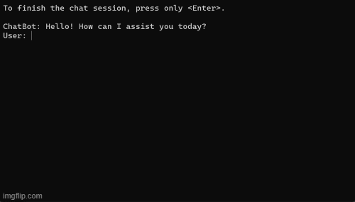

# Chat101: A begginer's chatbot

This sample runs a 101 level chat application with a large language model (LLM). The code demonstrates basic usage of the Semantic Kernel SDK and the importance of context in prompts.



# Requirements

You will need the following items to run the sample:

- [.NET 7.0 SDK](https://dotnet.microsoft.com/download/dotnet/7.0)
- AI service:

    | AI Service   | Requirement |
    | ------------ | ------------------------------------------------------------------------------ |
    | Azure OpenAI | - [Access](https://aka.ms/oai/access)<br>- [Resource](https://learn.microsoft.com/azure/ai-services/openai/how-to/create-resource?pivots=web-portal#create-a-resource)<br>- [Endpoint](https://learn.microsoft.com/azure/ai-services/openai/tutorials/embeddings?tabs=command-line#retrieve-key-and-endpoint)<br>- [API key](https://learn.microsoft.com/azure/ai-services/openai/tutorials/embeddings?tabs=command-line#retrieve-key-and-endpoint)<br>- [Deployment name](https://learn.microsoft.com/azure/ai-services/openai/how-to/create-resource?pivots=web-portal#deploy-a-model) of a [validated chat model](../ChatModels.md)<br> |
    | OpenAI       | - [Account](https://platform.openai.com)<br>- [API key](https://platform.openai.com/account/api-keys)<br>- Model name of a [validated chat model](../ChatModels.md)<br> |

> **IMPORTANT:** This sample is for educational purposes only and is not recommended for production deployments.

> **IMPORTANT:** Each chat interaction will call Azure OpenAI/OpenAI which will use tokens that you may be billed for.

# Instructions

## Configure the application

1. Open `appsettings.json`.
2. Update the `Service` fields:

    **AzureOpenAI**

    ```json
    "Service":
    {
        "Type": "AzureOpenAI",
        "AzureOpenAI":
        {
            "ChatModelDeploymentName": "<chat-model-deployment-name>",
            "Endpoint": "https://<fill-in>.openai.azure.com/"
        }
    }
    ```

    **OpenAI**

    ```json
    "Service":
    {
        "Type": "OpenAI",
        "OpenAI":
        {
            "ChatModelName": "<chat-model-name>"
        }
    }
    ```

3. On the command line, set your API Key:

    **AzureOpenAI**

    ```powershell
    dotnet user-secrets set "Service:AzureOpenAI:APIKey" "<my-azureopenai-apikey>"
    ```

    **OpenAI**
    ```powershell
    dotnet user-secrets set "Service:OpenAI:APIKey" "<my-openai-apikey>"
    ```


### (OPTIONAL) .NET Secret Manager to run all samples
If you would like to run all the samples using one configuration, you can use the .NET [Secret Manager](https://learn.microsoft.com/en-us/aspnet/core/security/app-secrets).

<details><summary><i>Instructions</i></summary>
<p>

On the command line, run:

**AzureOpenAI** 

```powershell
dotnet user-secrets set "Service:Type" "AzureOpenAI"
dotnet user-secrets set "Service:AzureOpenAI:ChatModelDeploymentName" "<chat-model-deployment-name>"
dotnet user-secrets set "Service:AzureOpenAI:Endpoint" "https://<fill-in>.openai.azure.com/"
dotnet user-secrets set "Service:AzureOpenAI:APIKey" "<my-azureopenai-apikey>"
```

**OpenAI**
    
```powershell
dotnet user-secrets set "Service:Type" "OpenAI"
dotnet user-secrets set "Service:OpenAI:ChatModelName" "<chat-model-name>"
dotnet user-secrets set "Service:OpenAI:APIKey" "<my-openai-apikey>"
```
</p>
</details>


## Run the application

- Run the default application (with context).
   
   - **Visual Studio:** 
     - Open `Chat101.sln`. 
     - Press `F5`.
   - **VS Code:** 
     - Open `Chat101/` as its own workspace. 
     - Press `F5`.
   - **Command line:** 
     - Enter `Chat101/`. 
     - Run `dotnet run`.

- Run the application without context.
  
  1. Open `appsettings.json`.
  2. Set `UseContext` to `false`:

        ```json
        "Application":
        {
            "UseContext": false
        }
        ```

  3. Run the application (see above).

# Check out our other repos!

If you would like to learn more about Semantic Kernel and AI, you may also be interested in other repos the Semantic Kernel team supports:

| Repo                                                                              | Description                                                                                      |
| --------------------------------------------------------------------------------- | ------------------------------------------------------------------------------------------------ |
| [Semantic Kernel](https://github.com/microsoft/semantic-kernel)                   | A lightweight SDK that integrates cutting-edge LLM technology quickly and easily into your apps. |
| [Semantic Kernel Docs](https://github.com/MicrosoftDocs/semantic-kernel-docs)     | The home for Semantic Kernel documentation that appears on the Microsoft learn site.             |
| [Semantic Kernel Starters](https://github.com/microsoft/semantic-kernel-starters) | Starter projects for Semantic Kernel to make it easier to get started.                           |
| [Semantic Memory](https://github.com/microsoft/semantic-memory)                   | A service that allows you to create pipelines for ingesting, storing, and querying knowledge.    |

## Join the community

We welcome your contributions! One of the easiest ways to participate is to engage in discussions in the GitHub repository.
Bug reports and fixes are welcome!

To learn more and get started:

- Read the [documentation](https://learn.microsoft.com/semantic-kernel/)
- Join the [Discord community](https://aka.ms/SKDiscord)
- [Contribute](CONTRIBUTING.md) to the project
- Follow the team on our [blog](https://aka.ms/sk/blog)

## Code of Conduct

This project has adopted the
[Microsoft Open Source Code of Conduct](https://opensource.microsoft.com/codeofconduct/).
For more information see the
[Code of Conduct FAQ](https://opensource.microsoft.com/codeofconduct/faq/)
or contact [opencode@microsoft.com](mailto:opencode@microsoft.com)
with any additional questions or comments.

## License

Copyright (c) Microsoft Corporation. All rights reserved.
