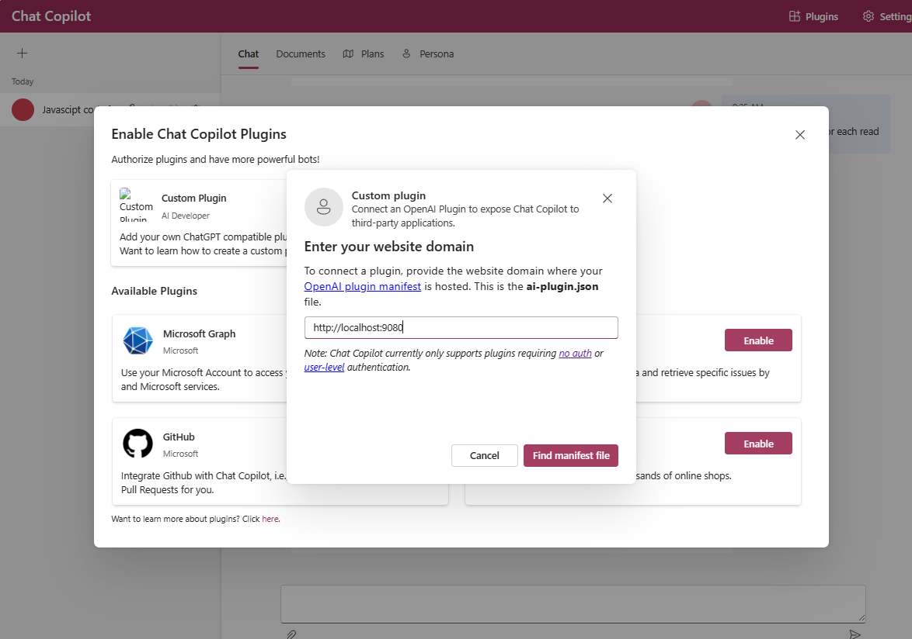

# OpenAi [Next.js] plugin starter

This project provides starter code to create a ChatGPT plugin. It includes the following components:

- An endpoint designed to provide a .well-known/ai-plugin.json file, enabling ChatGPT to identify the plugin.
- A tool that facilitates the generation of API specification files.
- The capability to add new native functions as endpoints within the plugin.
- A feature that allows for API testing directly on web pages and offers visual feedback by embedding it on the page.
- Integration with Adaptive Cards to facilitate testing of card representations and related functionalities. 
- TBD: A feature that can convert visual dynamic components into markdown format.
- TBD: A function to produce dynamic Open Graph images derived from web pages.
 
To learn more about using this starter, see the Semantic Kernel documentation that describes how to [create a ChatGPT plugin](https://learn.microsoft.com/en-us/semantic-kernel/ai-orchestration/chatgpt-plugins).

## Prerequisites 
* https://github.com/microsoft/chat-copilot 
* For this plugin 
    - [Node.js](https://nodejs.org/en)

## Learn More
- To learn more about Next.js, take a look at the following resources:
- [Next.js Documentation](https://nextjs.org/docs) - learn about Next.js features and API.
- [Learn Next.js](https://nextjs.org/learn) - an interactive Next.js tutorial.  
- [Semantic Kernel](https://github.com/microsoft/semantic-kernel)


## Getting Started with running plugin

First, run to install the packages and to genearte the open api swagger json
```bash
npm install 
# or
yarn install  
```

Once you have the APIs in place with appropriate @swagger comments added, run the command below to generate the Swagger JSON file, as per the OpenAPI specification. Make sure to follow the guidelines on adding comments from here. https://github.com/jellydn/next-swagger-doc 
Most importantly, the alignment as per the image is crucial; if not, it fails to generate the Swagger doc.

```
yarn next-swagger-doc-cli next-swagger-doc.json
```

First, run the development server:

```bash
npm run dev -p 9080
# or
yarn dev -p 9080
# or
pnpm dev -p 9080
```

Open below Url's with your browser to see the result.
[http://localhost:9080](http://localhost:9080) 
[http://localhost:9080/.well-known/ai-plugin.json](http://localhost:9080/.well-known/ai-plugin.json)
[http://localhost:9080/swagger.json](http://localhost:9080/swagger.json)


You can start editing the page by modifying `app/page.tsx`. The page auto-updates as you edit the file. 

## Once Your Plugin is Running, Ensure the Chat Copilot is Running
https://github.com/microsoft/chat-copilot  

Link the plugin by adding it to the custom plugin as demonstrated here


After it's linked and Enabled, you can pose questions to it
```
2 + 3
3 * 6 
What is 7 + 9
....
```