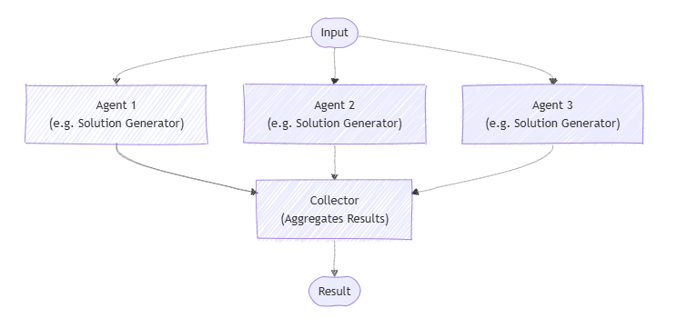

# Concurrent Orchestration

> [!IMPORTANT]
> Agent Orchestration features in the Agent Framework are in the experimental stage. They are under active development and may change significantly before advancing to the preview or release candidate stage.

Concurrent orchestration enables multiple agents to work on the same task in parallel. Each agent processes the input independently, and their results are collected and aggregated. This approach is well-suited for scenarios where diverse perspectives or solutions are valuable, such as brainstorming, ensemble reasoning, or voting systems.

To learn more about the pattern, such as when to use the pattern or when to avoid the pattern, see [Concurrent orchestration](/azure/architecture/ai-ml/guide/ai-agent-design-patterns#concurrent-orchestration).

## Common Use Cases

Multiple agents generate different solutions to a problem, and their responses are collected for further analysis or selection:



## What You'll Learn

- How to define multiple agents with different expertise
- How to orchestrate these agents to work concurrently on a single task
- How to collect and process the results

::: zone pivot="programming-language-csharp"

### Define Your Agents

Agents are specialized entities that can process tasks. Here, we define two agents: a physics expert and a chemistry expert.

> [!TIP]
> The [`ChatCompletionAgent`](../agent-types/chat-completion-agent.md) is used here, but you can use any [agent type](../agent-architecture.md#agent-types-in-semantic-kernel).

```csharp
using Microsoft.SemanticKernel;
using Microsoft.SemanticKernel.Agents;
using Microsoft.SemanticKernel.Agents.Orchestration;
using Microsoft.SemanticKernel.Agents.Orchestration.Concurrent;
using Microsoft.SemanticKernel.Agents.Runtime.InProcess;

// Create a kernel with an AI service
Kernel kernel = ...;

ChatCompletionAgent physicist = new ChatCompletionAgent{
    Name = "PhysicsExpert",
    Instructions = "You are an expert in physics. You answer questions from a physics perspective."
    Kernel = kernel,
};

ChatCompletionAgent chemist = new ChatCompletionAgent{
    Name = "ChemistryExpert",
    Instructions = "You are an expert in chemistry. You answer questions from a chemistry perspective."
    Kernel = kernel,
};
```

### Set Up the Concurrent Orchestration

The `ConcurrentOrchestration` class allows you to run multiple agents in parallel. You pass the list of agents as members.

```csharp
ConcurrentOrchestration orchestration = new (physicist, chemist);
```

### Start the Runtime

A runtime is required to manage the execution of agents. Here, we use `InProcessRuntime` and start it before invoking the orchestration.

```csharp
InProcessRuntime runtime = new InProcessRuntime();
await runtime.StartAsync();
```

### Invoke the Orchestration

You can now invoke the orchestration with a specific task. The orchestration will run all agents concurrently on the given task.

```csharp
var result = await orchestration.InvokeAsync("What is temperature?", runtime);
```

### Collect Results

The results from all agents can be collected asynchronously. Note that the order of results is not guaranteed.

```csharp
string[] output = await result.GetValueAsync(TimeSpan.FromSeconds(20));
Console.WriteLine($"# RESULT:\n{string.Join("\n\n", output.Select(text => $"{text}"))}");
```

### Optional: Stop the Runtime

After processing is complete, stop the runtime to clean up resources.

```csharp
await runtime.RunUntilIdleAsync();
```

### Sample Output

```plaintext
# RESULT:
Temperature is a fundamental physical quantity that measures the average kinetic energy ...

Temperature is a measure of the average kinetic energy of the particles ...
```

> [!TIP]
> The full sample code is available [here](https://github.com/microsoft/semantic-kernel/blob/main/dotnet/samples/GettingStartedWithAgents/Orchestration/Step01_Concurrent.cs)

::: zone-end

::: zone pivot="programming-language-python"

### Define Your Agents

Agents are specialized entities that can process tasks. Here, we define two agents: a physics expert and a chemistry expert.

> [!TIP]
> The [`ChatCompletionAgent`](./../agent-types/chat-completion-agent.md) is used here with Azure OpenAI, however, you can use any [agent type](./../agent-architecture.md#agent-types-in-semantic-kernel) or [model service](../../../concepts/ai-services/chat-completion/index.md).

```python
from semantic_kernel.agents import Agent, ChatCompletionAgent
from semantic_kernel.connectors.ai.open_ai import AzureChatCompletion

def get_agents() -> list[Agent]:
    physics_agent = ChatCompletionAgent(
        name="PhysicsExpert",
        instructions="You are an expert in physics. You answer questions from a physics perspective.",
        service=AzureChatCompletion(),
    )
    chemistry_agent = ChatCompletionAgent(
        name="ChemistryExpert",
        instructions="You are an expert in chemistry. You answer questions from a chemistry perspective.",
        service=AzureChatCompletion(),
    )
    return [physics_agent, chemistry_agent]
```

### Set Up the Concurrent Orchestration

The `ConcurrentOrchestration` class allows you to run multiple agents in parallel. You pass the list of agents as members.

```python
from semantic_kernel.agents import ConcurrentOrchestration

agents = get_agents()
concurrent_orchestration = ConcurrentOrchestration(members=agents)
```

### Start the Runtime

A runtime is required to manage the execution of agents. Here, we use `InProcessRuntime` and start it before invoking the orchestration.

```python
from semantic_kernel.agents.runtime import InProcessRuntime

runtime = InProcessRuntime()
runtime.start()
```

### Invoke the Orchestration

You can now invoke the orchestration with a specific task. The orchestration will run all agents concurrently on the given task.

```python
orchestration_result = await concurrent_orchestration.invoke(
    task="What is temperature?",
    runtime=runtime,
)
```

### Collect Results

The results from all agents can be collected asynchronously. Note that the order of results is not guaranteed.

```python
value = await orchestration_result.get(timeout=20)
# For the concurrent orchestration, the result is a list of chat messages
for item in value:
    print(f"# {item.name}: {item.content}")
```

### Optional: Stop the Runtime

After processing is complete, stop the runtime to clean up resources.

```python
await runtime.stop_when_idle()
```

### Sample Output

```plaintext
# PhysicsExpert: Temperature is a physical quantity that represents the average kinetic energy of the particles in a substance...
# ChemistryExpert: Temperature is a fundamental concept in chemistry and physics, representing a measure of the average kinetic energy...
```

> [!TIP]
> The full sample code is available [here](https://github.com/microsoft/semantic-kernel/blob/main/python/samples/getting_started_with_agents/multi_agent_orchestration/step1_concurrent.py).

::: zone-end

::: zone pivot="programming-language-java"

> [!NOTE]
> Agent orchestration is not yet available in Java SDK.

::: zone-end

## Next steps

> [!div class="nextstepaction"]
> [Sequential Orchestration](./sequential.md)
