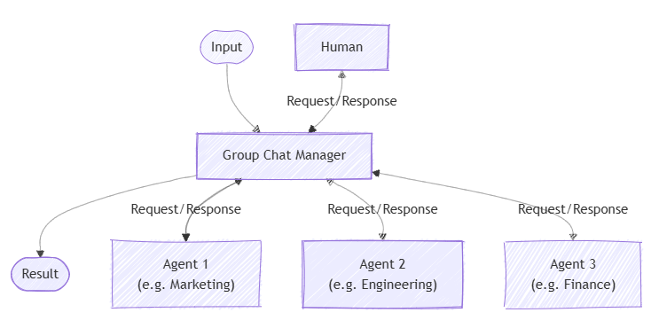

# Group Chat Orchestration

> [!IMPORTANT]
> Agent Orchestration features in the Agent Framework are in the experimental stage. They are under active development and may change significantly before advancing to the preview or release candidate stage.

Group chat orchestration models a collaborative conversation among agents, optionally including a human participant. A group chat manager coordinates the flow, determining which agent should respond next and when to request human input. This pattern is powerful for simulating meetings, debates, or collaborative problem-solving sessions.

## Common Use Cases

Agents representing different departments discuss a business proposal, with a manager agent moderating the conversation and involving a human when needed:



## What You'll Learn

- How to define agents with different roles for a group chat
- How to use a group chat manager to control the flow of conversation
- How to involve a human participant in the conversation
- How to observe the conversation and collect the final result

::: zone pivot="programming-language-csharp"

### Define Your Agents

Each agent in the group chat has a specific role. In this example, we define a copywriter and a reviewer.

> [!TIP]
> The [`ChatCompletionAgent`](../agent-types/chat-completion-agent.md) is used here, but you can use any [agent type](../agent-architecture.md#agent-types-in-semantic-kernel).

```csharp
using Microsoft.SemanticKernel;
using Microsoft.SemanticKernel.Agents;
using Microsoft.SemanticKernel.Agents.Orchestration;
using Microsoft.SemanticKernel.Agents.Orchestration.GroupChat;
using Microsoft.SemanticKernel.Agents.Runtime.InProcess;

// Create a kernel with an AI service
Kernel kernel = ...;

ChatCompletionAgent writer = new ChatCompletionAgent {
    Name = "CopyWriter",
    Description = "A copy writer",
    Instructions = "You are a copywriter with ten years of experience and are known for brevity and a dry humor. The goal is to refine and decide on the single best copy as an expert in the field. Only provide a single proposal per response. You're laser focused on the goal at hand. Don't waste time with chit chat. Consider suggestions when refining an idea.",
    Kernel = kernel,
};

ChatCompletionAgent editor = new ChatCompletionAgent {
    Name = "Reviewer",
    Description = "An editor.",
    Instructions = "You are an art director who has opinions about copywriting born of a love for David Ogilvy. The goal is to determine if the given copy is acceptable to print. If so, state that it is approved. If not, provide insight on how to refine suggested copy without example.",
    Kernel = kernel,
};
```

### Optional: Observe Agent Responses

You can create a callback to capture agent responses as the sequence progresses via the `ResponseCallback` property.

```csharp
ChatHistory history = [];

ValueTask responseCallback(ChatMessageContent response)
{
    history.Add(response);
    return ValueTask.CompletedTask;
}
```

### Set Up the Group Chat Orchestration

Create a `GroupChatOrchestration` object, passing in the agents, a group chat manager (here, a `RoundRobinGroupChatManager`), and the response callback. The manager controls the flow—here, it alternates turns in a round-robin fashion for a set number of rounds.

```csharp
GroupChatOrchestration orchestration = new GroupChatOrchestration(
    new RoundRobinGroupChatManager { MaximumInvocationCount = 5 },
    writer,
    editor)
{
    ResponseCallback = responseCallback,
};
```

### Start the Runtime

A runtime is required to manage the execution of agents. Here, we use `InProcessRuntime` and start it before invoking the orchestration.

```csharp
InProcessRuntime runtime = new InProcessRuntime();
await runtime.StartAsync();
```

### Invoke the Orchestration

Invoke the orchestration with your initial task (e.g., "Create a slogan for a new electric SUV..."). The agents will take turns responding, refining the result.

```csharp
var result = await orchestration.InvokeAsync(
    "Create a slogan for a new electric SUV that is affordable and fun to drive.",
    runtime);
```

### Collect Results

Wait for the orchestration to complete and retrieve the final output.

```csharp
string output = await result.GetValueAsync(TimeSpan.FromSeconds(60));
Console.WriteLine($"\n# RESULT: {text}");
Console.WriteLine("\n\nORCHESTRATION HISTORY");
foreach (ChatMessageContent message in history)
{
    this.WriteAgentChatMessage(message);
}
```

### Optional: Stop the Runtime

After processing is complete, stop the runtime to clean up resources.

```csharp
await runtime.RunUntilIdleAsync();
```

### Sample Output

```plaintext
# RESULT: “Affordable Adventure: Drive Electric, Drive Fun.”


ORCHESTRATION HISTORY

# Assistant - CopyWriter: “Charge Ahead: Affordable Thrills, Zero Emissions.”

# Assistant - Reviewer: The slogan is catchy but it could be refined to better ...

# Assistant - CopyWriter: “Electrify Your Drive: Fun Meets Affordability.”

# Assistant - Reviewer: The slogan captures the essence of electric driving and ...

# Assistant - CopyWriter: “Affordable Adventure: Drive Electric, Drive Fun.”
```

> [!TIP]
> The full sample code is available [here](https://github.com/microsoft/semantic-kernel/blob/main/dotnet/samples/GettingStartedWithAgents/Orchestration/Step03_GroupChat.cs)

::: zone-end

::: zone pivot="programming-language-python"

### Define Your Agents

Each agent in the group chat has a specific role. In this example:

- Writer: Creates and edits content based on feedback.
- Reviewer: Reviews content and provides feedback for improvement.

> [!TIP]
> The [`ChatCompletionAgent`](./../agent-types/chat-completion-agent.md) is used here with Azure OpenAI, however, you can use any [agent type](./../agent-architecture.md#agent-types-in-semantic-kernel) or [model service](../../../concepts/ai-services/chat-completion/index.md).

```python
from semantic_kernel.agents import Agent, ChatCompletionAgent
from semantic_kernel.connectors.ai.open_ai import AzureChatCompletion

def get_agents() -> list[Agent]:
    writer = ChatCompletionAgent(
        name="Writer",
        description="A content writer.",
        instructions=(
            "You are an excellent content writer. You create new content and edit contents based on the feedback."
        ),
        service=AzureChatCompletion(),
    )
    reviewer = ChatCompletionAgent(
        name="Reviewer",
        description="A content reviewer.",
        instructions=(
            "You are an excellent content reviewer. You review the content and provide feedback to the writer."
        ),
        service=AzureChatCompletion(),
    )
    return [writer, reviewer]
```

### Observe Agent Responses

You can define a callback to print each agent's message as the conversation progresses.

```python
from semantic_kernel.contents import ChatMessageContent

def agent_response_callback(message: ChatMessageContent) -> None:
    print(f"**{message.name}**\n{message.content}")
```

### Set Up the Group Chat Orchestration

Create a `GroupChatOrchestration` object, passing in the agents, a group chat manager (in this case a `RoundRobinGroupChatManager`), and the response callback. The manager controls the flow—here, it alternates turns in a round-robin fashion for a set number of rounds.

```python
from semantic_kernel.agents import GroupChatOrchestration, RoundRobinGroupChatManager

agents = get_agents()
group_chat_orchestration = GroupChatOrchestration(
    members=agents,
    manager=RoundRobinGroupChatManager(max_rounds=5),  # Odd number so writer gets the last word
    agent_response_callback=agent_response_callback,
)
```

### Start the Runtime

Start the runtime to manage agent execution.

```python
from semantic_kernel.agents.runtime import InProcessRuntime

runtime = InProcessRuntime()
runtime.start()
```

### Invoke the Orchestration

Invoke the orchestration with your initial task (e.g., "Create a slogan for a new electric SUV..."). The agents will take turns responding, refining the result.

```python
orchestration_result = await group_chat_orchestration.invoke(
    task="Create a slogan for a new electric SUV that is affordable and fun to drive.",
    runtime=runtime,
)
```

### Collect Results

Wait for the orchestration to complete.

```python
value = await orchestration_result.get()
print(f"***** Final Result *****\n{value}")
```

### Optional: Stop the Runtime

After processing is complete, stop the runtime to clean up resources.

```python
await runtime.stop_when_idle()
```

### Sample Output

```plaintext
**Writer**
"Drive Tomorrow: Affordable Adventure Starts Today!"
**Reviewer**
This slogan, "Drive Tomorrow: Affordable Adventure Starts Today!", effectively communicates the core attributes...
**Writer**
"Embrace the Future: Your Affordable Electric Adventure Awaits!"
**Reviewer**
This revised slogan, "Embrace the Future: Your Affordable Electric Adventure Awaits!", further enhances the message...
**Writer**
"Feel the Charge: Adventure Meets Affordability in Your New Electric SUV!"
***** Result *****
"Feel the Charge: Adventure Meets Affordability in Your New Electric SUV!"
```

> [!TIP]
> The full sample code is available [here](https://github.com/microsoft/semantic-kernel/blob/main/python/samples/getting_started_with_agents/multi_agent_orchestration/step3_group_chat.py).

::: zone-end

::: zone pivot="programming-language-java"

> [!NOTE]
> Agent orchestration is not yet available in Java SDK.

::: zone-end

### Customize the Group Chat Manager

::: zone pivot="programming-language-csharp"

You can customize the group chat flow by implementing your own `GroupChatManager`. This allows you to control how results are filtered, how the next agent is selected, and when to request user input or terminate the chat.

For example, you can create a custom manager by inheriting from `GroupChatManager` and overriding its abstract methods:

```csharp
using Microsoft.SemanticKernel.Agents.Orchestration.GroupChat;
using Microsoft.SemanticKernel.ChatCompletion;
using System.Threading;
using System.Threading.Tasks;

public class CustomGroupChatManager : GroupChatManager
{
    public override ValueTask<GroupChatManagerResult<string>> FilterResults(ChatHistory history, CancellationToken cancellationToken = default)
    {
        // Custom logic to filter or summarize chat results
        return ValueTask.FromResult(new GroupChatManagerResult<string>("Summary") { Reason = "Custom summary logic." });
    }

    public override ValueTask<GroupChatManagerResult<string>> SelectNextAgent(ChatHistory history, GroupChatTeam team, CancellationToken cancellationToken = default)
    {
        // Randomly select an agent from the team
        var random = new Random();
        int index = random.Next(team.Members.Count);
        string nextAgent = team.Members[index].Id;
        return ValueTask.FromResult(new GroupChatManagerResult<string>(nextAgent) { Reason = "Custom selection logic." });
    }

    public override ValueTask<GroupChatManagerResult<bool>> ShouldRequestUserInput(ChatHistory history, CancellationToken cancellationToken = default)
    {
        // Custom logic to decide if user input is needed
        return ValueTask.FromResult(new GroupChatManagerResult<bool>(false) { Reason = "No user input required." });
    }

    public override ValueTask<GroupChatManagerResult<bool>> ShouldTerminate(ChatHistory history, CancellationToken cancellationToken = default)
    {
        // Optionally call the base implementation to check for default termination logic
        var baseResult = base.ShouldTerminate(history, cancellationToken).Result;
        if (baseResult.Value)
        {
            // If the base logic says to terminate, respect it
            return ValueTask.FromResult(baseResult);
        }

        // Custom logic to determine if the chat should terminate
        bool shouldEnd = history.Count > 10; // Example: end after 10 messages
        return ValueTask.FromResult(new GroupChatManagerResult<bool>(shouldEnd) { Reason = "Custom termination logic." });
    }
}
```

You can then use your custom manager in the orchestration:

```csharp
GroupChatOrchestration orchestration = new (new CustomGroupChatManager { MaximumInvocationCount = 5 }, ...);
```

> [!TIP]
> A complete example of a custom group chat manager is available [here](https://github.com/microsoft/semantic-kernel/blob/main/dotnet/samples/GettingStartedWithAgents/Orchestration/Step03b_GroupChatWithAIManager.cs)

::: zone-end

::: zone pivot="programming-language-python"

You can customize the group chat flow by implementing your own `GroupChatManager`. This allows you to control how results are filtered, how the next agent is selected, and when to request user input or terminate the chat.

For example, you can create a custom manager by inheriting from `GroupChatManager` and overriding its abstract methods:

```python
from semantic_kernel.agents import GroupChatManager, BooleanResult, StringResult, MessageResult
from semantic_kernel.contents import ChatMessageContent, ChatHistory

class CustomGroupChatManager(GroupChatManager):
    async def filter_results(self, chat_history: ChatHistory) -> MessageResult:
        # Custom logic to filter or summarize chat results
        summary = "Summary of the discussion."
        return MessageResult(result=ChatMessageContent(role="assistant", content=summary), reason="Custom summary logic.")

    async def select_next_agent(self, chat_history: ChatHistory, participant_descriptions: dict[str, str]) -> StringResult:
        # Randomly select an agent from the participants
        import random
        next_agent = random.choice(list(participant_descriptions.keys()))
        return StringResult(result=next_agent, reason="Custom selection logic.")

    async def should_request_user_input(self, chat_history: ChatHistory) -> BooleanResult:
        # Custom logic to decide if user input is needed
        return BooleanResult(result=False, reason="No user input required.")

    async def should_terminate(self, chat_history: ChatHistory) -> BooleanResult:
        # Optionally call the base implementation to check for default termination logic
        base_result = await super().should_terminate(chat_history)
        if base_result.result:
            return base_result
        # Custom logic to determine if the chat should terminate
        should_end = len(chat_history.messages) > 10  # Example: end after 10 messages
        return BooleanResult(result=should_end, reason="Custom termination logic.")
```

You can then use your custom manager in the orchestration:

```python
from semantic_kernel.agents import GroupChatOrchestration

group_chat_orchestration = GroupChatOrchestration(manager=CustomGroupChatManager(max_rounds=5), ...)
```

> [!TIP]
> A complete example of a custom group chat manager is available [here](https://github.com/microsoft/semantic-kernel/blob/main/python/samples/getting_started_with_agents/multi_agent_orchestration/step3b_group_chat_with_chat_completion_manager.py)

::: zone-end

::: zone pivot="programming-language-java"

> [!NOTE]
> Agent orchestration is not yet available in Java SDK.

::: zone-end

### Order of Group Chat Manager Function Calls

When orchestrating a group chat, the group chat manager's methods are called in a specific order for each round of the conversation:

1. **ShouldRequestUserInput**: Checks if user (human) input is required before the next agent speaks. If true, the orchestration pauses for user input. The user input is then added to the chat history of the manager and sent to all agents.
2. **ShouldTerminate**: Determines if the group chat should end (for example, if a maximum number of rounds is reached or a custom condition is met). If true, the orchestration proceeds to result filtering.
3. **FilterResults**: Called only if the chat is terminating, to summarize or process the final results of the conversation.
4. **SelectNextAgent**: If the chat is not terminating, selects the next agent to respond in the conversation.

This order ensures that user input and termination conditions are checked before advancing the conversation, and that results are filtered only at the end. You can customize the logic for each step by overriding the corresponding methods in your custom group chat manager.

## Next steps

> [!div class="nextstepaction"]
> [Handoff Orchestration](./handoff.md)
