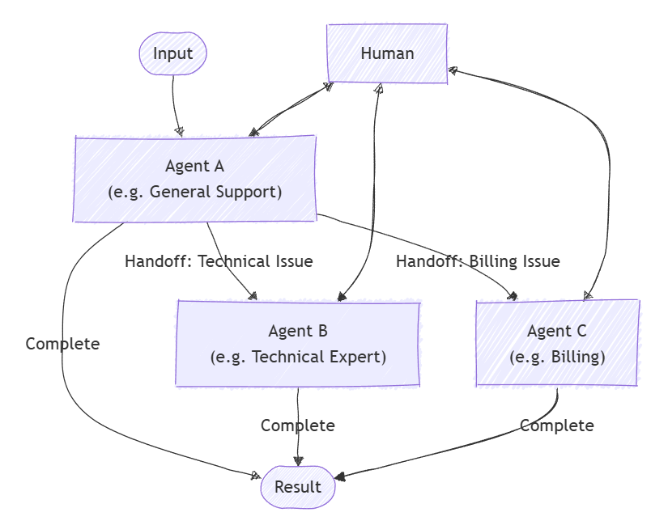

# Handoff Orchestration

> [!IMPORTANT]
> Agent Orchestrations are in the experimental stage. These patterns are under active development and may change significantly before advancing to the preview or release candidate stage.

Handoff orchestration allows agents to transfer control to one another based on the context or user request. Each agent can “handoff” the conversation to another agent with the appropriate expertise, ensuring that the right agent handles each part of the task. This is particularly useful in customer support, expert systems, or any scenario requiring dynamic delegation.

## Common Use Cases

A customer support agent handles a general inquiry, then hands off to a technical expert agent for troubleshooting, or to a billing agent if needed:



## What You'll Learn

- How to define agents and their handoff relationships
- How to set up a handoff orchestration for dynamic agent routing
- How to involve a human in the conversation loop

::: zone pivot="programming-language-csharp"

### Define Specialized Agents

Each agent is responsible for a specific area. In this example, we define a triage agent, a refund agent, an order status agent, and an order return agent. Some agents use plugins to handle specific tasks.

> [!TIP]
> The [`ChatCompletionAgent`](../agent-types/chat-completion-agent.md) is used here, but you can use any [agent type](../agent-architecture.md#agent-types-in-semantic-kernel).

```csharp
using Microsoft.SemanticKernel;
using Microsoft.SemanticKernel.Agents;
using Microsoft.SemanticKernel.Agents.Orchestration;
using Microsoft.SemanticKernel.Agents.Orchestration.Handoff;
using Microsoft.SemanticKernel.Agents.Runtime.InProcess;
using Microsoft.SemanticKernel.ChatCompletion;

// Plugin implementations
public sealed class OrderStatusPlugin {
    [KernelFunction]
    public string CheckOrderStatus(string orderId) => $"Order {orderId} is shipped and will arrive in 2-3 days.";
}
public sealed class OrderReturnPlugin {
    [KernelFunction]
    public string ProcessReturn(string orderId, string reason) => $"Return for order {orderId} has been processed successfully.";
}
public sealed class OrderRefundPlugin {
    [KernelFunction]
    public string ProcessReturn(string orderId, string reason) => $"Refund for order {orderId} has been processed successfully.";
}

// Helper function to create a kernel with chat completion
public static Kernel CreateKernelWithChatCompletion(...)
{
    ...
}

ChatCompletionAgent triageAgent = new ChatCompletionAgent {
    Name = "TriageAgent",
    Description = "Handle customer requests.",
    Instructions = "A customer support agent that triages issues.",
    Kernel = CreateKernelWithChatCompletion(...),
};

ChatCompletionAgent statusAgent = new ChatCompletionAgent {
    Name = "OrderStatusAgent",
    Description = "A customer support agent that checks order status.",
    Instructions = "Handle order status requests.",
    Kernel = CreateKernelWithChatCompletion(...),
};
statusAgent.Kernel.Plugins.Add(KernelPluginFactory.CreateFromObject(new OrderStatusPlugin()));

ChatCompletionAgent returnAgent = new ChatCompletionAgent {
    Name = "OrderReturnAgent",
    Description = "A customer support agent that handles order returns.",
    Instructions = "Handle order return requests.",
    Kernel = CreateKernelWithChatCompletion(...),
};
returnAgent.Kernel.Plugins.Add(KernelPluginFactory.CreateFromObject(new OrderReturnPlugin()));

ChatCompletionAgent refundAgent = new ChatCompletionAgent {
    Name = "OrderRefundAgent",
    Description = "A customer support agent that handles order refund.",
    Instructions = "Handle order refund requests.",
    Kernel = CreateKernelWithChatCompletion(...),
};
refundAgent.Kernel.Plugins.Add(KernelPluginFactory.CreateFromObject(new OrderRefundPlugin()));
```

### Set Up Handoff Relationships

Use `OrchestrationHandoffs` to specify which agent can hand off to which, and under what circumstances.

```csharp
var handoffs = OrchestrationHandoffs
    .StartWith(triageAgent)
    .Add(triageAgent, statusAgent, returnAgent, refundAgent)
    .Add(statusAgent, triageAgent, "Transfer to this agent if the issue is not status related")
    .Add(returnAgent, triageAgent, "Transfer to this agent if the issue is not return related")
    .Add(refundAgent, triageAgent, "Transfer to this agent if the issue is not refund related");
```

### Observe Agent Responses

You can create a callback to capture agent responses as the conversation progresses via the `ResponseCallback` property.

```csharp
ChatHistory history = [];

ValueTask responseCallback(ChatMessageContent response)
{
    history.Add(response);
    return ValueTask.CompletedTask;
}
```

### Human in the Loop

A key feature of handoff orchestration is the ability for a human to participate in the conversation. This is achieved by providing an `InteractiveCallback`, which is called whenever an agent needs input from the user. In a real application, this would prompt the user for input; in a sample, you can use a queue of responses.

```csharp
// Simulate user input with a queue
Queue<string> responses = new();
responses.Enqueue("I'd like to track the status of my order");
responses.Enqueue("My order ID is 123");
responses.Enqueue("I want to return another order of mine");
responses.Enqueue("Order ID 321");
responses.Enqueue("Broken item");
responses.Enqueue("No, bye");

ValueTask<ChatMessageContent> interactiveCallback()
{
    string input = responses.Dequeue();
    Console.WriteLine($"\n# INPUT: {input}\n");
    return ValueTask.FromResult(new ChatMessageContent(AuthorRole.User, input));
}
```

### Set Up the Handoff Orchestration

Create a `HandoffOrchestration` object, passing in the agents, handoff relationships, and the callbacks.

```csharp
HandoffOrchestration orchestration = new HandoffOrchestration(
    handoffs,
    triageAgent,
    statusAgent,
    returnAgent,
    refundAgent)
{
    InteractiveCallback = interactiveCallback,
    ResponseCallback = responseCallback,
};
```

### Start the Runtime

A runtime is required to manage the execution of agents. Here, we use `InProcessRuntime` and start it before invoking the orchestration.

```csharp
InProcessRuntime runtime = new InProcessRuntime();
await runtime.StartAsync();
```

### Invoke the Orchestration

Invoke the orchestration with your initial task (e.g., "I am a customer that needs help with my orders"). The agents will route the conversation as needed, involving the human when required.

```csharp
string task = "I am a customer that needs help with my orders";
var result = await orchestration.InvokeAsync(task, runtime);
```

### Collect Results

Wait for the orchestration to complete and retrieve the final output.

```csharp
string output = await result.GetValueAsync(TimeSpan.FromSeconds(300));
Console.WriteLine($"\n# RESULT: {output}");
Console.WriteLine("\n\nORCHESTRATION HISTORY");
foreach (ChatMessageContent message in history)
{
    // Print each message
    Console.WriteLine($"# {message.Role} - {message.AuthorName}: {message.Content}");
}
```

### Optional: Stop the Runtime

After processing is complete, stop the runtime to clean up resources.

```csharp
await runtime.RunUntilIdleAsync();
```

### Sample Output

```plaintext
# RESULT: Handled order return for order ID 321 due to a broken item, and successfully processed the return.

ORCHESTRATION HISTORY

# Assistant - TriageAgent: Could you please specify what kind of help you need with your orders? Are you looking to check the order status, return an item, or request a refund?

# Assistant - OrderStatusAgent: Could you please tell me your order ID?

# Assistant - OrderStatusAgent: Your order with ID 123 has been shipped and will arrive in 2-3 days. Anything else I can assist you with?

# Assistant - OrderReturnAgent: I can help you with that. Could you please provide the order ID and the reason you'd like to return it?

# Assistant - OrderReturnAgent: Please provide the reason for returning the order with ID 321.

# Assistant - OrderReturnAgent: The return for your order with ID 321 has been successfully processed due to the broken item. Anything else I can assist you with?
```

> [!TIP]
> The full sample code is available [here](https://github.com/microsoft/semantic-kernel/blob/main/dotnet/samples/GettingStartedWithAgents/Orchestration/Step04_Handoff.cs)

::: zone-end

::: zone pivot="programming-language-python"

### Define Specialized Agents

Each agent is responsible for a specific area. For example:

- TriageAgent: Handles initial customer requests and decides which specialist to involve.
- RefundAgent: Handles refund requests.
- OrderStatusAgent: Checks order status.
- OrderReturnAgent: Handles order returns.

#### Plugins

First we need to define the plugins that will be used in the agents. These plugins will contain the logic for handling specific tasks.

```python
from semantic_kernel.functions import kernel_function

class OrderStatusPlugin:
    @kernel_function
    def check_order_status(self, order_id: str) -> str:
        """Check the status of an order."""
        # Simulate checking the order status
        return f"Order {order_id} is shipped and will arrive in 2-3 days."


class OrderRefundPlugin:
    @kernel_function
    def process_refund(self, order_id: str, reason: str) -> str:
        """Process a refund for an order."""
        # Simulate processing a refund
        print(f"Processing refund for order {order_id} due to: {reason}")
        return f"Refund for order {order_id} has been processed successfully."


class OrderReturnPlugin:
    @kernel_function
    def process_return(self, order_id: str, reason: str) -> str:
        """Process a return for an order."""
        # Simulate processing a return
        print(f"Processing return for order {order_id} due to: {reason}")
        return f"Return for order {order_id} has been processed successfully."
```

#### Agents

Next, we define the agents that will use these plugins.

> [!TIP]
> The [`ChatCompletionAgent`](./../agent-types/chat-completion-agent.md) is used here with Azure OpenAI, however, you can use any [agent type](./../agent-architecture.md#agent-types-in-semantic-kernel) or [model service](../../../concepts/ai-services/chat-completion/index.md).

```python
from semantic_kernel.agents import ChatCompletionAgent
from semantic_kernel.connectors.ai.open_ai import OpenAIChatCompletion

support_agent = ChatCompletionAgent(
    name="TriageAgent",
    description="A customer support agent that triages issues.",
    instructions="Handle customer requests.",
    service=OpenAIChatCompletion(),
)

refund_agent = ChatCompletionAgent(
    name="RefundAgent",
    description="A customer support agent that handles refunds.",
    instructions="Handle refund requests.",
    service=OpenAIChatCompletion(),
    plugins=[OrderRefundPlugin()],
)

order_status_agent = ChatCompletionAgent(
    name="OrderStatusAgent",
    description="A customer support agent that checks order status.",
    instructions="Handle order status requests.",
    service=OpenAIChatCompletion(),
    plugins=[OrderStatusPlugin()],
)

order_return_agent = ChatCompletionAgent(
    name="OrderReturnAgent",
    description="A customer support agent that handles order returns.",
    instructions="Handle order return requests.",
    service=OpenAIChatCompletion(),
    plugins=[OrderReturnPlugin()],
)
```

### Define Handoff Relationships

Use `OrchestrationHandoffs` to specify which agent can hand off to which, and under what circumstances.

```python
from semantic_kernel.agents import OrchestrationHandoffs

handoffs = (
    OrchestrationHandoffs()
    .add_many(    # Use add_many to add multiple handoffs to the same source agent at once
        source_agent=support_agent.name,
        target_agents={
            refund_agent.name: "Transfer to this agent if the issue is refund related",
            order_status_agent.name: "Transfer to this agent if the issue is order status related",
            order_return_agent.name: "Transfer to this agent if the issue is order return related",
        },
    )
    .add(    # Use add to add a single handoff
        source_agent=refund_agent.name,
        target_agent=support_agent.name,
        description="Transfer to this agent if the issue is not refund related",
    )
    .add(
        source_agent=order_status_agent.name,
        target_agent=support_agent.name,
        description="Transfer to this agent if the issue is not order status related",
    )
    .add(
        source_agent=order_return_agent.name,
        target_agent=support_agent.name,
        description="Transfer to this agent if the issue is not order return related",
    )
)
```

### Observe Agent Responses

You can define a callback to print each agent's message as the conversation progresses.

```python
from semantic_kernel.contents import ChatMessageContent

def agent_response_callback(message: ChatMessageContent) -> None:
    print(f"{message.name}: {message.content}")
```

### Human in the Loop

A key feature of handoff orchestration is the ability for a human to participate in the conversation. This is achieved by providing a `human_response_function` callback, which is called whenever an agent needs input from the user.

```python
from semantic_kernel.contents import AuthorRole, ChatMessageContent

def human_response_function() -> ChatMessageContent:
    user_input = input("User: ")
    return ChatMessageContent(role=AuthorRole.USER, content=user_input)
```

### Set Up the Handoff Orchestration

Create a `HandoffOrchestration` object, passing in the agents, handoff relationships, and the callbacks.

```python
from semantic_kernel.agents import HandoffOrchestration

handoff_orchestration = HandoffOrchestration(
    members=[
        support_agent,
        refund_agent,
        order_status_agent,
        order_return_agent,
    ],
    handoffs=handoffs,
    agent_response_callback=agent_response_callback,
    human_response_function=human_response_function,
)
```

### Start the Runtime

Start the runtime to manage agent execution.

```python
from semantic_kernel.agents.runtime import InProcessRuntime

runtime = InProcessRuntime()
runtime.start()
```

### Invoke the Orchestration

Invoke the orchestration with your initial task (e.g., "A customer is on the line."). The agents will route the conversation as needed, involving the human when required.

```python
orchestration_result = await handoff_orchestration.invoke(
    task="A customer is on the line.",
    runtime=runtime,
)
```

### Collect Results

Wait for the orchestration to complete.

```python
value = await orchestration_result.get()
print(value)
```

### Optional: Stop the Runtime

After processing is complete, stop the runtime to clean up resources.

```python
await runtime.stop_when_idle()
```

### Sample Output

```plaintext
TriageAgent: Hello! Thank you for reaching out. How can I assist you today?
User: I'd like to track the status of my order
OrderStatusAgent: Sure, I can help you with that. Could you please provide me with your order ID?
User: My order ID is 123
OrderStatusAgent: Your order with ID 123 has been shipped and is expected to arrive in 2-3 days. Is there anything else I can assist you with?
User: I want to return another order of mine
OrderReturnAgent: I can help you with returning your order. Could you please provide the order ID for the return and the reason you'd like to return it?
User: Order ID 321
OrderReturnAgent: Please provide the reason for returning the order with ID 321.
User: Broken item
OrderReturnAgent: The return for your order with ID 321 has been successfully processed due to the broken item. Is there anything else I can assist you with?
User: No, bye
Task is completed with summary: Handled order return for order ID 321 due to a broken item, and successfully processed the return.
```

> [!TIP]
> The full sample code is available [here](https://github.com/microsoft/semantic-kernel/blob/main/python/samples/getting_started_with_agents/multi_agent_orchestration/step4_handoff.py).

::: zone-end

::: zone pivot="programming-language-java"

> [!NOTE]
> Agent orchestration is not yet available in Java SDK.

::: zone-end

## Next steps

> [!div class="nextstepaction"]
> [Magentic Orchestration](./magentic.md)
