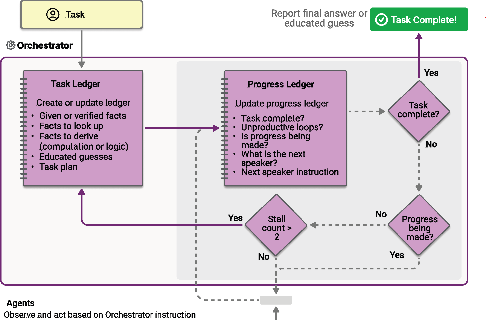

# Magentic Orchestration

> [!IMPORTANT]
> Agent Orchestration features in the Agent Framework are in the experimental stage. They are under active development and may change significantly before advancing to the preview or release candidate stage.

Magentic orchestration is designed based on the [Magentic-One](https://microsoft.github.io/autogen/stable/user-guide/agentchat-user-guide/magentic-one.html) system invented by AutoGen. It is a flexible, general-purpose multi-agent pattern designed for complex, open-ended tasks that require dynamic collaboration. In this pattern, a dedicated Magentic manager coordinates a team of specialized agents, selecting which agent should act next based on the evolving context, task progress, and agent capabilities.

The Magentic manager maintains a shared context, tracks progress, and adapts the workflow in real time. This enables the system to break down complex problems, delegate subtasks, and iteratively refine solutions through agent collaboration. The orchestration is especially well-suited for scenarios where the solution path is not known in advance and may require multiple rounds of reasoning, research, and computation.

> [!TIP]
> Read more about the Magentic-One [here](https://www.microsoft.com/research/articles/magentic-one-a-generalist-multi-agent-system-for-solving-complex-tasks/).

> [!TIP]
> The name "Magentic" comes from "Magentic-One". "Magentic-One" is a multi-agent system that includes a set of agents, such as the `WebSurfer` and `FileSurfer`. The Semantic Kernel Magentic orchestration is inspired by the Magentic-One system where the `Magentic` manager coordinates a team of specialized agents to solve complex tasks. However, it is not a direct implementation of the Magentic-One system and does not feature the agents from the Magentic-One system.

## Common Use Cases

A user requests a comprehensive report comparing the energy efficiency and CO₂ emissions of different machine learning models. The Magentic manager first assigns a research agent to gather relevant data, then delegates analysis and computation to a coder agent. The manager coordinates multiple rounds of research and computation, aggregates the findings, and produces a detailed, structured report as the final output.



## What You'll Learn

- How to define and configure agents for Magentic orchestration
- How to set up a Magentic manager to coordinate agent collaboration
- How the orchestration process works, including planning, progress tracking, and final answer synthesis

::: zone pivot="programming-language-csharp"

### Define Your Agents

Each agent in the Magentic pattern has a specialized role. In this example:

- ResearchAgent: Finds and summarizes information (e.g., via web search). Here the sample is using the `ChatCompletionAgent` with the `gpt-4o-search-preview` model for its web search capability.
- CoderAgent: Writes and executes code to analyze or process data. Here the sample is using the `AzureAIAgent` since it has advanced tools like the code interpreter.

> [!TIP]
> The [`ChatCompletionAgent`](../agent-types/chat-completion-agent.md) and [`AzureAIAgent`](../agent-types/azure-ai-agent.md) are used here, but you can use any [agent type](./../agent-architecture.md#agent-types-in-semantic-kernel).

```csharp
using Microsoft.SemanticKernel;
using Microsoft.SemanticKernel.Agents;
using Microsoft.SemanticKernel.Agents.AzureAI;
using Microsoft.SemanticKernel.Agents.Magentic;
using Microsoft.SemanticKernel.Agents.Orchestration;
using Microsoft.SemanticKernel.Agents.Runtime.InProcess;
using Microsoft.SemanticKernel.ChatCompletion;
using Microsoft.SemanticKernel.Connectors.OpenAI;
using Azure.AI.Agents.Persistent;
using Azure.Identity;

// Helper function to create a kernel with chat completion
public static Kernel CreateKernelWithChatCompletion(...)
{
    ...
}

// Create a kernel with OpenAI chat completion for the research agent
Kernel researchKernel = CreateKernelWithChatCompletion("gpt-4o-search-preview");
ChatCompletionAgent researchAgent = new ChatCompletionAgent {
    Name = "ResearchAgent",
    Description = "A helpful assistant with access to web search. Ask it to perform web searches.",
    Instructions = "You are a Researcher. You find information without additional computation or quantitative analysis.",
    Kernel = researchKernel,
};

// Create a persistent Azure AI agent for code execution
PersistentAgentsClient agentsClient = AzureAIAgent.CreateAgentsClient(endpoint, new AzureCliCredential());
PersistentAgent definition = await agentsClient.Administration.CreateAgentAsync(
    modelId,
    name: "CoderAgent",
    description: "Write and executes code to process and analyze data.",
    instructions: "You solve questions using code. Please provide detailed analysis and computation process.",
    tools: [new CodeInterpreterToolDefinition()]);
AzureAIAgent coderAgent = new AzureAIAgent(definition, agentsClient);
```

### Set Up the Magentic Manager

The Magentic manager coordinates the agents, plans the workflow, tracks progress, and synthesizes the final answer. The standard manager (`StandardMagenticManager`) uses a chat completion model that supports structured output.

```csharp
Kernel managerKernel = CreateKernelWithChatCompletion("o3-mini");
StandardMagenticManager manager = new StandardMagenticManager(
    managerKernel.GetRequiredService<IChatCompletionService>(),
    new OpenAIPromptExecutionSettings())
{
    MaximumInvocationCount = 5,
};
```

### Optional: Observe Agent Responses

You can create a callback to capture agent responses as the orchestration progresses via the `ResponseCallback` property.

```csharp
ChatHistory history = [];

ValueTask responseCallback(ChatMessageContent response)
{
    history.Add(response);
    return ValueTask.CompletedTask;
}
```

### Create the Magentic Orchestration

Combine your agents and manager into a `MagenticOrchestration` object.

```csharp
MagenticOrchestration orchestration = new MagenticOrchestration(
    manager,
    researchAgent,
    coderAgent)
{
    ResponseCallback = responseCallback,
};
```

### Start the Runtime

A runtime is required to manage the execution of agents. Here, we use `InProcessRuntime` and start it before invoking the orchestration.

```csharp
InProcessRuntime runtime = new InProcessRuntime();
await runtime.StartAsync();
```

### Invoke the Orchestration

Invoke the orchestration with your complex task. The manager will plan, delegate, and coordinate the agents to solve the problem.

```csharp
string input = @"I am preparing a report on the energy efficiency of different machine learning model architectures.\nCompare the estimated training and inference energy consumption of ResNet-50, BERT-base, and GPT-2 on standard datasets (e.g., ImageNet for ResNet, GLUE for BERT, WebText for GPT-2). Then, estimate the CO2 emissions associated with each, assuming training on an Azure Standard_NC6s_v3 VM for 24 hours. Provide tables for clarity, and recommend the most energy-efficient model per task type (image classification, text classification, and text generation).";
var result = await orchestration.InvokeAsync(input, runtime);
```

### Collect Results

Wait for the orchestration to complete and retrieve the final output.

```csharp
string output = await result.GetValueAsync(TimeSpan.FromSeconds(300));
Console.WriteLine($"\n# RESULT: {output}");
Console.WriteLine("\n\nORCHESTRATION HISTORY");
foreach (ChatMessageContent message in history)
{
    // Print each message
    Console.WriteLine($"# {message.Role} - {message.AuthorName}: {message.Content}");
}
```

### Optional: Stop the Runtime

After processing is complete, stop the runtime to clean up resources.

```csharp
await runtime.RunUntilIdleAsync();
```

### Sample Output

````plaintext
# RESULT: ```markdown
# Report: Energy Efficiency of Machine Learning Model Architectures

This report assesses the energy consumption and related CO₂ emissions for three popular ...

ORCHESTRATION HISTORY

# Assistant - ResearchAgent: Comparing the energy efficiency of different machine learning ...

# assistant - CoderAgent: Below are tables summarizing the approximate energy consumption and ...

# assistant - CoderAgent: The estimates provided in our tables align with a general understanding ...

# assistant - CoderAgent: Here's the updated structure for the report integrating both the ...
````

> [!TIP]
> The full sample code is available [here](https://github.com/microsoft/semantic-kernel/blob/main/dotnet/samples/GettingStartedWithAgents/Orchestration/Step05_Magentic.cs)

::: zone-end

::: zone pivot="programming-language-python"

### Define Your Agents

Each agent in the Magentic pattern has a specialized role. In this example:

- ResearchAgent: Finds and summarizes information (e.g., via web search). Here the sample is using the `ChatCompletionAgent` with the `gpt-4o-search-preview` model for its web search capability.
- CoderAgent: Writes and executes code to analyze or process data. Here the sample is using the `OpenAIAssistantAgent` since it has advanced tools like the code interpreter.

> [!TIP]
> The [`ChatCompletionAgent`](../agent-types/chat-completion-agent.md) and [`OpenAIAssistantAgent`](../agent-types/assistant-agent.md) are used here, but you can use any [agent type](./../agent-architecture.md#agent-types-in-semantic-kernel).

```python
from semantic_kernel.agents import ChatCompletionAgent, OpenAIAssistantAgent
from semantic_kernel.connectors.ai.open_ai import OpenAIChatCompletion

research_agent = ChatCompletionAgent(
    name="ResearchAgent",
    description="A helpful assistant with access to web search. Ask it to perform web searches.",
    instructions="You are a Researcher. You find information without additional computation or quantitative analysis.",
    service=OpenAIChatCompletion(ai_model_id="gpt-4o-search-preview"),
)

# Create an OpenAI Assistant agent with code interpreter capability
client, model = OpenAIAssistantAgent.setup_resources()
code_interpreter_tool, code_interpreter_tool_resources = OpenAIAssistantAgent.configure_code_interpreter_tool()
definition = await client.beta.assistants.create(
    model=model,
    name="CoderAgent",
    description="A helpful assistant that writes and executes code to process and analyze data.",
    instructions="You solve questions using code. Please provide detailed analysis and computation process.",
    tools=code_interpreter_tool,
    tool_resources=code_interpreter_tool_resources,
)
coder_agent = OpenAIAssistantAgent(
    client=client,
    definition=definition,
)
```

### Set Up the Magentic Manager

The Magentic manager coordinates the agents, plans the workflow, tracks progress, and synthesizes the final answer. The standard manager (`StandardMagenticManager`) uses carefully designed prompts and requires a chat completion model that supports structured output.

```python
from semantic_kernel.agents import StandardMagenticManager
from semantic_kernel.connectors.ai.open_ai import OpenAIChatCompletion

manager = StandardMagenticManager(chat_completion_service=OpenAIChatCompletion())
```

### Optional: Observe Agent Responses

You can define a callback to print each agent's message as the orchestration progresses.

```python
from semantic_kernel.contents import ChatMessageContent

def agent_response_callback(message: ChatMessageContent) -> None:
    print(f"**{message.name}**\n{message.content}")
```

### Create the Magentic Orchestration

Combine your agents and manager into a `MagenticOrchestration` object.

```python
from semantic_kernel.agents import MagenticOrchestration

magentic_orchestration = MagenticOrchestration(
    members=[research_agent, coder_agent],
    manager=manager,
    agent_response_callback=agent_response_callback,
)
```

### Start the Runtime

Start the runtime to manage agent execution.

```python
from semantic_kernel.agents.runtime import InProcessRuntime

runtime = InProcessRuntime()
runtime.start()
```

### Invoke the Orchestration

Invoke the orchestration with your complex task. The manager will plan, delegate, and coordinate the agents to solve the problem.

```python
orchestration_result = await magentic_orchestration.invoke(
    task=(
        "I am preparing a report on the energy efficiency of different machine learning model architectures. "
        "Compare the estimated training and inference energy consumption of ResNet-50, BERT-base, and GPT-2 "
        "on standard datasets (e.g., ImageNet for ResNet, GLUE for BERT, WebText for GPT-2). "
        "Then, estimate the CO2 emissions associated with each, assuming training on an Azure Standard_NC6s_v3 VM "
        "for 24 hours. Provide tables for clarity, and recommend the most energy-efficient model "
        "per task type (image classification, text classification, and text generation)."
    ),
    runtime=runtime,
)
```

### Collect Results

Wait for the orchestration to complete and print the final result.

```python
value = await orchestration_result.get()
print(f"\nFinal result:\n{value}")
```

### Optional: Stop the Runtime

After processing is complete, stop the runtime to clean up resources.

```python
await runtime.stop_when_idle()
```

### Sample Output

```plaintext
**ResearchAgent**
Estimating the energy consumption and associated CO₂ emissions for training and inference of ResNet-50, BERT-base...

**CoderAgent**
Here is the comparison of energy consumption and CO₂ emissions for each model (ResNet-50, BERT-base, and GPT-2)
over a 24-hour period:

| Model     | Training Energy (kWh) | Inference Energy (kWh) | Total Energy (kWh) | CO₂ Emissions (kg) |
|-----------|------------------------|------------------------|---------------------|---------------------|
| ResNet-50 | 21.11                  | 0.08232                | 21.19232            | 19.50               |
| BERT-base | 0.048                  | 0.23736                | 0.28536             | 0.26                |
| GPT-2     | 42.22                  | 0.35604                | 42.57604            | 39.17               |

...

Final result:
Here is the comprehensive report on energy efficiency and CO₂ emissions for ResNet-50, BERT-base, and GPT-2 models...
```

> [!TIP]
> The full sample code is available [here](https://github.com/microsoft/semantic-kernel/blob/main/python/samples/getting_started_with_agents/multi_agent_orchestration/step5_magentic.py).

::: zone-end

::: zone pivot="programming-language-java"

> [!NOTE]
> Agent orchestration is not yet available in Java SDK.

::: zone-end

## Next steps

> [!div class="nextstepaction"]
> [Advanced Topics in Agent Orchestration](./advanced-topics.md)
