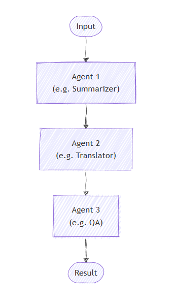

# Sequential Orchestration

> [!IMPORTANT]
> Agent Orchestrations are in the experimental stage. These patterns are under active development and may change significantly before advancing to the preview or release candidate stage.

In the sequential pattern, agents are organized in a pipeline. Each agent processes the task in turn, passing its output to the next agent in the sequence. This is ideal for workflows where each step builds upon the previous one, such as document review, data processing pipelines, or multi-stage reasoning.

## Common Use Cases

A document passes through a summarization agent, then a translation agent, and finally a quality assurance agent, each building on the previous output:



## What You'll Learn

- How to define a sequence of agents, each with a specialized role
- How to orchestrate these agents so that each processes the output of the previous one
- How to observe intermediate outputs and collect the final result

::: zone pivot="programming-language-csharp"

### Define Your Agents

Agents are specialized entities that process tasks in sequence. Here, we define three agents: an analyst, a copywriter, and an editor.

> [!TIP]
> The [`ChatCompletionAgent`](../agent-types/chat-completion-agent.md) is used here, but you can use any [agent type](../agent-architecture.md#agent-types-in-semantic-kernel).

```csharp
using Microsoft.SemanticKernel;
using Microsoft.SemanticKernel.Agents;
using Microsoft.SemanticKernel.Agents.Orchestration;
using Microsoft.SemanticKernel.Agents.Orchestration.Sequential;
using Microsoft.SemanticKernel.Agents.Runtime.InProcess;

// Create a kernel with an AI service
Kernel kernel = ...;

ChatCompletionAgent analystAgent = new ChatCompletionAgent {
    Name = "Analyst",
    Instructions = "You are a marketing analyst. Given a product description, identify:\n- Key features\n- Target audience\n- Unique selling points",
    Kernel = kernel,
};

ChatCompletionAgent writerAgent = new ChatCompletionAgent {
    Name = "Copywriter",
    Instructions = "You are a marketing copywriter. Given a block of text describing features, audience, and USPs, compose a compelling marketing copy (like a newsletter section) that highlights these points. Output should be short (around 150 words), output just the copy as a single text block.",
    Kernel = kernel,
};

ChatCompletionAgent editorAgent = new ChatCompletionAgent {
    Name = "Editor",
    Instructions = "You are an editor. Given the draft copy, correct grammar, improve clarity, ensure consistent tone, give format and make it polished. Output the final improved copy as a single text block.",
    Kernel = kernel,
};
```

### Optional: Observe Agent Responses

You can create a callback to capture agent responses as the sequence progresses via the `ResponseCallback` property.

```csharp
ChatHistory history = [];

ValueTask responseCallback(ChatMessageContent response)
{
    history.Add(response);
    return ValueTask.CompletedTask;
}
```

### Set Up the Sequential Orchestration

Create a `SequentialOrchestration` object, passing in the agents and the optional response callback.

```csharp
SequentialOrchestration orchestration = new(analystAgent, writerAgent, editorAgent)
{
    ResponseCallback = responseCallback,
};
```

### Start the Runtime

A runtime is required to manage the execution of agents. Here, we use `InProcessRuntime` and start it before invoking the orchestration.

```csharp
InProcessRuntime runtime = new InProcessRuntime();
await runtime.StartAsync();
```

### Invoke the Orchestration

Invoke the orchestration with your initial task (e.g., a product description). The output will flow through each agent in sequence.

```csharp
var result = await orchestration.InvokeAsync(
    "An eco-friendly stainless steel water bottle that keeps drinks cold for 24 hours",
    runtime);
```

### Collect Results

Wait for the orchestration to complete and retrieve the final output.

```csharp
string output = await result.GetValueAsync(TimeSpan.FromSeconds(20));
Console.WriteLine($"\n# RESULT: {text}");
Console.WriteLine("\n\nORCHESTRATION HISTORY");
foreach (ChatMessageContent message in history)
{
    this.WriteAgentChatMessage(message);
}
```

### Optional: Stop the Runtime

After processing is complete, stop the runtime to clean up resources.

```csharp
await runtime.RunUntilIdleAsync();
```

### Sample Output

```plaintext
# RESULT: Introducing our Eco-Friendly Stainless Steel Water Bottles – the perfect companion for those who care about the planet while staying hydrated! Our bottles ...


ORCHESTRATION HISTORY

# Assistant - Analyst: **Key Features:**
- Made from eco-friendly stainless steel
- Insulation technology that maintains cold temperatures for up to 24 hours
- Reusable and sustainable design
- Various sizes and colors available (assumed based on typical offerings)
- Leak-proof cap
- BPA-free ...

# Assistant - copywriter: Introducing our Eco-Friendly Stainless ...

# Assistant - editor: Introducing our Eco-Friendly Stainless Steel Water Bottles – the perfect companion for those who care about the planet while staying hydrated! Our bottles ...
```

> [!TIP]
> The full sample code is available [here](https://github.com/microsoft/semantic-kernel/blob/main/dotnet/samples/GettingStartedWithAgents/Orchestration/Step02_Sequential.cs)

::: zone-end

::: zone pivot="programming-language-python"

### Define Your Agents

Each agent in the sequence has a specific responsibility. In this example, we have:

- ConceptExtractorAgent: Extracts key features, target audience, and unique selling points from a product description.
- WriterAgent: Composes a marketing copy based on the extracted information.
- FormatProofAgent: Edits and polishes the draft copy for clarity and consistency.

> [!TIP]
> The [`ChatCompletionAgent`](./../agent-types/chat-completion-agent.md) is used here with Azure OpenAI, however, you can use any [agent type](./../agent-architecture.md#agent-types-in-semantic-kernel) or [model service](../../../concepts/ai-services/chat-completion/index.md).

```python
from semantic_kernel.agents import Agent, ChatCompletionAgent
from semantic_kernel.connectors.ai.open_ai import AzureChatCompletion

def get_agents() -> list[Agent]:
    concept_extractor_agent = ChatCompletionAgent(
        name="ConceptExtractorAgent",
        instructions=(
            "You are a marketing analyst. Given a product description, identify:\n"
            "- Key features\n"
            "- Target audience\n"
            "- Unique selling points\n\n"
        ),
        service=AzureChatCompletion(),
    )
    writer_agent = ChatCompletionAgent(
        name="WriterAgent",
        instructions=(
            "You are a marketing copywriter. Given a block of text describing features, audience, and USPs, "
            "compose a compelling marketing copy (like a newsletter section) that highlights these points. "
            "Output should be short (around 150 words), output just the copy as a single text block."
        ),
        service=AzureChatCompletion(),
    )
    format_proof_agent = ChatCompletionAgent(
        name="FormatProofAgent",
        instructions=(
            "You are an editor. Given the draft copy, correct grammar, improve clarity, ensure consistent tone, "
            "give format and make it polished. Output the final improved copy as a single text block."
        ),
        service=AzureChatCompletion(),
    )
    return [concept_extractor_agent, writer_agent, format_proof_agent]
```

### Optional: Observe Agent Responses

You can define a callback to observe and print the output from each agent as the sequence progresses.

```python
from semantic_kernel.contents import ChatMessageContent

def agent_response_callback(message: ChatMessageContent) -> None:
    print(f"# {message.name}\n{message.content}")
```

### Set Up the Sequential Orchestration

SequentialOrchestration object, passing in the agents and the optional response callback.

```python
from semantic_kernel.agents import SequentialOrchestration

agents = get_agents()
sequential_orchestration = SequentialOrchestration(
    members=agents,
    agent_response_callback=agent_response_callback,
)
```

### Start the Runtime

Start the runtime to manage agent execution.

```python
from semantic_kernel.agents.runtime import InProcessRuntime

runtime = InProcessRuntime()
runtime.start()
```

### Invoke the Orchestration

Invoke the orchestration with your initial task (e.g., a product description). The output will flow through each agent in sequence.

```python
orchestration_result = await sequential_orchestration.invoke(
    task="An eco-friendly stainless steel water bottle that keeps drinks cold for 24 hours",
    runtime=runtime,
)
```

### Collect Results

Wait for the orchestration to complete.

```python
value = await orchestration_result.get(timeout=20)
print(f"***** Final Result *****\n{value}")
```

### Optional: Stop the Runtime

After processing is complete, stop the runtime to clean up resources.

```python
await runtime.stop_when_idle()
```

### Sample Output

```plaintext
# ConceptExtractorAgent
- Key Features:
- Made of eco-friendly stainless steel
- Keeps drinks cold for 24 hours
...
# WriterAgent
Keep your beverages refreshingly chilled all day long with our eco-friendly stainless steel bottles...
# FormatProofAgent
Keep your beverages refreshingly chilled all day long with our eco-friendly stainless steel bottles...
***** Final Result *****
Keep your beverages refreshingly chilled all day long with our eco-friendly stainless steel bottles...
```

> [!TIP]
> The full sample code is available [here](https://github.com/microsoft/semantic-kernel/blob/main/python/samples/getting_started_with_agents/multi_agent_orchestration/step2_sequential.py).

::: zone-end

::: zone pivot="programming-language-java"

> [!NOTE]
> Agent orchestration is not yet available in Java SDK.

::: zone-end

## Next steps

> [!div class="nextstepaction"]
> [Group Chat Orchestration](./group-chat.md)
