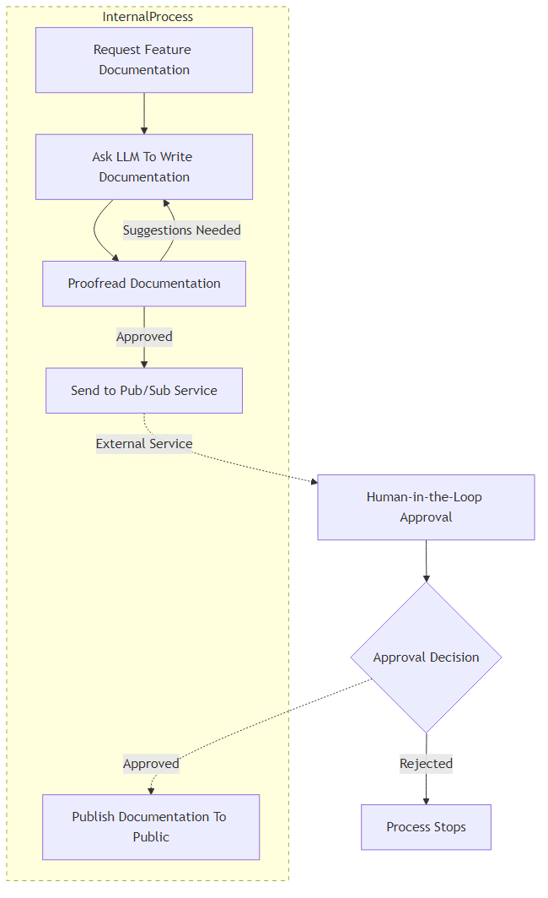

# How-To: Human-in-the-Loop

> [!WARNING]
> The _Semantic Kernel Process Framework_ is experimental, still in development and is subject to change.

## Overview

In the previous sections we built Process to help us automate the creation of documentation for our new product. our process can now generate documentation and run it through a proofread and edit cycle to ensure we get high quality documentation. In this section we will improve on that process again by requiring a human to approve or reject the documentation before it's published. The flexibility of the process framework means that there are several ways that we could go about doing this but in this example we will demonstrate integration with an external pubsub system for requesting approval.



### Make publishing wait for approval

The first change we need to make to the process is to make the publishing step wait for the approval before it publishes the documentation. One option is to simply add a second parameter for the approval to the `PublishDocumentation` function in the `PublishDocumentationStep`. This works because a KernelFunction in a step will only be invoked when all of its required parameters have been provided. 

::: zone pivot="programming-language-csharp"

```csharp
// A process step to publish documentation
public class PublishDocumentationStep : KernelProcessStep
{
    [KernelFunction]
    public void PublishDocumentation(string docs, bool isApproved) // added the isApproved parameter
    {
        // Only publish the documentation if it has been approved
        if (isApproved)
        {
            // For example purposes we just write the generated docs to the console
            Console.WriteLine($"{nameof(PublishDocumentationStep)}:\n\tPublishing product documentation:\n\n{docs}");
        }
    }
}
```

::: zone-end

::: zone pivot="programming-language-python"
::: zone-end

::: zone pivot="programming-language-java"
::: zone-end

With the code above, the `PublishDocumentation` function in the `PublishDocumentationStep` will only be invoked when the generated documentation has been sent to the `docs` parameter and the result of the approval has been sent to the `isApproved` parameter. Let's update the process flow to match this new design.

::: zone pivot="programming-language-csharp"

```csharp
// Create the process builder
ProcessBuilder processBuilder = new("DocumentationGeneration");

// Add the steps
var infoGatheringStep = processBuilder.AddStepFromType<GatherProductInfoStep>();
var docsGenerationStep = processBuilder.AddStepFromType<GenerateDocumentationStepV2>();
var docsProofreadStep = processBuilder.AddStepFromType<ProofreadStep>();
var docsPublishStep = processBuilder.AddStepFromType<PublishDocumentationStep>();

// Orchestrate the events
processBuilder
    .OnInputEvent("Start")
    .SendEventTo(new(infoGatheringStep));

// When external human approval event comes in, route it to the 'isApproved' parameter of the docsPublishStep
processBuilder
    .OnInputEvent("HumanApprovalResponse")
    .SendEventTo(new(docsPublishStep, parameterName: "isApproved"));

infoGatheringStep
    .OnFunctionResult()
    .SendEventTo(new(docsGenerationStep, functionName: "GenerateDocumentation"));

docsGenerationStep
    .OnEvent("DocumentationGenerated")
    .SendEventTo(new(docsProofreadStep));

docsProofreadStep
    .OnEvent("DocumentationRejected")
    .SendEventTo(new(docsGenerationStep, functionName: "ApplySuggestions"));

// When the proofreader approves the documentation, send it to the 'docs' parameter of the docsPublishStep
docsProofreadStep
    .OnEvent("DocumentationApproved")
    .SendEventTo(new(docsPublishStep, parameterName: "docs"));

var process = processBuilder.Build();
return process;
```

::: zone-end

::: zone pivot="programming-language-python"
::: zone-end

::: zone pivot="programming-language-java"
::: zone-end

Two changes have been made to the process flow:
- Added an input event named `HumanApprovalResponse` that will be routed to the `isApproved` parameter of the `docsPublishStep` step.
- Since the KernelFunction in `docsPublishStep` now has two parameters, we need to update the existing route to specify the parameter name of `docs`.

Run the process as you did before and notice that this time when the proofreader approves the generated documentation and sends it to the `docs` parameter of the `docPublishStep` step, the step is no longer invoked because it is waiting for the `isApproved` parameter. At this point the process goes idle because there are no steps ready to be invoked and the call that we made to start the process returns. The process will remain in this idle state until our "human-in-the-loop" takes action to approve or reject the publish request. Once this has happened and the result has been communicated back to our program, we can restart the process with the result.

::: zone pivot="programming-language-csharp"

```csharp
// Restart the process with approval for publishing the documentation.
await process.StartAsync(kernel, new KernelProcessEvent { Id = "HumanApprovalResponse", Data = true });
```

::: zone-end

::: zone pivot="programming-language-python"
::: zone-end

::: zone pivot="programming-language-java"
::: zone-end

When the process is started again with the `HumanApprovalResponse` it will pick up from where it left off and invoke the `docsPublishStep` with `isApproved` set to `true` and our documentation will be published.