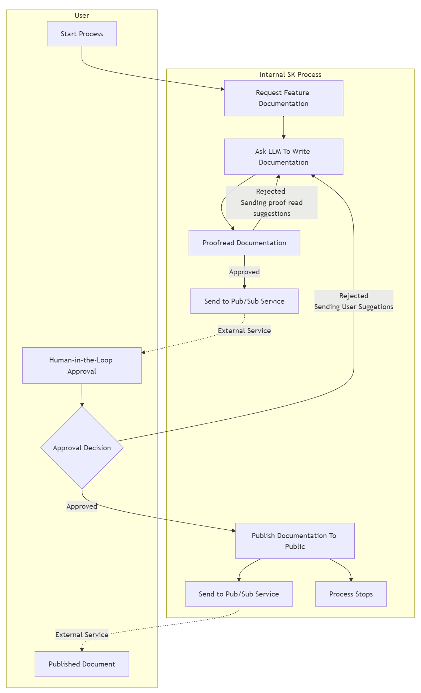

# How-To: Human-in-the-Loop

> [!WARNING]
> The _Semantic Kernel Process Framework_ is experimental, still in development and is subject to change.

## Overview

In the previous sections we built a Process to help us automate the creation of documentation for our new product. Our process can now generate documentation that is specific to our product, and can ensure it meets our quality bar by running it through a proofread and edit cycle. In this section we will improve on that process again by requiring a human to approve or reject the documentation before it's published. The flexibility of the process framework means that there are several ways that we could go about doing this but in this example we will demonstrate integration with an external pubsub system for requesting approval.



### Make publishing wait for approval

The first change we need to make to the process is to make the publishing step wait for the approval before it publishes the documentation. One option is to simply add a second parameter for the approval to the `PublishDocumentation` function in the `PublishDocumentationStep`. This works because a KernelFunction in a step will only be invoked when all of its required parameters have been provided.

::: zone pivot="programming-language-csharp"

```csharp
// A process step to publish documentation
public class PublishDocumentationStep : KernelProcessStep
{
    [KernelFunction]
    public DocumentInfo PublishDocumentation(DocumentInfo document, bool userApproval) // added the userApproval parameter
    {
        // Only publish the documentation if it has been approved
        if (userApproval)
        {
            // For example purposes we just write the generated docs to the console
            Console.WriteLine($"[{nameof(PublishDocumentationStep)}]:\tPublishing product documentation approved by user: \n{document.Title}\n{document.Content}");
        }
        return document;
    }
}
```

::: zone-end

::: zone pivot="programming-language-python"
> Support for Python Human-in-the-loop Process behavior is coming soon.
::: zone-end

::: zone pivot="programming-language-java"
::: zone-end

With the code above, the `PublishDocumentation` function in the `PublishDocumentationStep` will only be invoked when the generated documentation has been sent to the `document` parameter and the result of the approval has been sent to the `userApproval` parameter.

We can now reuse the existing logic of `ProofreadStep` step to additionally emit an event to our external pubsub system which will notify the human approver that there is a new request.

::: zone pivot="programming-language-csharp"

```csharp
// A process step to publish documentation
public class ProofReadDocumentationStep : KernelProcessStep
{
    ...

    if (formattedResponse.MeetsExpectations)
    {
        // Events that are getting piped to steps that will be resumed, like PublishDocumentationStep.OnPublishDocumentation
        // require events to be marked as public so they are persisted and restored correctly
        await context.EmitEventAsync("DocumentationApproved", data: document, visibility: KernelProcessEventVisibility.Public);
    }
    ...
}
```
Since we want to publish the newly generated documentation when it is approved by the proofread agent, the approved documents will be queued on the publishing step. In addition, a human will be notified via our external pubsub system with an update on the latest document. Let's update the process flow to match this new design.

::: zone-end

::: zone pivot="programming-language-python"
> Support for Python Human-in-the-loop Process behavior is coming soon.
::: zone-end

::: zone pivot="programming-language-java"
::: zone-end

::: zone pivot="programming-language-csharp"

```csharp
// Create the process builder
ProcessBuilder processBuilder = new("DocumentationGeneration");

// Add the steps
var infoGatheringStep = processBuilder.AddStepFromType<GatherProductInfoStep>();
var docsGenerationStep = processBuilder.AddStepFromType<GenerateDocumentationStepV2>();
var docsProofreadStep = processBuilder.AddStepFromType<ProofreadStep>();
var docsPublishStep = processBuilder.AddStepFromType<PublishDocumentationStep>();

// internal component that allows emitting SK events externally, a list of topic names
// is needed to link them to existing SK events
var proxyStep = processBuilder.AddProxyStep(["RequestUserReview", "PublishDocumentation"]);

// Orchestrate the events
processBuilder
    .OnInputEvent("StartDocumentGeneration")
    .SendEventTo(new(infoGatheringStep));

processBuilder
    .OnInputEvent("UserRejectedDocument")
    .SendEventTo(new(docsGenerationStep, functionName: "ApplySuggestions"));

// When external human approval event comes in, route it to the 'isApproved' parameter of the docsPublishStep
processBuilder
    .OnInputEvent("UserApprovedDocument")
    .SendEventTo(new(docsPublishStep, parameterName: "userApproval"));

// Hooking up the rest of the process steps
infoGatheringStep
    .OnFunctionResult()
    .SendEventTo(new(docsGenerationStep, functionName: "GenerateDocumentation"));

docsGenerationStep
    .OnEvent("DocumentationGenerated")
    .SendEventTo(new(docsProofreadStep));

docsProofreadStep
    .OnEvent("DocumentationRejected")
    .SendEventTo(new(docsGenerationStep, functionName: "ApplySuggestions"));

// When the proofreader approves the documentation, send it to the 'document' parameter of the docsPublishStep
// Additionally, the generated document is emitted externally for user approval using the pre-configured proxyStep
docsProofreadStep
    .OnEvent("DocumentationApproved")
    // [NEW] addition to emit messages externally
    .EmitExternalEvent(proxyStep, "RequestUserReview") // Hooking up existing "DocumentationApproved" to external topic "RequestUserReview"
    .SendEventTo(new(docsPublishStep, parameterName: "document"));

// When event is approved by user, it gets published externally too
docsPublishStep
    .OnFunctionResult()
    // [NEW] addition to emit messages externally
    .EmitExternalEvent(proxyStep, "PublishDocumentation");

var process = processBuilder.Build();
return process;
```

Finally, an implementation of the interface `IExternalKernelProcessMessageChannel` should be provided since it is internally use by the new `ProxyStep`. This interface is used to emit messages externally. The implementation of this interface will depend on the external system that you are using. In this example, we will use a custom client that we have created to send messages to an external pubsub system.

``` csharp
// Example of potential custom IExternalKernelProcessMessageChannel implementation 
public class MyCloudEventClient : IExternalKernelProcessMessageChannel
{
    private MyCustomClient? _customClient;

    // Example of an implementation for the process
    public async Task EmitExternalEventAsync(string externalTopicEvent, KernelProcessProxyMessage message)
    {
        // logic used for emitting messages externally.
        // Since all topics are received here potentially 
        // some if else/switch logic is needed to map correctly topics with external APIs/endpoints.
        if (this._customClient != null)
        {
            switch (externalTopicEvent) 
            {
                case "RequestUserReview":
                    var requestDocument = message.EventData.ToObject() as DocumentInfo;
                    // As an example only invoking a sample of a custom client with a different endpoint/api route
                    this._customClient.InvokeAsync("REQUEST_USER_REVIEW", requestDocument);
                    return;

                case "PublishDocumentation":
                    var publishedDocument = message.EventData.ToObject() as DocumentInfo;
                    // As an example only invoking a sample of a custom client with a different endpoint/api route
                    this._customClient.InvokeAsync("PUBLISH_DOC_EXTERNALLY", publishedDocument);
                    return;
            }
        }
    }

    public async ValueTask Initialize()
    {
        // logic needed to initialize proxy step, can be used to initialize custom client
        this._customClient = new MyCustomClient("http://localhost:8080");
        this._customClient.Initialize();
    }

    public async ValueTask Uninitialize()
    {
        // Cleanup to be executed when proxy step is uninitialized
        if (this._customClient != null)
        {
            await this._customClient.ShutdownAsync();
        }
    }
}
```
Finally to allow the process `ProxyStep` to make use of the `IExternalKernelProcessMessageChannel` implementation, in this case `MyCloudEventClient`, we need to pipe it properly.

When using Local Runtime, the implemented class can be passed when invoking `StartAsync` on the `KernelProcess` class.

```csharp
KernelProcess process;
IExternalKernelProcessMessageChannel myExternalMessageChannel = new MyCloudEventClient();
// Start the process with the external message channel
await process.StartAsync(kernel, new KernelProcessEvent 
    {
        Id = inputEvent,
        Data = input,
    },
    myExternalMessageChannel)
```

When using Dapr Runtime, the plumbing has to be done through dependency injection at the Program setup of the project.

```csharp
var builder = WebApplication.CreateBuilder(args);
...
// depending on the application a singleton or scoped service can be used
// Injecting SK Process custom client IExternalKernelProcessMessageChannel implementation
builder.Services.AddSingleton<IExternalKernelProcessMessageChannel, MyCloudEventClient>();
```

::: zone-end

::: zone pivot="programming-language-python"
> Support for Python Human-in-the-loop Process behavior is coming soon.
::: zone-end

::: zone pivot="programming-language-java"
::: zone-end

Two changes have been made to the process flow:

- Added an input event named `HumanApprovalResponse` that will be routed to the `userApproval` parameter of the `docsPublishStep` step.
- Since the KernelFunction in `docsPublishStep` now has two parameters, we need to update the existing route to specify the parameter name of `document`.

Run the process as you did before and notice that this time when the proofreader approves the generated documentation and sends it to the `document` parameter of the `docPublishStep` step, the step is no longer invoked because it is waiting for the `userApproval` parameter. At this point the process goes idle because there are no steps ready to be invoked and the call that we made to start the process returns. The process will remain in this idle state until our "human-in-the-loop" takes action to approve or reject the publish request. Once this has happened and the result has been communicated back to our program, we can restart the process with the result.

::: zone pivot="programming-language-csharp"

```csharp
// Restart the process with approval for publishing the documentation.
await process.StartAsync(kernel, new KernelProcessEvent { Id = "UserApprovedDocument", Data = true });
```

::: zone-end

::: zone pivot="programming-language-python"
> Support for Python Human-in-the-loop Process behavior is coming soon.
::: zone-end

::: zone pivot="programming-language-java"
::: zone-end

When the process is started again with the `UserApprovedDocument` it will pick up from where it left off and invoke the `docsPublishStep` with `userApproval` set to `true` and our documentation will be published. If it is started again with the `UserRejectedDocument` event, the process will kick off the `ApplySuggestions` function in the `docsGenerationStep` step and the process will continue as before.

The process is now complete and we have successfully added a human-in-the-loop step to our process. The process can now be used to generate documentation for our product, proofread it, and publish it once it has been approved by a human.
