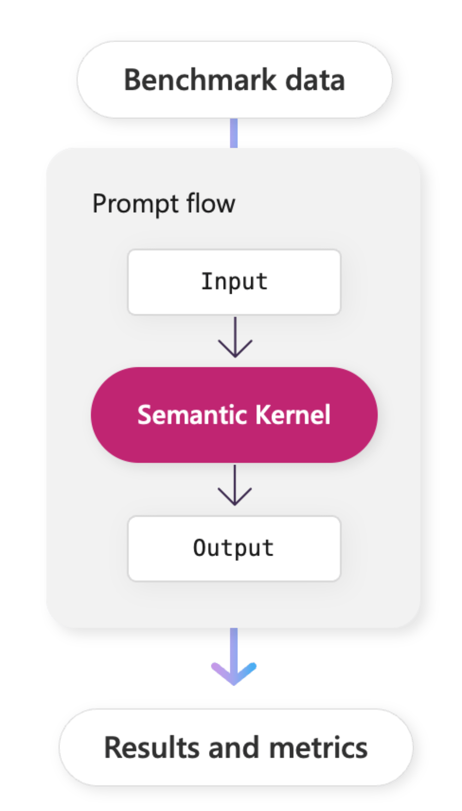

# Using Prompt flow with Semantic Kernel

In the [overview](./index.md) and [planner](../index.md) articles, we demonstrated the importance of providing descriptions for your plugins so planners can effectively use them for autogenerated plans. Knowing whether or not your descriptions are effective, however, can be difficult. In this section, we'll describe how you can use [Prompt flow](/azure/machine-learning/prompt-flow/overview-what-is-prompt-flow) to evaluate plugins and planners to ensure that they are consistently producing the desired results.

> [!Note]
> Today Prompt flow is only available in Python, so this section will only show how to use Prompt flow to evaluate plugins using Python.

## What is Prompt flow?
[Prompt flow](/azure/machine-learning/prompt-flow/overview-what-is-prompt-flow) is a development tool designed to streamline the creation of LLM applications. It does so by providing tooling that simplifies the process of prototyping, experimenting, iterating, and deploying LLM applications.

Most notably, Prompt flow allows you to author chains of native and semantic functions and visualize them as a graph. This allows you and the rest of your team to easily create and test AI powered capabilities in both Azure Machine Learning Studio and locally with VS Code.

:::image type="content" source="../../../media/prompt-flow-in-vs-code.png" alt-text="A graph of a Prompt flow":::

Additionally, as part of the Azure Machine Learning Service, Prompt flow makes it easy to deploy real-time endpoints that allows you to integrate your flows into your existing applications _and_ it provides a robust set of tools to perform evaluations and A/B tests for any new flows.

In this section, we'll be focusing on Prompt flow's evaluation and deployment features to evaluate and deploy Semantic Kernel planners. To learn more about Prompt flow, check out the [Prompt flow overview](/azure/machine-learning/prompt-flow/overview-what-is-prompt-flow) article.

### Why use Prompt flow with Semantic Kernel?

With Semantic Kernel you can build autonomous AI applications with the aid of [plugins](./index.md) and [planners](../index.md). Creating autonomous AI applications, however, can be challenging because you need to ensure your plugins and planners consistently produce the desired results across a wide range of inputs. This is where Prompt flow can help.

:::row:::
   :::column span="2":::
#### 1) Give Prompt flow the power of planners

        Prompt flow is great at defining and running static chains of functions. This works for many AI applications, but it doesn't work for scenarios where you expect an AI application to automatically adapt to new inputs and scenarios. _This is where Semantic Kernel shines._

        By leveraging planners and plugins within Prompt flow, you can author flows that automatically generate plans based on the needs of your users. This let's you avoid manually define every possible scenario yourself.

#### 2) Easily evaluate Semantic Kernel

        With Prompt flow, you can leverage the power of Azure ML to evaluate the accuracy, performance, and error rates of your plugins and planners.
        
        This allows you to quickly iterate on your plugins and planners because you can easily run tests to validate that you haven't accidentally introduced any regressions. If you use Prompt flow in Azure ML, your teammates can also run evaluations on your flows for collaborative development.

   :::column-end:::
   :::column span="1":::
        
   :::column-end:::
:::row-end:::

#### 3) Deploy Semantic Kernel to Azure ML

Lastly, Prompt flow's ability to deploy AI applications to Azure Machine Learning means you can use Prompt flow to easily deploy your Semantic Kernel applications with minimal effort.

### Do I _need_ to use Prompt flow with Semantic Kernel?
No! Prompt flow is an optional tool that you can use to help you create, evaluate, and deploy your Semantic Kernel applications. You can still use Semantic Kernel without Prompt flow by deploying it to your own infrastructure, but you will not be able to leverage Prompt flow's evaluation and deployment features.

Similarly, you can use Prompt flow without Semantic Kernel, but you will not have the ability to create dynamic flows or plans that can address unique customer scenarios.

## Next steps
Now that you understand the value of using Prompt flow with Semantic Kernel, let's walk through how you can use Prompt flow to evaluate and deploy your Semantic Kernel applications. The following articles will walk you through the key steps of using Prompt flow with Semantic Kernel by using the math plugin we created in the [planner](../index.md) article.

|   | Article | Description | 
|:-:|---------|-------------|
| 1. | [Creating a Prompt flow with Semantic Kernel](./create-a-prompt-flow-with-semantic-kernel.md) | Learn how to use the Prompt flow CLI to create a new flow and then add Semantic Kernel to it. |
| 2. | [Running batches with Prompt flow](./running-batches-with-prompt-flow.md) | Run the flow you created in the previous article with large amounts of benchmark data to see how it performs with a wide range of user requests. |
| 3. | [Evaluating batch results](./evaluating-plugins-and-planners-with-prompt-flow.md) | Once you've run your flow on top of the benchmark data, you can run an evaluation to see how well it performed. This article also describes how you can improve your plugins and personas after reviewing the evaluation results. |
| 4. | Deploying Semantic Kernel with Prompt flow (coming soon) | Finally, learn how to deploy your plugin to Azure so other apps and services can use your planner. |

> [!div class="nextstepaction"]
> [Create a Prompt flow with Semantic Kernel](./create-a-prompt-flow-with-semantic-kernel.md)
