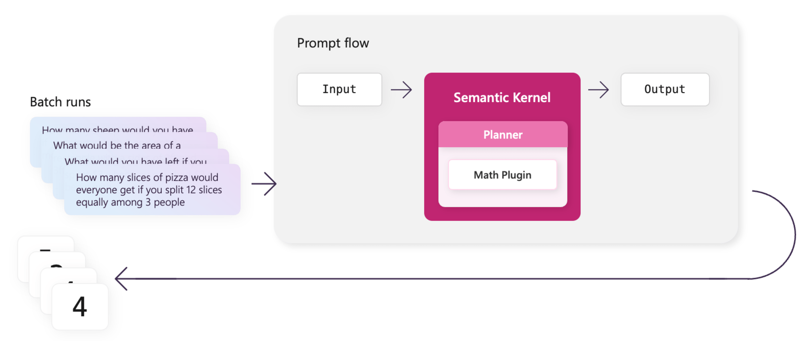

# Running batches with Prompt flow


If you want to test your flow with multiple inputs, you can use the batch run feature. This allows you to run your flow with a list of inputs from either a csv, tsv, JSON line file. Afterwards, all of the outputs will be saved to another JSON line file. In the [next article](./evaluating-plugins-and-planners-with-prompt-flow.md) you can then use the output file to evaluate your flow.



To get started, you must first create a JSON lines file that contains sample inputs and the correct ground truth. The following sections will walk you through how to do this.

This article uses the completed solution from the [preview article](./create-a-prompt-flow-with-semantic-kernel.md). If you want to follow along, you can use the following samples in the public documentation repository.

> [!Note]
> Today Prompt flow is only available in Python, so this article will only show how to use Prompt flow to evaluate plugins using Python.

| Language | Link to completed solution |
| --- | --- |
| C# | Not available |
| Python | [Open solution in GitHub](https://github.com/MicrosoftDocs/semantic-kernel-docs/tree/main/samples/python/12-Evaluate-with-Prompt-Flow) |

## Create benchmark data for your Prompt flow
All benchmark data can be found in the _data.jsonl_ file. This file contains a list of JSON objects that contains the input and the correct ground truth. Let's update the _data.jsonl_ file with data that we can use to evaluate our plugin.

```json
{"text": "How many sheep would you have if you started with 3 and got 2 more?", "groundtruth": "5"}
{"text": "What would be the area of a rectangle with a sides of 2ft and 3ft?", "groundtruth": "6"}
{"text": "What would you have left if you spent $3 when you only had $2 to begin with", "groundtruth": "-1"}
{"text": "How many slices of pizza would everyone get if you split 12 slices equally among 3 people", "groundtruth": "4"}
{"text": "What is the sum of 5 and 3?", "groundtruth": "8"}
{"text": "Subtract 7 from 10.", "groundtruth": "3"}
{"text": "Multiply 6 by 4.", "groundtruth": "24"}
{"text": "Divide 20 by 5.", "groundtruth": "4"}
{"text": "What is the square of 7?", "groundtruth": "49"}
{"text": "What is the square root of 81?", "groundtruth": "9"}
```

### Run your Prompt flow with the benchmark data
Now that we have our benchmark data, we can run our flow over the data to see how well it performs. There are several ways to run a flow using either the VS Code extension or the CLI.

#### Use the visual editor to run a batch of inputs
1. Open the visual editor.
2. Select the **Batch run** icon (the beaker icon).

    :::image type="content" source="../../../media/prompt-flow-batch-run-button.png" alt-text="Location of the batch run icon":::

3. Select **Local JSON Lines File**.
4. Select the _data.jsonl_ file in the file picker.
5. Select the **Run** button in the new file.

    :::image type="content" source="../../../media/run-link-for-prompt-flow.png" alt-text="Location of the run button for Prompt flow":::

#### Use the CLI to run a batch of inputs
1. Navigate to the root of the flow folder.

    ```bash
    cd ./perform_math
    ```

2. Run the following command in your terminal; we'll use the `--name` parameter to name the run _perform_math_.

    ```bash
    pf run create  --flow . --data data.jsonl --stream --name perform_math
    ```

    > [!Important]
    > The name of evaluations must be unique. If you run the same evaluation twice, you will need to use a different name otherwise the second run will fail.
    

## Viewing the results
If you use the CLI to name your batch run with the `--name` parameter, you can use the following commands to get the results afterwards.

```bash
pf run show-details -n perform_math
pf run visualize -n perform_math
```

After running the `pf run show-details` command, you should see the following output.

# [GPT-3.5-turbo](#tab/gpt-35-turbo)
If you are running the planner with GPT-3.5-turbo, you'll likely run into a few errors, so only _some_ of the results will come back (notice that line 3 failed) and a few of the results may be incorrect (e.g., line 1, 2, and 4).

```output
+----+-------------------------------------------------------------------------------------------+----------------------+-------------------+
|    | inputs.text                                                                               |   inputs.line_number | outputs.result    |
+====+===========================================================================================+======================+===================+
|  0 | How many sheep would you have if you started with 3 and got 2 more?                       |                    0 | 5.0               |
+----+-------------------------------------------------------------------------------------------+----------------------+-------------------+
|  1 | What would be the area of a rectangle with a sides of 2ft and 3ft?                        |                    1 | 2.449489742783178 |
+----+-------------------------------------------------------------------------------------------+----------------------+-------------------+
|  2 | What would you have left if you spent $3 when you only had $2 to begin with               |                    2 |                   |
+----+-------------------------------------------------------------------------------------------+----------------------+-------------------+
|  3 | How many slices of pizza would everyone get if you split 12 slices equally among 3 people |                    3 | (Failed)          |
+----+-------------------------------------------------------------------------------------------+----------------------+-------------------+
|  4 | What is the sum of 5 and 3?                                                               |                    4 | 5.0               |
+----+-------------------------------------------------------------------------------------------+----------------------+-------------------+
|  5 | Subtract 7 from 10.                                                                       |                    5 | 3.0               |
+----+-------------------------------------------------------------------------------------------+----------------------+-------------------+
|  6 | Multiply 6 by 4.                                                                          |                    6 | 24.0              |
+----+-------------------------------------------------------------------------------------------+----------------------+-------------------+
|  7 | Divide 20 by 5.                                                                           |                    7 | 4.0               |
+----+-------------------------------------------------------------------------------------------+----------------------+-------------------+
|  8 | What is the square of 7?                                                                  |                    8 | 49.0              |
+----+-------------------------------------------------------------------------------------------+----------------------+-------------------+
|  9 | What is the square root of 81?                                                            |                    9 | 9.0               |
+----+-------------------------------------------------------------------------------------------+----------------------+-------------------+
```

# [GPT-4](#tab/gpt-4)
If you are running the planner with GPT-4, there should be minimal errors, but some of the results may still be incorrect. For example, row 2 should be _negative_ 1 not positive 1.

```output
+----+-------------------------------------------------------------------------------------------+----------------------+------------------+
|    | inputs.text                                                                               |   inputs.line_number | outputs.result   |
+====+===========================================================================================+======================+==================+
|  0 | How many sheep would you have if you started with 3 and got 2 more?                       |                    0 | 5.0              |
+----+-------------------------------------------------------------------------------------------+----------------------+------------------+
|  1 | What would be the area of a rectangle with a sides of 2ft and 3ft?                        |                    1 | 8.0              |
+----+-------------------------------------------------------------------------------------------+----------------------+------------------+
|  2 | What would you have left if you spent $3 when you only had $2 to begin with               |                    2 | 1.0              |
+----+-------------------------------------------------------------------------------------------+----------------------+------------------+
|  3 | How many slices of pizza would everyone get if you split 12 slices equally among 3 people |                    3 | 4.0              |
+----+-------------------------------------------------------------------------------------------+----------------------+------------------+
|  4 | What is the sum of 5 and 3?                                                               |                    4 | 8.0              |
+----+-------------------------------------------------------------------------------------------+----------------------+------------------+
|  5 | Subtract 7 from 10.                                                                       |                    5 | 3.0              |
+----+-------------------------------------------------------------------------------------------+----------------------+------------------+
|  6 | Multiply 6 by 4.                                                                          |                    6 | 24.0             |
+----+-------------------------------------------------------------------------------------------+----------------------+------------------+
|  7 | Divide 20 by 5.                                                                           |                    7 | 4.0              |
+----+-------------------------------------------------------------------------------------------+----------------------+------------------+
|  8 | What is the square of 7?                                                                  |                    8 | 49.0             |
+----+-------------------------------------------------------------------------------------------+----------------------+------------------+
|  9 | What is the square root of 81?                                                            |                    9 | 9.0              |
+----+-------------------------------------------------------------------------------------------+----------------------+------------------+
```

---

As you can see, the results are not yet perfect. In the [next article](./evaluating-plugins-and-planners-with-prompt-flow.md), we'll use Prompt flow's evaluation feature to quantify how well our flow is performing and then we'll update our plugin and planner to improve the results.

### Using the VS Code extension to view the results

If you don't know the name of your run, you can also use the Prompt flow VS Code extension to see a history of all your previous runs and visualize them. To do this, follow these steps:
1. Select the Prompt flow icon in the app bar in VS Code.
2. In the **Batch run history** section, select the refresh button.
3. Select the run you want to view.
4. Select **Visualize & analyze**.
    
    :::image type="content" source="../../../media/prompt-flow-batch-run-history.png" alt-text="Location of the batch run history":::

5. Afterwards, you'll get the same visualization that you'd see if you had run `pf run visualize -n perform_math` in your terminal.

    :::image type="content" source="../../../media/prompt-flow-visualize-batch-run.png" alt-text="The visual of the run":::


### View the logs
To see what the flow is doing, you can open and view the logs of the run. To do this, follow these steps.

1. Run the following command to view the details of the run.

    ```bash
    pf run stream -n perform_math
    ```

2. Before any of the errors are output to the terminal, you should see a run summary

    ```output
    ======= Run Summary =======

    Run name: "perform_math"
    Run status: "Completed"
    Start time: "2023-09-07 11:22:05.160936"
    Duration: "0:00:13.736032"
    Output path: "/Users/<user>/.promptflow/.runs/perform_math"
    ```

3. Copy the value of the `Output path` property.
4. Navigate to the output path. You should see a folder that looks like the following.

    :::image type="content" source="../../../media/prompt-flow-output-folder.png" alt-text="View of the flow artifacts folder":::

5. Open the *node_artifacts/math_planner* folder.
6. Open the one of the JSON line files. These files contain the logs of a single run of your custom node so you can see what your planner is doing. You should see results like the following.

    ```json
    {
        "NodeName": "math_planner",
        "line_number": 3,
        "run_info": {
            "node": "math_planner",
            "flow_run_id": "perform_math",
            "run_id": "perform_math_math_planner_3",
            "status": "Completed",
            "inputs": {
            "input1": "How many slices of pizza would everyone get if you split 12 slices equally among 3 people"
            },
            "output": "4.0",
            "metrics": null,
            "error": null,
            "parent_run_id": "perform_math_3",
            "start_time": "2023-09-05T14:40:55.159904Z",
            "end_time": "2023-09-05T14:41:02.668920Z",
            "index": 3,
            "api_calls": [
            {
                "name": "my_python_tool",
                "type": "Tool",
                "inputs": {
                "input1": "How many slices of pizza would everyone get if you split 12 slices equally among 3 people"
                },
                "output": "4.0",
                "start_time": 1693921255.159942,
                "end_time": 1693921262.668671,
                "error": null,
                "children": null,
                "node_name": "math_planner"
            }
            ],
            "variant_id": "",
            "cached_run_id": null,
            "cached_flow_run_id": null,
            "logs": {
            "stdout": "[2023-09-05T14:41:02+0000] Function: MathPlugin.Divide\n[2023-09-05T14:41:02+0000] Input vars: {'input': '12', 'denominator': '3'}\n[2023-09-05T14:41:02+0000] Output vars: ['RESULT__SLICES_PER_PERSON']\n[2023-09-05T14:41:02+0000] Result: 4.0\n",
            "stderr": ""
            },
            "system_metrics": {
            "duration": 7.509016
            },
            "result": "4.0"
        },
        "start_time": "2023-09-05T14:40:55.159904",
        "end_time": "2023-09-05T14:41:02.668920",
        "status": "Completed"
        }
    ```
    
    Any print statements in your code will be logged in the `run_info.logs.stdout` property. 

## Next steps
Now that you know how to run a batch of inputs on your flow, you can now use the [evaluation feature](./evaluating-plugins-and-planners-with-prompt-flow.md) to quantify the actual performance of your flow.


> [!div class="nextstepaction"]
> [Evaluate your plugins and planners](./evaluating-plugins-and-planners-with-prompt-flow.md)
