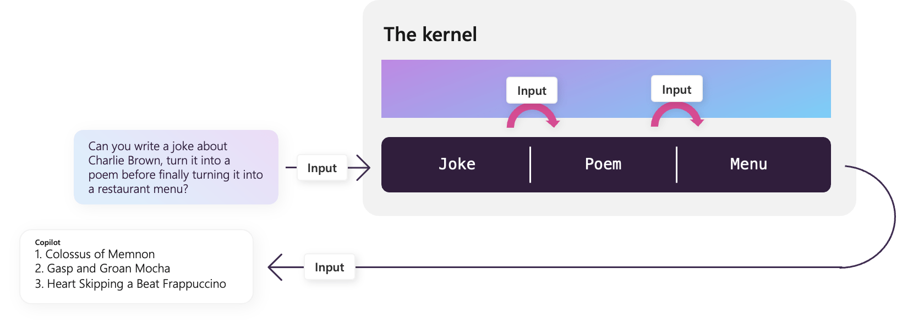

# Chaining functions together

[!INCLUDE [pat_large.md](../includes/pat_large.md)]

In previous articles, we showed how you could invoke a Semantic Kernel function (whether semantic or native) individually. Oftentimes, however, you may want to string multiple functions together into a single pipeline to simplify your code.

[Later in this article](./chaining-functions.md#passing-more-than-just-input-with-native-functions), we'll put this knowledge to use by demonstrating how you could refactor the code from the [native functions](./native-functions.md) to make it more readable and maintainable. If you want to see the final solution, you can check out the following samples in the public documentation repository.

| Language  | Link to final solution |
| --- | --- |
| C# | [Open solution in GitHub](https://github.com/MicrosoftDocs/semantic-kernel-docs/tree/main/samples/dotnet/03-Chaining-Functions) |
| Python | [Open solution in GitHub](https://github.com/MicrosoftDocs/semantic-kernel-docs/tree/main/samples/python/03-Chaining-Functions) |


## Passing data to semantic functions with `$input`
Semantic Kernel was designed in the spirit of UNIX's piping and filtering capabilities. To replicate this behavior, we've added a special variable called `$input` into the kernel's context object that allows you to stream output from one semantic function to the next.



For example we can make three inline semantic functions and string their outputs into the next by adding the `$input` variable into each prompt.

# [C#](#tab/Csharp)
Create and register the semantic functions.

```csharp
string myJokePrompt = """
Tell a short joke about {{$input}}.
""";
string myPoemPrompt = """
Take this "{{$input}}" and convert it to a nursery rhyme.
""";
string myMenuPrompt = """
Make this poem "{{$input}}" influence the three items in a coffee shop menu. 
The menu reads in enumerated form:

""";

var myJokeFunction = kernel.CreateSemanticFunction(myJokePrompt, maxTokens: 500);
var myPoemFunction = kernel.CreateSemanticFunction(myPoemPrompt, maxTokens: 500);
var myMenuFunction = kernel.CreateSemanticFunction(myMenuPrompt, maxTokens: 500);
```

Run the functions sequentially. Notice how all of the functions share the same context.

```csharp
var context = kernel.CreateNewContext("Charlie Brown");
await myJokeFunction.InvokeAsync(context);
await myPoemFunction.InvokeAsync(context);
await myMenuFunction.InvokeAsync(context);

Console.WriteLine(context);
```

# [Python](#tab/python)

Create and register the semantic functions.

```python
my_joke_prompt = """Tell a short joke about {{$INPUT}}."""
my_poem_prompt = """Take this "{{$INPUT}}" and convert it to a nursery rhyme."""
my_menu_prompt = """Make this poem "{{$INPUT}}" influence the three items in a coffee shop menu. 
The menu reads in enumerated form:
"""
```

Run the functions sequentially. Notice how all of the functions share the same context.

```python


my_joke_function = kernel.create_semantic_function(myJokePrompt, max_tokens=500)
my_poem_function = kernel.create_semantic_function(myPoemPrompt, max_tokens=500)
my_menu_function = kernel.create_semantic_function(myMenuPrompt, max_tokens=500)

context = kernel.create_new_context("Charlie Brown")
await my_joke_function(context=context)
await my_poem_function(context=context)
await my_menu_function(context=context)

print(context)
```

---

Which would result in something like:

```output
1. Colossus of Memnon Latte - A creamy latte with a hint of sweetness, just like the awe-inspiring statue.

2. Gasp and Groan Mocha - A rich and indulgent mocha that will make you gasp and groan with delight.

3. Heart Skipping a Beat Frappuccino - A refreshing frappuccino with a hint of sweetness that will make your heart skip a beat.
```

### Using the `RunAsync` method to simplify your code
Running each function individually can be very verbose, so Semantic Kernel also provides the `RunAsync` method in C# or `run_async` method in Python that automatically calls a series of functions sequentially, all with the same context object.

# [C#](#tab/Csharp)
```csharp
var myOutput = await kernel.RunAsync(
    new ContextVariables("Charlie Brown"),
    myJokeFunction,
    myPoemFunction,
    myMenuFunction);

Console.WriteLine(myOutput);
```

# [Python](#tab/python)

```python
myOutput = await kernel.run_async(
    my_joke_function,
    my_poem_function, 
    my_menu_function,
    input_str = input_text)

print(myOutput)
```

---

## Passing more than just `$input` with native functions
In the previous articles, we've already seen how you can update and retrieve additional properties from the context object within native functions. We can use this same technique to pass additional data between functions within a pipeline.

We'll demonstrate this by updating the code written in the [native functions](./native-functions.md) article to use the `RunAsync` method instead.

### Adding a function that changes variables in the context
In the previous example, we used the `RouteRequest` function to individually call each of the Semantic Kernel functions, and in between calls, we updated the context object with the new data. We can simplify this code by creating a new native function that performs the same context update operations. We'll call this function `ExtractNumbersFromJson` and it will take the JSON string from the `input` variable and extract the numbers from it.

Add the following code to your `OrchestratorPlugin` class.

# [C#](#tab/Csharp)
```csharp
[SKFunction("Extracts numbers from JSON")]
public SKContext ExtractNumbersFromJson(SKContext context)
{
    JObject numbers = JObject.Parse(context["input"]);

    // loop through numbers and add them to the context
    foreach (var number in numbers)
    {
        if (number.Key == "number1")
        {
            // add the first number to the input variable
            context["input"] = number.Value.ToString();
            continue;
        }
        else
        {
            // add the rest of the numbers to the context
            context[number.Key] = number.Value.ToString();
        }
    }
    return context;
}
```

# [Python](#tab/python)

```python
@sk_function(
    description="Extracts numbers from JSON",
    name="extract_numbers_from_json",
)
def ExtractNumbersFromJson(self, context: SKContext):
    numbers = json.loads(context["input"])

    # Loop through numbers and add them to the context
    for key, value in numbers.items():
        if key == "number1":
            # Add the first number to the input variable
            context["input"] = str(value)
        else:
            # Add the rest of the numbers to the context
            context[key] = str(value)

    return context
```

---

### Using the `RunAsync` method to chain our functions
Now that we have a function that can extracts numbers, we can update our `RouteRequest` function to use the `RunAsync` method to call the functions in a pipeline. Update the `RouteRequest` function to the following:

# [C#](#tab/Csharp)
```csharp
[SKFunction("Routes the request to the appropriate function.")]
public async Task<string> RouteRequest(SKContext context)
{
    // Save the original user request
    string request = context["input"];

    // Add the list of available functions to the context
    context["options"] = "Sqrt, Add";

    // Retrieve the intent from the user request
    var GetIntent = _kernel.Skills.GetFunction("OrchestratorPlugin", "GetIntent");
    await GetIntent.InvokeAsync(context);
    string intent = context["input"].Trim();

    // Prepare the functions to be called in the pipeline
    var GetNumbers = _kernel.Skills.GetFunction("OrchestratorPlugin", "GetNumbers");
    var ExtractNumbersFromJson = _kernel.Skills.GetFunction("OrchestratorPlugin", "ExtractNumbersFromJson");
    ISKFunction MathFunction;

    // Retrieve the correct function based on the intent
    switch (intent)
    {
        case "Sqrt":
            MathFunction = _kernel.Skills.GetFunction("MathPlugin", "Sqrt");
            break;
        case "Add":
            MathFunction = _kernel.Skills.GetFunction("MathPlugin", "Add");
            break;
        default:
            return "I'm sorry, I don't understand.";
    }

    // Run the functions in a pipeline
    var output = await _kernel.RunAsync(
        request,
        GetNumbers,
        ExtractNumbersFromJson,
        MathFunction);

    return output["input"];
}
```

# [Python](#tab/python)

```python
@sk_function(
    description="Routes the request to the appropriate function",
    name="route_request",
)
async def RouteRequest(self, context: SKContext) -> str:
    # Save the original user request
    request = context["input"]

    # Add the list of available functions to the context
    context["options"] = "Sqrt, Add"

    # Retrieve the intent from the user request
    GetIntent = self._kernel.skills.get_function("OrchestratorPlugin", "GetIntent")
    await GetIntent.invoke_async(context=context)
    intent = context["input"].strip()

    # Prepare the functions to be called in the pipeline
    GetNumbers = self._kernel.skills.get_function(
        "OrchestratorPlugin", "GetNumbers"
    )
    ExtractNumbersFromJson = self._kernel.skills.get_function(
        "OrchestratorPlugin", "extract_numbers_from_json"
    )

    # Retrieve the correct function based on the intent
    if intent == "Sqrt":
        MathFunction = self._kernel.skills.get_function("MathPlugin", "square_root")
    elif intent == "Add":
        MathFunction = self._kernel.skills.get_function("MathPlugin", "add")
    else:
        return "I'm sorry, I don't understand."
        
    # Run the functions in a pipeline
    output = await self._kernel.run_async(
        GetNumbers,
        ExtractNumbersFromJson,
        MathFunction,
        input_str=request,
    )

    return output["input"]
```

---

After making these changes, you should be able to run the code again and see the same results as before. Only now, the `RouteRequest` is easier to read and you've created a new native function that can be reused in other pipelines.

## Starting a pipeline with additional context variables
So far, we've only passed in a string to the `RunAsync` method. However, you can also pass in a context object to start the pipeline with additional information. This can be useful to pass additional information to any of the functions in the pipeline.

It's _also_ useful in persisting the initial `$input` variable across all functions in the pipeline without it being overwritten. For example, in our current pipeline, the user's original request is overwritten by the output of the `GetNumbers` function. This makes it difficult to retrieve the original request later in the pipeline to create a natural sounding response. By storying the original request as another variable, we can retrieve it later in the pipeline.

### Passing a context object to `RunAsync`
To pass a context object to `RunAsync`, you can create a new context object and pass it as the first parameter. This will start the pipeline with the variables in the context object. We'll be creating a new variable called `original_input` to store the original request. Later, we'll show where to add this code in the `RouteRequest` function.

# [C#](#tab/Csharp)
```csharp
// Create a new context object
var pipelineContext = new ContextVariables(request);
pipelineContext["original_request"] = request;
```


# [Python](#tab/python)

```python
# Create a new context object with the original request
pipelineContext = self._kernel.create_new_context()
pipelineContext["original_request"] = request
pipelineContext["input"] = request
```

---

### Creating a semantic function that uses the new context variables
Now that we have a variable with the original request, we can use it to create a more natural sounding response. We'll create a new semantic function called `CreateResponse` that will use the `original_request` variable to create a response in the `OrchestratorPlugin`.

Start by creating a new folder called _CreateResponse_ in your _OrchestratorPlugin_ folder. Then create the _config.json_ and _skprompt.txt_ files and paste the following code into the _config.json_ file. Notice how we now have two input variables, `input` and `original_request`.

```json
{
     "schema": 1,
     "type": "completion",
     "description": "Creates a response based on the original request and the output of the pipeline",
     "completion": {
          "max_tokens": 256,
          "temperature": 0.0,
          "top_p": 0.0,
          "presence_penalty": 0.0,
          "frequency_penalty": 0.0
     },
     "input": {
          "parameters": [
               {
                    "name": "input",
                    "description": "The user's request.",
                    "defaultValue": ""
               },
               {
                    "name": "original_request",
                    "description": "The original request from the user.",
                    "defaultValue": ""
               }
          ]
     }
}
```

Next, copy and paste the following prompt into _skprompt.txt_.

```txt
The answer to the users request is: {{$input}}
The bot should provide the answer back to the user.

User: {{$original_request}}
Bot: 
```

You can now update the `RouteRequest` function to include the `CreateResponse` function in the pipeline. Update the `RouteRequest` function to the following:

# [C#](#tab/Csharp)
```csharp
[SKFunction("Routes the request to the appropriate function.")]
public async Task<string> RouteRequest(SKContext context)
{
    // Save the original user request
    string request = context["input"];

    // Add the list of available functions to the context
    context["options"] = "Sqrt, Add";

    // Retrieve the intent from the user request
    var GetIntent = _kernel.Skills.GetFunction("OrchestratorPlugin", "GetIntent");
    var CreateResponse = _kernel.Skills.GetFunction("OrchestratorPlugin", "CreateResponse");
    await GetIntent.InvokeAsync(context);
    string intent = context["input"].Trim();

    // Prepare the functions to be called in the pipeline
    var GetNumbers = _kernel.Skills.GetFunction("OrchestratorPlugin", "GetNumbers");
    var ExtractNumbersFromJson = _kernel.Skills.GetFunction("OrchestratorPlugin", "ExtractNumbersFromJson");
    ISKFunction MathFunction;

    // Prepare the math function based on the intent
    switch (intent)
    {
        case "Sqrt":
            MathFunction = _kernel.Skills.GetFunction("MathPlugin", "Sqrt");
            break;
        case "Add":
            MathFunction = _kernel.Skills.GetFunction("MathPlugin", "Add");
            break;
        default:
            return "I'm sorry, I don't understand.";
    }

    // Create a new context object with the original request
    var pipelineContext = new ContextVariables(request);
    pipelineContext["original_request"] = request;

    // Run the functions in a pipeline
    var output = await _kernel.RunAsync(
        pipelineContext,
        GetNumbers,
        ExtractNumbersFromJson,
        MathFunction,
        CreateResponse);

    return output["input"];
}
```


# [Python](#tab/python)

```python
@sk_function(
    description="Routes the request to the appropriate function",
    name="route_request",
)
async def RouteRequest(self, context: SKContext) -> str:
    # Save the original user request
    request = context["input"]

    # Add the list of available functions to the context
    context["options"] = "Sqrt, Add"

    # Retrieve the intent from the user request
    GetIntent = self._kernel.skills.get_function("OrchestratorPlugin", "GetIntent")
    CreateResponse = self._kernel.skills.get_function(
        "OrchestratorPlugin", "CreateResponse"
    )
    await GetIntent.invoke_async(context=context)
    intent = context["input"].strip()

    # Prepare the functions to be called in the pipeline
    GetNumbers = self._kernel.skills.get_function(
        "OrchestratorPlugin", "GetNumbers"
    )
    ExtractNumbersFromJson = self._kernel.skills.get_function(
        "OrchestratorPlugin", "extract_numbers_from_json"
    )

    # Retrieve the correct function based on the intent
    if intent == "Sqrt":
        MathFunction = self._kernel.skills.get_function("MathPlugin", "square_root")
    elif intent == "Add":
        MathFunction = self._kernel.skills.get_function("MathPlugin", "add")
    else:
        return "I'm sorry, I don't understand."

    # Create a new context object with the original request
    pipelineContext = self._kernel.create_new_context()
    pipelineContext["original_request"] = request
    pipelineContext["input"] = request

    # Run the functions in a pipeline
    output = await self._kernel.run_async(
        GetNumbers,
        ExtractNumbersFromJson,
        MathFunction,
        CreateResponse,
        input_context=pipelineContext,
    )

    return output["input"]
```

---

### Testing the new pipeline
Now that we've updated the pipeline, we can test it out. Run the following code in your main file.

# [C#](#tab/Csharp)
```csharp
using Microsoft.SemanticKernel;
using Plugins;

// ... instantiate your kernel

var pluginsDirectory = Path.Combine(System.IO.Directory.GetCurrentDirectory(), "plugins");

// Import the semantic functions
kernel.ImportSemanticSkillFromDirectory(pluginsDirectory, "OrchestratorPlugin");
kernel.ImportSemanticSkillFromDirectory(pluginsDirectory, "SummarizeSkill");

// Import the native functions
var mathPlugin = kernel.ImportSkill(new MathPlugin(), "MathPlugin");
var orchestratorPlugin = kernel.ImportSkill(new OrchestratorPlugin(kernel), "OrchestratorPlugin");

// Make a request that runs the Sqrt function
var result1 = await orchestratorPlugin["RouteRequest"]
    .InvokeAsync("What is the square root of 524?");
Console.WriteLine(result1);

// Make a request that runs the Add function
var result2 = await orchestratorPlugin["RouteRequest"]
    .InvokeAsync("How many sheep would I have if I started with 3 and then got 7 more?");
Console.WriteLine(result2);
```

# [Python](#tab/python)

```python
import semantic_kernel as sk
from semantic_kernel.connectors.ai.open_ai import (
    OpenAITextCompletion,
    AzureChatCompletion,
)
from plugins.OrchestratorPlugin import OrchestratorPlugin
from plugins.MathPlugin import MathPlugin


async def main():
    # ... Instantiate your kernel

    pluginsDirectory = "./plugins"

    # Import the semantic functions
    kernel.import_semantic_skill_from_directory(pluginsDirectory, "OrchestratorPlugin")
    kernel.import_semantic_skill_from_directory(pluginsDirectory, "SummarizeSkill")

    # Import the native functions
    mathPlugin = kernel.import_skill(MathPlugin(), "MathPlugin")
    orchestratorPlugin = kernel.import_skill(
        OrchestratorPlugin(kernel), "OrchestratorPlugin"
    )

    # Make a request that runs the Sqrt function
    result1 = await orchestratorPlugin["route_request"].invoke_async(
        "What is the square root of 524?"
    )
    print(result1["input"])

    # Make a request that runs the Add function
    result2 = await orchestratorPlugin["route_request"].invoke_async(
        "How many sheep would I have if I started with 3 and then got 7 more?"
    )
    print(result2["input"])


# Run the main function
if __name__ == "__main__":
    import asyncio

    asyncio.run(main())
```

---

You should get a response like the following. Notice how the response is now more natural sounding.

```output
The square root of 524 is 22.891046284519195.
You would have 10 sheep.
```

## Take the next step
You are now becoming familiar with orchestrating both semantic and non-semantic functions. Up until now, however, you've had to manually orchestrate the functions. In the next section, you'll learn how to use planner to orchestrate functions automatically.

> [!div class="nextstepaction"]
> [Automatically create chains with planner](./planner.md)