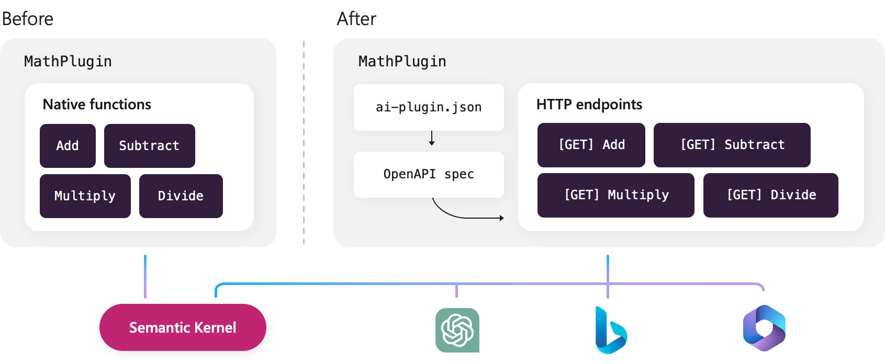

# Create and run ChatGPT plugins using Semantic Kernel

[!INCLUDE [pat_large.md](../includes/pat_large.md)]

In this article, we'll show you how to take a Semantic Kernel plugin and expose it to ChatGPT with Azure Functions. As an example, we'll demonstrate how to transform the `MathPlugin` we created in previous articles into a ChatGPT plugin.

At the [end of this article](./chatgpt-plugins.md#running-the-plugin-with-semantic-kernel), you'll also learn how to load a ChatGPT plugin into Semantic Kernel and use it with a planner.

Once we're done, you'll have an Azure Function that exposes each of your plugin's native functions as HTTP endpoints so they can be used by Semantic Kernel _or_ ChatGPT. If you want to see the final solution, you can check out the sample in the public documentation repository.


| Language  | Link to final solution |
| --- | --- |
| C# | [Open solution in GitHub](https://github.com/MicrosoftDocs/semantic-kernel-pr/tree/main/samples/dotnet/05-Create-ChatGPT-Plugin) |
| Python | _Coming soon_ |

## Prerequisites
To complete this tutorial, you'll need the following:
- [Azure Functions Core Tools](https://github.com/Azure/azure-functions-core-tools) version 4.x.
- [.NET 6.0 SDK.](https://dotnet.microsoft.com/download)

To publish your plugin once you're complete, you'll also need an Azure account with an active subscription. [Create an account for free](https://azure.microsoft.com/free/?ref=microsoft.com&utm_source=microsoft.com&utm_medium=docs&utm_campaign=visualstudio) and one of the following tools for creating Azure resources:
- [Azure CLI](/cli/azure/install-azure-cli) [version 2.4](/cli/azure/release-notes-azure-cli#april-21-2020) or later.
- The [Azure Az PowerShell module](/powershell/azure/install-azure-powershell) version 5.9.0 or later.

You do **_not_** need to have access to OpenAI's plugin preview to complete this tutorial. If you do have access, however, you can upload your final plugin to OpenAI and use it in ChatGPT at the very end.


## What are ChatGPT plugins?
In the [plugin article](./plugins.md#what-is-a-plugin) we described how all plugins are moving towards the common standard defined by OpenAI. This standard, which is called a ChatGPT plugin in this article, uses a plugin manifest file that points to an accompanying [OpenAPI specification](https://swagger.io/resources/open-api/). Plugins defined in this way can then be used by any application that supports the OpenAI specification, including Semantic Kernel and ChatGPT.

> [!Important]
> OpenAPI is different than OpenAI. OpenAPI is a specification for describing REST APIs, while OpenAI is a company that develops AI models and APIs. While the two are not related, OpenAI has adopted the OpenAPI specification for describing plugin APIs.

### Transforming our `MathPlugin` into a ChatGPT plugin
So far, however, we've only shown how to create plugins that are _natively_ loaded into Semantic Kernel instead of being exposed through an OpenAPI specification. This has helped us demonstrate the core concepts of plugins without adding the additional complexity of standing up an HTTP endpoint. With minimal changes, however, we can take the plugins we've already created and expose them to ChatGPT.



There are three steps we must take to turn our existing `MathPlugin` into a ChatGPT plugin:
1. Create HTTP endpoints for each native function.
2. Create an OpenAPI specification and plugin manifest file that describes our plugin.
3. Test the plugin in either Semantic Kernel or ChatGPT.


## Provide HTTP endpoints for each function
Before we can expose our plugin to other applications, we need to create an HTTP endpoint for each of our native functions. This will allow us to call our native functions from any other service. You can achieve this multiple ways, but in this article we'll use Azure Functions.

### Create a new Azure Function project
There are several ways to create an Azure Function, but in this article we'll use the Azure Functions Core Tools. If you are using Visual Studio or Visual Studio Code, you can also use the Azure Functions extension to create a new Azure Function project. For more information, see [Create your first function using Visual Studio](/azure/azure-functions/functions-create-your-first-function-visual-studio) or [Create your first function using Visual Studio Code](/azure/azure-functions/create-first-function-vs-code-csharp).

1. To create a new Azure Function project, run the following command in your terminal:

    ```bash
    func init MathPlugin --worker-runtime dotnet-isolated --target-framework net6.0
    ```

2. Navigate into the `MathPlugin` directory:

    ```bash
    cd MathPlugin
    ```

3. Open the _MathPlugin.csproj_ file.

3. Update the _MathPlugin.csproj_ file to include the following package references:

    ```xml
    <PackageReference Include="Microsoft.Azure.Functions.Worker" Version="1.17.0" />
    <PackageReference Include="Microsoft.Azure.Functions.Worker.Extensions.Http" Version="3.0.13" />
    <PackageReference Include="Microsoft.Azure.Functions.Worker.Sdk" Version="1.11.0" />
    ```

4. Open the _host.json_ file.

5. Update the _host.json_ file to include the following configuration:

    ```json
    {
        "version": "2.0",
        "logging": {
            "applicationInsights": {
                "samplingSettings": {
                    "isEnabled": true,
                    "excludedTypes": "Request"
                }
            }
        },
        "extensions": {
            "http": {
                "routePrefix": ""
            }
        }
    }
    ```

    > [!Note]
    > Later, this will allow us to serve up the plugin manifest file from the _.well-known_ directory as required by the OpenAI specification.

    

4. Run the following command to restore the packages:

    ```bash
    dotnet restore
    ```

### Add the native functions to the Azure Function project
We can now add our native functions to the Azure Function project.

1. Run the following command in your terminal to create placeholder for the `Add` function:

    ```bash
    func new --name Add --template "HTTP trigger" --authlevel "anonymous"
    ```
2. Open the _Add.cs_ file.
3. Replace the `Run` function with the following code:
    ```csharp
    [Function("Add")]
    public HttpResponseData Run([HttpTrigger(AuthorizationLevel.Function, "get", "post")] HttpRequestData req)
    {
        bool result1 = double.TryParse(req.Query["number1"], out double number1);
        bool result2 = double.TryParse(req.Query["number2"], out double number2);

        if (result1 && result2)
        {
            HttpResponseData response = req.CreateResponse(HttpStatusCode.OK);
            response.Headers.Add("Content-Type", "application/json");
            double sum = number1 + number2;
            response.WriteString(sum.ToString());
            
            return response;
        }
        else
        {
            HttpResponseData response = req.CreateResponse(HttpStatusCode.BadRequest);
            response.Headers.Add("Content-Type", "application/json");
            response.WriteString("Please pass two numbers on the query string or in the request body");

            return response;
        }
    }
    ```
4. Repeat the previous steps to create HTTP endpoints for the `Subtract`, `Multiply`, `Divide`, and `Sqrt` functions. When replacing the `Run` function, be sure to update the function name and logic for each function accordingly.

### Validate the HTTP endpoints
At this point, you should have five HTTP endpoints in your Azure Function project. You can test them by following these steps:

1. Run the following command in your terminal:
    ```bash
    func start
    ```
2. Open a new terminal window and run the following commands:
    ```bash
    curl "http://localhost:707/Add?number1=1&number2=2"
    curl "http://localhost:7071/Subtract?number1=1&number2=2"
    curl "http://localhost:7071/Multiply?number1=1&number2=2"
    curl "http://localhost:7071/Divide?number1=1&number2=2"
    curl "http://localhost:7071/Sqrt?number=9"
    ```

3. You should see the following responses:
    ```output
    3
    -1
    2
    0.5
    3
    ```

## Create the manifest files
Now that we have HTTP endpoints for each of our native functions, we need to create the files that will tell ChatGPT and other applications how to call them. We'll do this by creating an OpenAPI specification and plugin manifest file.

### Add an OpenAPI spec to your Azure Function project
An OpenAPI specification describes the HTTP endpoints that are available in your plugin. Instead of manually creating an OpenAPI specification, you can use NuGet packages provided by Azure Functions to automatically create and serve up these files. To add an OpenAPI specification to your Azure Function project, follow these steps:

1. Run the following commands in your Azure Function project directory:
    ```bash
    dotnet add package Microsoft.Azure.WebJobs.Extensions.OpenApi --version 1.5.1
    dotnet add package Microsoft.Azure.Functions.Worker.Extensions.OpenApi --version 1.5.1
    ```
2. Open the _Add.cs_ file.
3. Add the following `using` statements:
    ```csharp
    using Microsoft.Azure.WebJobs.Extensions.OpenApi.Core.Attributes;
    using Microsoft.OpenApi.Models;
    ```
4. Add the following attributes to the `Run` function:
    ```csharp
    [OpenApiOperation(operationId: "Add", tags: new[] { "ExecuteFunction" }, Description = "Adds two numbers.")]
    [OpenApiParameter(name: "number1", Description = "The first number to add'", Required = true, In = ParameterLocation.Query)]
    [OpenApiParameter(name: "number2", Description = "The second number to add", Required = true, In = ParameterLocation.Query)]
    [OpenApiResponseWithBody(statusCode: HttpStatusCode.OK, contentType: "application/json", bodyType: typeof(string), Description = "Returns the sum of the two numbers.")]
    [OpenApiResponseWithBody(statusCode: HttpStatusCode.BadRequest, contentType: "application/json", bodyType: typeof(string), Description = "Returns the error of the input.")]  
    ```
5. Repeat the previous steps for the `Subtract`, `Multiply`, `Divide`, and `Sqrt` functions. When adding the attributes, update the operation and parameter descriptions accordingly.

    > [!Important]
    > The `Description` fields are the most important attributes because they will be used by the planner to determine which function to call. We recommend reusing the same description values from the previous walkthroughs.

    | Function | Description |
    | --- | --- |
    | Add | Add two numbers. |
    | Subtract | Subtract two numbers. |
    | Multiply | Multiply two numbers. When increasing by a percentage, don't forget to add 1 to the percentage. |
    | Divide | Divide two numbers. |
    | Sqrt | Take the square root of a number. |

### Validate the OpenAPI spec
You can then test the OpenAPI document by following these steps:

1. Run the following command in your terminal:
    ```bash
    func start
    ```
2. Navigate to the following URL in your browser:
    ```bash
    http://localhost:7071/swagger/ui
    ```

3. You should see the following page:
    :::image type="content" source="../media/swagger-ui.png" alt-text="Swagger UI":::

4. Navigating to _http://localhost:7071/swagger.json_ will allow you to download the OpenAPI specification.

### Add the plugin manifest file
The last step is to serve up the plugin manifest file. Based on the OpenAI specification, the manifest file is always served up from the _/.well-known/ai-plugin.json_ file and contains the following information:

| Field | Type | Description | Required |
| --- | --- | --- | --- |
| schema_version | String | Manifest schema version | ✅ |
| name_for_model | String | Name the model will use to target the plugin (no spaces allowed, only letters and numbers). 50 character max. | ✅ |
| name_for_human | String | Human-readable name, such as the full company name. 20 character max. | ✅ |
| description_for_model | String | Description better tailored to the model, such as token context length considerations or keyword usage for improved plugin prompting. 8,000 character max. | ✅ |
| description_for_human | String | Human-readable description of the plugin. 100 character max. | ✅ |
| auth | ManifestAuth | Authentication schema | ✅ |
| api | Object | API specification | ✅ |
| logo_url | String | URL used to fetch the logo. Suggested size: 512 x 512. Transparent backgrounds are supported. Must be an image, no GIFs are allowed. | ✅ |
| contact_email | String | Email contact for safety/moderation | ✅ |
| legal_info_url | String | Redirect URL for users to view plugin information | ✅ |
| HttpAuthorizationType | HttpAuthorizationType | "bearer" or "basic" | ✅ |
| ManifestAuthType | ManifestAuthType | "none", "user_http", "service_http", or "oauth" |  |
| interface BaseManifestAuth | BaseManifestAuth | type: ManifestAuthType; instructions: string; |  |
| ManifestNoAuth | ManifestNoAuth | No authentication required: BaseManifestAuth & { type: 'none', } |  |
| ManifestAuth | ManifestAuth | ManifestNoAuth, ManifestServiceHttpAuth, ManifestUserHttpAuth, ManifestOAuthAuth |  |

To create an Azure Function that serves up this manifest, follow these steps:

1. Run the following command in your terminal:
    ```bash
    func new --name AIPluginJson --template "HTTP trigger" --authlevel "anonymous"
    ```
2. Open the _AIPluginJson.cs_ file.
3. Replace the `Run` method with the following code:
    ```csharp
    [Function("GetAiPluginJson")]
    public HttpResponseData Run([HttpTrigger(AuthorizationLevel.Function, "get", Route = ".well-known/ai-plugin.json")] HttpRequestData req)
    {
        var currentDomain = $"{req.Url.Scheme}://{req.Url.Host}:{req.Url.Port}";

        HttpResponseData response = req.CreateResponse(HttpStatusCode.OK);
        response.Headers.Add("Content-Type", "application/json");

        var json = $@"{{
        ""schema_version"": ""v1"",
        ""name_for_human"": ""TODO List"",
        ""name_for_model"": ""todo"",
        ""description_for_human"": ""This plugin performs basic math operations."",
        ""description_for_model"": ""Help the user perform math. You can add, subtract, multiple, divide, and perform square roots."",
        ""auth"": {{
            ""type"": ""none""
        }},
        ""api"": {{
            ""type"": ""openapi"",
            ""url"": ""{currentDomain}/swagger.json""
        }},
        ""logo_url"": ""{currentDomain}/logo.png"",
        ""contact_email"": ""support@example.com"",
        ""legal_info_url"": ""http://www.example.com/legal""
    }}";

        response.WriteString(json);

        return response;
    }
    ```

### Validate the plugin manifest file
You can then test that the plugin manifest file is being served up by following these steps:

1. Run the following command in your terminal:
    ```bash
    func start
    ```
2. Navigate to the following URL in your browser:
    ```bash
    http://localhost:7071/.well-known/ai-plugin.json
    ```

3. You should now see the plugin manifest file.
    :::image type="content" source="../media/ai-plugin-json.png" alt-text="ai-plugin.json file":::

## Testing the plugin end-to-end
You now have a complete plugin that can be used in Semantic Kernel and ChatGPT. Since there is currently a waitlist for creating plugins for ChatGPT, we'll first demonstrate how you can test your plugin with Semantic Kernel.

### Running the plugin with Semantic Kernel
By testing your plugin in Semantic Kernel, you can ensure that it is working as expected before you get access to the plugin developer portal for ChatGPT. While testing in Semantic Kernel, we recommend using the Stepwise Planner to invoke your plugin since it is the only planner that supports JSON responses.

To test the plugin in Semantic Kernel, follow these steps:

1. Create a new C# project.
2. Add the necessary Semantic Kernel NuGet packages:
    ```bash
    dotnet add package Microsoft.SemanticKernel
    dotnet add package Microsoft.SemanticKernel.Planning
    dotnet add package Microsoft.SemanticKernel.Skills.OpenAPI
    ```
3. Paste the following code into your _program.cs_ file:
    ```csharp
    using Microsoft.Extensions.Logging;
    using Microsoft.SemanticKernel;
    using Microsoft.SemanticKernel.Planning;

    // ... create a new Semantic Kernel instance here

    // Add the math plugin using the plugin manifest URL
    const string pluginManifestUrl = "http://localhost:7071/.well-known/ai-plugin.json";
    var mathPlugin = await kernel.ImportChatGptPluginSkillFromUrlAsync("MathPlugin", new Uri(pluginManifestUrl));

    // Create a stepwise planner and invoke it
    var planner = new StepwisePlanner(kernel);
    var question = "I have $2130.23. How much would I have after it grew by 24% and after I spent $5 on a latte?";
    var plan = planner.CreatePlan(question);
    var result = await plan.InvokeAsync(kernel.CreateNewContext());

    // Print the results
    Console.WriteLine("Result: " + result);

    // Print details about the plan
    if (result.Variables.TryGetValue("stepCount", out string? stepCount))
    {
        Console.WriteLine("Steps Taken: " + stepCount);
    }
    if (result.Variables.TryGetValue("skillCount", out string? skillCount))
    {
        Console.WriteLine("Skills Used: " + skillCount);
    }
    ```

4. After running the code, you should see the following output:

    ```output
    Result: After the amount grew by 24% and $5 was spent on a latte, you would have $2636.4852 remaining.
    Steps Taken: 3
    Skills Used: 2 (MathPlugin.Multiply(1), MathPlugin.Subtract(1))
    ```

### Running the plugin in ChatGPT
If you would like to test your plugin in ChatGPT, you can do so by following these steps:
1. Request access to plugin development by filling out the [waitlist form](https://openai.com/waitlist/plugins).
2. Once you have access, follow the steps [provided by OpenAI](https://platform.openai.com/docs/plugins/getting-started/running-a-plugin) to register your plugin.

## Next steps
Congratulations! You have successfully created a plugin that can be used in Semantic Kernel and ChatGPT. Once you have fully tested your plugin, you can deploy it to Azure Functions and register it with OpenAI. For more information, see the following resources:
- [Deploying Azure Functions](/azure/azure-functions/functions-deployment-technologies)
- [Submit a plugin to the OpenAI plugin store](https://platform.openai.com/docs/plugins/review)