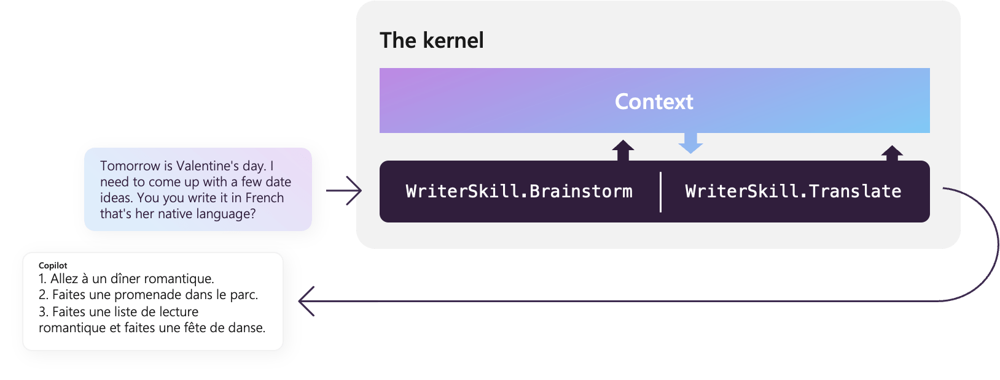

# Using the kernel to orchestrate AI

[!INCLUDE [pat_large.md](../includes/pat_large.md)]

The term "kernel" can have different meanings in different contexts, but in the case of the Semantic Kernel, the kernel refers to an instance of the processing engine that fulfills a user's request with a collection of [plugins](/semantic-kernel/concepts-sk/skills). 

> _Kernel_: "The core, center, or essence of an object or system." —[Wiktionary](/semantic-kernel/support/bibliography#kernel)


> [!Note]
> Skills are currently being renamed to plugins. This article has been updated to reflect the latest terminology, but some images and code samples may still refer to skills.

## How does the kernel work?
The kernel has been designed to encourage [function composition](https://en.wikipedia.org/wiki/Function_composition) which allows developers to combine and interconnect the input and outputs of plugins into a single pipeline. It achieves this by providing a context object that is passed to each plugin in the pipeline. The context object contains the outputs of all previous plugins so the current plugin can use them as inputs.




In this way, the kernel is very similar to the UNIX kernel and its pipes and filters architecture; only now, instead of chaining together programs, we are chaining together AI prompts and native functions.


## Using the kernel
To start using the kernel, you must first create an instance of it.

# [C#](#tab/Csharp)

```csharp
using Microsoft.SemanticKernel;

// Set Simple kernel instance
IKernel kernel_1 = KernelBuilder.Create();
```

# [Python](#tab/python)

```python
import semantic_kernel as sk

kernel = sk.Kernel()
```

---

### Customizing the kernel
The kernel can also be customized to change how it behaves. During instantiation you can adjust the following properties:

- The initial set of plugins
- The prompt template engine
- The logging engine
- The memory store

Below is an example of how to instantiate the kernel with a custom logger in both C# and Python.


> [!TIP]
> To see these code samples in action, we recommend checking out the [Loading the kernel](../get-started/quick-start-guide/loading-the-kernel.md) guide to explore different ways to load the kernel in a C# or Python notebook.

# [C#](#tab/Csharp)

You can use the `KernelBuilder` class to create a kernel with custom configuration. The following code snippet shows how to create a kernel with a logger.

```csharp
using Microsoft.Extensions.Logging;
using Microsoft.Extensions.Logging.Abstractions;

ILogger myLogger = NullLogger.Instance;
IKernel kernel_2 = Kernel.Builder
    .WithLogger(myLogger)
    .Build();
```

Additionally, you can create a kernel using a configuration object. This is useful if you want to define a configuration elsewhere in your code and then inject it into the kernel.

```csharp
var config = new KernelConfig();
IKernel kernel_3 = Kernel.Builder
    .WithConfiguration(config)
    .Build();
```

# [Python](#tab/python)

You can pass in custom configuration into the  `Kernel()` method to create a kernel with custom settings. The following code snippet shows how to create a kernel with a logger.

```python
my_logger = sk.NullLogger()
kernel_2 = sk.Kernel(log=my_logger)
```

---

### Adding an AI model to the kernel
To add an AI model to the kernel, we can use the out-of-the-box connectors that Semantic Kernel provides. Remember, connectors are what allow you to give you AI a "brain." In this case, we're giving the kernel the ability to think by adding a model. Later, when you learn about [memory](../memories/index.md), you'll see how to give the kernel the ability to remember with connectors.

The following code snippets show how to add a model to the kernel in C# and Python.

# [C#](#tab/Csharp)

```csharp
Kernel.Builder
.WithAzureTextCompletionService(
    "my-finetuned-Curie",                   // Azure OpenAI *Deployment Name*
    "https://contoso.openai.azure.com/",    // Azure OpenAI *Endpoint*
    "...your Azure OpenAI Key..."           // Azure OpenAI *Key*
)
.WithOpenAITextCompletionService(
    "text-davinci-003",                     // OpenAI Model Name
    "...your OpenAI API Key...",            // OpenAI API key
    "...your OpenAI Org ID..."              // *optional* OpenAI Organization ID
)
.WithAzureChatCompletionService(
    "gpt-35-turbo",                         // Azure OpenAI *Deployment Name*
    "https://contoso.openai.azure.com/",    // Azure OpenAI *Endpoint*
    "...your Azure OpenAI Key..."           // Azure OpenAI *Key*
)
.WithOpenAIChatCompletionService(
    "gpt-3.5-turbo",                        // OpenAI Model Name
    "...your OpenAI API Key...",            // OpenAI API key
    "...your OpenAI Org ID..."              // *optional* OpenAI Organization ID
);
```

# [Python](#tab/python)
To add AI models to the kernel in Python, you can use the `add_text_completion_service` method. Depending on which AI service you want to use, you can either use the `AzureTextCompletion` or `OpenAITextCompletion` classes.

```python
kernel = sk.Kernel()

kernel.add_text_completion_service(           # We are adding a text service
    "Azure_curie",                            # The alias we can use in prompt templates' config.json
    AzureTextCompletion(
        "my-finetuned-Curie",                 # Azure OpenAI *Deployment ID*
        "https://contoso.openai.azure.com/",  # Azure OpenAI *Endpoint*
        "...your Azure OpenAI Key..."         # Azure OpenAI *Key*
    )
)

kernel.add_text_completion_service(           # We are adding a text service
    "OpenAI_davinci",                         # The alias we can use in prompt templates' config.json
    OpenAITextCompletion(
        "text-davinci-003",                   # OpenAI Model Name
        "...your OpenAI API Key...",          # OpenAI API key
        "...your OpenAI Org ID..."            # *optional* OpenAI Organization ID
    )
)
```

---


### Importing and registering plugins
Now that you have an instance of the kernel with an AI model, you can start adding plugins to it which will give it the ability to fulfill user requests. Below you can see how to import and register plugins, both from a file and inline.

> [!TIP]
> Many of the code samples below come from the quick start notebooks. To follow along (and to learn more about how the code works), we recommend checking out the [Running prompts from files](../get-started/quick-start-guide/running-prompts-from-files.md) and [Running semantic functions inline](../get-started/quick-start-guide/semantic-function-inline.md) guides.


The following example leverages the sample [`FunSkill` plugin](https://github.com/microsoft/semantic-kernel/tree/main/samples/skills/FunSkill) that comes with the Semantic Kernel repo.

# [C#](#tab/Csharp)

```csharp
var skillsDirectory = Path.Combine(System.IO.Directory.GetCurrentDirectory(), "..", "..", "skills");

var funSkillFunctions = kernel.ImportSemanticSkillFromDirectory(skillsDirectory, "FunSkill");
var jokeFunction = funSkillFunctions["Joke"];
```

# [Python](#tab/python)

```python
skills_directory = "../../skills"

funFunctions = kernel.import_semantic_skill_from_directory(skills_directory, "FunSkill")

jokeFunction = funFunctions["Joke"]
```

---

Alternatively, you can register a semantic function inline. To do so, you'll start by defining the semantic prompt and its configuration. The following samples show how you could have registered the same `Joke` function from the `FunSkill` plugin inline.

# [C#](#tab/Csharp)
Create the semantic prompt as a string.

```csharp
string skPrompt = @"WRITE EXACTLY ONE JOKE or HUMOROUS STORY ABOUT THE TOPIC BELOW

JOKE MUST BE:
- G RATED
- WORKPLACE/FAMILY SAFE
NO SEXISM, RACISM OR OTHER BIAS/BIGOTRY

BE CREATIVE AND FUNNY. I WANT TO LAUGH.
+++++

{{$input}}
+++++

";
```

Create the prompt configuration.

```csharp
var promptConfig = new PromptTemplateConfig
{
    Completion =
    {
        MaxTokens = 1000,
        Temperature = 0.9,
        TopP = 0.0,
        PresencePenalty = 0.0,
        FrequencyPenalty = 0.0,
    }
};
```

Register the semantic function.

```csharp
var promptTemplate = new PromptTemplate(
    skPrompt,
    promptConfig,
    kernel
);

var functionConfig = new SemanticFunctionConfig(promptConfig, promptTemplate);
var jokeFunction = kernel.RegisterSemanticFunction("FunSkill", "Joke", functionConfig);
```

# [Python](#tab/python)

Create the semantic prompt as a string.

```python
prompt = """
WRITE EXACTLY ONE JOKE or HUMOROUS STORY ABOUT THE TOPIC BELOW

JOKE MUST BE:
- G RATED
- WORKPLACE/FAMILY SAFE
NO SEXISM, RACISM OR OTHER BIAS/BIGOTRY

BE CREATIVE AND FUNNY. I WANT TO LAUGH.
+++++

{{$input}}
+++++
"""
```

Register the prompt with configuration.

```python
jokeFunction = kernel.create_semantic_function(
        prompt,
        max_tokens=1000,
        temperature=0.9,
        top_p=0.0,
        presence_penalty=0.0,
        frequency_penalty=0.0,
    )
```

---

### Running a function from a plugin
Whether you imported a plugin from a file or registered it inline, you can now run the plugin to fulfill a user request. Below you can see how to run the joke function you registered above by passing in an input.

# [C#](#tab/Csharp)

```csharp
var result = await jokeFunction.InvokeAsync("time travel to dinosaur age");

Console.WriteLine(result);
```

# [Python](#tab/python)

```python
result = await jokeFunction.invoke_async("time travel to dinosaur age")

print(result)
```

---

After running the above code examples, you should receive an output like the following. 

```output
A time traveler went back to the dinosaur age and was amazed by the size of the creatures. He asked one of the dinosaurs, "How do you manage to get around with such short legs?"

The dinosaur replied, "It's easy, I just take my time!"
```

### Chaining functions within plugins
If you have multiple functions, you can chain them together to create a pipeline. The kernel will automatically pass the outputs of each plugin to the next plugin in the pipeline using the `$input` variable. You can learn more about how to chain functions in the [chaining plugins](./chaining-functions.md) article.

# [C#](#tab/Csharp)
Create and register the semantic functions.

```csharp
string myJokePrompt = """
Tell a short joke about {{$INPUT}}.
""";
string myPoemPrompt = """
Take this "{{$INPUT}}" and convert it to a nursery rhyme.
""";
string myMenuPrompt = """
Make this poem "{{$INPUT}}" influence the three items in a coffee shop menu. 
The menu reads in enumerated form:

""";

var myJokeFunction = kernel.CreateSemanticFunction(myJokePrompt, maxTokens: 500);
var myPoemFunction = kernel.CreateSemanticFunction(myPoemPrompt, maxTokens: 500);
var myMenuFunction = kernel.CreateSemanticFunction(myMenuPrompt, maxTokens: 500);
```

Create and run the pipeline.

```csharp
var myOutput = await kernel.RunAsync(
    "Charlie Brown",
    myJokeFunction,
    myPoemFunction,
    myMenuFunction);

Console.WriteLine(myOutput);
```

# [Python](#tab/python)

Create and register the semantic functions.

```python
myJokePrompt = """Tell a short joke about {{$INPUT}}."""
myPoemPrompt = """Take this "{{$INPUT}}" and convert it to a nursery rhyme.""";
myMenuPrompt = """Make this poem "{{$INPUT}}" influence the three items in a coffee shop menu. 
The menu reads in enumerated form:
""";
```

Create and run the pipeline.

```python
myJokeFunction = kernel.create_semantic_function(myJokePrompt, max_tokens=500)
myPoemFunction = kernel.create_semantic_function(myPoemPrompt, max_tokens=500)
myMenuFunction = kernel.create_semantic_function(myMenuPrompt, max_tokens=500)

input_text = "Charlie Brown"

myOutput = await kernel.run_async(
    myJokeFunction, myPoemFunction, myMenuFunction, input_str=input_text
)

print(myOutput)
```

---

The above code will output something like the following.

```output
1. Colossus of Memnon Latte - A creamy latte with a hint of sweetness, just like the awe-inspiring statue.

2. Gasp and Groan Mocha - A rich and indulgent mocha that will make you gasp and groan with delight.

3. Heart Skipping a Beat Frappuccino - A refreshing frappuccino with a hint of sweetness that will make your heart skip a beat.
```

## Take the next step
This article only scratches the surface of what you can do with the kernel. To learn more about additional features, check out the following articles.

| Your goal     | Next step     |
|--------------|-----------|
| Learn what plugins are and what they can do | [Understand AI plugins](./plugins.md) |
| Create more advanced pipelines with Semantic Kernel | [Chaining functions together](./chaining-functions.md) |
| Automatically creating pipelines with Planner |  [Auto create plans with planner](./planner.md) |
| Simulating memory within Semantic Kernel |  [Give you AI memories](../memories/index.md) |

> [!div class="nextstepaction"]
> [Understanding plugins](./plugins.md)