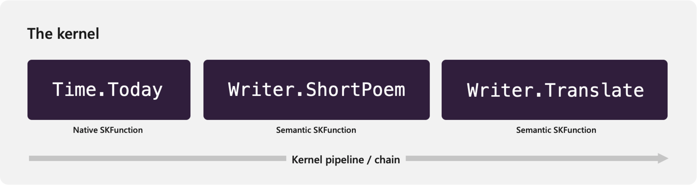

# Understanding the kernel in Semantic Kernel

[!INCLUDE [pat_large.md](../../includes/pat_large.md)]

> _Kernel_: "The core, center, or essence of an object or system." —[Wiktionary](/semantic-kernel/support/bibliography#kernel)

Similar to operating system, the kernel is responsible for managing resources that are necessary to run "code" in an AI application. This includes managing the configuration, services, and plugins that are necessary for both native code and AI services to run together.

If you want to see the code demonstrated in this article run in a complete solution, you can check out the following samples in the public documentation repository.

| Language  | Link to final solution |
| --- | --- |
| C# | [Open solution in GitHub](https://github.com/MicrosoftDocs/semantic-kernel-docs/tree/main/samples/dotnet/01-Kernel-Intro) |
| Python | [Open solution in GitHub](https://github.com/MicrosoftDocs/semantic-kernel-docs/tree/main/samples/python/01-Kernel-Intro) |

## Using native and AI services together
Semantic Kernel makes it easy to run AI services alongside native code by treating calls to AI services as first-class citizens called "semantic functions."

Semantic functions are discussed more deeply in their [own section](../plugins/semantic-functions/inline-semantic-functions.md), but for now, it is important to understand that both native and semantic functions behave the _same way_ within Semantic Kernel. This is thanks to the fact that both are expressed as [SKFunction](/dotnet/api/microsoft.semantickernel.skilldefinition.skfunction) objects. Because of this, they can each be triggered the same way by the kernel. This is important because it allows the kernel to run both types of functions indiscriminately.

In the example above, you can see the kernel is able to run a native function to get the current time and then run a semantic function to generate a poem about the time in a different language.

### Running functions using the kernel
To run `SKFunction` objects, Semantic Kernel provides the [RunAsync](/dotnet/api/microsoft.semantickernel.kernel.runasync) method within the [Kernel](/dotnet/api/microsoft.semantickernel.kernel) class. This method takes one or more `SKFunction` objects and executes them sequentially. For example, the following code runs a single native function from the [Time plugin](../plugins/out-of-the-box-plugins.md) and returns back the result:

# [C#](#tab/Csharp)
Import the necessary packages:
:::code language="csharp" source="~/../samples/dotnet/01-Kernel-Intro/Program.cs" range="6-7":::

Run the today function from the time plugin:
:::code language="csharp" source="~/../samples/dotnet/01-Kernel-Intro/Program.cs" range="9-14" highlight="4":::
# [Python](#tab/python)
Import the necessary packages:
:::code language="python" source="~/../samples/python/01-Kernel-Intro/main.py" range="2-3":::

Run the today function from the time plugin:
:::code language="python" source="~/../samples/python/01-Kernel-Intro/main.py" range="12-17" highlight="4":::

---

After running this, you should see today's date printed to the console.

## Creating the kernel runtime environment
To run anything more complex than a simple native function, however, you must ensure the kernel's runtime is appropriately configured. This is particularly important for semantic functions that require access to AI services.

### Runtime properties managed by the kernel
By investigating the [constructor](/dotnet/api/microsoft.semantickernel.kernel.-ctor) of the `Kernel` class, you can see that you can configure multiple settings that are necessary to run both native and semantic functions. These include:
- The default [AI service](/dotnet/api/microsoft.semantickernel.services.iaiserviceprovider) that will power your semantic functions.
- The [template engine](/dotnet/api/microsoft.semantickernel.templateengine.iprompttemplateengine) used to render prompt templates.
- The [logger](/dotnet/api/microsoft.extensions.logging.ilogger) used to log messages from functions.
- The [plugins](/dotnet/api/microsoft.semantickernel.skilldefinition.iskillcollection) that are available to be executed.
- Additional configuration used by the kernel via the [KernelConfig](/dotnet/api/microsoft.semantickernel.kernelconfig) class.

### Configuring the kernel
Depending on your language of choice, you can configure the kernel in different ways. For example, in C#, you can use the `Kernel.Builder` class to create a kernel, whereas with Python, you can iteratively add properties to the `Kernel` object.

In the following examples, you can see how to add a chat completion service and a logger to the kernel.

# [C#](#tab/Csharp)
If you are using a Azure OpenAI, you can use the [WithAzureChatCompletionService](/dotnet/api/microsoft.semantickernel.openaikernelbuilderextensions.withazurechatcompletionservice) method.

:::code language="csharp" source="~/../samples/dotnet/01-Kernel-Intro/Program.cs" range="34-41":::

If you are using OpenAI, you can use the [WithOpenAIChatCompletionService](/dotnet/api/microsoft.semantickernel.openaikernelbuilderextensions.withopenaichatcompletionservice) method.

:::code language="csharp" source="~/../samples/dotnet/01-Kernel-Intro/Program.cs" range="65-72":::

# [Python](#tab/python)
If you are using a Azure OpenAI, you can use the `AzureChatCompletion` class.

:::code language="csharp" source="~/../samples/python/01-Kernel-Intro/main.py" range="24-32":::

If you are using OpenAI, you can use the `OpenAIChatCompletion` class.

:::code language="csharp" source="~/../samples/python/01-Kernel-Intro/main.py" range="34-42":::

---

### Going further with the kernel
For more details on how to configure and leverage these properties, please refer to the following articles:

| Article | Description |
|---------|-------------|
| [Adding services](./adding-services.md) | Learn how to add services from OpenAI, Azure OpenAI, Hugging Face, and more to the kernel. |
| [Adding telemetry and logs](https://devblogs.microsoft.com/semantic-kernel/unlock-the-power-of-telemetry-in-semantic-kernel-sdk/) | Gain visibility into what Semantic Kernel is doing by adding telemetry to the kernel. |

## Next steps
Once you're done configuring the kernel, you can start creating custom functions by developing your own plugins.

> [!div class="nextstepaction"]
> [Create a plugin for Semantic Kernel](../plugins/index.md)