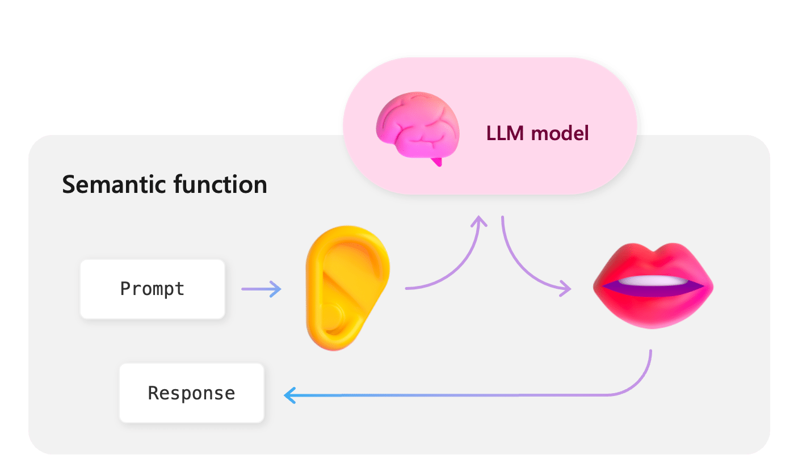
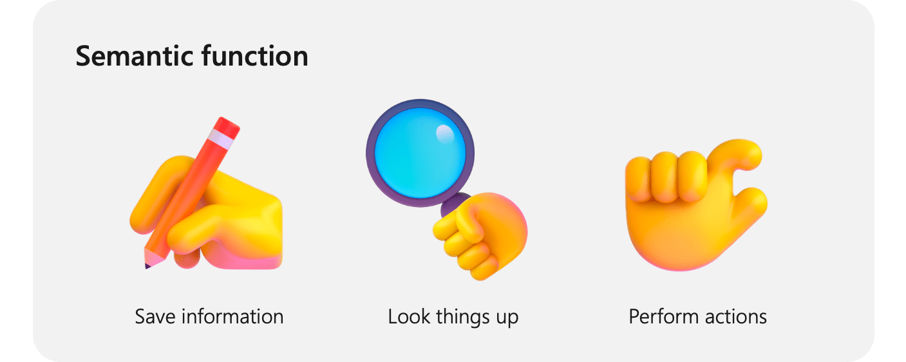

# Using AI plugins in Semantic Kernel

[!INCLUDE [pat_large.md](../includes/pat_large.md)]

With plugins, you can encapsulate AI capabilities into a single unit of functionality. Plugins are the building blocks of the Semantic Kernel and can interoperate with plugins in ChatGPT, Bing, and Microsoft 365.

> [!Note]
> Skills are currently being renamed to plugins. This article has been updated to reflect the latest terminology, but some images and code samples may still refer to skills.

## What is a plugin?
To drive alignment across the industry, we've adopted the [OpenAI plugin specification](https://platform.openai.com/docs/plugins/getting-started/) as the standard for plugins. This will help create an ecosystem of interoperable plugins that can be used across all of the major AI apps and services like ChatGPT, Bing, and Microsoft 365.

:::row:::
   :::column span="2":::
        
   :::column-end:::
   :::column span="1":::
      For developers using Semantic Kernel, this means any plugins you build will soon be usable in ChatGPT, Bing, and Microsoft 365, allowing you to increase the reach of your AI capabilities without rewriting your code. It also means that plugins built for ChatGPT, Bing, and Microsoft 365 will be able to integrate with Semantic Kernel.
   :::column-end:::
:::row-end:::

To show how to make interoperable plugins, we've created an in-depth walkthrough on how to create a ChatGPT plugin using OpenAI's specification and how to use that _same_ plugin in Semantic Kernel. You can find the walkthrough in the [Create and run ChatGPT plugins](./chatgpt-plugins.md) article.

### What does a plugin look like?
At a high-level, a plugin is a group of functions that can be exposed to AI apps and services. The functions within plugins can then be orchestrated by an AI application to accomplish user requests. Within Semantic Kernel, you can invoke these functions either manually (see [chaining functions](./chaining-functions.md)) or automatically with a [planner](./planner.md).

_Just_ providing functions, however, is not enough to make a plugin. To power automatic orchestration with a [planner](./planner.md), plugins _also_ need to provide details that semantically describe how they behave. Everything from the function's input, output, and side effects need to be described in a way that the AI can understand, otherwise, planner will provide unexpected results.

:::row:::
   :::column span="1":::
      For example, in the [`WriterSkill` plugin](https://github.com/microsoft/semantic-kernel/tree/main/samples/skills/WriterSkill), each function has a semantic description that describes what the function does. Planner can then use this description to choose the best function to call based on a user's ask.
      
      In the picture on the right, planner would likely use the `ShortPoem` and `StoryGen` functions to satisfy the users ask thanks to the provided semantic descriptions.
   :::column-end:::
   :::column span="3":::
        
   :::column-end:::
:::row-end:::

## Adding functions to plugins
Now that you know what a plugin is, let's take a look at how to create one. Within a plugin, you can create two types of functions: semantic functions and native functions. The following sections describe how to create each type. For further details, please refer to the [Creating semantic functions](./semantic-functions.md) and [Creating native functions](./native-functions.md) articles.

:::row:::
   :::column span="2":::
      ### Semantic functions

      If plugins represent the "[body](../overview/index.md#semantic-kernel-makes-ai-development-extensible)" of your AI app, then semantic functions would represent the ears and mouth of your AI. They allow your AI app to listen to users asks and respond back with a natural language response.
      
      To connect the ears and the mouth to the "brain," Semantic Kernel uses connectors. This allows you to easily swap out the AI services without rewriting code.
   :::column-end:::
   :::column span="3":::
        
   :::column-end:::
:::row-end:::

Below is an sample called `Summarize` that can be found in the [samples folder](https://github.com/microsoft/semantic-kernel/tree/main/samples/skills/SummarizeSkill/Summarize) in the GitHub repository.


```Prompt
[SUMMARIZATION RULES]
DONT WASTE WORDS
USE SHORT, CLEAR, COMPLETE SENTENCES.
DO NOT USE BULLET POINTS OR DASHES.
USE ACTIVE VOICE.
MAXIMIZE DETAIL, MEANING
FOCUS ON THE CONTENT

[BANNED PHRASES]
This article
This document
This page
This material
[END LIST]

Summarize:
Hello how are you?
+++++
Hello

Summarize this
{{$input}}
+++++
```

To semantically describe this function (as well as define the configuration for the AI service), you must also create a _config.json_ file in the same folder as the prompt. This file describes the function's input parameters and description. Below is the _config.json_ file for the `Summarize` function.

```json
{
  "schema": 1,
  "type": "completion",
  "description": "Summarize given text or any text document",
  "completion": {
    "max_tokens": 512,
    "temperature": 0.0,
    "top_p": 0.0,
    "presence_penalty": 0.0,
    "frequency_penalty": 0.0
  },
  "input": {
    "parameters": [
      {
        "name": "input",
        "description": "Text to summarize",
        "defaultValue": ""
      }
    ]
  }
}
```

Both `description` fields are used by [planner](./planner.md), so it's important to provide a detailed, yet concise, description so planner can make the best decision when orchestrating functions together. We recommend testing multiple descriptions to see which one works best for the widest range of scenarios.

You can learn more about creating semantic functions in the [Creating semantic functions](./semantic-functions.md) article. In this article you'll learn the best practices for the following:
> [!div class="checklist"]
> * How to create semantic functions
> * Adding input parameters
> * Calling functions within semantic functions

> [!div class="nextstepaction"]
> [Learn more about creating semantic functions](./semantic-functions.md)

### Native functions

:::row:::
   :::column span="2":::
      With native functions, you can have the kernel call C# or Python code directly so that you can manipulate data or perform other operations. In this way, native functions are like the hands of your AI app. They can be used to save data, retrieve data, and perform any other operation that you can do in code that is ill-suited for LLMs (e.g., performing calculations).
   :::column-end:::
   :::column span="3":::
        
   :::column-end:::
:::row-end:::


Instead of providing a separate configuration file with semantic descriptions, planner is able to use annotations in the code to understand how the function behaves. Below are examples of the annotations used by planner in both C# and Python for out-of-the-box native functions.

# [C#](#tab/Csharp)
The following code is an excerpt from the `DocumentSkill` plugin, which can be found in the [document plugin](https://github.com/microsoft/semantic-kernel/tree/main/dotnet/src/Skills/Skills.Document) folder in the GitHub repository. It demonstrates how you can use the `SKFunction` and `SKFunctionInput` attributes to describe the function's input and output to planner.

```csharp
[SKFunction("Read all text from a document")]
[SKFunctionInput(Description = "Path to the file to read")]
public async Task<string> ReadTextAsync(string filePath, SKContext context)
{
    this._logger.LogInformation("Reading text from {0}", filePath);
    using var stream = await this._fileSystemConnector.GetFileContentStreamAsync(filePath, context.CancellationToken).ConfigureAwait(false);
    return this._documentConnector.ReadText(stream);
}
```

# [Python](#tab/python)

The following code is an excerpt from the `MathSkill` plugin, which can be found in the [core skills](https://github.com/microsoft/semantic-kernel/tree/main/python/semantic_kernel/core_skills) folder in the GitHub repository. It demonstrates how you can use the `sk_function` and `sk_function_context_parameter` decorators to describe the function's input and output to planner.

```python
@sk_function(
    description="Adds value to a value",
    name="Add",
    input_description="The value to add",
)
@sk_function_context_parameter(
    name="Amount",
    description="Amount to add",
)
def add(self, initial_value_text: str, context: SKContext) -> str:
    """
    Returns the Addition result of initial and amount values provided.

    :param initial_value_text: Initial value as string to add the specified amount
    :param context: Contains the context to get the numbers from
    :return: The resulting sum as a string
    """
    return MathSkill.add_or_subtract(initial_value_text, context, add=True)
```

---

You can learn more about creating native functions in the [Creating native functions](./native-functions.md) article. In this article you'll learn the best practices for the following:
> [!div class="checklist"]
> * How to create simple native functions
> * Calling Semantic Kernel functions from within native functions
> * Different ways to invoke native functions

> [!div class="nextstepaction"]
> [Learn more about creating native functions](./semantic-functions.md)

## Take the next step
Now that you understand the basics of plugins, you can now go deeper into the details of creating semantic and native functions for your plugin.

> [!div class="nextstepaction"]
> [Create a semantic function](./semantic-functions.md)

