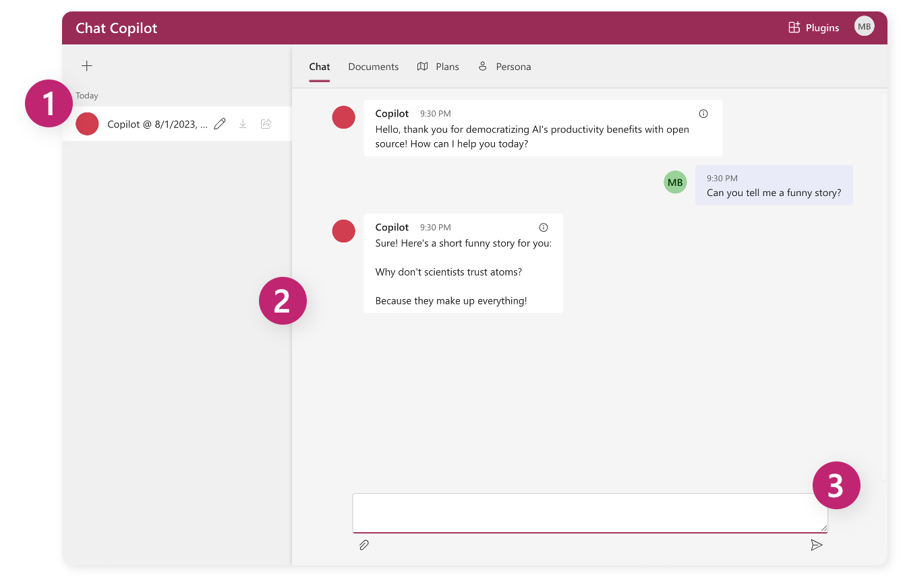
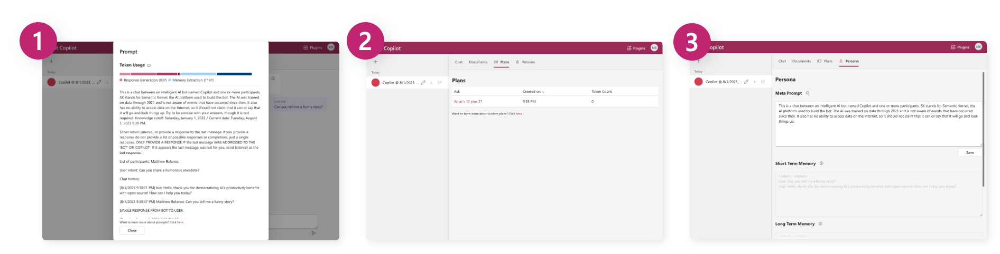

# Chat Copilot: A reference application for Semantic Kernel

[!INCLUDE [subheader.md](../includes/pat_large.md)]

Chat Copilot provides a reference application for building a chat experience using Semantic Kernel with an AI agent. The Semantic Kernel team built this application so that you could see how the different concepts of the platform come together to create a single conversational experience. These include leveraging [plugins](../agents/plugins/index.md), [planners](../agents/planners/index.md), and AI [memories](../memories/index.md).

:::image type="content" source="../media/chat-copilot-in-action.gif" alt-text="Chat Copilot in action":::

To access the app, check it out on its [GitHub repo: Chat Copilot](https://github.com/microsoft/chat-copilot).

## Exploring the app
With Chat Copilot, you'll have access to an experience that is similar to the paid version of ChatGPT. You can create new conversations with an agent and ask it to perform requests using [ChatGPT plugins](../agents/plugins/openai-plugins.md).

| Feature | Name | Description |
|:-|:-|:-|
| **1** | Conversation Pane | The left portion of the screen shows different conversation threads the user is holding with the agent.  To start a new conversation, click the **+** symbol. |
| **2** | Conversation Thread | Agent responses will appear in the main conversation thread, along with a history of your prompts. Users can scroll up and down to review a complete conversation history. |
| **3** | Prompt Entry Box | The bottom of the screen contains the prompt entry box, where users can type their prompts, and click the send icon to the right of the box when ready to send it to the agent. |

## Learning from the app
What's different about Chat Copilot from ChatGPT is that it _also_ provides debugging and learning features that demonstrate how the agent is working behind the scenes. This includes the ability to see the results of planner, the meta prompt used to generate a agent's response, and what its memory looks like. With this information, you can see how the agent is working and debug issues that you may encounter.

| Feature | Name | Description |
|:-|:-|:-|
| **1** | Prompt inspector | By selecting the info icon on any of the agent replies, you can see the full prompt that was used to generate the response. This is helpful to see how things like memory and plan results are given to the agent. Additionally, it shows how many tokens were used to generate each response. |
| **2** | Plan tab | See all of the plans that were created by the agent. Selecting a plan will show the JSON representation of the plan so that you can identify any issues with it. |
| **3** | Persona tab | View details that impact the personality of the agent like the meta prompt and the memories it has developed during the conversation. |

This makes Chat Copilot a great [test bed](./testing-plugins-with-chat-copilot.md) for any plugins you create. By uploading your plugins to Chat Copilot, you can test them out and see how they work with the rest of the platform. 

## Next step
Now that you know what Chat Copilot is capable of, you can now follow the getting started guide to run the app locally.

> [!div class="nextstepaction"]
> [Getting started with Chat Copilot](./getting-started.md)