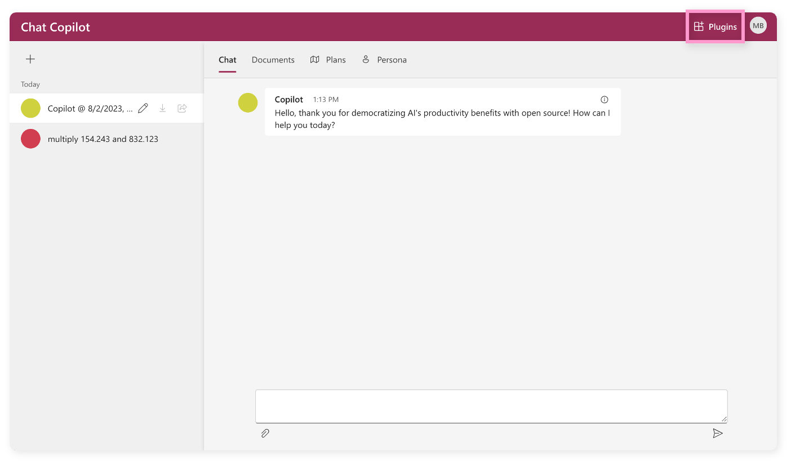
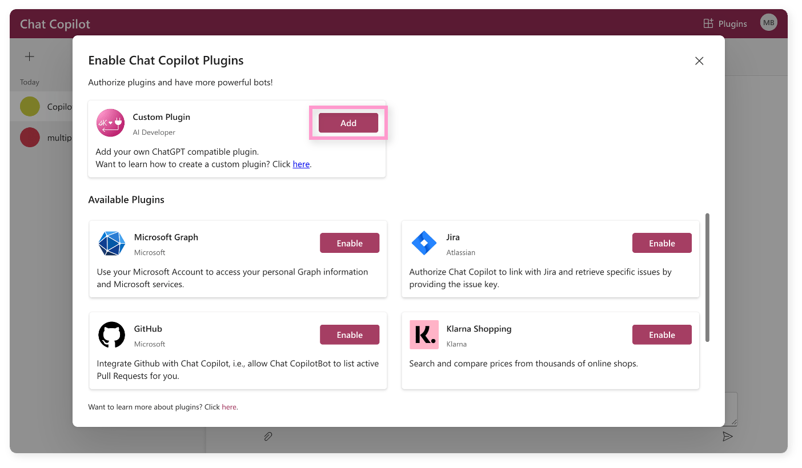
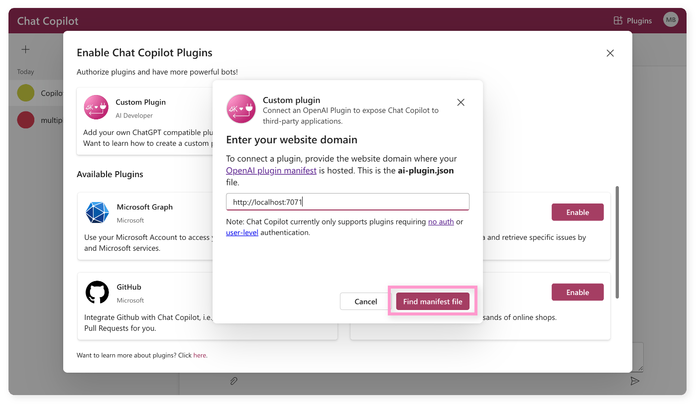
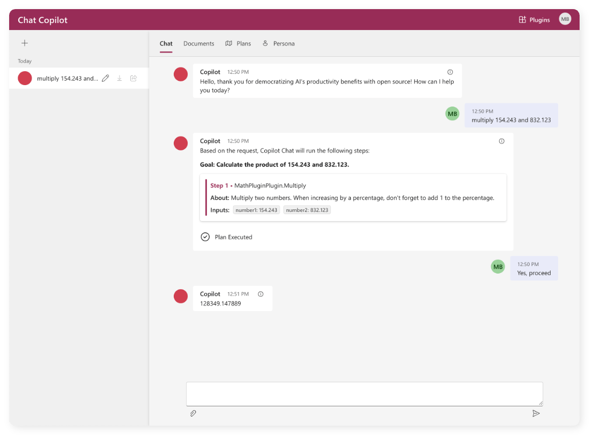

# Test your ChatGPT plugins with Chat Copilot
[!INCLUDE [subheader.md](../includes/pat_large.md)]

Chat Copilot allows you to import your own OpenAI plugins and test them in a safe environment. This article will walk you through the process of importing and testing your own OpenAI plugins.

## Prerequisites
Before you can import your own OpenAI plugins, you'll first need to have a Chat Copilot instance running. For more information on how to do this, see the [getting started](./getting-started.md) article.

Additionally, you will need to make sure that the CORS settings for your ChatGPT plugins are configured to allow requests from your Chat Copilot instance. For example, if you are running Chat Copilot locally, you will need to make sure that your ChatGPT plugins are configured to allow requests from _http://localhost:3000_.

## Why test your ChatGPT plugins with Chat Copilot?
As mentioned in the [plugin](../agents/plugins/index.md) article, plugins are the combination of logic (either expressed as native functions or prompts) _and_ their semantic descriptions. Without appropriate semantic descriptions, the planner will not be able to use your plugin.

With Chat Copilot, you can test the effectiveness of your semantic descriptions by seeing how well either the action planner or sequential planner can use your plugin. This will allow you to iterate on your semantic descriptions until you are satisfied with the results. 

## Importing your ChatGPT plugins
Once you have a Chat Copilot instance running, you can import your ChatGPT plugins directly from within the Chat Copilot user interface. To do this, follow these steps:

1. Select the **Plugins** button in the top right corner of the screen.
    
2. In the **Enable Chat Copilot Plugins** dialog, select the **Add** button within the **Custom Plugin** card.
    
3. Paste in the URL of your ChatGPT plugin and select the **Find manifest file** button.
    
4. After your plugin has been validated, select **Add plugin**.
    > [!NOTE]
    > If your plugin is not validating correctly, make sure your plugin is configured to allow requests from your Chat Copilot instance. For more information, see the [prerequisites](#prerequisites) section of this article.
5. At this point, your plugin has been imported, but it has _not_ been enabled. To enable your plugin, scroll to the bottom of the **Enable Chat Copilot Plugins** dialog and select the **Enable** button for your plugin.
6. Congrats! You can now use your plugin in a conversation with the Chat Copilot agent.

## Testing your ChatGPT plugins
Once you have imported and enabled your ChatGPT plugins, you can now test them out. To do this, simply make a request to your Chat Copilot instance that should trigger the use of your plugin. For example, if you have built and deployed the Math plugin in the [ChatGPT plugin article](../agents/plugins/openai-plugins.md), you can follow the steps below to test it out.

1. Ensure that the Math plugin has been imported and enabled in your Chat Copilot instance using the steps outlined in the [importing your ChatGPT plugins](#importing-your-chatgpt-plugins) section of this article.
2. Create a new chat by selecting the **+** button in the top left corner.
3. Ask the agent in the new chat to "multiply 154.243 and 832.123".
4. Afterwards, the agent should reply back with a plan to complete the task.
    > [!TIP]
    > If a plan is not generated, this means the planner did not think your plugin was a good fit for the request. This could be due to a number of reasons, but the most common is that your semantic descriptions are not helpful enough. To fix this, you can iterate on your semantic descriptions. You can also try changing the `RelevancyThreshold` as described in the [choosing a planner](./customizing-chat-copilot.md#choosing-a-planner) section.
5. Select **Yes, proceed** to approve of the plan.
6. The agent should now reply back with the result of the multiplication.
    

    > [!WARNING]
    > There is a known issue with Sequential planner that does not allow it to successfully pass results from one ChatGPT function to another ChatGPT function. This is being tracked in [this issue](https://github.com/microsoft/semantic-kernel/issues/2280).
7. To see how the plan result was used to generate the agent response, select the info icon in the top right corner of the last chat reply. The results from the plan should appear in a section between the `[RELATED START]` and `[RELATED END]` tags.

## Next step
Now that you have imported and tested your ChatGPT plugins, you can now learn how to deploy Chat Copilot so you can use Chat Copilot with others in your company.

> [!div class="nextstepaction"]
> [Deploy Chat Copilot](./deploy-to-azure.md)
