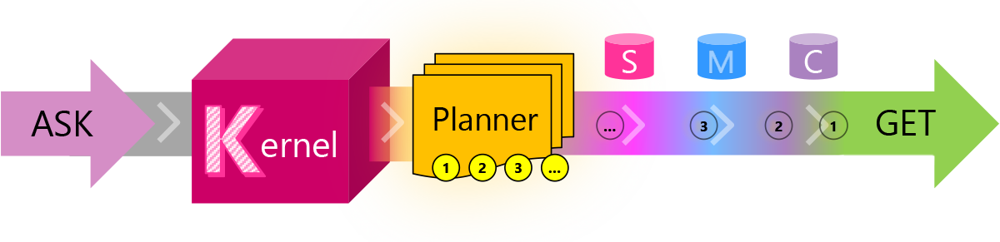

# What is Planner?

| ASK ⇾ | [Kernel](kernel) | Planner | [Skills](skills) | [Memories](memories)| [Connectors](Connectors)|... |  ⇾ GET | 
|---|---|---|---|---|---|---|---|

The **planner** works backwards from a goal that’s provided from a user's ASK. 

We call this approach "goal-oriented AI" — harking back to the early days of AI when researchers aspired for computers to beat the world's reigning chess champion. That grand goal was achieved eventually, but with the unusual competence of new LLM AI [models](/semantic-kernel/concepts-ai/models) to provide step-by-step directions for practically any goal can be attainable when the right **skills* are available. 

Because the **planner** has access to either a pre-defined library of pre-made [skills](/semantic-kernel/concepts-sk/skills) and/or a dynamically defined set of [skills](/semantic-kernel/concepts-sk/skills) it is able to fulfill an ASK with confidence. In addition, the **planner* calls upon [memories](/semantic-kernel/concepts-sk/memories) to best situate the ASK's context and [connectors] to call APIs and to leverage other external capabilities.

## What is the value of "goal-oriented" AI?

The ["Jobs To Be Done (JTBD)"](https://hbr.org/2016/09/know-your-customers-jobs-to-be-done) movement has popularized a shift in moving from work _outputs_ to work _outcomes_. Instead of focusing on the features or the functions of a product or a service, the JTBD approach emphasizes the goals and desires of the customer or the user, and the value or the benefit that they seek or expect from using the product or service. By understanding and articulating the JTBD of the customer or the user, a product or service can be designed and delivered more effectively. You just need to make the right ASK that isn't just "turn on the lights" and instead a more challenging goal like "I want a job promotion."

## What if the Planner needs a Skill that's unavailable?

The **planner** will operate within the [skills](/semantic-kernel/concepts-sk/skills) it has available. In the event that a desired skill does not exist, the planner can suggest you to create the [skill](/semantic-kernel/concepts-sk/skills). Or, depending upon the level of complexity the [kernel](/semantic-kernel/concepts-sk/kernel) can write and add the missing [skill](/semantic-kernel/concepts-sk/skills). 

## Take the next step

Now that you know about the **kernel** and the **planner**, you are ready to learn about **skills**.

> [!div class="nextstepaction"]
> [Learn about Skills](skills.md)
