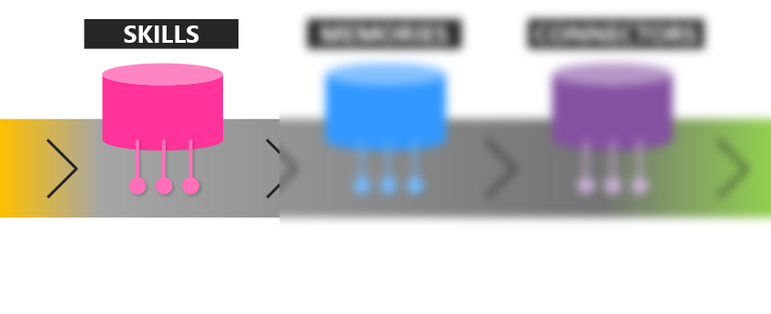

# What are Skills?

A **skill** refers to a domain of expertise made available to the [kernel](kernel) as a single function, or as a group of functions related to the **skill**. The design of SK **skills** has prioritized maximum flexibility for the developer to be both lightweight and extensible.  

## What is a Function?

A **function** is the basic building block of a **skills**. A **function** can be expressed as either:

1. an LLM AI [prompt](prompt)
2. native computer code

When using native computer code, it's also possible to invoke an LLM AI prompt — which means that there can be **functions** that are hybrid LLM AI × native code as well. 

**Functions** can be connected end-to-end, or "chained together," to create more powerful capabilities. When they are represented as pure LLM AI prompts, the word "function" and "prompt" can be used interchangeably. 

## What are "prompt templates"?

## How are functions packaged in code?

With a text file "skprompt.txt" that's using SK's Prompt Template format ...

## Take the next step

Now that you know about the **kernel**, **planner**, **skills**, you can take on **memories**.

> [!div class="nextstepaction"]
> [Learn about Memories](memories.md)

## Take the next step

> [!div class="nextstepaction"]
> [Learn about the Kernel](kernel)

[!INCLUDE [footer.md](../includes/footer.md)]