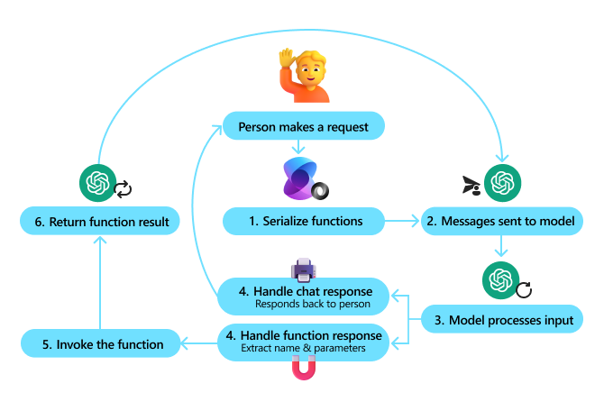

# Function calling with chat completion

The most powerful feature of chat completion is the ability to call functions from the model. This allows you to create a chat bot that can interact with your existing code, making it possible to automate business processes, create code snippets, and more.

With Semantic Kernel, we simplify the process of using function calling by automatically describing your functions and their parameters to the model and then handling the back-and-forth communication between the model and your code.

When using function calling, however, it's good to understand what's _actually_ happening behind the scenes so that you can optimize your code and make the most of this feature.

## How function calling works

When you make a request to a model with function calling enabled, Semantic Kernel performs the following steps:

| # | Step | Description |
|---|---|---|
| 1 | [**Serialize functions**](#1-serializing-the-functions) | All of the available functions (and its input parameters) in the kernel are serialized using JSON schema. |
| 2 | [**Send the messages and functions to the model**](#2-sending-the-messages-and-functions-to-the-model) | The serialized functions (and the current chat history) are sent to the model as part of the input. |
| 3 | [**Model processes the input**](#3-model-processes-the-input) | The model processes the input and generates a response. The response can either be a chat message or one or more function calls. |
| 4 | [**Handle the response**](#4-handle-the-response) | If the response is a chat message, it is returned to the caller. If the response is a function call, however, Semantic Kernel extracts the function name and its parameters. |
| 5 | [**Invoke the function**](#5-invoke-the-function) | The extracted function name and parameters are used to invoke the function in the kernel. |
| 6 | [**Return the function result**](#6-return-the-function-result) | The result of the function is then sent back to the model as part of the chat history. Steps 2-6 are then repeated until the model returns a chat message or the max iteration number has been reached. |

The following diagram illustrates the process of function calling:



The following section will use a concrete example to illustrate how function calling works in practice.

## Example: Ordering a pizza

Let's assume you have a plugin that allows a user to order a pizza. The plugin has the following functions:

1. `get_pizza_menu`: Returns a list of available pizzas
2. `add_pizza_to_cart`: Adds a pizza to the user's cart
3. `remove_pizza_from_cart`: Removes a pizza from the user's cart
4. `get_pizza_from_cart`: Returns the specific details of a pizza in the user's cart
4. `get_cart`: Returns the user's current cart
5. `checkout`: Checks out the user's cart

::: zone pivot="programming-language-csharp"
In C#, the plugin might look like this:

```csharp
public class OrderPizzaPlugin(
    IPizzaService pizzaService,
    IUserContext userContext,
    IPaymentService paymentService)
{
    [KernelFunction("get_pizza_menu")]
    public async Task<Menu> GetPizzaMenuAsync()
    {
        return await pizzaService.GetMenu();
    }

    [KernelFunction("add_pizza_to_cart")]
    [Description("Add a pizza to the user's cart; returns the new item and updated cart")]
    public async Task<CartDelta> AddPizzaToCart(
        PizzaSize size,
        List<PizzaToppings> toppings,
        int quantity = 1,
        string specialInstructions = ""
    )
    {
        Guid cartId = userContext.GetCartId();
        return await pizzaService.AddPizzaToCart(
            cartId: cartId,
            size: size,
            toppings: toppings,
            quantity: quantity,
            specialInstructions: specialInstructions);
    }

    [KernelFunction("remove_pizza_from_cart")]
    public async Task<RemovePizzaResponse> RemovePizzaFromCart(int pizzaId)
    {
        Guid cartId = userContext.GetCartId();
        return await pizzaService.RemovePizzaFromCart(cartId, pizzaId);
    }

    [KernelFunction("get_pizza_from_cart")]
    [Description("Returns the specific details of a pizza in the user's cart; use this instead of relying on previous messages since the cart may have changed since then.")]
    public async Task<Pizza> GetPizzaFromCart(int pizzaId)
    {
        Guid cartId = await userContext.GetCartIdAsync();
        return await pizzaService.GetPizzaFromCart(cartId, pizzaId);
    }

    [KernelFunction("get_cart")]
    [Description("Returns the user's current cart, including the total price and items in the cart.")]
    public async Task<Cart> GetCart()
    {
        Guid cartId = await userContext.GetCartIdAsync();
        return await pizzaService.GetCart(cartId);
    }

    [KernelFunction("checkout")]
    [Description("Checkouts the user's cart; this function will retrieve the payment from the user and complete the order.")]
    public async Task<CheckoutResponse> Checkout()
    {
        Guid cartId = await userContext.GetCartIdAsync();
        Guid paymentId = await paymentService.RequestPaymentFromUserAsync(cartId);

        return await pizzaService.Checkout(cartId, paymentId);
    }
}
```

You would then add this plugin to the kernel like so:

```csharp
IKernelBuilder kernelBuilder = new KernelBuilder();
kernelBuilder..AddAzureOpenAIChatCompletion(
    deploymentName: "NAME_OF_YOUR_DEPLOYMENT",
    apiKey: "YOUR_API_KEY",
    endpoint: "YOUR_AZURE_ENDPOINT"
);
kernelBuilder.Plugins.AddFromType<OrderPizzaPlugin>("OrderPizza");
Kernel kernel = kernelBuilder.Build();
```

> [!NOTE]
> Only functions with the `[KernelFunction]` attribute will be serialized and sent to the model. This allows you to have helper functions that are not exposed to the model.

::: zone-end

::: zone pivot="programming-language-python"
In Python, the plugin might look like this:

```python
from semantic_kernel.functions import kernel_function

class OrderPizzaPlugin:
    def __init__(self, pizza_service, user_context, payment_service):
        self.pizza_service = pizza_service
        self.user_context = user_context
        self.payment_service = payment_service

    @kernel_function
    async def get_pizza_menu(self):
        return await self.pizza_service.get_menu()

    @kernel_function(
        description="Add a pizza to the user's cart; returns the new item and updated cart"
    )
    async def add_pizza_to_cart(self, size: PizzaSize, toppings: List[PizzaToppings], quantity: int = 1, special_instructions: str = ""):
        cart_id = await self.user_context.get_cart_id()
        return await self.pizza_service.add_pizza_to_cart(cart_id, size, toppings, quantity, special_instructions)

    @kernel_function(
        description="Remove a pizza from the user's cart; returns the updated cart"
    )
    async def remove_pizza_from_cart(self, pizza_id: int):
        cart_id = await self.user_context.get_cart_id()
        return await self.pizza_service.remove_pizza_from_cart(cart_id, pizza_id)

    @kernel_function(
        description="Returns the specific details of a pizza in the user's cart; use this instead of relying on previous messages since the cart may have changed since then."
    )
    async def get_pizza_from_cart(self, pizza_id: int):
        cart_id = await self.user_context.get_cart_id()
        return await self.pizza_service.get_pizza_from_cart(cart_id, pizza_id)

    @kernel_function(
        description="Returns the user's current cart, including the total price and items in the cart."
    )
    async def get_cart(self):
        cart_id = await self.user_context.get_cart_id()
        return await self.pizza_service.get_cart(cart_id)

    @kernel_function(
        description="Checkouts the user's cart; this function will retrieve the payment from the user and complete the order."
    )
    async def checkout(self):
        cart_id = await self.user_context.get_cart_id()
        payment_id = await self.payment_service.request_payment_from_user(cart_id)
        return await self.pizza_service.checkout(cart_id, payment_id)
```

You would then add this plugin to the kernel like so:

```python
from semantic_kernel import Kernel

kernel = Kernel()

# Create the services needed for the plugin: pizza_service, user_context, and payment_service
# ...

# Add the plugin to the kernel
kernel.add_plugin(OrderPizzaPlugin(pizza_service, user_context, payment_service), plugin_name="OrderPizza")
```

> [!NOTE]
> Only functions with the `@kernel_function` decorator will be serialized and sent to the model. This allows you to have helper functions that are not exposed to the model.

::: zone-end

::: zone pivot="programming-language-java"

In Java, the plugin might look like this:

```java
public class OrderPizzaPlugin {

    private final PizzaService pizzaService;
    private final HttpSession userContext;
    private final PaymentService paymentService;

    public OrderPizzaPlugin(
        PizzaService pizzaService,
        UserContext userContext,
        PaymentService paymentService)
    {
      this.pizzaService = pizzaService;
      this.userContext = userContext;
      this.paymentService = paymentService;
    }

    @DefineKernelFunction(name = "get_pizza_menu", description = "Get the pizza menu.", returnType = "com.pizzashop.Menu")
    public Mono<Menu> getPizzaMenuAsync()
    {
        return pizzaService.getMenu();
    }

    @DefineKernelFunction(
        name = "add_pizza_to_cart", 
        description = "Add a pizza to the user's cart",
        returnDescription = "Returns the new item and updated cart", 
        returnType = "com.pizzashop.CartDelta")
    public Mono<CartDelta> addPizzaToCart(
        @KernelFunctionParameter(name = "size", description = "The size of the pizza", type = com.pizzashopo.PizzaSize.class, required = true)
        PizzaSize size,
        @KernelFunctionParameter(name = "toppings", description = "The toppings to add to the the pizza", type = com.pizzashopo.PizzaToppings.class)
        List<PizzaToppings> toppings,
        @KernelFunctionParameter(name = "quantity", description = "How many of this pizza to order", type = Integer.class, defaultValue = "1")
        int quantity,
        @KernelFunctionParameter(name = "specialInstructions", description = "Special instructions for the order",)
        String specialInstructions
    )
    {
        UUID cartId = userContext.getCartId();
        return pizzaService.addPizzaToCart(
            cartId,
            size,
            toppings,
            quantity,
            specialInstructions);
    }

    @DefineKernelFunction(name = "remove_pizza_from_cart", description = "Remove a pizza from the cart.", returnType = "com.pizzashop.RemovePizzaResponse")
    public Mono<RemovePizzaResponse> removePizzaFromCart(
        @KernelFunctionParameter(name = "pizzaId", description = "Id of the pizza to remove from the cart", type = Integer.class, required = true)
        int pizzaId)
    {
        UUID cartId = userContext.getCartId();
        return pizzaService.removePizzaFromCart(cartId, pizzaId);
    }

    @DefineKernelFunction(
        name = "get_pizza_from_cart", 
        description = "Returns the specific details of a pizza in the user's cart; use this instead of relying on previous messages since the cart may have changed since then.",
        returnType = "com.pizzashop.Pizza")
    public Mono<Pizza> getPizzaFromCart(
        @KernelFunctionParameter(name = "pizzaId", description = "Id of the pizza to get from the cart", type = Integer.class, required = true)
        int pizzaId)
    {

        UUID cartId = userContext.getCartId();
        return pizzaService.getPizzaFromCart(cartId, pizzaId);
    }

    @DefineKernelFunction(
        name = "get_cart", 
        description = "Returns the user's current cart, including the total price and items in the cart.",
        returnType = "com.pizzashop.Cart")

    public Mono<Cart> getCart()
    {
        UUID cartId = userContext.getCartId();
        return pizzaService.getCart(cartId);
    }


    @DefineKernelFunction(
        name = "checkout", 
        description = "Checkouts the user's cart; this function will retrieve the payment from the user and complete the order.",
        returnType = "com.pizzashop.CheckoutResponse")
    public Mono<CheckoutResponse> Checkout()
    {
        UUID cartId = userContext.getCartId();
        return paymentService.requestPaymentFromUser(cartId)
                .flatMap(paymentId -> pizzaService.checkout(cartId, paymentId));
    }
}
```

You would then add this plugin to the kernel like so:

```java
OpenAIAsyncClient client = new OpenAIClientBuilder()
  .credential(openAIClientCredentials)
  .buildAsyncClient();

ChatCompletionService chat = OpenAIChatCompletion.builder()
  .withModelId(modelId)
  .withOpenAIAsyncClient(client)
  .build();

KernelPlugin plugin = KernelPluginFactory.createFromObject(
  new OrderPizzaPlugin(pizzaService, userContext, paymentService),
  "OrderPizzaPlugin"
);

Kernel kernel = Kernel.builder()
    .withAIService(ChatCompletionService.class, chat)
    .withPlugin(plugin)
    .build();
```

> [!NOTE]
> Only functions with the `@DefineKernelFunction` annotation will be serialized and sent to the model. This allows you to have helper functions that are not exposed to the model.

::: zone-end

### 1) Serializing the functions

When you create a kernel with the `OrderPizzaPlugin`, the kernel will automatically serialize the functions and their parameters. This is necessary so that the model can understand the functions and their inputs.

For the above plugin, the serialized functions would look like this:

```json
[
  {
    "type": "function",
    "function": {
      "name": "OrderPizza-get_pizza_menu",
      "parameters": {
        "type": "object",
        "properties": {},
        "required": []
      }
    }
  },
  {
    "type": "function",
    "function": {
      "name": "OrderPizza-add_pizza_to_cart",
      "description": "Add a pizza to the user's cart; returns the new item and updated cart",
      "parameters": {
        "type": "object",
        "properties": {
          "size": {
            "type": "string",
            "enum": ["Small", "Medium", "Large"]
          },
          "toppings": {
            "type": "array",
            "items": {
              "type": "string",
              "enum": ["Cheese", "Pepperoni", "Mushrooms"]
            }
          },
          "quantity": {
            "type": "integer",
            "default": 1,
            "description": "Quantity of pizzas"
          },
          "specialInstructions": {
            "type": "string",
            "default": "",
            "description": "Special instructions for the pizza"
          }
        },
        "required": ["size", "toppings"]
      }
    }
  },
  {
    "type": "function",
    "function": {
      "name": "OrderPizza-remove_pizza_from_cart",
      "parameters": {
        "type": "object",
        "properties": {
          "pizzaId": {
            "type": "integer"
          }
        },
        "required": ["pizzaId"]
      }
    }
  },
  {
    "type": "function",
    "function": {
      "name": "OrderPizza-get_pizza_from_cart",
      "description": "Returns the specific details of a pizza in the user's cart; use this instead of relying on previous messages since the cart may have changed since then.",
      "parameters": {
        "type": "object",
        "properties": {
          "pizzaId": {
            "type": "integer"
          }
        },
        "required": ["pizzaId"]
      }
    }
  },
  {
    "type": "function",
    "function": {
      "name": "OrderPizza-get_cart",
      "description": "Returns the user's current cart, including the total price and items in the cart.",
      "parameters": {
        "type": "object",
        "properties": {},
        "required": []
      }
    }
  },
  {
    "type": "function",
    "function": {
      "name": "OrderPizza-checkout",
      "description": "Checkouts the user's cart; this function will retrieve the payment from the user and complete the order.",
      "parameters": {
        "type": "object",
        "properties": {},
        "required": []
      }
    }
  }
]
```

There's a few things to note here which can impact both the performance and the quality of the chat completion:

1. **Verbosity of function schema** – Serializing functions for the model to use doesn't come for free. The more verbose the schema, the more tokens the model has to process, which can slow down the response time and increase costs.

    > [!TIP]
    > Keep your functions as simple as possible. In the above example, you'll notice that not _all_ functions have descriptions where the function name is self-explanatory. This is intentional to reduce the number of tokens. The parameters are also kept simple; anything the model shouldn't need to know (like the `cartId` or `paymentId`) are kept hidden. This information is instead provided by internal services.

    > [!NOTE]
    > The one thing you don't need to worry about is the complexity of the return types. You'll notice that the return types are not serialized in the schema. This is because the model doesn't need to know the return type to generate a response. In Step 6, however, we'll see how overly verbose return types can impact the quality of the chat completion.

2. **Parameter types** – With the schema, you can specify the type of each parameter. This is important for the model to understand the expected input. In the above example, the `size` parameter is an enum, and the `toppings` parameter is an array of enums. This helps the model generate more accurate responses.

    > [!TIP]
    > Avoid, where possible, using `string` as a parameter type. The model can't infer the type of string, which can lead to ambiguous responses. Instead, use enums or other types (e.g., `int`, `float`, and complex types) where possible.

3. **Required parameters** - You can also specify which parameters are required. This is important for the model to understand which parameters are _actually_ necessary for the function to work. Later on in Step 3, the model will use this information to provide as minimal information as necessary to call the function.

    > [!TIP]
    > Only mark parameters as required if they are _actually_ required. This helps the model call functions more quickly and accurately.

4. **Function descriptions** – Function descriptions are optional but can help the model generate more accurate responses. In particular, descriptions can tell the model what to expect from the response since the return type is not serialized in the schema. If the model is using functions improperly, you can also add descriptions to provide examples and guidance.

    For example, in the `get_pizza_from_cart` function, the description tells the user to use this function instead of relying on previous messages. This is important because the cart may have changed since the last message.

    > [!TIP]
    > Before adding a description, ask yourself if the model _needs_ this information to generate a response. If not, consider leaving it out to reduce verbosity. You can always add descriptions later if the model is struggling to use the function properly.

5. **Plugin name** – As you can see in the serialized functions, each function has a `name` property. Semantic Kernel uses the plugin name to namespace the functions. This is important because it allows you to have multiple plugins with functions of the same name. For example, you may have plugins for multiple search services, each with their own `search` function. By namespacing the functions, you can avoid conflicts and make it easier for the model to understand which function to call.

    Knowing this, you should choose a plugin name that is unique and descriptive. In the above example, the plugin name is `OrderPizza`. This makes it clear that the functions are related to ordering pizza.

    > [!TIP]
    > When choosing a plugin name, we recommend removing superfluous words like "plugin" or "service". This helps reduce verbosity and makes the plugin name easier to understand for the model.

    > [!NOTE]
    > By default, the delimiter for the function name is `-`. While this works for most models, some of them may have different requirements, such as [Gemini](https://ai.google.dev/gemini-api/docs/function-calling#key-parameters-best-practices). This is taken care of by the kernel automatically however you may see slightly different function names in the serialized functions.

### 2) Sending the messages and functions to the model

Once the functions are serialized, they are sent to the model along with the current chat history. This allows the model to understand the context of the conversation and the available functions.

In this scenario, we can imagine the user asking the assistant to add a pizza to their cart:

::: zone pivot="programming-language-csharp"

```csharp
ChatHistory chatHistory = [];
chatHistory.AddUserMessage("I'd like to order a pizza!");
```

::: zone-end

::: zone pivot="programming-language-python"

```python
chat_history = ChatHistory()
chat_history.add_user_message("I'd like to order a pizza!")
```

::: zone-end

::: zone pivot="programming-language-java"

```java
ChatHistory chatHistory = new ChatHistory();
chatHistory.addUserMessage("I'd like to order a pizza!");
```

::: zone-end

We can then send this chat history and the serialized functions to the model. The model will use this information to determine the best way to respond.

::: zone pivot="programming-language-csharp"

```csharp
IChatCompletionService chatCompletion = kernel.GetRequiredService<IChatCompletionService>();

OpenAIPromptExecutionSettings openAIPromptExecutionSettings = new() 
{
    FunctionChoiceBehavior = FunctionChoiceBehavior.Auto()
};

ChatResponse response = await chatCompletion.GetChatMessageContentAsync(
    chatHistory,
    executionSettings: openAIPromptExecutionSettings,
    kernel: kernel)
```

> [!NOTE]
> This example uses the `FunctionChoiceBehavior.Auto()` behavior, one of the few available ones. For more information about other function choice behaviors, check out the [function choice behaviors article](./function-choice-behaviors.md).

::: zone-end

::: zone pivot="programming-language-python"

```python
chat_completion = kernel.get_service(type=ChatCompletionClientBase)

execution_settings = AzureChatPromptExecutionSettings()
execution_settings.function_choice_behavior = FunctionChoiceBehavior.Auto()

response = await chat_completion.get_chat_message_content(
    chat_history=history,
    settings=execution_settings,
    kernel=kernel,
)
```

> [!NOTE]
> This example uses the `FunctionChoiceBehavior.Auto()` behavior, one of the few available ones. For more information about other function choice behaviors, check out the [function choice behaviors article](./function-choice-behaviors.md).

::: zone-end

::: zone pivot="programming-language-java"

```java
ChatCompletionService chatCompletion = kernel.getService(I)ChatCompletionService.class);

InvocationContext invocationContext = InvocationContext.builder()
    .withToolCallBehavior(ToolCallBehavior.allowAllKernelFunctions(false));

List<ChatResponse> responses = chatCompletion.getChatMessageContentsAsync(
    chatHistory,
    kernel,
    invocationContext).block();
```

::: zone-end

> [!IMPORTANT]
> The kernel must be passed to the service in order to use function calling. This is because the plugins are registered with the kernel, and the service needs to know which plugins are available.

### 3) Model processes the input

With both the chat history and the serialized functions, the model can determine the best way to respond. In this case, the model recognizes that the user wants to order a pizza. The model would likely _want_ to call the `add_pizza_to_cart` function, but because we specified the size and toppings as required parameters, the model will ask the user for this information:

::: zone pivot="programming-language-csharp"

```csharp
Console.WriteLine(response);
chatHistory.AddAssistantMessage(response);

// "Before I can add a pizza to your cart, I need to
// know the size and toppings. What size pizza would
// you like? Small, medium, or large?"
```

::: zone-end

::: zone pivot="programming-language-python"

```python
print(response)
chat_history.add_assistant_message(response)

# "Before I can add a pizza to your cart, I need to
# know the size and toppings. What size pizza would
# you like? Small, medium, or large?"
```

::: zone-end

::: zone pivot="programming-language-java"

```java
responses.forEach(response -> System.out.printlin(response.getContent());
chatHistory.addAll(responses);

// "Before I can add a pizza to your cart, I need to
// know the size and toppings. What size pizza would
// you like? Small, medium, or large?"
```

::: zone-end

Since the model wants the user to respond next, Semantic Kernel will stop automatic function calling and return control to the user. At this point, the user can respond with the size and toppings of the pizza they want to order:

::: zone pivot="programming-language-csharp"

```csharp
chatHistory.AddUserMessage("I'd like a medium pizza with cheese and pepperoni, please.");

response = await chatCompletion.GetChatMessageContentAsync(
    chatHistory,
    kernel: kernel)
```

::: zone-end

::: zone pivot="programming-language-python"

```python
chat_history.add_user_message("I'd like a medium pizza with cheese and pepperoni, please.")

response = await chat_completion.get_chat_message_content(
    chat_history=history,
    settings=execution_settings,
    kernel=kernel,
)
```

::: zone-end

::: zone pivot="programming-language-java"

```java
chatHistory.addUserMessage("I'd like a medium pizza with cheese and pepperoni, please.");

responses = chatCompletion.GetChatMessageContentAsync(
    chatHistory,
    kernel,
    null).block();
```

::: zone-end

Now that the model has the necessary information, it can now call the `add_pizza_to_cart` function with the user's input. Behind the scenes, it adds a new message to the chat history that looks like this:

```csharp
"tool_calls": [
    {
        "id": "call_abc123",
        "type": "function",
        "function": {
            "name": "OrderPizzaPlugin-add_pizza_to_cart",
            "arguments": "{\n\"size\": \"Medium\",\n\"toppings\": [\"Cheese\", \"Pepperoni\"]\n}"
        }
    }
]
```

> [!TIP]
> It's good to remember that every argument you require must be generated by the model. This means spending tokens to generate the response. Avoid arguments that require many tokens (like a GUID). For example, notice that we use an `int` for the `pizzaId`. Asking the model to send a one to two digit number is much easier than asking for a GUID.

> [!IMPORTANT]
> This step is what makes function calling so powerful. Previously, AI app developers had to create separate processes to extract intent and slot fill functions. With function calling, the model can decide _when_ to call a function and _what_ information to provide.

### 4) Handle the response

When Semantic Kernel receives the response from the model, it checks if the response is a function call. If it is, Semantic Kernel extracts the function name and its parameters. In this case, the function name is `OrderPizzaPlugin-add_pizza_to_cart`, and the arguments are the size and toppings of the pizza.

With this information, Semantic Kernel can marshal the inputs into the appropriate types and pass them to the `add_pizza_to_cart` function in the `OrderPizzaPlugin`. In this example, the arguments originate as a JSON string but are deserialized by Semantic Kernel into a `PizzaSize` enum and a `List<PizzaToppings>`.

> [!NOTE]
> Marshaling the inputs into the correct types is one of the key benefits of using Semantic Kernel. Everything from the model comes in as a JSON object, but Semantic Kernel can automatically deserialize these objects into the correct types for your functions.

After marshalling the inputs, Semantic Kernel will also add the function call to the chat history:

::: zone pivot="programming-language-csharp"

```csharp
chatHistory.Add(
    new() {
        Role = AuthorRole.Assistant,
        Items = [
            new FunctionCallContent(
                functionName: "add_pizza_to_cart",
                pluginName: "OrderPizza",
                id: "call_abc123",
                arguments: new () { {"size", "Medium"}, {"toppings", ["Cheese", "Pepperoni"]} }
            )
        ]
    }
);
```

::: zone-end

::: zone pivot="programming-language-python"

```python
from semantic_kernel.contents import ChatMessageContent, FunctionCallContent
from semantic_kernel.contents.utils.author_role import AuthorRole

chat_history.add_message(
    ChatMessageContent(
        role=AuthorRole.ASSISTANT,
        items=[
            FunctionCallContent(
                name="OrderPizza-add_pizza_to_cart",
                id="call_abc123",
                arguments=str({"size": "Medium", "toppings": ["Cheese", "Pepperoni"]})
            )
        ]
    )
)
```

::: zone-end

::: zone pivot="programming-language-java"

Semantic Kernel for Java handles function calling differently than C# and Python when the
auto-invoke tool call behavior is false. You do not add function call content to the chat
history; rather, the application is made responsible for invoking the function calls.
Skip to the next section, "Invoke the function", for an example of handling
function calls in Java when auto-invoke is false.

::: zone-end

### 5) Invoke the function

Once Semantic Kernel has the correct types, it can finally invoke the `add_pizza_to_cart` function. Because the plugin uses dependency injection, the function can interact with external services like `pizzaService` and `userContext` to add the pizza to the user's cart.

Not all functions will succeed, however. If the function fails, Semantic Kernel can handle the error and provide a default response to the model. This allows the model to understand what went wrong and decide to retry or generate a response to the user.

> [!TIP]
> To ensure a model can self-correct, it's important to provide error messages that clearly communicate what went wrong and how to fix it. This can help the model retry the function call with the correct information.

> [!NOTE]
> Semantic Kernel automatically invokes functions by default. However, if you prefer to manage function invocation manually, you can enable manual function invocation mode. For more details on how to do this, please refer to the [function invocation article](./function-invocation.md).

### 6) Return the function result

After the function has been invoked, the function result is sent back to the model as part of the chat history. This allows the model to understand the context of the conversation and generate a subsequent response.

Behind the scenes, Semantic Kernel adds a new message to the chat history from the tool role that looks like this:

::: zone pivot="programming-language-csharp"

```csharp
chatHistory.Add(
    new() {
        Role = AuthorRole.Tool,
        Items = [
            new FunctionResultContent(
                functionName: "add_pizza_to_cart",
                pluginName: "OrderPizza",
                id: "0001",
                result: "{ \"new_items\": [ { \"id\": 1, \"size\": \"Medium\", \"toppings\": [\"Cheese\",\"Pepperoni\"] } ] }"
            )
        ]
    }
);
```

::: zone-end

::: zone pivot="programming-language-python"

```python
from semantic_kernel.contents import ChatMessageContent, FunctionResultContent
from semantic_kernel.contents.utils.author_role import AuthorRole

chat_history.add_message(
    ChatMessageContent(
        role=AuthorRole.TOOL,
        items=[
            FunctionResultContent(
                name="OrderPizza-add_pizza_to_cart",
                id="0001",
                result="{ \"new_items\": [ { \"id\": 1, \"size\": \"Medium\", \"toppings\": [\"Cheese\",\"Pepperoni\"] } ] }"
            )
        ]
    )
)
```

::: zone-end

::: zone pivot="programming-language-java"

If auto-invoke is disabled in the tool call behavior, a Java application
must invoke the function calls and add the function result as an `AuthorRole.TOOL` message
to the chat history.

```java
messages.stream()
    .filter (it -> it instanceof OpenAIChatMessageContent)
        .map(it -> ((OpenAIChatMessageContent<?>) it).getToolCall())
        .flatMap(List::stream)
        .forEach(toolCall -> {
            String content;
            try {
                // getFunction will throw an exception if the function is not found
                var fn = kernel.getFunction(toolCall.getPluginName(),
                        toolCall.getFunctionName());
                FunctionResult<?> fnResult = fn
                        .invokeAsync(kernel, toolCall.getArguments(), null, null).block();
                content = (String) fnResult.getResult();
            } catch (IllegalArgumentException e) {
                content = "Unable to find function. Please try again!";
            }

            chatHistory.addMessage(
                    AuthorRole.TOOL,
                    content,
                    StandardCharsets.UTF_8,
                    FunctionResultMetadata.build(toolCall.getId()));
        });
```

::: zone-end

Notice that the result is a JSON string that the model then needs to process. As before, the model will need to spend tokens consuming this information. This is why it's important to keep the return types as simple as possible. In this case, the return only includes the new items added to the cart, not the entire cart.

> [!TIP]
> Be as succinct as possible with your returns. Where possible, only return the information the model needs or summarize the information using another LLM prompt before returning it.

### Repeat steps 2-6

After the result is returned to the model, the process repeats. The model processes the latest chat history and generates a response. In this case, the model might ask the user if they want to add another pizza to their cart or if they want to check out.

## Parallel function calls

In the above example, we demonstrated how an LLM can call a single function. Often this can be slow if you need to call multiple functions in sequence. To speed up the process, several LLMs support parallel function calls. This allows the LLM to call multiple functions at once, speeding up the process.

For example, if a user wants to order multiple pizzas, the LLM can call the `add_pizza_to_cart` function for each pizza at the same time. This can significantly reduce the number of round trips to the LLM and speed up the ordering process.

## Next steps

Now that you understand how function calling works, you can proceed to learn how to configure various aspects of function calling that better correspond to your specific scenarios by going to the next step:

> [!div class="nextstepaction"]
> [Function Choice Behavior](./function-choice-behaviors.md)
