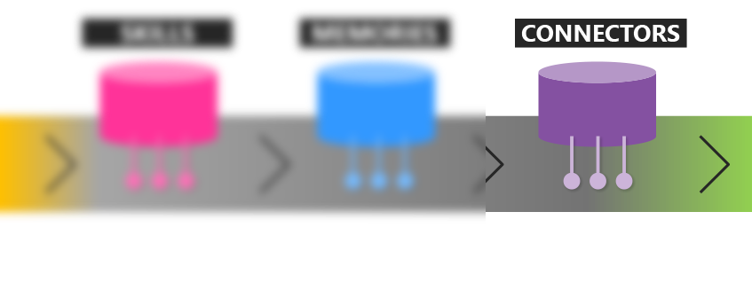

# What are Connectors?

## You've reached the end of your journey

Now that you know about the **kernel**, **planner**, **skills**, **memories**, **connectors**, then you might want to do a quick refresher of core LLM AI concepts.

> [!div class="nextstepaction"]
> [LLM AI Models Refresher](models.md)

## Concepts Glossary

| Semantic Kernel | | LLM AI |
|---|---|---|
| [Connectors](connectors) || [Embeddings](embeddings) |
| [Kernel](kernel) || [Models](models) |
| [Planner](planner) || [Prompts](prompts) |
| [Memories](memories) || [Tokens](tokens) |
| [Skills](skills) ||  |

[!INCLUDE [glossary.md](./includes)]