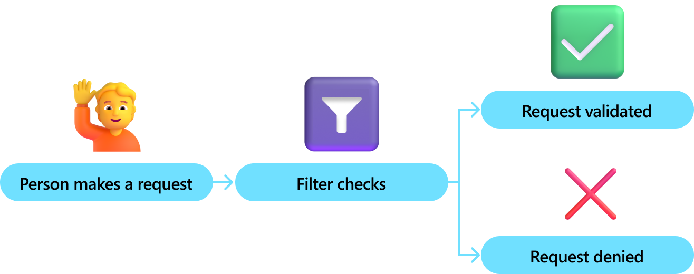

# What are Filters?

Filters enhance security by providing control and visibility over how and when functions run. This is needed to instill responsible AI principles into your work so that you feel confident your solution is enterprise ready.

For example, filters are leveraged to validate permissions before an approval flow begins. The `IFunctionInvocationFilter` is run to check the permissions of the person that’s looking to submit an approval. This means that only a select group of people will be able to kick off the process.

A good example of filters is provided [here](https://devblogs.microsoft.com/semantic-kernel/filters-in-semantic-kernel/) in our detailed Semantic Kernel blog post on Filters.
 
 

There are three types of filters:

- **Function Invocation Filter** - this filter is executed each time a `KernelFunction` is invoked. It allows:
  - Access to information about the function being executed and its arguments
  - Handling of exceptions during function execution
  - Overriding of the function result
  - Retrying of the function in case of failure (e.g., [switching to an alternative AI model](https://github.com/microsoft/semantic-kernel/blob/main/dotnet/samples/Concepts/Filtering/RetryWithFilters.cs))

- **Prompt Render Filter** - this filter is triggered before the prompt rendering operation, enabling:
  - Viewing and modifying the prompt that will be sent to the AI (e.g., for RAG or [PII redaction](https://github.com/microsoft/semantic-kernel/blob/main/dotnet/samples/Concepts/Filtering/PIIDetection.cs))
  - Preventing prompt submission to the AI by overriding the function result (e.g., for [Semantic Caching](https://github.com/microsoft/semantic-kernel/blob/main/dotnet/samples/Concepts/Caching/SemanticCachingWithFilters.cs))

- **Auto Function Invocation Filter** (experimental) - similar to the function invocation filter, this filter operates within the scope of `automatic function calling`, providing additional context, including chat history, a list of all functions to be executed, and iteration counters. It also allows termination of the auto function calling process (e.g., if a desired result is obtained from the second of three planned functions).

Each filter includes a `context` object that contains all relevant information about the function execution or prompt rendering. Additionally, each filter has a `next` delegate/callback to execute the next filter in the pipeline or the function itself, offering control over function execution (e.g., in cases of malicious prompts or arguments). Multiple filters of the same type can be registered, each with its own responsibility.

In a filter, calling the next delegate is essential to proceed to the next registered filter or the original operation (whether function invocation or prompt rendering). Without calling next, the operation will not be executed.

::: zone pivot="programming-language-csharp"

To use a filter, first define it, then add it to the `Kernel` object either through dependency injection or the appropriate `Kernel` property. When using dependency injection, the order of filters is not guaranteed, so with multiple filters, the execution order may be unpredictable.

For cases where filter order is important, it is recommended to add filters directly to the `Kernel` object using appropriate properties. This approach allows filters to be added, removed, or reordered at runtime.

## Function Invocation Filter

This filter is triggered every time a Semantic Kernel function is invoked, regardless of whether it is a function created from a prompt or a C# method.

```csharp
/// <summary>
/// Example of function invocation filter to perform logging before and after function invocation.
/// </summary>
public sealed class LoggingFilter(ILogger logger) : IFunctionInvocationFilter
{
    public async Task OnFunctionInvocationAsync(FunctionInvocationContext context, Func<FunctionInvocationContext, Task> next)
    {
        logger.LogInformation("FunctionInvoking - {PluginName}.{FunctionName}", context.Function.PluginName, context.Function.Name);

        await next(context);

        logger.LogInformation("FunctionInvoked - {PluginName}.{FunctionName}", context.Function.PluginName, context.Function.Name);
    }
}
```

Add filter using dependency injection:

```csharp
IKernelBuilder builder = Kernel.CreateBuilder();

builder.Services.AddSingleton<IFunctionInvocationFilter, LoggingFilter>();

Kernel kernel = builder.Build();
```

Add filter using `Kernel` property:

```csharp
kernel.FunctionInvocationFilters.Add(new LoggingFilter(logger));
```

### Code examples

* [Function invocation filter examples](https://github.com/microsoft/semantic-kernel/blob/main/dotnet/samples/Concepts/Filtering/FunctionInvocationFiltering.cs)

## Prompt Render Filter

This filter is invoked only during a prompt rendering operation, such as when a function created from a prompt is called. It will not be triggered for Semantic Kernel functions created from methods.

```csharp
/// <summary>
/// Example of prompt render filter which overrides rendered prompt before sending it to AI.
/// </summary>
public class SafePromptFilter : IPromptRenderFilter
{
    public async Task OnPromptRenderAsync(PromptRenderContext context, Func<PromptRenderContext, Task> next)
    {
        // Example: get function information
        var functionName = context.Function.Name;

        await next(context);

        // Example: override rendered prompt before sending it to AI
        context.RenderedPrompt = "Safe prompt";
    }
}
```

Add filter using dependency injection:

```csharp
IKernelBuilder builder = Kernel.CreateBuilder();

builder.Services.AddSingleton<IPromptRenderFilter, SafePromptFilter>();

Kernel kernel = builder.Build();
```

Add filter using `Kernel` property:

```csharp
kernel.PromptRenderFilters.Add(new SafePromptFilter());
```

### Code examples

* [Prompt render filter examples](https://github.com/microsoft/semantic-kernel/blob/main/dotnet/samples/Concepts/Filtering/PromptRenderFiltering.cs)

## Auto Function Invocation Filter (Experimental)

This filter is invoked only during an automatic function calling process. It will not be triggered when a function is invoked outside of this process.

```csharp
/// <summary>
/// Example of auto function invocation filter which terminates function calling process as soon as we have the desired result.
/// </summary>
public sealed class EarlyTerminationFilter : IAutoFunctionInvocationFilter
{
    public async Task OnAutoFunctionInvocationAsync(AutoFunctionInvocationContext context, Func<AutoFunctionInvocationContext, Task> next)
    {
        // Call the function first.
        await next(context);

        // Get a function result from context.
        var result = context.Result.GetValue<string>();

        // If the result meets the condition, terminate the process.
        // Otherwise, the function calling process will continue.
        if (result == "desired result")
        {
            context.Terminate = true;
        }
    }
}
```

Add filter using dependency injection:

```csharp
IKernelBuilder builder = Kernel.CreateBuilder();

builder.Services.AddSingleton<IAutoFunctionInvocationFilter, EarlyTerminationFilter>();

Kernel kernel = builder.Build();
```

Add filter using `Kernel` property:

```csharp
kernel.AutoFunctionInvocationFilters.Add(new EarlyTerminationFilter());
```

### Code examples

* [Auto function invocation filter examples](https://github.com/microsoft/semantic-kernel/blob/main/dotnet/samples/Concepts/Filtering/AutoFunctionInvocationFiltering.cs)

## Streaming and non-streaming invocation (Experimental)

Functions in Semantic Kernel can be invoked in two ways: streaming and non-streaming. In streaming mode, a function typically returns `IAsyncEnumerable<T>`, while in non-streaming mode, it returns `FunctionResult`. This distinction affects how results can be overridden in the filter: in streaming mode, the new function result value must be of type `IAsyncEnumerable<T>`, whereas in non-streaming mode, it can simply be of type `T`. To determine which result type needs to be returned, the `context.IsStreaming` flag is available in the filter context model.

```csharp
/// <summary>Filter that can be used for both streaming and non-streaming invocation modes at the same time.</summary>
public sealed class DualModeFilter : IFunctionInvocationFilter
{
    public async Task OnFunctionInvocationAsync(FunctionInvocationContext context, Func<FunctionInvocationContext, Task> next)
    {
        // Call next filter in pipeline or actual function.
        await next(context);

        // Check which function invocation mode is used.
        if (context.IsStreaming)
        {
            // Return IAsyncEnumerable<string> result in case of streaming mode.
            var enumerable = context.Result.GetValue<IAsyncEnumerable<string>>();
            context.Result = new FunctionResult(context.Result, OverrideStreamingDataAsync(enumerable!));
        }
        else
        {
            // Return just a string result in case of non-streaming mode.
            var data = context.Result.GetValue<string>();
            context.Result = new FunctionResult(context.Result, OverrideNonStreamingData(data!));
        }
    }

    private async IAsyncEnumerable<string> OverrideStreamingDataAsync(IAsyncEnumerable<string> data)
    {
        await foreach (var item in data)
        {
            yield return $"{item} - updated from filter";
        }
    }

    private string OverrideNonStreamingData(string data)
    {
        return $"{data} - updated from filter";
    }
}
```

## Using filters with `IChatCompletionService`

In cases where `IChatCompletionService` is used directly instead of `Kernel`, filters will only be invoked when a `Kernel` object is passed as a parameter to the chat completion service methods, as filters are attached to the `Kernel` instance. 

```csharp
Kernel kernel = Kernel.CreateBuilder().Build();

kernel.FunctionInvocationFilters.Add(new MyFilter());

IChatCompletionService chatCompletionService = GetService();

// Passing a Kernel here is required to trigger filters.
ChatMessageContent result = await chatCompletionService.GetChatMessageContentAsync(chatHistory, executionSettings, kernel);
```

## More examples

* [PII detection and redaction with filters](https://github.com/microsoft/semantic-kernel/blob/main/dotnet/samples/Concepts/Filtering/PIIDetection.cs)
* [Semantic Caching with filters](https://github.com/microsoft/semantic-kernel/blob/main/dotnet/samples/Concepts/Caching/SemanticCachingWithFilters.cs)
* [Content Safety with filters](https://github.com/microsoft/semantic-kernel/tree/main/dotnet/samples/Demos/ContentSafety)
* [Text summarization and translation quality check with filters](https://github.com/microsoft/semantic-kernel/tree/main/dotnet/samples/Demos/QualityCheck)

::: zone-end
::: zone pivot="programming-language-python"

## Coming soon

More info coming soon.

::: zone-end
::: zone pivot="programming-language-java"

## Coming soon

More info coming soon.

::: zone-end