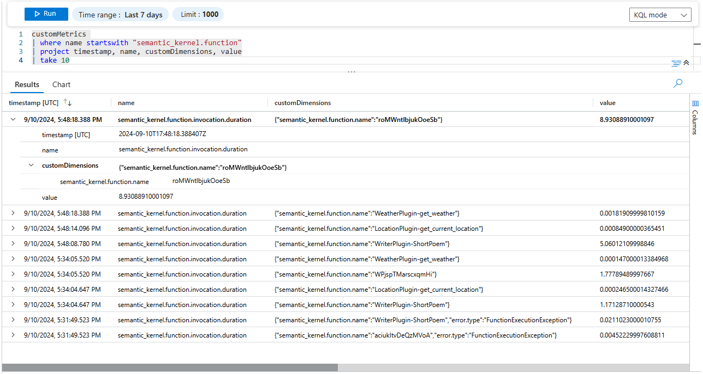

# Observability in Semantic Kernel

## Brief introduction to observability

When you build AI solutions, you want to be able to observe the behavior of your services. Observability is the ability to monitor and analyze the internal state of components within a distributed system. It is a key requirement for building enterprise-ready AI solutions.

Observability is typically achieved through logging, metrics, and tracing. They are often referred to as the three pillars of observability. You will also hear the term "telemetry" used to describe the data collected by these three pillars. Unlike debugging, observability provides an ongoing overview of the system's health and performance.

Useful materials for further reading:

- [Observability defined by Cloud Native Computing Foundation](https://glossary.cncf.io/observability/)
- [Distributed tracing](/dotnet/core/diagnostics/distributed-tracing)
- [Observability in .Net](/dotnet/core/diagnostics/observability-with-otel)
- [OpenTelemetry](https://opentelemetry.io/docs/what-is-opentelemetry/)

## Observability in Semantic Kernel

Semantic Kernel is designed to be observable. It emits logs, metrics, and traces that are compatible to the OpenTelemetry standard. You can use your favorite observability tools to monitor and analyze the behavior of your services built on Semantic Kernel.

Specifically, Semantic Kernel provides the following observability features:

- **Logging**: Semantic Kernel logs meaningful events and errors from the kernel, kernel plugins and functions, as well as the AI connectors.
    
    > [!IMPORTANT]
    > [Traces in Application Insights](/azure/azure-monitor/app/data-model-complete#trace) represent traditional log entries and [OpenTelemetry span events](https://opentelemetry.io/docs/concepts/signals/traces/#span-events). They are not the same as distributed traces.
- **Metrics**: Semantic Kernel emits metrics from kernel functions and AI connectors. You will be able to monitor metrics such as the kernel function execution time, the token consumption of AI connectors, etc.
    
- **Tracing**: Semantic Kernel supports distributed tracing. You can track activities across different services and within Semantic Kernel.
    

::: zone pivot="programming-language-csharp"

| Telemetry | Description                           |
|-----------|---------------------------------------|
| Log       | Logs are recorded throughout the Kernel. For more information on Logging in .Net, please refer to this [document](/dotnet/core/extensions/logging). Sensitive data, such as kernel function arguments and results, are logged at the trace level. Please refer to this [table](/dotnet/core/extensions/logging?tabs=command-line#log-level) for more information on log levels. |
| Activity  | Each kernel function execution and each call to an AI model are recorded as an activity. All activities are generated by an activity source named "Microsoft.SemanticKernel". |
| Metric    | Semantic Kernel captures the following metrics from kernel functions:<ul><li>`semantic_kernel.function.invocation.duration` (Histogram) - function execution time (in seconds)</li><li>`semantic_kernel.function.streaming.duration` (Histogram) - function streaming execution time (in seconds)</li><li>`semantic_kernel.function.invocation.token_usage.prompt` (Histogram) - number of prompt token usage (only for `KernelFunctionFromPrompt`)</li><li>`semantic_kernel.function.invocation.token_usage.completion` (Histogram) - number of completion token usage (only for `KernelFunctionFromPrompt`)</li>  |

::: zone-end

::: zone pivot="programming-language-python"

| Telemetry | Description                           |
|-----------|---------------------------------------|
| Log       | Logs are recorded throughout the Kernel. For more information on Logging in Python, please refer to this [document](https://docs.python.org/3/howto/logging.html). Sensitive data, such as kernel function arguments and results, are logged at the debug level.|
| Span  | Each auto function invocation loop, each kernel function execution, and each call to an AI model are recorded as a span. |
| Metric    | Semantic Kernel captures the following metrics from kernel functions:<ul><li>`semantic_kernel.function.invocation.duration` (Histogram) - function execution time (in seconds)</li><li>`semantic_kernel.function.streaming.duration` (Histogram) - function streaming execution time (in seconds)</li> |

::: zone-end

::: zone pivot="programming-language-java"

> [!NOTE]
> Semantic Kernel Observability is not yet available for Java.

::: zone-end

## OpenTelemetry Semantic Convention

Semantic Kernel follows the [OpenTelemetry Semantic Convention](https://opentelemetry.io/docs/concepts/semantic-conventions/) for Observability. This means that the logs, metrics, and traces emitted by Semantic Kernel are structured and follow a common schema. This ensures that you can more effectively analyze the telemetry data emitted by Semantic Kernel.

> [!Note]
> Currently, the [Semantic Conventions for Generative AI](https://github.com/open-telemetry/semantic-conventions/blob/main/docs/gen-ai/README.md) are in experimental status. Semantic Kernel strives to follow the OpenTelemetry Semantic Convention as closely as possible, and provide a consistent and meaningful observability experience for AI solutions.

## Next steps

Now that you have a basic understanding of observability in Semantic Kernel, you can learn more about how to output telemetry data to the console or use APM tools to visualize and analyze telemetry data.

> [!div class="nextstepaction"]
> [Console](telemetry-with-console.md)

> [!div class="nextstepaction"]
> [Application Insights](telemetry-with-app-insights.md)

> [!div class="nextstepaction"]
> [Aspire Dashboard](telemetry-with-aspire-dashboard.md)
