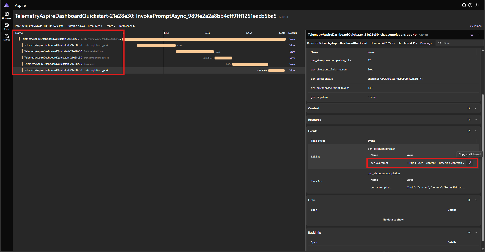
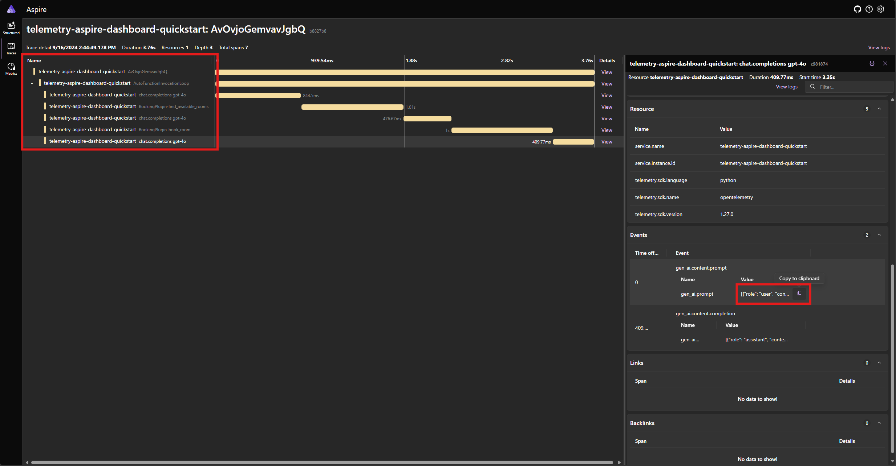
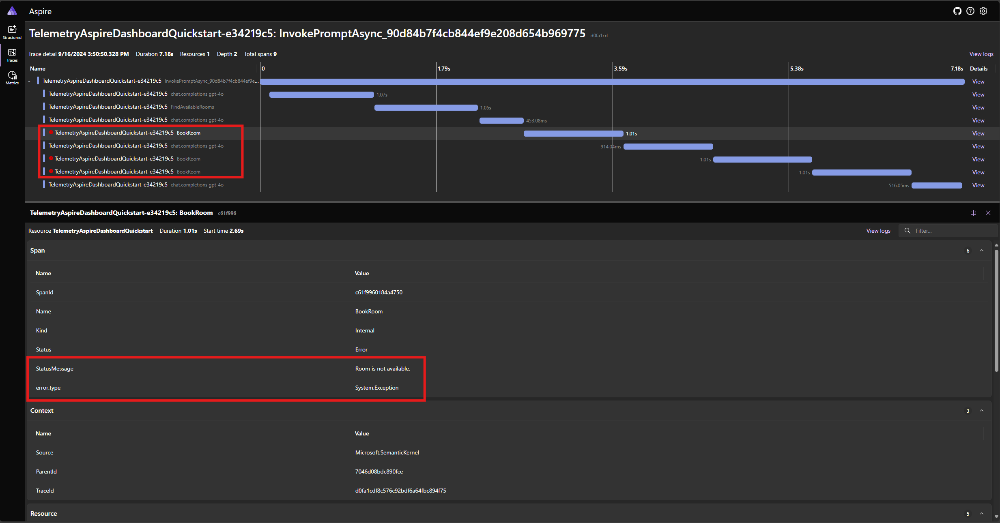
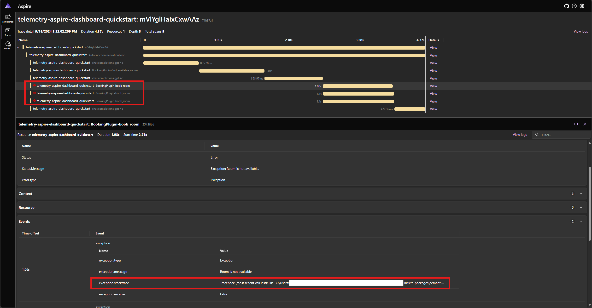

# More advanced scenarios for telemetry

> [!NOTE]
> This article will use [Aspire Dashboard](/dotnet/aspire/fundamentals/dashboard/overview?tabs=bash) for illustration. If you prefer to use other tools, please refer to the documentation of the tool you are using on setup instructions.

## Auto Function Calling

Auto Function Calling is a Semantic Kernel feature that allows the kernel to automatically execute functions when the model responds with function calls, and provide the results back to the model. This feature is useful for scenarios where a query requires multiple iterations of function calls to get a final natural language response. For more details, please see these GitHub [samples](https://github.com/microsoft/semantic-kernel/tree/main/python/samples/concepts/auto_function_calling).

> [!NOTE]
> Function calling is not supported by all models.

> [!TIP]
> You will hear the term "tools" and "tool calling" sometimes used interchangeably with "functions" and "function calling".

### Prerequisites

::: zone pivot="programming-language-csharp"

- An Azure OpenAI chat completion deployment that supports function calling.
- Docker
- The latest [.Net SDK](https://dotnet.microsoft.com/download/dotnet) for your operating system.

::: zone-end

::: zone pivot="programming-language-python"

- An Azure OpenAI chat completion deployment that supports function calling.
- Docker
- [Python 3.10, 3.11, or 3.12](https://www.python.org/downloads/) installed on your machine.

::: zone-end

::: zone pivot="programming-language-java"

> [!NOTE]
> Semantic Kernel Observability is not yet available for Java.

::: zone-end

### Setup

::: zone pivot="programming-language-csharp"

#### Create a new console application

In a terminal, run the following command to create a new console application in C#:

```console
dotnet new console -n TelemetryAutoFunctionCallingQuickstart
```

Navigate to the newly created project directory after the command completes.

#### Install required packages

- Semantic Kernel

  ```console
  dotnet add package Microsoft.SemanticKernel
  ```

- OpenTelemetry Console Exporter
  ```console
  dotnet add package OpenTelemetry.Exporter.OpenTelemetryProtocol
  ```

### Create a simple application with Semantic Kernel

From the project directory, open the `Program.cs` file with your favorite editor. We are going to create a simple application that uses Semantic Kernel to send a prompt to a chat completion model. Replace the existing content with the following code and fill in the required values for `deploymentName`, `endpoint`, and `apiKey`:

```csharp
using System.ComponentModel;
using Microsoft.Extensions.DependencyInjection;
using Microsoft.Extensions.Logging;
using Microsoft.SemanticKernel;
using Microsoft.SemanticKernel.Connectors.OpenAI;
using OpenTelemetry;
using OpenTelemetry.Logs;
using OpenTelemetry.Metrics;
using OpenTelemetry.Resources;
using OpenTelemetry.Trace;

namespace TelemetryAutoFunctionCallingQuickstart
{
    class BookingPlugin
    {
        [KernelFunction("FindAvailableRooms")]
        [Description("Finds available conference rooms for today.")]
        public async Task<List<string>> FindAvailableRoomsAsync()
        {
            // Simulate a remote call to a booking system.
            await Task.Delay(1000);
            return ["Room 101", "Room 201", "Room 301"];
        }

        [KernelFunction("BookRoom")]
        [Description("Books a conference room.")]
        public async Task<string> BookRoomAsync(string room)
        {
            // Simulate a remote call to a booking system.
            await Task.Delay(1000);
            return $"Room {room} booked.";
        }
    }

    class Program
    {
        static async Task Main(string[] args)
        {
            // Endpoint to the Aspire Dashboard
            var endpoint = "http://localhost:4317";

            var resourceBuilder = ResourceBuilder
                .CreateDefault()
                .AddService("TelemetryAspireDashboardQuickstart");

            // Enable model diagnostics with sensitive data.
            AppContext.SetSwitch("Microsoft.SemanticKernel.Experimental.GenAI.EnableOTelDiagnosticsSensitive", true);

            using var traceProvider = Sdk.CreateTracerProviderBuilder()
                .SetResourceBuilder(resourceBuilder)
                .AddSource("Microsoft.SemanticKernel*")
                .AddOtlpExporter(options => options.Endpoint = new Uri(endpoint))
                .Build();

            using var meterProvider = Sdk.CreateMeterProviderBuilder()
                .SetResourceBuilder(resourceBuilder)
                .AddMeter("Microsoft.SemanticKernel*")
                .AddOtlpExporter(options => options.Endpoint = new Uri(endpoint))
                .Build();

            using var loggerFactory = LoggerFactory.Create(builder =>
            {
                // Add OpenTelemetry as a logging provider
                builder.AddOpenTelemetry(options =>
                {
                    options.SetResourceBuilder(resourceBuilder);
                    options.AddOtlpExporter(options => options.Endpoint = new Uri(endpoint));
                    // Format log messages. This is default to false.
                    options.IncludeFormattedMessage = true;
                    options.IncludeScopes = true;
                });
                builder.SetMinimumLevel(LogLevel.Information);
            });

            IKernelBuilder builder = Kernel.CreateBuilder();
            builder.Services.AddSingleton(loggerFactory);
            builder.AddAzureOpenAIChatCompletion(
                deploymentName: "your-deployment-name",
                endpoint: "your-azure-openai-endpoint",
                apiKey: "your-azure-openai-api-key"
            );
            builder.Plugins.AddFromType<BookingPlugin>();

            Kernel kernel = builder.Build();

            var answer = await kernel.InvokePromptAsync(
                "Reserve a conference room for me today.",
                new KernelArguments(
                    new OpenAIPromptExecutionSettings {
                        ToolCallBehavior = ToolCallBehavior.AutoInvokeKernelFunctions
                    }
                )
            );

            Console.WriteLine(answer);
        }
    }
}
```

In the code above, we first define a mock conference room booking plugin with two functions: `FindAvailableRoomsAsync` and `BookRoomAsync`. We then create a simple console application that registers the plugin to the kernel, and ask the kernel to automatically call the functions when needed.

::: zone-end

::: zone pivot="programming-language-python"

#### Create a new Python virtual environment

```console
python -m venv telemetry-auto-function-calling-quickstart
```

Activate the virtual environment.

```console
telemetry-auto-function-calling-quickstart\Scripts\activate
```

#### Install required packages

```console
pip install semantic-kernel opentelemetry-exporter-otlp-proto-grpc
```

### Create a simple Python script with Semantic Kernel

Create a new Python script and open it with your favorite editor.

# [Powershell](#tab/Powershell)

```PowerShell
New-Item -Path telemetry_auto_function_calling_quickstart.py -ItemType file
```

# [Bash](#tab/Bash)

```bash
touch telemetry_auto_function_calling_quickstart.py
```

---

We are going to create a simple Python script that uses Semantic Kernel to send a prompt to a chat completion model. Replace the existing content with the following code and fill in the required values for `deployment_name`, `endpoint`, and `api_key`:

```python
import asyncio
import logging

from opentelemetry._logs import set_logger_provider
from opentelemetry.exporter.otlp.proto.grpc._log_exporter import OTLPLogExporter
from opentelemetry.exporter.otlp.proto.grpc.metric_exporter import OTLPMetricExporter
from opentelemetry.exporter.otlp.proto.grpc.trace_exporter import OTLPSpanExporter
from opentelemetry.metrics import set_meter_provider
from opentelemetry.sdk._logs import LoggerProvider, LoggingHandler
from opentelemetry.sdk._logs.export import BatchLogRecordProcessor
from opentelemetry.sdk.metrics import MeterProvider
from opentelemetry.sdk.metrics.export import PeriodicExportingMetricReader
from opentelemetry.sdk.metrics.view import DropAggregation, View
from opentelemetry.sdk.resources import Resource
from opentelemetry.sdk.trace import TracerProvider
from opentelemetry.sdk.trace.export import BatchSpanProcessor
from opentelemetry.semconv.resource import ResourceAttributes
from opentelemetry.trace import set_tracer_provider

from semantic_kernel import Kernel
from semantic_kernel.connectors.ai.function_choice_behavior import FunctionChoiceBehavior
from semantic_kernel.connectors.ai.open_ai import AzureChatCompletion
from semantic_kernel.connectors.ai.prompt_execution_settings import PromptExecutionSettings
from semantic_kernel.functions.kernel_arguments import KernelArguments
from semantic_kernel.functions.kernel_function_decorator import kernel_function


class BookingPlugin:
    @kernel_function(
        name="find_available_rooms",
        description="Find available conference rooms for today.",
    )
    def find_available_rooms(self,) -> list[str]:
        return ["Room 101", "Room 201", "Room 301"]

    @kernel_function(
        name="book_room",
        description="Book a conference room.",
    )
    def book_room(self, room: str) -> str:
        return f"Room {room} booked."


# Endpoint to the Aspire Dashboard
endpoint = "http://localhost:4317"

# Create a resource to represent the service/sample
resource = Resource.create({ResourceAttributes.SERVICE_NAME: "telemetry-aspire-dashboard-quickstart"})


def set_up_logging():
    exporter = OTLPLogExporter(endpoint=endpoint)

    # Create and set a global logger provider for the application.
    logger_provider = LoggerProvider(resource=resource)
    # Log processors are initialized with an exporter which is responsible
    # for sending the telemetry data to a particular backend.
    logger_provider.add_log_record_processor(BatchLogRecordProcessor(exporter))
    # Sets the global default logger provider
    set_logger_provider(logger_provider)

    # Create a logging handler to write logging records, in OTLP format, to the exporter.
    handler = LoggingHandler()
    # Add filters to the handler to only process records from semantic_kernel.
    handler.addFilter(logging.Filter("semantic_kernel"))
    # Attach the handler to the root logger. `getLogger()` with no arguments returns the root logger.
    # Events from all child loggers will be processed by this handler.
    logger = logging.getLogger()
    logger.addHandler(handler)
    logger.setLevel(logging.INFO)


def set_up_tracing():
    exporter = OTLPSpanExporter(endpoint=endpoint)

    # Initialize a trace provider for the application. This is a factory for creating tracers.
    tracer_provider = TracerProvider(resource=resource)
    # Span processors are initialized with an exporter which is responsible
    # for sending the telemetry data to a particular backend.
    tracer_provider.add_span_processor(BatchSpanProcessor(exporter))
    # Sets the global default tracer provider
    set_tracer_provider(tracer_provider)


def set_up_metrics():
    exporter = OTLPMetricExporter(endpoint=endpoint)

    # Initialize a metric provider for the application. This is a factory for creating meters.
    meter_provider = MeterProvider(
        metric_readers=[PeriodicExportingMetricReader(exporter, export_interval_millis=5000)],
        resource=resource,
        views=[
            # Dropping all instrument names except for those starting with "semantic_kernel"
            View(instrument_name="*", aggregation=DropAggregation()),
            View(instrument_name="semantic_kernel*"),
        ],
    )
    # Sets the global default meter provider
    set_meter_provider(meter_provider)


# This must be done before any other telemetry calls
set_up_logging()
set_up_tracing()
set_up_metrics()


async def main():
    # Create a kernel and add a service
    kernel = Kernel()
    kernel.add_service(AzureChatCompletion(
        api_key="your-azure-openai-api-key",
        endpoint="your-azure-openai-endpoint",
        deployment_name="your-deployment-name"
    ))
    kernel.add_plugin(BookingPlugin(), "BookingPlugin")

    answer = await kernel.invoke_prompt(
        "Reserve a conference room for me today.",
        arguments=KernelArguments(
            settings=PromptExecutionSettings(
                function_choice_behavior=FunctionChoiceBehavior.Auto(),
            ),
        ),
    )
    print(answer)


if __name__ == "__main__":
    asyncio.run(main())
```

In the code above, we first define a mock conference room booking plugin with two functions: `find_available_rooms` and `book_room`. We then create a simple Python script that registers the plugin to the kernel, and ask the kernel to automatically call the functions when needed.

#### Environment variables

Please refer to this [article](./telemetry-with-console.md#environment-variables) for more information on setting up the required environment variables to enable the kernel to emit spans for AI connectors.

::: zone-end

::: zone pivot="programming-language-java"

> [!NOTE]
> Semantic Kernel Observability is not yet available for Java.

::: zone-end

### Start the Aspire Dashboard

Follow the instructions [here](/dotnet/aspire/fundamentals/dashboard/standalone?tabs=bash#start-the-dashboard) to start the dashboard. Once the dashboard is running, open a browser and navigate to `http://localhost:18888` to access the dashboard.

### Run

::: zone pivot="programming-language-csharp"

Run the console application with the following command:

```console
dotnet run
```

::: zone-end

::: zone pivot="programming-language-python"

Run the Python script with the following command:

```console
python telemetry_auto_function_calling_quickstart.py
```

::: zone-end

::: zone pivot="programming-language-java"

> [!NOTE]
> Semantic Kernel Observability is not yet available for Java.

::: zone-end

You should see an output similar to the following:

```console
Room 101 has been successfully booked for you today.
```

### Inspect telemetry data

After running the application, head over to the dashboard to inspect the telemetry data.

::: zone pivot="programming-language-csharp"

Find the trace for the application in the **Traces** tab. You should five spans in the trace:



These 5 spans represent the internal operations of the kernel with auto function calling enabled. It first invokes the model, which requests a function call. Then the kernel automatically executes the function `FindAvailableRoomsAsync` and returns the result to the model. The model then requests another function call to make a reservation, and the kernel automatically executes the function `BookRoomAsync` and returns the result to the model. Finally, the model returns a natural language response to the user.

And if you click on the last span, and look for the prompt in the `gen_ai.content.prompt` event, you should see something similar to the following:

```json
[
  { "role": "user", "content": "Reserve a conference room for me today." },
  {
    "role": "Assistant",
    "content": null,
    "tool_calls": [
      {
        "id": "call_NtKi0OgOllJj1StLkOmJU8cP",
        "function": { "arguments": {}, "name": "FindAvailableRooms" },
        "type": "function"
      }
    ]
  },
  {
    "role": "tool",
    "content": "[\u0022Room 101\u0022,\u0022Room 201\u0022,\u0022Room 301\u0022]"
  },
  {
    "role": "Assistant",
    "content": null,
    "tool_calls": [
      {
        "id": "call_mjQfnZXLbqp4Wb3F2xySds7q",
        "function": { "arguments": { "room": "Room 101" }, "name": "BookRoom" },
        "type": "function"
      }
    ]
  },
  { "role": "tool", "content": "Room Room 101 booked." }
]
```

This is the chat history that gets built up as the model and the kernel interact with each other. This is sent to the model in the last iteration to get a natural language response.

::: zone-end

::: zone pivot="programming-language-python"

Find the trace for the application in the **Traces** tab. You should five spans in the trace grouped under the `AutoFunctionInvocationLoop` span:



These 5 spans represent the internal operations of the kernel with auto function calling enabled. It first invokes the model, which requests a function call. Then the kernel automatically executes the function `find_available_rooms` and returns the result to the model. The model then requests another function call to make a reservation, and the kernel automatically executes the function `book_room` and returns the result to the model. Finally, the model returns a natural language response to the user.

And if you click on the last span, and look for the prompt in the `gen_ai.content.prompt` event, you should see something similar to the following:

```json
[
  { "role": "user", "content": "Reserve a conference room for me today." },
  {
    "role": "assistant",
    "tool_calls": [
      {
        "id": "call_ypqO5v6uTRlYH9sPTjvkGec8",
        "type": "function",
        "function": {
          "name": "BookingPlugin-find_available_rooms",
          "arguments": "{}"
        }
      }
    ]
  },
  {
    "role": "tool",
    "content": "['Room 101', 'Room 201', 'Room 301']",
    "tool_call_id": "call_ypqO5v6uTRlYH9sPTjvkGec8"
  },
  {
    "role": "assistant",
    "tool_calls": [
      {
        "id": "call_XDZGeTfNiWRpYKoHoH9TZRoX",
        "type": "function",
        "function": {
          "name": "BookingPlugin-book_room",
          "arguments": "{\"room\":\"Room 101\"}"
        }
      }
    ]
  },
  {
    "role": "tool",
    "content": "Room Room 101 booked.",
    "tool_call_id": "call_XDZGeTfNiWRpYKoHoH9TZRoX"
  }
]
```

This is the chat history that gets built up as the model and the kernel interact with each other. This is sent to the model in the last iteration to get a natural language response.

::: zone-end

::: zone pivot="programming-language-java"

> [!NOTE]
> Semantic Kernel Observability is not yet available for Java.

::: zone-end

## Error handling

If an error occurs during the execution of a function, the kernel will automatically catch the error and return an error message to the model. The model can then use this error message to provide a natural language response to the user.

::: zone pivot="programming-language-csharp"

Modify the `BookRoomAsync` function in the C# code to simulate an error:

```csharp
[KernelFunction("BookRoom")]
[Description("Books a conference room.")]
public async Task<string> BookRoomAsync(string room)
{
    // Simulate a remote call to a booking system.
    await Task.Delay(1000);

    throw new Exception("Room is not available.");
}
```

Run the application again and observe the trace in the dashboard. You should see the span representing the kernel function call with an error:



> [!NOTE]
> It is very likely that the model responses to the error may vary each time you run the application, because the model is stochastic. You may see the model reserving all three rooms at the same time, or reserving one the first time then reserving the other two the second time, etc.

::: zone-end

::: zone pivot="programming-language-python"

Modify the `book_room` function in the Python code to simulate an error:

```python
@kernel_function(
    name="book_room",
    description="Book a conference room.",
)
async def book_room(self, room: str) -> str:
    # Simulate a remote call to a booking system
    await asyncio.sleep(1)

    raise Exception("Room is not available.")
```

Run the application again and observe the trace in the dashboard. You should see the span representing the kernel function call with an error and the stack trace:



> [!NOTE]
> It is very likely that the model responses to the error may vary each time you run the application, because the model is stochastic. You may see the model reserving all three rooms at the same time, or reserving one the first time then reserving the other two the second time, etc.

::: zone-end

::: zone pivot="programming-language-java"

> [!NOTE]
> Semantic Kernel Observability is not yet available for Java.

::: zone-end

## Next steps and further reading

In production, your services may get a large number of requests. Semantic Kernel will generate a large amount of telemetry data. some of which may not be useful for your use case and will introduce unnecessary costs to store the data. You can use the [sampling](https://opentelemetry.io/docs/concepts/sampling/) feature to reduce the amount of telemetry data that is collected.

Observability in Semantic Kernel is constantly improving. You can find the latest updates and new features in the [GitHub repository](https://github.com/microsoft/semantic-kernel).
