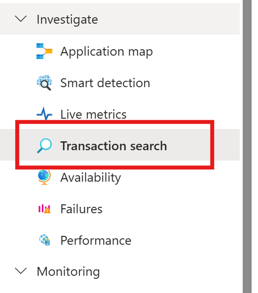

# Inspection of telemetry data with Application Insights

[Application Insights](/azure/azure-monitor/app/app-insights-overview) is part of [Azure Monitor](/azure/azure-monitor/overview), which is a comprehensive solution for collecting, analyzing, and acting on telemetry data from your cloud and on-premises environments. With Application Insights, you can monitor your application's performance, detect issues, and diagnose problems.

In this example, we will learn how to export telemetry data to Application Insights, and inspect the data in the Application Insights portal.

::: zone pivot="programming-language-csharp"

> [!WARNING]
> Semantic Kernel utilizes a .NET 8 feature called keyed services.
> Application Insights has an issue with service registration, making it incompatible with keyed services.
> If you are using Semantic Kernel with keyed services and encounter unexpected errors related to Application Insights dependency injection, you should register Application Insights before any keyed services to resolve this issue.
> For more information see [microsoft/ApplicationInsights-dotnet#2879](https://github.com/microsoft/ApplicationInsights-dotnet/issues/2879)

::: zone-end

## Exporter

Exporters are responsible for sending telemetry data to a destination. Read more about exporters [here](https://opentelemetry.io/docs/concepts/components/#exporters). In this example, we use the Azure Monitor exporter to output telemetry data to an Application Insights instance.

## Prerequisites

::: zone pivot="programming-language-csharp"

- An Azure OpenAI chat completion deployment.
- An Application Insights instance. Follow the [instructions](/azure/azure-monitor/app/create-workspace-resource?tabs=bicep#create-a-workspace-based-resource) here to create a resource if you don't have one. Copy the [connection string](/azure/azure-monitor/app/sdk-connection-string?tabs=dotnet5#find-your-connection-string) for later use.
- The latest [.Net SDK](https://dotnet.microsoft.com/download/dotnet) for your operating system.

::: zone-end

::: zone pivot="programming-language-python"

- An Azure OpenAI chat completion deployment.
- An Application Insights instance. Follow the [instructions](/azure/azure-monitor/app/create-workspace-resource?tabs=bicep#create-a-workspace-based-resource) here to create a resource if you don't have one. Copy the [connection string](/azure/azure-monitor/app/sdk-connection-string?tabs=dotnet5#find-your-connection-string) for later use.
- [Python 3.10, 3.11, or 3.12](https://www.python.org/downloads/) installed on your machine.

::: zone-end

::: zone pivot="programming-language-java"

> [!NOTE]
> Semantic Kernel Observability is not yet available for Java.

::: zone-end

## Setup

::: zone pivot="programming-language-csharp"

### Create a new console application

In a terminal, run the following command to create a new console application in C#:

```console
dotnet new console -n TelemetryApplicationInsightsQuickstart
```

Navigate to the newly created project directory after the command completes.


### Install required packages

- Semantic Kernel
    ```console
    dotnet add package Microsoft.SemanticKernel
    ```

- OpenTelemetry Console Exporter
    ```console
    dotnet add package Azure.Monitor.OpenTelemetry.Exporter
    ```

### Create a simple application with Semantic Kernel

From the project directory, open the `Program.cs` file with your favorite editor. We are going to create a simple application that uses Semantic Kernel to send a prompt to a chat completion model. Replace the existing content with the following code and fill in the required values for `deploymentName`, `endpoint`, and `apiKey`:

```csharp
using Azure.Monitor.OpenTelemetry.Exporter;

using Microsoft.Extensions.DependencyInjection;
using Microsoft.Extensions.Logging;
using Microsoft.SemanticKernel;
using OpenTelemetry;
using OpenTelemetry.Logs;
using OpenTelemetry.Metrics;
using OpenTelemetry.Resources;
using OpenTelemetry.Trace;

namespace TelemetryApplicationInsightsQuickstart
{
    class Program
    {
        static async Task Main(string[] args)
        {
            // Telemetry setup code goes here

            IKernelBuilder builder = Kernel.CreateBuilder();
            // builder.Services.AddSingleton(loggerFactory);
            builder.AddAzureOpenAIChatCompletion(
                deploymentName: "your-deployment-name",
                endpoint: "your-azure-openai-endpoint",
                apiKey: "your-azure-openai-api-key"
            );

            Kernel kernel = builder.Build();

            var answer = await kernel.InvokePromptAsync(
                "Why is the sky blue in one sentence?"
            );

            Console.WriteLine(answer);
        }
    }
}
```

### Add telemetry

If you run the console app now, you should expect to see a sentence explaining why the sky is blue. To observe the kernel via telemetry, replace the `// Telemetry setup code goes here` comment with the following code:

```csharp
// Replace the connection string with your Application Insights connection string
var connectionString = "your-application-insights-connection-string";

var resourceBuilder = ResourceBuilder
    .CreateDefault()
    .AddService("TelemetryApplicationInsightsQuickstart");

// Enable model diagnostics with sensitive data.
AppContext.SetSwitch("Microsoft.SemanticKernel.Experimental.GenAI.EnableOTelDiagnosticsSensitive", true);

using var traceProvider = Sdk.CreateTracerProviderBuilder()
    .SetResourceBuilder(resourceBuilder)
    .AddSource("Microsoft.SemanticKernel*")
    .AddAzureMonitorTraceExporter(options => options.ConnectionString = connectionString)
    .Build();

using var meterProvider = Sdk.CreateMeterProviderBuilder()
    .SetResourceBuilder(resourceBuilder)
    .AddMeter("Microsoft.SemanticKernel*")
    .AddAzureMonitorMetricExporter(options => options.ConnectionString = connectionString)
    .Build();

using var loggerFactory = LoggerFactory.Create(builder =>
{
    // Add OpenTelemetry as a logging provider
    builder.AddOpenTelemetry(options =>
    {
        options.SetResourceBuilder(resourceBuilder);
        options.AddAzureMonitorLogExporter(options => options.ConnectionString = connectionString);
        // Format log messages. This is default to false.
        options.IncludeFormattedMessage = true;
        options.IncludeScopes = true;
    });
    builder.SetMinimumLevel(LogLevel.Information);
});
```

Finally Uncomment the line `// builder.Services.AddSingleton(loggerFactory);` to add the logger factory to the builder.

Please refer to this [article](./telemetry-with-console.md#add-telemetry) for more information on the telemetry setup code. The only difference here is that we are using `AddAzureMonitor[Trace|Metric|Log]Exporter` to export telemetry data to Application Insights.

::: zone-end

::: zone pivot="programming-language-python"

### Create a new Python virtual environment

```console
python -m venv telemetry-application-insights-quickstart
```

Activate the virtual environment.
```console
telemetry-application-insights-quickstart\Scripts\activate
```

### Install required packages

```console
pip install semantic-kernel azure-monitor-opentelemetry-exporter
```

### Create a simple Python script with Semantic Kernel

Create a new Python script and open it with your favorite editor.

# [Powershell](#tab/Powershell)

```PowerShell
New-Item -Path telemetry_application_insights_quickstart.py -ItemType file
```

# [Bash](#tab/Bash)

```bash
touch telemetry_application_insights_quickstart.py
```

---

We are going to create a simple Python script that uses Semantic Kernel to send a prompt to a chat completion model. Replace the existing content with the following code and fill in the required values for `deployment_name`, `endpoint`, and `api_key`:

```python
import asyncio
import logging

from azure.monitor.opentelemetry.exporter import (
    AzureMonitorLogExporter,
    AzureMonitorMetricExporter,
    AzureMonitorTraceExporter,
)

from opentelemetry._logs import set_logger_provider
from opentelemetry.metrics import set_meter_provider
from opentelemetry.sdk._logs import LoggerProvider, LoggingHandler
from opentelemetry.sdk._logs.export import BatchLogRecordProcessor
from opentelemetry.sdk.metrics import MeterProvider
from opentelemetry.sdk.metrics.export import PeriodicExportingMetricReader
from opentelemetry.sdk.metrics.view import DropAggregation, View
from opentelemetry.sdk.resources import Resource
from opentelemetry.sdk.trace import TracerProvider
from opentelemetry.sdk.trace.export import BatchSpanProcessor
from opentelemetry.semconv.resource import ResourceAttributes
from opentelemetry.trace import set_tracer_provider

from semantic_kernel import Kernel
from semantic_kernel.connectors.ai.open_ai import AzureChatCompletion


# Telemetry setup code goes here

async def main():
    # Create a kernel and add a service
    kernel = Kernel()
    kernel.add_service(AzureChatCompletion(
        api_key="your-azure-openai-api-key",
        endpoint="your-azure-openai-endpoint",
        deployment_name="your-deployment-name"
    ))

    answer = await kernel.invoke_prompt("Why is the sky blue in one sentence?")
    print(answer)


if __name__ == "__main__":
    asyncio.run(main())
```

### Add telemetry

#### Environment variables

Please refer to this [article](./telemetry-with-console.md#environment-variables) for more information on setting up the required environment variables to enable the kernel to emit spans for AI connectors.

#### Code
If you run the script now, you should expect to see a sentence explaining why the sky is blue. To observe the kernel via telemetry, replace the `# Telemetry setup code goes here` comment with the following code:

```python
# Replace the connection string with your Application Insights connection string
connection_string = "your-application-insights-connection-string"

# Create a resource to represent the service/sample
resource = Resource.create({ResourceAttributes.SERVICE_NAME: "telemetry-application-insights-quickstart"})


def set_up_logging():
    exporter = AzureMonitorLogExporter(connection_string=connection_string)

    # Create and set a global logger provider for the application.
    logger_provider = LoggerProvider(resource=resource)
    # Log processors are initialized with an exporter which is responsible
    # for sending the telemetry data to a particular backend.
    logger_provider.add_log_record_processor(BatchLogRecordProcessor(exporter))
    # Sets the global default logger provider
    set_logger_provider(logger_provider)

    # Create a logging handler to write logging records, in OTLP format, to the exporter.
    handler = LoggingHandler()
    # Add filters to the handler to only process records from semantic_kernel.
    handler.addFilter(logging.Filter("semantic_kernel"))
    # Attach the handler to the root logger. `getLogger()` with no arguments returns the root logger.
    # Events from all child loggers will be processed by this handler.
    logger = logging.getLogger()
    logger.addHandler(handler)
    logger.setLevel(logging.INFO)


def set_up_tracing():
    exporter = AzureMonitorTraceExporter(connection_string=connection_string)

    # Initialize a trace provider for the application. This is a factory for creating tracers.
    tracer_provider = TracerProvider(resource=resource)
    # Span processors are initialized with an exporter which is responsible
    # for sending the telemetry data to a particular backend.
    tracer_provider.add_span_processor(BatchSpanProcessor(exporter))
    # Sets the global default tracer provider
    set_tracer_provider(tracer_provider)


def set_up_metrics():
    exporter = AzureMonitorMetricExporter(connection_string=connection_string)

    # Initialize a metric provider for the application. This is a factory for creating meters.
    meter_provider = MeterProvider(
        metric_readers=[PeriodicExportingMetricReader(exporter, export_interval_millis=5000)],
        resource=resource,
        views=[
            # Dropping all instrument names except for those starting with "semantic_kernel"
            View(instrument_name="*", aggregation=DropAggregation()),
            View(instrument_name="semantic_kernel*"),
        ],
    )
    # Sets the global default meter provider
    set_meter_provider(meter_provider)


# This must be done before any other telemetry calls
set_up_logging()
set_up_tracing()
set_up_metrics()
```

Please refer to this [article](./telemetry-with-console.md#add-telemetry-1) for more information on the telemetry setup code. The only difference here is that we are using `AzureMonitor[Trace|Metric|Log]Exporter` to export telemetry data to Application Insights.

::: zone-end

::: zone pivot="programming-language-java"

> [!NOTE]
> Semantic Kernel Observability is not yet available for Java.
 
::: zone-end

## Run

::: zone pivot="programming-language-csharp"

Run the console application with the following command:

```console
dotnet run
```

::: zone-end

::: zone pivot="programming-language-python"

Run the Python script with the following command:

```console
python telemetry_application_insights_quickstart.py
```

::: zone-end

::: zone pivot="programming-language-java"

> [!NOTE]
> Semantic Kernel Observability is not yet available for Java.

::: zone-end

## Inspect telemetry data

After running the application, head over to the Application Insights portal to inspect the telemetry data. It may take a few minutes for the data to appear in the portal.

### Transaction search

Navigate to the **Transaction search** tab to view the transactions that have been recorded.



Hit refresh to see the latest transactions. When results appear, click on one of them to see more details.


Toggle between the **View all** and **View timeline** button to see all traces and dependencies of the transaction in different views.

> [!IMPORTANT]
> [Traces](/azure/azure-monitor/app/data-model-complete#trace) represent traditional log entries and [OpenTelemetry span events](https://opentelemetry.io/docs/concepts/signals/traces/#span-events). They are not the same as distributed traces. Dependencies represent the calls to (internal and external) components. Please refer to this [article](/azure/azure-monitor/app/data-model-complete) for more information on the data model in Application Insights.

For this particular example, you should see two dependencies and multiple traces. The first dependency represents a kernel function that is created from the prompt. The second dependency represents the call to the Azure OpenAI chat completion model. When you expand the `chat.completion {your-deployment-name}` dependency, you should see the details of the call. A set of `gen_ai` attributes are attached to the dependency, which provides additional context about the call.


::: zone pivot="programming-language-csharp"

If you have the switch `Microsoft.SemanticKernel.Experimental.GenAI.EnableOTelDiagnosticsSensitive` set to `true`, you will also see two traces that carry the sensitive data of the prompt and the completion result.


Click on them and you will see the prompt and the completion result under the custom properties section.

::: zone-end

::: zone pivot="programming-language-python"

If you have the environment variable `SEMANTICKERNEL_EXPERIMENTAL_GENAI_ENABLE_OTEL_DIAGNOSTICS_SENSITIVE` set to `true`, you will also see two traces that carry the sensitive data of the prompt and the completion result.


Click on them and you will see the prompt and the completion result under the custom properties section.

::: zone-end

### Log analytics

Transaction search is not the only way to inspect telemetry data. You can also use [**Log analytics**](/azure/azure-monitor/logs/log-analytics-overview) to query and analyze the data. Navigate to the **Logs** under **Monitoring** to start.

Follow this [document](/azure/azure-monitor/logs/log-analytics-overview#log-analytics-interface) to start exploring the log analytics interface.

Below are some sample queries you can use for this example:

```kusto
// Retrieves the total number of completion and prompt tokens used for the model if you run the application multiple times.
dependencies
| where name startswith "chat"
| project model = customDimensions["gen_ai.request.model"], completion_token = toint(customDimensions["gen_ai.response.completion_tokens"]), prompt_token = toint(customDimensions["gen_ai.response.prompt_tokens"])
| where model == "gpt-4o"
| project completion_token, prompt_token
| summarize total_completion_tokens = sum(completion_token), total_prompt_tokens = sum(prompt_token)
```


```kusto
// Retrieves all the prompts and completions and their corresponding token usage.
dependencies
| where name startswith "chat"
| project timestamp, operation_Id, name, completion_token = customDimensions["gen_ai.response.completion_tokens"], prompt_token = customDimensions["gen_ai.response.prompt_tokens"]
| join traces on operation_Id
| where message startswith "gen_ai"
|project timestamp, messages = customDimensions, token=iff(customDimensions contains "gen_ai.prompt", prompt_token, completion_token)
```


## Next steps

Now that you have successfully output telemetry data to Application Insights, you can explore more features of Semantic Kernel that can help you monitor and diagnose your application:

> [!div class="nextstepaction"]
> [Advanced telemetry with Semantic Kernel](./telemetry-advanced.md)
