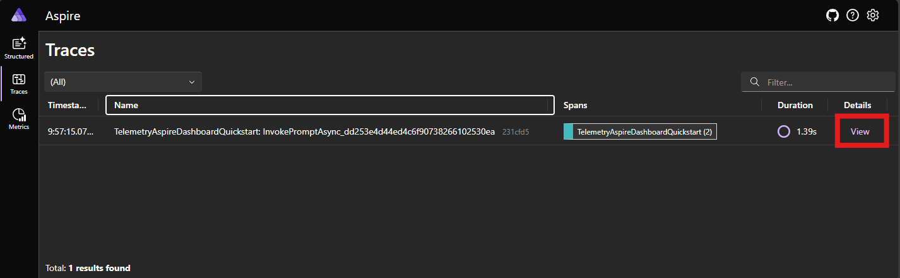
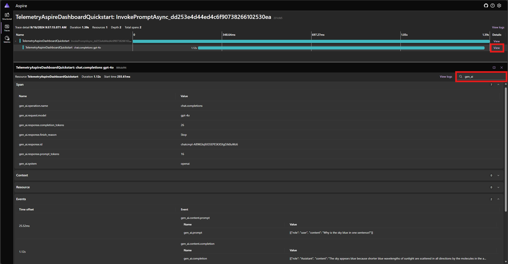

# Inspection of telemetry data with Aspire Dashboard

[Aspire Dashboard](/dotnet/aspire/fundamentals/dashboard/overview?tabs=bash) is part of the [.NET Aspire](/dotnet/aspire/get-started/aspire-overview) offering. The dashboard allows developers to monitor and inspect their distributed applications.

In this example, we will use the [standalone mode](/dotnet/aspire/fundamentals/dashboard/standalone?tabs=bash) and learn how to export telemetry data to Aspire Dashboard, and inspect the data there.

## Exporter

Exporters are responsible for sending telemetry data to a destination. Read more about exporters [here](https://opentelemetry.io/docs/concepts/components/#exporters). In this example, we use the [OpenTelemetry Protocol (OTLP)](https://opentelemetry.io/docs/specs/otlp/) exporter to send telemetry data to Aspire Dashboard.

## Prerequisites

::: zone pivot="programming-language-csharp"

- An Azure OpenAI chat completion deployment.
- Docker
- The latest [.Net SDK](https://dotnet.microsoft.com/download/dotnet) for your operating system.

::: zone-end

::: zone pivot="programming-language-python"

- An Azure OpenAI chat completion deployment.
- Docker
- [Python 3.10, 3.11, or 3.12](https://www.python.org/downloads/) installed on your machine.

::: zone-end

::: zone pivot="programming-language-java"

> [!NOTE]
> Semantic Kernel Observability is not yet available for Java.

::: zone-end

## Setup

::: zone pivot="programming-language-csharp"

### Create a new console application

In a terminal, run the following command to create a new console application in C#:

```console
dotnet new console -n TelemetryAspireDashboardQuickstart
```

Navigate to the newly created project directory after the command completes.

### Install required packages

- Semantic Kernel

  ```console
  dotnet add package Microsoft.SemanticKernel
  ```

- OpenTelemetry Console Exporter
  ```console
  dotnet add package OpenTelemetry.Exporter.OpenTelemetryProtocol
  ```

### Create a simple application with Semantic Kernel

From the project directory, open the `Program.cs` file with your favorite editor. We are going to create a simple application that uses Semantic Kernel to send a prompt to a chat completion model. Replace the existing content with the following code and fill in the required values for `deploymentName`, `endpoint`, and `apiKey`:

```csharp
using Microsoft.Extensions.DependencyInjection;
using Microsoft.Extensions.Logging;
using Microsoft.SemanticKernel;
using OpenTelemetry;
using OpenTelemetry.Logs;
using OpenTelemetry.Metrics;
using OpenTelemetry.Resources;
using OpenTelemetry.Trace;

namespace TelemetryAspireDashboardQuickstart
{
    class Program
    {
        static async Task Main(string[] args)
        {
            // Telemetry setup code goes here

            IKernelBuilder builder = Kernel.CreateBuilder();
            // builder.Services.AddSingleton(loggerFactory);
            builder.AddAzureOpenAIChatCompletion(
                deploymentName: "your-deployment-name",
                endpoint: "your-azure-openai-endpoint",
                apiKey: "your-azure-openai-api-key"
            );

            Kernel kernel = builder.Build();

            var answer = await kernel.InvokePromptAsync(
                "Why is the sky blue in one sentence?"
            );

            Console.WriteLine(answer);
        }
    }
}
```

### Add telemetry

If you run the console app now, you should expect to see a sentence explaining why the sky is blue. To observe the kernel via telemetry, replace the `// Telemetry setup code goes here` comment with the following code:

```csharp
// Endpoint to the Aspire Dashboard
var endpoint = "http://localhost:4317";

var resourceBuilder = ResourceBuilder
    .CreateDefault()
    .AddService("TelemetryAspireDashboardQuickstart");

// Enable model diagnostics with sensitive data.
AppContext.SetSwitch("Microsoft.SemanticKernel.Experimental.GenAI.EnableOTelDiagnosticsSensitive", true);

using var traceProvider = Sdk.CreateTracerProviderBuilder()
    .SetResourceBuilder(resourceBuilder)
    .AddSource("Microsoft.SemanticKernel*")
    .AddOtlpExporter(options => options.Endpoint = new Uri(endpoint))
    .Build();

using var meterProvider = Sdk.CreateMeterProviderBuilder()
    .SetResourceBuilder(resourceBuilder)
    .AddMeter("Microsoft.SemanticKernel*")
    .AddOtlpExporter(options => options.Endpoint = new Uri(endpoint))
    .Build();

using var loggerFactory = LoggerFactory.Create(builder =>
{
    // Add OpenTelemetry as a logging provider
    builder.AddOpenTelemetry(options =>
    {
        options.SetResourceBuilder(resourceBuilder);
        options.AddOtlpExporter(options => options.Endpoint = new Uri(endpoint));
        // Format log messages. This is default to false.
        options.IncludeFormattedMessage = true;
        options.IncludeScopes = true;
    });
    builder.SetMinimumLevel(LogLevel.Information);
});
```

Finally Uncomment the line `// builder.Services.AddSingleton(loggerFactory);` to add the logger factory to the builder.

Please refer to this [article](./telemetry-with-console.md#add-telemetry) for more information on the telemetry setup code. The only difference here is that we are using `AddOtlpExporter` to export telemetry data to Aspire Dashboard.

::: zone-end

::: zone pivot="programming-language-python"

### Create a new Python virtual environment

```console
python -m venv telemetry-aspire-dashboard-quickstart
```

Activate the virtual environment.

```console
telemetry-aspire-dashboard-quickstart\Scripts\activate
```

### Install required packages

```console
pip install semantic-kernel opentelemetry-exporter-otlp-proto-grpc
```

### Create a simple Python script with Semantic Kernel

Create a new Python script and open it with your favorite editor.

# [Powershell](#tab/Powershell)

```PowerShell
New-Item -Path telemetry_aspire_dashboard_quickstart.py -ItemType file
```

# [Bash](#tab/Bash)

```bash
touch telemetry_aspire_dashboard_quickstart.py
```

---

We are going to create a simple Python script that uses Semantic Kernel to send a prompt to a chat completion model. Replace the existing content with the following code and fill in the required values for `deployment_name`, `endpoint`, and `api_key`:

```python
import asyncio
import logging

from opentelemetry._logs import set_logger_provider
from opentelemetry.exporter.otlp.proto.grpc._log_exporter import OTLPLogExporter
from opentelemetry.exporter.otlp.proto.grpc.metric_exporter import OTLPMetricExporter
from opentelemetry.exporter.otlp.proto.grpc.trace_exporter import OTLPSpanExporter
from opentelemetry.metrics import set_meter_provider
from opentelemetry.sdk._logs import LoggerProvider, LoggingHandler
from opentelemetry.sdk._logs.export import BatchLogRecordProcessor
from opentelemetry.sdk.metrics import MeterProvider
from opentelemetry.sdk.metrics.export import PeriodicExportingMetricReader
from opentelemetry.sdk.metrics.view import DropAggregation, View
from opentelemetry.sdk.resources import Resource
from opentelemetry.sdk.trace import TracerProvider
from opentelemetry.sdk.trace.export import BatchSpanProcessor
from opentelemetry.semconv.resource import ResourceAttributes
from opentelemetry.trace import set_tracer_provider

from semantic_kernel import Kernel
from semantic_kernel.connectors.ai.open_ai import AzureChatCompletion


# Telemetry setup code goes here

async def main():
    # Create a kernel and add a service
    kernel = Kernel()
    kernel.add_service(AzureChatCompletion(
        api_key="your-azure-openai-api-key",
        endpoint="your-azure-openai-endpoint",
        deployment_name="your-deployment-name"
    ))

    answer = await kernel.invoke_prompt("Why is the sky blue in one sentence?")
    print(answer)


if __name__ == "__main__":
    asyncio.run(main())
```

### Add telemetry

#### Environment variables

Please refer to this [article](./telemetry-with-console.md#environment-variables) for more information on setting up the required environment variables to enable the kernel to emit spans for AI connectors.

#### Code

If you run the script now, you should expect to see a sentence explaining why the sky is blue. To observe the kernel via telemetry, replace the `# Telemetry setup code goes here` comment with the following code:

```python
# Endpoint to the Aspire Dashboard
endpoint = "http://localhost:4317"

# Create a resource to represent the service/sample
resource = Resource.create({ResourceAttributes.SERVICE_NAME: "telemetry-aspire-dashboard-quickstart"})


def set_up_logging():
    exporter = OTLPLogExporter(endpoint=endpoint)

    # Create and set a global logger provider for the application.
    logger_provider = LoggerProvider(resource=resource)
    # Log processors are initialized with an exporter which is responsible
    # for sending the telemetry data to a particular backend.
    logger_provider.add_log_record_processor(BatchLogRecordProcessor(exporter))
    # Sets the global default logger provider
    set_logger_provider(logger_provider)

    # Create a logging handler to write logging records, in OTLP format, to the exporter.
    handler = LoggingHandler()
    # Add filters to the handler to only process records from semantic_kernel.
    handler.addFilter(logging.Filter("semantic_kernel"))
    # Attach the handler to the root logger. `getLogger()` with no arguments returns the root logger.
    # Events from all child loggers will be processed by this handler.
    logger = logging.getLogger()
    logger.addHandler(handler)
    logger.setLevel(logging.INFO)


def set_up_tracing():
    exporter = OTLPSpanExporter(endpoint=endpoint)

    # Initialize a trace provider for the application. This is a factory for creating tracers.
    tracer_provider = TracerProvider(resource=resource)
    # Span processors are initialized with an exporter which is responsible
    # for sending the telemetry data to a particular backend.
    tracer_provider.add_span_processor(BatchSpanProcessor(exporter))
    # Sets the global default tracer provider
    set_tracer_provider(tracer_provider)


def set_up_metrics():
    exporter = OTLPMetricExporter(endpoint=endpoint)

    # Initialize a metric provider for the application. This is a factory for creating meters.
    meter_provider = MeterProvider(
        metric_readers=[PeriodicExportingMetricReader(exporter, export_interval_millis=5000)],
        resource=resource,
        views=[
            # Dropping all instrument names except for those starting with "semantic_kernel"
            View(instrument_name="*", aggregation=DropAggregation()),
            View(instrument_name="semantic_kernel*"),
        ],
    )
    # Sets the global default meter provider
    set_meter_provider(meter_provider)


# This must be done before any other telemetry calls
set_up_logging()
set_up_tracing()
set_up_metrics()
```

Please refer to this [article](./telemetry-with-console.md#add-telemetry-1) for more information on the telemetry setup code. The only difference here is that we are using `OTLP[Span|Metric|Log]Exporter` to export telemetry data to Aspire Dashboard.

::: zone-end

::: zone pivot="programming-language-java"

> [!NOTE]
> Semantic Kernel Observability is not yet available for Java.

::: zone-end

## Start the Aspire Dashboard

Follow the instructions [here](/dotnet/aspire/fundamentals/dashboard/standalone?tabs=bash#start-the-dashboard) to start the dashboard. Once the dashboard is running, open a browser and navigate to `http://localhost:18888` to access the dashboard.

## Run

::: zone pivot="programming-language-csharp"

Run the console application with the following command:

```console
dotnet run
```

::: zone-end

::: zone pivot="programming-language-python"

Run the Python script with the following command:

```console
python telemetry_aspire_dashboard_quickstart.py
```

::: zone-end

::: zone pivot="programming-language-java"

> [!NOTE]
> Semantic Kernel Observability is not yet available for Java.

::: zone-end

## Inspect telemetry data

After running the application, head over to the dashboard to inspect the telemetry data.

> [!TIP]
> Follow this [guide](/dotnet/aspire/fundamentals/dashboard/explore) to explore the Aspire Dashboard interface.

### Traces

If this is your first time running the application after starting the dashboard, you should see a one trace is the `Traces` tab. Click on the trace to view more details.



In the trace details, you can see the span that represents the prompt function and the span that represents the chat completion model. Click on the chat completion span to see details about the request and response.

> [!TIP]
> You can filter the attributes of the spans to find the one you are interested in.



### Logs

Head over to the `Structured` tab to view the logs emitted by the application. Please refer to this [guide](/dotnet/aspire/fundamentals/dashboard/explore#structured-logs-page) on how to work with structured logs in the dashboard.

## Next steps

Now that you have successfully output telemetry data to Aspire Dashboard, you can explore more features of Semantic Kernel that can help you monitor and diagnose your application:

> [!div class="nextstepaction"]
> [Advanced telemetry with Semantic Kernel](./telemetry-advanced.md)
