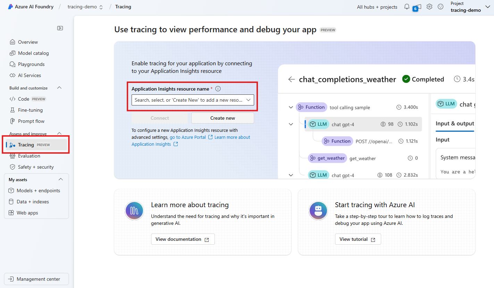

# Visualize traces on Azure AI Foundry Tracing UI

[Azure AI Foundry](/azure/ai-studio/) Tracing UI is a web-based user interface that allows you to visualize traces and logs generated by your applications. This article provides a step-by-step guide on how to visualize traces on Azure AI Foundry Tracing UI.

> [!IMPORTANT]
> Before you start, make sure you have completed the tutorial on [inspecting telemetry data with Application Insights](./telemetry-with-app-insights.md).

Prerequisites:

- An Azure AI Foundry project. Follow this [guide](/azure/ai-studio/how-to/create-projects) to create one if you don't have one.
- A [chat completion service](../../ai-services/chat-completion/index.md).

## Attach an Application Insights resource to the project

Go to the Azure AI Foundry project, select the **Tracing** tab on the left blade, and use the drop down to attach the Application Insights resource you created in the previous tutorial then click **Connect**.

## Use an AI service of your choice

All Semantic Kernel [AI connectors](../../ai-services/chat-completion/index.md) emit GenAI telemetry data that can be visualized in the Azure AI Foundry Tracing UI.

Simply rerun the code from the [inspecting telemetry data with Application Insights](./telemetry-with-app-insights.md) tutorial.

## Visualize traces on Azure AI Foundry Tracing UI

After the script finishes running, head over to the Azure AI Foundry tracing UI. You will see a new trace in the trace UI.

> [!TIP]
> It may take a few minutes for the traces to show up on the UI.

## Next steps

Now that you have successfully visualize trace data with an Azure AI Foundry project, you can explore more features of Semantic Kernel that can help you monitor and diagnose your application:

> [!div class="nextstepaction"]
> [Advanced telemetry with Semantic Kernel](./telemetry-advanced.md)
