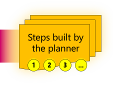

# What is Planner?

The Planner works backwards from a goal that’s been given with an Ask. Because the Planner has access to all the available Skills it can generate the set of necessary steps to reach the end goal. 

> [!div class="nextstepaction"]
> [Learn about SKills](skills.md)
