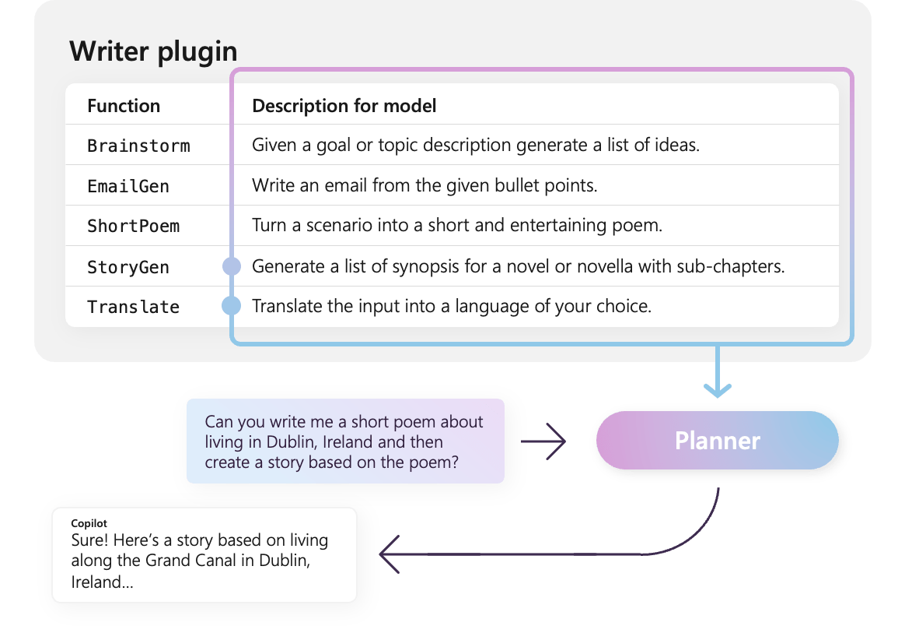

# What is a Plugin?

:::row:::
   :::column span="1":::
    Plugins are a key component of Semantic Kernel. If you have already used plugins from ChatGPT or Copilot extensions in Microsoft 365, you’re already familiar with them. With plugins, you can encapsulate your existing APIs into a collection that can be used by an AI. This allows you to give your AI the ability to perform actions that it wouldn’t be able to do otherwise.

    Behind the scenes, Semantic Kernel leverages [function calling](https://platform.openai.com/docs/guides/function-calling), a native feature of most of the latest LLMs to allow LLMs, to perform [planning](../planning.md) and to invoke your APIs. With function calling, LLMs can request (i.e., call) a particular function. Semantic Kernel then marshals the request to the appropriate function in your codebase and returns the results back to the LLM so the LLM can generate a final response.
   :::column-end:::
   :::column span="1":::
        
   :::column-end:::
:::row-end:::

Not all AI SDKs have an analogous concept to plugins (most just have functions or tools). In enterprise scenarios, however, plugins are valuable because they encapsulate a set of functionality that mirrors how enterprise developers already develop services and APIs. Plugins also play nicely with dependency injection. Within a plugin's constructor, you can inject services that are necessary to perform the work of the plugin (e.g., database connections, HTTP clients, etc.). This is difficult to accomplish with other SDKs that lack plugins.

## Anatomy of a plugin
At a high-level, a plugin is a group of [functions](#importing-different-types-of-plugins) that can be exposed to AI apps and services. The functions within plugins can then be orchestrated by an AI application to accomplish user requests. Within Semantic Kernel, you can invoke these functions automatically with function calling.

> [!Note]
> In other platforms, functions are often referred to as "tools" or "actions". In Semantic Kernel, we use the term "functions" since they are typically defined as native functions in your codebase.

Just providing functions, however, is not enough to make a plugin. To power automatic orchestration with function calling, plugins also need to provide details that semantically describe how they behave. Everything from the function's input, output, and side effects need to be described in a way that the AI can understand, otherwise, the AI will not correctly call the function.


For example, the sample `WriterPlugin` plugin on the right has functions with semantic descriptions that describe what each function does. An LLM can then use these descriptions to choose the best functions to call to fulfill a user's ask.

:::row:::
   :::column span="1":::
      
      In the picture on the right, an LLM would likely call the `ShortPoem` and `StoryGen` functions to satisfy the users ask thanks to the provided semantic descriptions.
   :::column-end:::
   :::column span="3":::
        
   :::column-end:::
:::row-end:::

### Importing different types of plugins
There are two primary ways of importing plugins into Semantic Kernel: using [native code](./adding-native-plugins.md) or using an [OpenAPI specification](./adding-openapi-plugins.md). The former allows you to author plugins in your existing codebase that can leverage dependencies and services you already have. The latter allows you to import plugins from an OpenAPI specification, which can be shared across different programming languages and platforms.

Below we provide a simple example of importing and using a native plugin. To learn more about how to  import these different types of plugins, refer to the following articles:
- [Importing native code](./adding-native-plugins.md)
- [Importing an OpenAPI specification](./adding-openapi-plugins.md)

> [!Tip]
> When getting started, we recommend using native code plugins. As your application matures, and as you work across cross-platform teams, you may want to consider using OpenAPI specifications to share plugins across different programming languages and platforms.

### The different types of plugin functions
Within a plugin, you will typically have two different types of functions, those that retrieve data for retrieval augmented generation (RAG) and those that automate tasks. While each type is functionally the same, they are typically used differently within applications that use Semantic Kernel.

For example, with retrieval functions, you may want to use strategies to improve performance (e.g., caching and using cheaper intermediate models for summarization). Whereas with task automation functions, you'll likely want to implement human-in-the-loop approval processes to ensure that tasks are completed correctly.

To learn more about the different types of plugin functions, refer to the following articles:
- [Data retrieval functions](./using-data-retrieval-functions-for-rag.md)
- [Task automation functions](./using-task-automation-functions.md)

## Getting started with plugins

Using plugins within Semantic Kernel is always a three step process:
1. [Define your plugin](#1-define-your-plugin)
2. [Add the plugin to your kernel](#2-add-the-plugin-to-your-kernel)
3. [And then either invoke the plugin's functions in either a prompt with function calling](#3-invoke-the-plugins-functions)

Below we'll provide a high-level example of how to use a plugin within Semantic Kernel. Refer to the links above for more detailed information on how to create and use plugins.

### 1) Define your plugin

The easiest way to create a plugin is by defining a class and annotating its methods with the `KernelFunction` attribute. This let's Semantic Kernel know that this is a function that can be called by an AI or referenced in a prompt.

You can also import plugins from an [OpenAPI specification](./adding-openapi-plugins.md).

Below, we'll create a plugin that can retrieve the state of lights and alter its state.

> [!Tip]
> Since most LLM have been trained with Python for function calling, its recommended to use snake case for function names and property names even if you're using the C# or Java SDK.

::: zone pivot="programming-language-csharp"
```csharp
using System.ComponentModel;
using Microsoft.SemanticKernel;

public class LightsPlugin
{
   // Mock data for the lights
   private readonly List<LightModel> lights = new()
   {
      new LightModel { Id = 1, Name = "Table Lamp", IsOn = false, Brightness = 100, Hex = "FF0000" },
      new LightModel { Id = 2, Name = "Porch light", IsOn = false, Brightness = 50, Hex = "00FF00" },
      new LightModel { Id = 3, Name = "Chandelier", IsOn = true, Brightness = 75, Hex = "0000FF" }
   };

   [KernelFunction("get_lights")]
   [Description("Gets a list of lights and their current state")]
   [return: Description("An array of lights")]
   public async Task<List<LightModel>> GetLightsAsync()
   {
      return lights
   }

   [KernelFunction("get_state")]
   [Description("Gets the state of a particular light")]
   [return: Description("The state of the light")]
   public async Task<LightModel?> GetStateAsync([Description("The ID of the light")] int id)
   {
      // Get the state of the light with the specified ID
      return lights.FirstOrDefault(light => light.Id == id);
   }

   [KernelFunction("change_state")]
   [Description("Changes the state of the light")]
   [return: Description("The updated state of the light; will return null if the light does not exist")]
   public async Task<LightModel?> ChangeStateAsync(int id, LightModel LightModel)
   {
      var light = lights.FirstOrDefault(light => light.Id == id);

      if (light == null)
      {
         return null;
      }

      // Update the light with the new state
      light.IsOn = LightModel.IsOn;
      light.Brightness = LightModel.Brightness;
      light.Hex = LightModel.Hex;

      return light;
   }
}

public class LightModel
{
   [JsonPropertyName("id")]
   public int Id { get; set; }

   [JsonPropertyName("name")]
   public string Name { get; set; }

   [JsonPropertyName("is_on")]
   public bool? IsOn { get; set; }

   [JsonPropertyName("brightness")]
   public byte? Brightness { get; set; }

   [JsonPropertyName("hex")]
   public string? Hex { get; set; }
}
```
::: zone-end

::: zone pivot="programming-language-python"
```python
from typing import TypedDict, Annotated

class LightModel(TypedDict):
   id: int
   name: str
   is_on: bool | None
   brightness: int | None
   hex: str | None

class LightsPlugin:
   lights: list[LightModel] = [
      {"id": 1, "name": "Table Lamp", "is_on": False, "brightness": 100, "hex": "FF0000"},
      {"id": 2, "name": "Porch light", "is_on": False, "brightness": 50, "hex": "00FF00"},
      {"id": 3, "name": "Chandelier", "is_on": True, "brightness": 75, "hex": "0000FF"},
   ]

   @kernel_function
   async def get_lights(self) -> Annotated[list[LightModel], "An array of lights"]:
      """Gets a list of lights and their current state."""
      return self.lights

   @kernel_function
   async def get_state(
      self,
      id: Annotated[int, "The ID of the light"]
   ) -> Annotated[LightModel | None], "The state of the light"]:
      """Gets the state of a particular light."""
      for light in self.lights:
         if light["id"] == id:
               return light
      return None

   @kernel_function
   async def change_state(
      self,
      id: Annotated[int, "The ID of the light"],
      new_state: LightModel
   ) -> Annotated[Optional[LightModel], "The updated state of the light; will return null if the light does not exist"]:
      """Changes the state of the light."""
      for light in self.lights:
         if light["id"] == id:
               light["is_on"] = new_state.get("is_on", light["is_on"])
               light["brightness"] = new_state.get("brightness", light["brightness"])
               light["hex"] = new_state.get("hex", light["hex"])
               return light
      return None
```
::: zone-end


::: zone pivot="programming-language-java"

:::code language="java" source="~/../semantic-kernel-samples-java/learnDocs/LightsApp/src/main/java/LightsPlugin.java" id="plugin":::

::: zone-end

Notice that we provide descriptions for the function, return value, and parameters. This is important for the AI to understand what the function does and how to use it.

> [!Tip]
> Don't be afraid to provide detailed descriptions for your functions if an AI is having trouble calling them. Few-shot examples, recommendations for when to use (and not use) the function, and guidance on where to get required parameters can all be helpful.

### 2) Add the plugin to your kernel

Once you've defined your plugin, you can add it to your kernel by creating a new instance of the plugin and adding it to the kernel's plugin collection.

This example demonstrates the easiest way of adding a class as a plugin with the `AddFromType` method. To learn about other ways of adding plugins, refer to the [adding native plugins](./adding-native-plugins.md) article.

::: zone pivot="programming-language-csharp"
```csharp
var builder = new KernelBuilder();
builder.Plugins.AddFromType<LightsPlugin>("Lights")
Kernel kernel = builder.Build();
```
::: zone-end

::: zone pivot="programming-language-python"
```python
kernel = Kernel()
kernel.add_plugin(
   LightsPlugin(),
   plugin_name="Lights",
)
```
::: zone-end

::: zone pivot="programming-language-java"

:::code language="java" source="~/../semantic-kernel-samples-java/learnDocs/LightsApp/src/main/java/LightsApp.java" id="importplugin":::
:::code language="java" source="~/../semantic-kernel-samples-java/learnDocs/LightsApp/src/main/java/LightsApp.java" id="buildkernel":::

::: zone-end


### 3) Invoke the plugin's functions

Finally, you can have the AI invoke your plugin's functions by using function calling. Below is an example that demonstrates how to coax the AI to call the `get_lights` function from the `Lights` plugin before calling the `change_state` function to turn on a light. 

::: zone pivot="programming-language-csharp"
```csharp
using Microsoft.SemanticKernel;
using Microsoft.SemanticKernel.ChatCompletion;
using Microsoft.SemanticKernel.Connectors.OpenAI;

// Create a kernel with Azure OpenAI chat completion
var builder = Kernel.CreateBuilder().AddAzureOpenAIChatCompletion(modelId, endpoint, apiKey);

// Build the kernel
Kernel kernel = builder.Build();
var chatCompletionService = kernel.GetRequiredService<IChatCompletionService>();

// Add a plugin (the LightsPlugin class is defined below)
kernel.Plugins.AddFromType<LightsPlugin>("Lights");

// Enable planning
OpenAIPromptExecutionSettings openAIPromptExecutionSettings = new() 
{
    FunctionChoiceBehavior = FunctionChoiceBehavior.Auto()
};

// Create a history store the conversation
var history = new ChatHistory();
history.AddUserMessage("Please turn on the lamp");

// Get the response from the AI
var result = await chatCompletionService.GetChatMessageContentAsync(
   history,
   executionSettings: openAIPromptExecutionSettings,
   kernel: kernel);

// Print the results
Console.WriteLine("Assistant > " + result);

// Add the message from the agent to the chat history
history.AddAssistantMessage(result);
```
::: zone-end

::: zone pivot="programming-language-python"
```python
import asyncio

from semantic_kernel import Kernel
from semantic_kernel.functions import kernel_function
from semantic_kernel.connectors.ai.open_ai import AzureChatCompletion
from semantic_kernel.connectors.ai.function_choice_behavior import FunctionChoiceBehavior
from semantic_kernel.connectors.ai.chat_completion_client_base import ChatCompletionClientBase
from semantic_kernel.contents.chat_history import ChatHistory
from semantic_kernel.functions.kernel_arguments import KernelArguments

from semantic_kernel.connectors.ai.open_ai.prompt_execution_settings.azure_chat_prompt_execution_settings import (
    AzureChatPromptExecutionSettings,
)

async def main():
   # Initialize the kernel
   kernel = Kernel()

   # Add Azure OpenAI chat completion
   chat_completion = AzureChatCompletion(
      deployment_name="your_models_deployment_name",
      api_key="your_api_key",
      base_url="your_base_url",
   )
   kernel.add_service(chat_completion)
   
   # Add a plugin (the LightsPlugin class is defined below)
   kernel.add_plugin(
      LightsPlugin(),
      plugin_name="Lights",
   )

   # Enable planning
   execution_settings = AzureChatPromptExecutionSettings()
   execution_settings.function_call_behavior = FunctionChoiceBehavior.Auto()

   # Create a history of the conversation
   history = ChatHistory()
   history.add_message("Please turn on the lamp")

   # Get the response from the AI
   result = await chat_completion.get_chat_message_content(
      chat_history=history,
      settings=execution_settings,
      kernel=kernel,
   )

   # Print the results
   print("Assistant > " + str(result))

   # Add the message from the agent to the chat history
   history.add_message(result)

# Run the main function
if __name__ == "__main__":
    asyncio.run(main())
```
::: zone-end

::: zone pivot="programming-language-java"

:::code language="java" source="~/../semantic-kernel-samples-java/learnDocs/LightsApp/src/main/java/LightsAppNonInteractive.java" id="invoke":::

::: zone-end


With the above code, you should get a response that looks like the following:

| Role                          | Message                                           |
| ----------------------------- | ------------------------------------------------- |
| 🔵&nbsp;**User**                      | Please turn on the lamp                           |
| 🔴&nbsp;**Assistant&nbsp;(function&nbsp;call)** | `Lights.get_lights()`                                 |
| 🟢&nbsp;**Tool**                      | `[{ "id": 1, "name": "Table Lamp", "isOn": false, "brightness": 100, "hex": "FF0000" }, { "id": 2, "name": "Porch light", "isOn": false, "brightness": 50, "hex": "00FF00" }, { "id": 3, "name": "Chandelier", "isOn": true, "brightness": 75, "hex": "0000FF" }]` |
| 🔴&nbsp;**Assistant&nbsp;(function&nbsp;call)** | Lights.change_state(1, { "isOn": true })          |
| 🟢&nbsp;**Tool**                      | `{ "id": 1, "name": "Table Lamp", "isOn": true, "brightness": 100, "hex": "FF0000" }` |
| 🔴&nbsp;**Assistant**                 | The lamp is now on                                |


> [!Tip]
> While you can invoke a plugin function directly, this is not advised because the AI should be the one deciding which functions to call. If you need explicit control over which functions are called, consider using standard methods in your codebase instead of plugins.

## General recommendations for authoring plugins

Considering that each scenario has unique requirements, utilizes distinct plugin designs, and may incorporate multiple LLMs, it is challenging to provide a one-size-fits-all guide for plugin design.
However, below are some general recommendations and guidelines to ensure that plugins are AI-friendly and can be easily and efficiently consumed by LLMs.

### Import only the necessary plugins

Import only the plugins that contain functions necessary for your specific scenario. This approach will not only reduce the number of input tokens consumed but also minimize the occurrence of function 
miscalls-calls to functions that are not used in the scenario. Overall, this strategy should enhance function-calling accuracy and decrease the number of false positives.
   
Additionally, OpenAI recommends that you use no more than 20 tools in a single API call; ideally, no more than 10 tools. As stated by OpenAI: *"We recommend that you use no more than
20 tools in a single API call. Developers typically see a reduction in the model's ability to select the correct tool once they have between 10-20 tools defined."**
For more information, you can visit their documentation at [OpenAI Function Calling Guide](https://platform.openai.com/docs/guides/function-calling#keep-the-number-of-functions-low-for-higher-accuracy).

### Make plugins AI-friendly

To enhance the LLM's ability to understand and utilize plugins, it is recommended to follow these guidelines:
- **Use descriptive and concise function names:** Ensure that function names clearly convey their purpose to help the model understand when to select each function. If a function name is ambiguous, consider renaming it for clarity.
Avoid using abbreviations or acronyms to shorten function names. Utilize the `DescriptionAttribute` to provide additional context and instructions only when necessary, minimizing token consumption.

- **Minimize function parameters:** Limit the number of function parameters and use primitive types whenever possible. This approach reduces token consumption and simplifies the function signature, making it easier for the LLM
to match function parameters effectively.  

- **Name function parameters clearly:** Assign descriptive names to function parameters to clarify their purpose. Avoid using abbreviations or acronyms to shorten parameter names, as this will assist the LLM in reasoning about
the parameters and providing accurate values. As with function names, use the `DescriptionAttribute` only when necessary to minimize token consumption.  

### Find a right balance between the number of functions and their responsibilities

On one hand, having functions with a single responsibility is a good practice that allows to keep functions simple and reusable across multiple scenarios. On the other hand, each function call incurs overhead in terms of network round-trip latency 
and the number of consumed input and output tokens: input tokens are used to send the function definition and invocation result to the LLM, while output tokens are consumed when receiving the function call from the model.
Alternatively, a single function with multiple responsibilities can be implemented to reduce the number of consumed tokens and lower network overhead, although this comes at the cost of reduced reusability in other scenarios.
<br><br>
However, consolidating many responsibilities into a single function may increase the number and complexity of function parameters and its return type. This complexity can lead to situations where the model may struggle to correctly match the function parameters,
resulting in missed parameters or values of incorrect type. Therefore, it is essential to strike the right balance between the number of functions to reduce network overhead and the number of responsibilities each function has, ensuring that the model can accurately
match function parameters.

### Transform Semantic Kernel functions
   
Utilize the transformation techniques for Semantic Kernel functions as described in the [Transforming Semantic Kernel Functions](https://devblogs.microsoft.com/semantic-kernel/transforming-semantic-kernel-functions/#:~:text=Semantic%20Kernel%20provides%20a%20series,from%20an%20Open%20API%20specification) blog post to:  
   
- **Change function behavior:** There are scenarios where the default behavior of a function may not align with the desired outcome and it's not feasible to modify the original function's implementation. In such cases, you can create a new function that wraps the 
original one and modifies its behavior accordingly.
   
- **Provide context information:** Functions may require parameters that the LLM cannot or should not infer. For example, if a function needs to act on behalf of the current user or requires authentication information, this context is typically available to the host application but not to the LLM. In such cases, you can transform 
the function to invoke the original one while supplying the necessary context information from the hosting application, along with arguments provided by the LLM.  
   
- **Change parameters list, types, and names:** If the original function has a complex signature that the LLM struggles to interpret, you can transform the function into one with a simpler signature that the LLM can more easily understand. 
This may involve changing parameter names, types, the number of parameters, and flattening or unflattening complex parameters, among other adjustments.

### Local state utilization  
   
When designing plugins that operate on relatively large or confidential datasets, such as documents, articles, or emails containing sensitive information, consider utilizing local state to store original data or intermediate results that do not need to be
sent to the LLM. Functions for such scenarios can accept and return a state id, allowing you to look up and access the data locally instead of passing the actual data to the LLM, only to receive it back as an argument for the next function invocation.

By storing data locally, you can keep the information private and secure while avoiding unnecessary token consumption during function calls. This approach not only enhances data privacy but also improves overall efficiency in processing large or sensitive datasets.