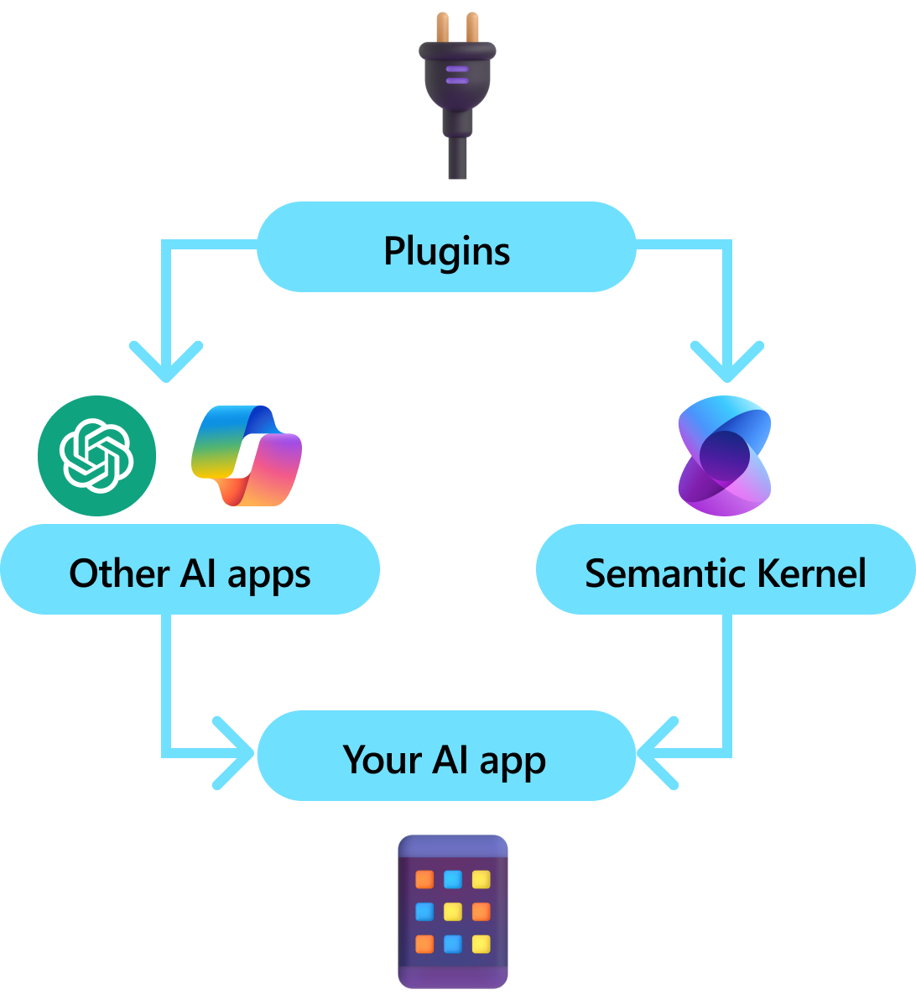

# What is a Plugin?

:::row:::
   :::column span="1":::
    Plugins are a key component of Semantic Kernel. If you have already used plugins from ChatGPT or Copilot extensions in Microsoft 365, you’re already familiar with them. With plugins, you can encapsulate your existing APIs into a collection that can be used by an AI. This allows you to give your AI the ability to perform actions that it wouldn’t be able to do otherwise.

    Behind the scenes, Semantic Kernel leverages [function calling](https://platform.openai.com/docs/guides/function-calling), a native feature of most of the latest LLMs to allow LLMs, to perform [planning](./planning.md) and to invoke your APIs. With function calling, LLMs can request (i.e., call) a particular function. Semantic Kernel then marshals the request to the appropriate function in your codebase and returns the results back to the LLM so the LLM can generate a final response.
   :::column-end:::
   :::column span="1":::
        
   :::column-end:::
:::row-end:::

Not all AI SDKs have an analogous concept to plugins (most just have functions or tools). In enterprise scenarios, however, plugins are valuable because they encapsulate a set of functionality that mirrors how enterprise developers already develop services and APIs. Plugins also play nicely with dependency injection. Within a plugin's constructor, you can inject services that are necessary to perform the work of the plugin (e.g., database connections, HTTP clients, etc.). This is difficult to accomplish with other SDKs that lack plugins.

## Anatomy of a plugin
At a high-level, a plugin is a group of [functions](#types-of-plugin-functions) that can be exposed to AI apps and services. The functions within plugins can then be orchestrated by an AI application to accomplish user requests. Within Semantic Kernel, you can invoke these functions automatically with function calling.

> [!Note]
> In other platforms, functions are often referred to as "tools" or "actions". In Semantic Kernel, we use the term "functions" since they are typically defined as native functions in your codebase.

Just providing functions, however, is not enough to make a plugin. To power automatic orchestration with function calling, plugins also need to provide details that semantically describe how they behave. Everything from the function's input, output, and side effects need to be described in a way that the AI can understand, otherwise, the AI will not correctly call the function.


For example, the sample `WriterPlugin` plugin on the right has functions with semantic descriptions that describe what each function does. An LLM can then use these descriptions to choose the best functions to call to fulfill a user's ask.

:::row:::
   :::column span="1":::
      
      In the picture on the right, an LLM would likely call the `ShortPoem` and `StoryGen` functions to satisfy the users ask thanks to the provided semantic descriptions.
   :::column-end:::
   :::column span="3":::
        
   :::column-end:::
:::row-end:::

### Importing different types of plugins
There are two primary ways of importing plugins into Semantic Kernel: using [native code](./adding-native-plugins.md) or using an [OpenAPI specification](./adding-openapi-plugins.md). The former allows you to author plugins in your existing codebase that can leverage dependencies and services you already have. The latter allows you to import plugins from an OpenAPI specification, which can be shared across different programming languages and platforms.

Below we provide a simple example of importing and using a native plugin. To learn more about how to  import these different types of plugins, refer to the following articles:
- [Importing native code](./adding-native-plugins.md)
- [Importing an OpenAPI specification](./adding-openapi-plugins.md)

> [!Tip]
> When getting started, we recommend using native code plugins. As your application matures, and as you work across cross-platform teams, you may want to consider using OpenAPI specifications to share plugins across different programming languages and platforms.

### The different types of plugin functions
Within a plugin, you will typically have two different types of functions, those that retrieve data for retrieval augmented generation (RAG) and those that automate tasks. While each type is functionally the same, they are typically used differently within applications that use Semantic Kernel.

For example, with retrieval functions, you may want to use strategies to improve performance (e.g., caching and using cheaper intermediate models for summarization). Whereas with task automation functions, you'll likely want to implement human-in-the-loop approval processes to ensure that tasks are completed correctly.

To learn more about the different types of plugin functions, refer to the following articles:
- [Data retrieval functions](./using-data-retrieval-functions-for-rag.md)
- [Task automation functions](./using-task-automation-functions.md)

## Getting started with plugins

Using plugins within Semantic Kernel is always a three step process:
1. [Define your plugin](#1-define-your-plugin)
2. [Add the plugin to your kernel](#2-add-the-plugin-to-your-kernel)
3. [And then either invoke the plugin's functions in either a prompt with function calling](#3-invoke-the-plugins-functions)

Below we'll provide a high-level example of how to use a plugin within Semantic Kernel. Refer to the links above for more detailed information on how to create and use plugins.

### 1) Define your plugin

The easiest way to create a plugin is by defining a class and annotating its methods with the `KernelFunction` attribute. This let's Semantic Kernel know that this is a function that can be called by an AI or referenced in a prompt.

You can also define plugins manually using the [create from function](./adding-native-plugins.md#create-from-function) method or by importing a plugin from an [OpenAPI specification](./adding-openapi-plugins.md).

Below, we'll create a plugin that can retrieve the state of lights and alter its state.

> [!Tip]
> Since most LLM have been trained with Python for function calling, its recommended to use snake case for function names and property names even if you're using the C# or Java SDK.

```csharp
public class Lights
{
   // Mock data for the lights
   private readonly List<LightModel> lights = new()
   {
      new LightModel { Id = 1, Name = "Table Lamp", IsOn = false, Brightness = 100, Hex = "FF0000" },
      new LightModel { Id = 2, Name = "Porch light", IsOn = false, Brightness = 50, Hex = "00FF00" },
      new LightModel { Id = 3, Name = "Chandelier", IsOn = true, Brightness = 75, Hex = "0000FF" }
   };

   [KernelFunction("get_lights")]
   [Description("Gets a comma-separated list of light IDs")]
   [return: Description("An array of lights")]
   public async Task<List<LightModel>> GetLightsAsync()
   {
      return lights
   }

   [KernelFunction("get_state")]
   [Description("Gets the state of a particular light")]
   [return: Description("The state of the light")]
   public async Task<LightModel?> GetStateAsync([Description("The ID of the light")] int id)
   {
      // Get the state of the light with the specified ID
      return lights.FirstOrDefault(light => light.Id == id);
   }

   [KernelFunction("change_state")]
   [Description("Changes the state of the light")]
   [return: Description("The updated state of the light; will return null if the light does not exist")]
   public async Task<LightModel?> ChangeStateAsync(int id, LightModel LightModel)
   {
      var light = lights.FirstOrDefault(light => light.Id == id);

      if (light == null)
      {
         return null;
      }

      // Update the light with the new state
      light.IsOn = LightModel.IsOn;
      light.Brightness = LightModel.Brightness;
      light.Hex = LightModel.Hex;

      return light;
   }
}

public class LightModel
{
   [JsonPropertyName("id")]
   public int Id { get; set; }

   [JsonPropertyName("name")]
   public string Name { get; set; }

   [JsonPropertyName("is_on")]
   public bool? IsOn { get; set; }

   [JsonPropertyName("brightness")]
   public byte? Brightness { get; set; }

   [JsonPropertyName("hex")]
   public string? Hex { get; set; }
}
```

Notice that we provide descriptions for the function, return value, and parameters. This is important for the AI to understand what the function does and how to use it.

> [!Tip]
> Don't be afraid to provide detailed descriptions for your functions if an AI is having trouble calling them. Few-shot examples, recommendations for when to use (and not use) the function, and guidance on where to get required parameters can all be helpful.

### 2) Add the plugin to your kernel

Once you've defined your plugin, you can add it to your kernel by creating a new instance of the plugin and adding it to the kernel's plugin collection.

This example demonstrates the easiest way of adding a class as a plugin with the `AddFromType` method. To learn about other ways of adding plugins, refer to the [adding native plugins](./adding-native-plugins.md) article.

```csharp
var kernel = new KernelBuilder()
   .AddFromType<LightPlugin>()
   .Build();
```

### 3) Invoke the plugin's functions

Finally, you can have the AI invoke your plugin's functions by using function calling. Below is an example that demonstrates how to coax the AI to call the `get_lights` function from the `Lights` plugin before calling the `change_state` function to turn on a light. 

```csharp
```

With the above code, you should get a response that looks like the following:

| Role                          | Message                                           |
| ----------------------------- | ------------------------------------------------- |
| 🔵&nbsp;**User**                      | Please turn on the lamp                           |
| 🔴&nbsp;**Assistant&nbsp;(function&nbsp;call)** | Lights.get_lights                                 |
| 🟢&nbsp;**Tool**                      | [{ "id": 1, "name": "Table Lamp", "isOn": false, "brightness": 100, "hex": "FF0000" }, { "id": 2, "name": "Porch light", "isOn": false, "brightness": 50, "hex": "00FF00" }, { "id": 3, "name": "Chandelier", "isOn": true, "brightness": 75, "hex": "0000FF" }] |
| 🔴&nbsp;**Assistant&nbsp;(function&nbsp;call)** | Lights.change_state(1, { "isOn": true })          |
| 🟢&nbsp;**Tool**                      | { "id": 1, "name": "Table Lamp", "isOn": true, "brightness": 100, "hex": "FF0000" } |
| 🔴&nbsp;**Assistant**                 | The lamp is now on                                |


> [!Tip]
> While you can invoke a plugin function directly, this is not advised because the AI should be the one deciding which functions to call. If you need explicit control over which functions are called, consider using standard methods in your codebase instead of plugins.