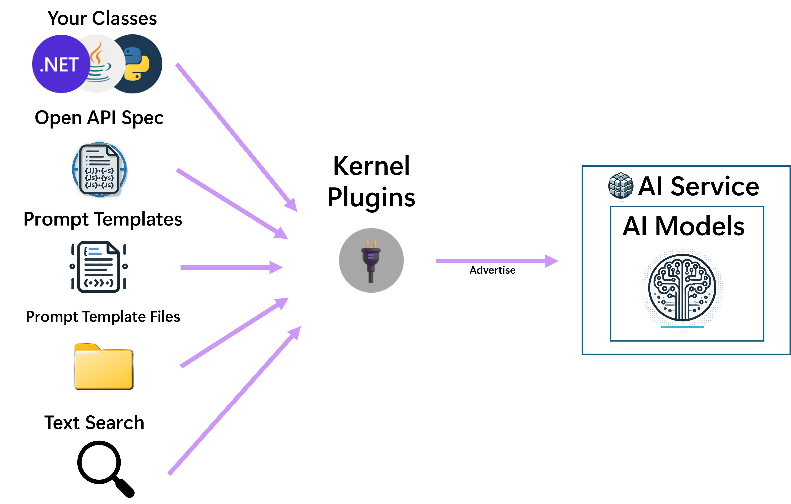
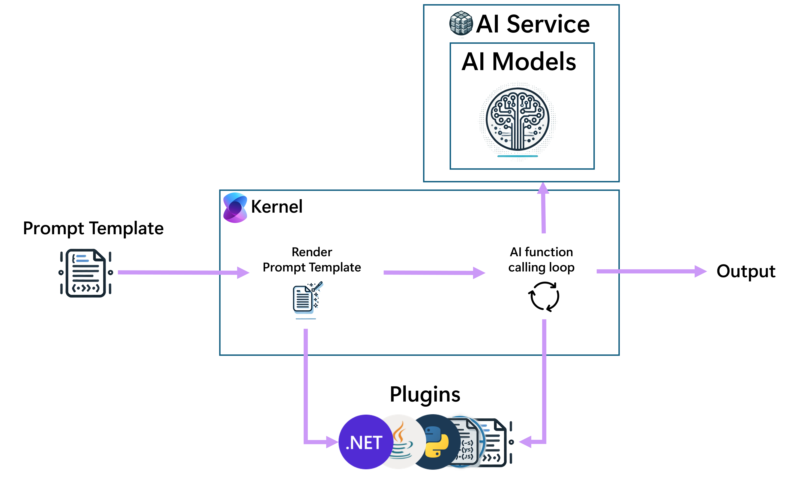

# Semantic Kernel Components

Semantic Kernel provides many different components, that can be used individually or together. This article gives an overview of the different components and explains the relationship between them.

## AI Service Connectors

The Semantic Kernel AI service connectors provide an abstraction layer that exposes multiple AI service types from different providers via a common interface.
Supported services include Chat Completion, Text Generation, Embedding Generation, Text to Image, Image to Text, Text to Audio and Audio to Text.

The most important of these is Chat Completion. When an implemention is registered with the Kernel this will be used
by default by any method calls to the kernel. None of the other supported services will be used automatically.

> [!TIP]
> For more information on using AI services see [Adding AI services to Semantic Kernel](./ai-services/index.md).

## Vector Store (Memory) Connectors

The Semantic Kernel Vector Store connectors provide an abstraction layer that exposes vector stores from different providers via a common interface.
The Kernel does not use any registered vector store automatically, but Vector Search can easily be exposed as a plugin to the Kernel
in which case the plugin is made available to Prompt Templates and the Chat Completion AI Model.

> [!TIP]
> For more information on using memory connectors see [Adding AI services to Semantic Kernel](./ai-services/index.md).

## Functions and Plugins

Plugins are named function containers. Each can contain one or more functions.
Plugins can be registered with the kernel, which allows the kernel to use them in two ways:

1. Advertise them to the chat completion AI, so that the AI can choose them for invocation.
1. Make them available to be called from a template during template rendering.

Functions can be created in many ways, including from native code, OpenAPI specs, `ITextSearch` implementations for RAG scenarios, but also from prompt templates.

> [!TIP]
> For more information on different plugin sources see [What is a Plugin?](./plugins/index.md).
> [!TIP]
> For more information on advertising plugins to the chat completion AI see [Function calling with chat completion](./ai-services/chat-completion/function-calling/index.md).

## Prompt Templates

Prompt templates allow a developer or prompt engineer to create a template that mixes context and instructions for the AI with user input and function output.
E.g. the template may contain instructions for the Chat Completion AI model, and placeholders for user input, plus hardcoded calls to plugins that always
need to be executed before invoking the Chat Completion AI model.

Prompt templates can be used in two ways:

1. As the starting point of a Chat Completion flow by asking the kernel to render the template and invoke the Chat Completion AI model with the rendered result.
1. As a plugin function, so that it can be invoked in the same way as any other function can be.

When a prompt template is converted to a plugin function and executed, it will first be rendered, plus any functions that it references will be executed.
The rendered result will then be passed to the Chat Completion AI model. The result generated by the AI will be returned to the caller.
This allows the possibility of creating functionality that is described using human language instead of actual code. Separating functionality into
functions like this allows the AI model to reason about this separately and can lead to higher success rates.

Using prompt templates as functions can result in rather complex flows. E.g. consider the scenario where a prompt template `A` is registered as a plugin.
At the same time a different prompt template `B` may be passed to the kernel to start the chat completion flow. `B` could have a hardcoded call to `A`.
This would result in the following steps:

1. `B` rendering starts and the prompt execution finds a reference to `A`
1. `A` is rendered.
1. The rendered output of `A` is passed to the Chat Completion AI model.
1. The result of the Chat Completion AI model is returned to `B`.
1. Rendering of `B` completes.
1. The rendered output of `B` is passed to the Chat Completion AI model.
1. The result of the Chat Completion AI model is returned to to the caller.

Also consider the scenario where there is no hardcoded call from `B` to `A`.
If function calling is enabled, the Chat Completion AI model may still decide that `A` should be invoked
since it requires data or functionality that `A` can provide.

See the following diagram for a simple flow that is started from a prompt template.

> [!TIP]
> For more information on prompt templates see [What are prompts?](./prompts/index.md).

## Filters

Filters provide a way to take custom action before and after specific events during the chat completion flow.
These events include:

1. Before and after function invocation.
1. Before and after prompt rendering.

Filters need to be registered with the kernel to get invoked during the chat completion flow.

Note that since prompt templates can also be used as functions, in some cases both function and prompt filters may be invoked for a prompt template.

> [!TIP]
> For more information on filters see [What are Filters?](./enterprise-readiness/filters.md).
