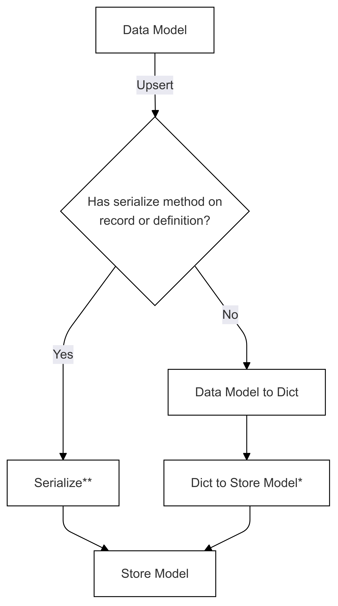
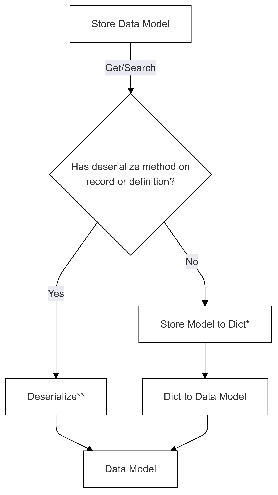

# Serialization of your data model to and from different stores (Preview)

::: zone pivot="programming-language-csharp"

In order for your data model to be stored in a database, it needs to be converted to a format that the database can understand.
Different databases require different storage schemas and formats. Some have a strict schema that needs to be adhered to, while
others allow the schema to be defined by the user.

The vector store connectors provided by Semantic Kernel have built-in mappers that will map your data model to and from the
database schemas. See the [page for each connector](./out-of-the-box-connectors/index.md) for more information on how the built-in
mappers map data for each database.

::: zone-end
::: zone pivot="programming-language-python"

In order for your data model defined either as a [class](./defining-your-data-model.md) or a [definition](./schema-with-record-definition.md) to be stored in a database, it needs to be serialized to a format that the database can understand.

There are two ways that can be done, either by using the built-in serialization provided by the Semantic Kernel or by providing your own serialization logic.

The following two diagrams show the flows are shown for both serialization and deserialization of data models to and from a store model.

### Serialization Flow (used in Upsert)

### Deserialization Flow (used in Get and Search)

The steps marked with * (in both diagrams) are implemented by the developer of a specific connector, and are different for each store.
The steps marked with ** (in both diagrams) are supplied either as a method on a record or as part of the record definition, this is always supplied by the user, see [Direct Serialization](#direct-serialization-data-model-to-store-model) for more information.

## (De)Serialization approaches

### Direct serialization (Data Model to Store Model)
The direct serialization is the best way to ensure full control over how your models get serialized and to optimize performance. The downside is that it is specific to a data store, and therefore when using this it isn't as easy to switch between different stores with the same data model.

You can use this by implementing a method that follows the `SerializeMethodProtocol` protocol in your data model, or by adding functions that follow the `SerializeFunctionProtocol` to your record definition, both can be found in `semantic_kernel/data/vector_store_model_protocols.py`.

When one of those functions are present, it will be used to directly serialize the data model to the store model.

You could even only implement one of the two and use the built-in (de)serialization for the other direction, this could for instance be useful when dealing with a collection that was created outside of your control and you need to do some customization to the way it is deserialized (and you can't do an upsert anyway).

### Built-in (de)serialization (Data Model to Dict and Dict to Store Model and vice versa)

The built-in serialization is done by first converting the data model to a dictionary and then serializing it to the model that that store understands, for each store that is different and defined as part of the built-in connector. Deserialization is done in the reverse order.

#### Serialization Step 1: Data Model to Dict

Depending on what kind of data model you have, the steps are done in different ways. There are four ways it will try to serialize the data model to a dictionary:
1. `to_dict` method on the definition (aligns to the to_dict attribute of the data model, following the `ToDictFunctionProtocol`)
2. check if the record is a `ToDictMethodProtocol` and use the `to_dict` method
3. check if the record is a Pydantic model and use the `model_dump` of the model, see the note below for more info.
4. loop through the fields in the definition and create the dictionary

#### Optional: Embedding
When you have a data model with a `embedding_generator` field, or the collection has an `embedding_generator` field, the embedding will be generated and added to the dictionary before it is serialized to the store model.

#### Serialization Step 2: Dict to Store Model

A method has to be supplied by the connector for converting the dictionary to the store model. This is done by the developer of the connector and is different for each store.

#### Deserialization Step 1: Store Model to Dict

A method has to be supplied by the connector for converting the store model to a dictionary. This is done by the developer of the connector and is different for each store.

#### Deserialization Step 2: Dict to Data Model

The deserialization is done in the reverse order, it tries these options:
1. `from_dict` method on the definition (aligns to the from_dict attribute of the data model, following the `FromDictFunctionProtocol`)
2. check if the record is a `FromDictMethodProtocol` and use the `from_dict` method
3. check if the record is a Pydantic model and use the `model_validate` of the model, see the note below for more info.
4. loop through the fields in the definition and set the values, then this dict is passed into the constructor of the data model as named arguments (unless the data model is a dict itself, in that case it is returned as is)

> [!NOTE]
> #### Using Pydantic with built-in serialization
> When you define you model using a Pydantic BaseModel, it will use the `model_dump` and `model_validate` methods to serialize and deserialize the data model to and from a dict. This is done by using the model_dump method without any parameters, if you want to control that, consider implementing the `ToDictMethodProtocol` on your data model, as that is tried first.

::: zone-end
::: zone pivot="programming-language-java"

## Coming soon

More info coming soon.

::: zone-end

