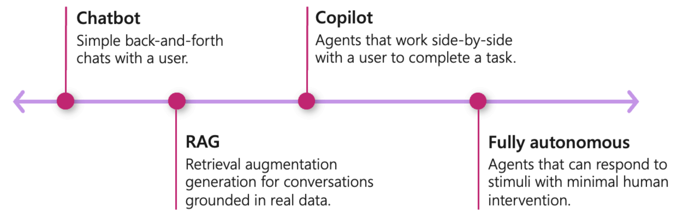

# What is an agent?

An agent is an artificial intelligence that can answer questions and automate processes for users. There's a wide spectrum of agents that can be built, ranging from simple chat bots to fully automated AI assistants. With Semantic Kernel, we provide you with the tools to build increasingly more sophisticated agents that don't require you to be an AI expert.



A copilot is a special type of agent that is meant to work side-by-side with a user. Unlike an agent, a copilot is _not_ meant to be fully automated. Instead, it is meant to help a user complete a task by providing suggestions and recommendations. For example, a copilot could be used to help a user write an email by providing suggestions for what to write next. The user can then choose to accept or reject the suggestion.

When you start your journey with Semantic Kernel, we recommend that you start with building a copilot. This is because copilots are easier to build and safer to deploy because the user is always in control. Once you have a copilot, you can then turn it into a fully automated agent by removing the need for user input.

## Building your first agent
An agent is made up of three core building blocks: [plugins](./plugins/index.md), [planners](./planners/index.md), and its persona. These building blocks are what allow an agent to retrieve information from the user or other systems, plan how to use that information, and use that information to respond to a user or perform an action.


Take for example, a copilot that helps a user write and send an email. After getting instructions from a user, the copilot would need to generate a plan using the available plugins to complete the task. This plan would include steps like...
1. Get the user's email address and name
2. Get the email address of the recipient
3. Get the topic of the email
4. Generate the subject and body of the email
5. Review the email with the user
6. Send the email

### Plugins: giving your agent skills
To generate this plan, the copilot would first need the capabilities necessary to perform these steps. This is where plugins come in. Plugins allow you to give your agent skills via code. For example, you could create a plugin that sends emails, retrieves information from a database, asks for help, or even saves and retrieves memories from previous conversations.

In our example, we can build a simple plugin that sends emails. This plugin would have a single function, `SendEmail`, that takes in the email address, subject, and body of the email. It would then use this information to send the email.

```csharp
public class EmailPlugin
{
    [KernelFunction]
    [Description("Sends an email to a recipient.")]
    public async Task SendEmailAsync(
        Kernel kernel,
        [Description("Semicolon delimitated list of emails of the recipients")] string recipientEmails,
        string subject,
        string body
    )
    {
        // Add logic to send an email using the recipientEmails, subject, and body
        // For now, we'll just print out a success message to the console
        Console.WriteLine("Email sent!");
    }
}
```

There are other ways to create plugins. For example, if you have a RestAPI that can send emails, you can create automatically create a plugin using its OpenAPI specification. To learn more about other ways to author plugins, see the [plugins](./plugins/index.md) section.

### Planners: giving guidance to your agent
To actually use this plugin (and to wire them up with other steps), the copilot would need to first generate a plan. This is where planners come in. Planners are special prompts that allow an agent generate a plan to complete a task. The simplest planners are just a single prompt that helps the agent use function calling to complete a task.

Often, you'll create your planners as specialized plugins that are highly tuned to a specific task. For example, you may create an `AuthorEmailPlanner` that asks the agent to "brainstorm the steps necessary to write an email before calling the necessary functions."

In this planner, we'll pass in the email topic and who the email is for so the planner can generate a plan to write an email.

```csharp
public class AuthorEmailPlanner
{
    [KernelFunction]
    [Description("Returns back the required steps necessary to author an email.")]
    [return: Description("The list of steps needed to author an email")]
    public async Task<string> GenerateRequiredStepsAsync(
        Kernel kernel,
        [Description("A 2-3 sentence description of what the email should be about")] string topic,
        [Description("A description of the recipients")] string recipients
    )
    {
        // Prompt the LLM to generate a list of steps to complete the task
        var result = await kernel.InvokePromptAsync($"""
        I'm going to write an email to {recipients} about {topic} on behalf of a user.
        Before I do that, can you succinctly recommend the top 3 steps I should take in a numbered list?
        I want to make sure I don't forget anything that would help my user's email sound more professional.
        """, new() {
            { "topic", topic },
            { "recipients", recipients }
        });

        // Return the plan back to the agent
        return result.ToString();
    }
}
```

In more advanced planners, you can ask an LLM to generate code that can be executed to complete a task. This is what we call a "code-based" planner and it serves as the basis of our Handlebars planner.


## Putting the pieces together
Now that we understand the core building blocks of an agent, we can now combine them together to build our first agent. To do so, we'll initialize our `Kernel` object with our plugins, planners, and persona. Afterwards, we'll use the `Kernel` object to generate a plan and then execute that plan.

```csharp
// Create the kernel
var builder = Kernel.CreateBuilder();
builder.Services.AddLogging(c => c.SetMinimumLevel(LogLevel.Trace).AddDebug());
builder.Services.AddChatCompletionService(kernelSettings);
builder.Plugins.AddFromType<AuthorEmailPlanner>();
builder.Plugins.AddFromType<EmailPlugin>();
Kernel kernel = builder.Build();

// Retrieve the chat completion service from the kernel
IChatCompletionService chatCompletionService = kernel.GetRequiredService<IChatCompletionService>();

// Create the chat history
ChatHistory chatMessages = new ChatHistory("""
You are a friendly assistant who likes to follow the rules. You will complete required steps
and request approval before taking any consequential actions. If the user doesn't provide
enough information for you to complete a task, you will keep asking questions until you have
enough information to complete the task.
""");

// Start the conversation
while (true)
{
    // Get user input
    System.Console.Write("User > ");
    chatMessages.AddUserMessage(Console.ReadLine()!);

    // Get the chat completions
    OpenAIPromptExecutionSettings openAIPromptExecutionSettings = new()
    {
        FunctionCallBehavior = FunctionCallBehavior.AutoInvokeKernelFunctions
    };
    var result = chatCompletionService.GetStreamingChatMessageContentsAsync(
        chatMessages,
        executionSettings: openAIPromptExecutionSettings,
        kernel: kernel);

    // Stream the results
    string fullMessage = "";
    await foreach (var content in result)
    {
        if (content.Role.HasValue)
        {
            System.Console.Write("Assistant > ");
        }
        System.Console.Write(content.Content);
        fullMessage += content.Content;
    }
    System.Console.WriteLine();

    // Add the message from the agent to the chat history
    chatMessages.AddAssistantMessage(fullMessage);
}
```

## Trying out your agent
Now that we've completed our program, we can give it a test run. Below is a sample conversation with our agent while using gpt-4 model.

```User
Can you help me write an email for my boss?
```

```Assistant
Of course, I'd be happy to help you write an email to your boss. Could you please
provide me with more details? Specifically, I need to know:

1. The topic or purpose of the email.
2. Your boss's email address.
```

```User
I want to give her an update on last months sales. We broke a bunch of records that
I want to share with her, but we did have a challenge selling the X4321 model.
```

```Assistant
That sounds like a great topic for an email. Could you please provide me with your
boss's email address so I can assist you further?
```

```User
Sure! It's sarah@contoso.com
```

```Assistant
Great! Here's a plan for your email:

1. **Start with a Clear Subject Line and Greeting**: The subject line should be
concise and informative, such as "Update on Last Month's Sales & X4321 Model
Challenges". Start the email with a professional greeting, like "Dear Sarah,".

2. **Highlight Achievements and Challenges in Separate Paragraphs**: Begin with
the positive news about the record-breaking achievements. Use specific data and
examples to illustrate the success. Then, transition to the challenges with the
X4321 model. Be honest and clear about the issues, but also suggest potential
solutions or steps being taken to address these challenges.

3. **End with a Call to Action and Professional Closing**: If you need Sarah to
take any actions, state this clearly towards the end of the email. This could be
asking for her input, a meeting to discuss further, or any other relevant action.
Close the email professionally with a phrase like "Best regards" or "Sincerely",
followed by your name.

Remember to proofread the email for any grammatical errors or unclear statements
before sending it. This will help ensure the message is professional and easy to
understand.

Would you like me to draft the email for you based on these steps?
```

```User
Yes please!
```

```Assistant
Sure, here's a draft based on the steps we discussed:

Subject: Update on Last Month's Sales & X4321 Model Challenges

Dear Sarah,

I hope this email finds you well. I am writing to update you on our sales
performance for the past month.

I am pleased to report that we broke several sales records last month. Our team's
hard work and dedication have paid off, resulting in significant growth in our overall
sales figures. [Here, you can add specific data or examples of the records broken]

However, we did face some challenges with the X4321 model. Despite our best efforts,
the sales for this model did not meet our expectations. [Here, you can explain more
about the challenges faced]

We are currently working on strategies to improve the sales of the X4321 model.
[Here, you can mention any specific steps or plans you have to address the issue]

I would appreciate your input on this matter. If you would like, we can schedule a
meeting to discuss this further.

Thank you for your continued support and guidance.

Best regards,
[Your Name]

Please review this draft and let me know if you would like to make any changes
before I send it.
```

```User
Can you add that we increased our revenue by 20%? You can also share that the X4321
didn't sell as well since most customers upgraded to the Y5000 model, but this isn't
too bad since it's what helped increase our revenue.
```

```Assistant
Absolutely, here's the updated draft:

Subject: Update on Last Month's Sales & X4321 Model Challenges

Dear Sarah,

I hope this email finds you well. I am writing to update you on our sales performance
for the past month.

I am pleased to report that we broke several sales records last month. Our team's hard
work and dedication have paid off, resulting in a significant 20% increase in our
overall revenue. This growth is a testament to our team's commitment and the quality
of our products.

However, we did face some challenges with the X4321 model. Despite our best efforts,
the sales for this model did not meet our expectations. Interestingly, most customers
upgraded to the Y5000 model, which contributed significantly to our increased revenue.
While we aim to improve the sales of all our models, this shift in customer preference
is not entirely negative.

We are currently analyzing this trend and working on strategies to leverage it for
future sales. Your insights and suggestions would be greatly appreciated.

Thank you for your continued support and guidance.

Best regards,
[Your Name]

Please review this updated draft and let me know if you would like to make any changes
before I send it.
```

```User
Please sign it with Stephen and then you can go ahead and send it to Sarah
```

```Function
Email sent!
```

```Assistant
The email has been sent to Sarah. If there's anything else you need assistance with,
feel free to ask!
```

## Next steps
Now that you've built your first agent, you can now deep dive into the different components of Semantic Kernel.
