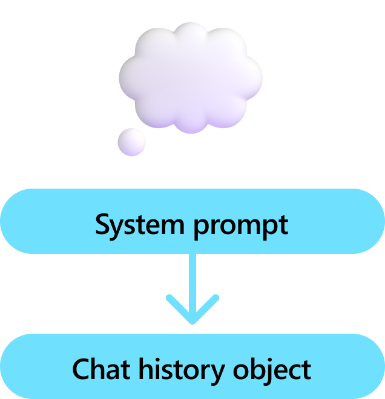

# Personas: Giving your Agent a Role

:::row:::
   :::column span="2":::
        
   :::column-end:::
   :::column span="1":::
     Personas influence how your agents work and respond to inputs; you want to influence how your agent interacts with users. Often called a "meta prompt" or "instruction", the persona is a prompt that is used to influence how the agent responds to stimuli. For example, you can use the persona to tell the agent to ask for help if it doesn't know what to do. Or to be more verbose when it is explaining something. In our example, we use the persona to make sure the agent retrieves all the information it needs before completing a task. This would encourage the persona to ask more questions so it can generate a better email.
We'll do this by passing in a system prompt into a ChatHistory object that contains the persona. This ChatHistory object will then be used whenever we make a request to the agent so that the agent is aware of its persona and all the previous conversations it has had with the user.
   :::column-end:::
:::row-end:::

:::row:::
   :::column span="2":::
      C#Copy
ChatHistory chatMessages = new ChatHistory("""
You are a friendly assistant who likes to follow the rules. You will complete required steps
and request approval before taking any consequential actions. If the user doesn't provide
enough information for you to complete a task, you will keep asking questions until you have
enough information to complete the task.
""");
   :::column-end:::
   :::column span="1":::
    
   :::column-end:::
:::row-end:::

  